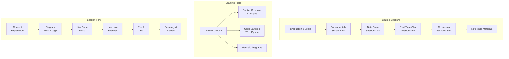
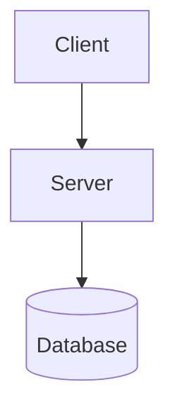
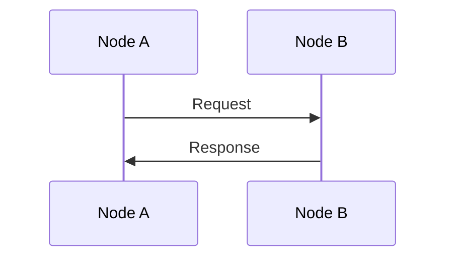
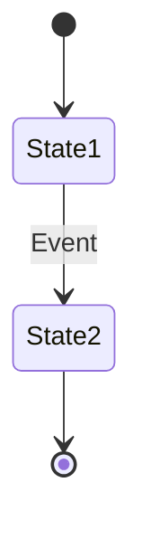

# Design: Distributed Systems Course

## Overview

This design document outlines a comprehensive mdBook-based course on distributed systems, targeting developers with average programming skills who are new to distributed systems. The course spans 10 sessions of 1.5 hours each (15 hours total) and combines theoretical understanding with hands-on implementation using TypeScript and Python.

### Course Vision

Create an accessible, well-structured course that takes learners from foundational distributed systems concepts to building a working consensus-based system. The course emphasizes practical understanding through Docker Compose deployments of real distributed applications.

### Project Scope

- **Format**: mdBook (Markdown-based book with multi-format output)
- **Duration**: 10 sessions × 1.5 hours
- **Languages**: TypeScript and Python (dual examples for all concepts)
- **Deployment**: Local Docker Compose (no cloud infrastructure required)
- **Learning Style**: Mixed theory + live coding + hands-on exercises per session

---

## Detailed Requirements

### Target Audience

| Attribute | Specification |
|-----------|----------------|
| Programming Experience | Average proficiency (can write functions, classes, basic OOP) |
| Distributed Systems Experience | None (complete beginner) |
| Prerequisites | Basic familiarity with command line, Docker basics |
| Goal | Understand concepts AND build/deploy a working distributed application |

### Learning Outcomes

By the end of this course, learners will be able to:

1. **Explain** distributed systems concepts including CAP theorem, consistency models, and consensus
2. **Build** a working message queue system with producer-consumer pattern
3. **Implement** a replicated key-value store with leader election
4. **Create** a real-time chat system with pub/sub messaging
5. **Develop** a consensus-based system using the Raft algorithm
6. **Deploy** all systems using Docker Compose on local machines

### Course Structure Requirements

| Requirement | Specification |
|-------------|----------------|
| Sessions | 10 sessions of 1.5 hours each |
| Session Format | Mixed: concept explanation → diagram → code demo → hands-on exercise → run & test |
| Concepts Per Session | 1-2 clear concepts based on complexity |
| Progression | Easiest to hardest (Queue → Store → Chat → Consensus) |
| Code Examples | Always provide both TypeScript and Python implementations |
| Diagrams | Mermaid diagrams for architecture, sequence, and state |
| Docker Compose | Complete working setup for each application type |

### Application Types (in difficulty order)

| Order | Application | Sessions | Key Concepts |
|-------|-------------|----------|--------------|
| 1 | Queue/Work System | 1-2 | Producer-consumer, message passing, fault tolerance |
| 2 | Store with Replication | 3-5 | Partitioning, CAP, leader election, consistency models |
| 3 | Chat System | 6-7 | WebSockets, pub/sub, message ordering, persistence |
| 4 | Consensus System | 8-10 | Raft algorithm, log replication, state machine |

---

## Architecture Overview

### Course Architecture



### Technology Stack

| Component | Technology | Purpose |
|-----------|------------|---------|
| Content Format | Markdown + mdBook | Course delivery platform |
| Programming Languages | TypeScript, Python | Dual-language examples |
| Containerization | Docker + Docker Compose | Local deployment |
| Diagramming | Mermaid | Architecture, sequence, state diagrams |
| Real-time Communication | WebSocket (ws / websockets) | Chat system implementation |
| Message Passing | HTTP, TCP | Inter-node communication |
| Data Storage | In-memory, files | Simple persistence for learning |

---

## Components and Interfaces

### mdBook Structure

```
distributed-systems-course/
├── book.toml                          # mdBook configuration
├── src/
│   ├── SUMMARY.md                     # Table of contents
│   ├── introduction.md                # Course overview
│   ├── fundamentals/                  # Sessions 1-2
│   │   ├── 01-what-is-ds.md
│   │   ├── 02-message-passing.md
│   │   └── 03-queue-system.md
│   ├── data-store/                    # Sessions 3-5
│   │   ├── 04-data-partitioning.md
│   │   ├── 05-cap-theorem.md
│   │   ├── 06-replication.md
│   │   └── 07-consistency.md
│   ├── real-time/                     # Sessions 6-7
│   │   ├── 08-websockets.md
│   │   ├── 09-pub-sub.md
│   │   └── 10-chat-system.md
│   ├── consensus/                     # Sessions 8-10
│   │   ├── 11-what-is-consensus.md
│   │   ├── 12-raft-algorithm.md
│   │   ├── 13-raft-leader-election.md
│   │   ├── 14-log-replication.md
│   │   └── 15-consensus-system.md
│   └── reference/
│       ├── docker-setup.md
│       ├── troubleshooting.md
│       └── further-reading.md
└── examples/                          # Docker Compose examples
    ├── 01-queue/
    ├── 02-store/
    ├── 03-chat/
    └── 04-consensus/
```

### Content Component Interface

Each chapter follows this structure:

```markdown
# [Chapter Title]

## Learning Objectives
- [ ] Objective 1
- [ ] Objective 2

## Concept Explanation
[Clear explanation with diagrams]

## Architecture Diagram
[Mermaid diagram]

## Implementation

### TypeScript Version
[code example]

### Python Version
[code example]

## Docker Compose Setup
[docker-compose.yml]

## Running the Example
[Step-by-step instructions]

## Exercises
1. Exercise 1
2. Exercise 2

## Summary
[Key takeaways]
```

### Code Component Interface

All code examples must implement:

| Interface Method | Description | Example |
|------------------|-------------|---------|
| `start()` | Initialize the node/service | Start server, connect to peers |
| `stop()` | Graceful shutdown | Close connections, cleanup |
| `send(data)` | Send message to another node | HTTP POST, TCP write |
| `receive(data)` | Handle incoming message | Route to handler |
| `health()` | Health check endpoint | Return node status |

---

## Data Models

### Queue System Data Model

```typescript
interface Task {
  id: string;           // Unique task identifier
  payload: any;         // Task data
  status: 'pending' | 'processing' | 'completed' | 'failed';
  createdAt: timestamp;
  retries: number;
}
```

```python
@dataclass
class Task:
    id: str
    payload: Any
    status: Literal['pending', 'processing', 'completed', 'failed']
    created_at: float
    retries: int
```

### Store System Data Model

```typescript
interface StoreNode {
  id: string;
  role: 'leader' | 'follower';
  term: number;           // For leader election
  data: Map<string, any>; // Key-value storage
  peers: string[];        // List of peer node IDs
}

interface ReplicationLogEntry {
  index: number;
  term: number;
  key: string;
  value: any;
}
```

```python
@dataclass
class StoreNode:
    id: str
    role: Literal['leader', 'follower']
    term: int
    data: Dict[str, Any]
    peers: List[str]

@dataclass
class ReplicationLogEntry:
    index: int
    term: int
    key: str
    value: Any
```

### Chat System Data Model

```typescript
interface ChatMessage {
  id: string;
  roomId: string;
  userId: string;
  content: string;
  timestamp: number;
  sequenceNumber: number; // For ordering
}

interface Presence {
  userId: string;
  roomId: string;
  status: 'online' | 'offline';
  lastSeen: number;
}
```

```python
@dataclass
class ChatMessage:
    id: str
    room_id: str
    user_id: str
    content: str
    timestamp: float
    sequence_number: int

@dataclass
class Presence:
    user_id: str
    room_id: str
    status: Literal['online', 'offline']
    last_seen: float
```

### Consensus System Data Model (Raft)

```typescript
interface RaftNode {
  id: string;
  state: 'follower' | 'candidate' | 'leader';
  currentTerm: number;
  votedFor: string | null;
  log: LogEntry[];
  commitIndex: number;
  lastApplied: number;
}

interface LogEntry {
  index: number;
  term: number;
  command: { key: string; value: any };
}

interface RaftMessage {
  type: 'RequestVote' | 'RequestVoteResponse' |
         'AppendEntries' | 'AppendEntriesResponse';
  term: number;
  from: string;
  to: string;
  data?: any;
}
```

```python
@dataclass
class RaftNode:
    id: str
    state: Literal['follower', 'candidate', 'leader']
    current_term: int
    voted_for: Optional[str]
    log: List['LogEntry']
    commit_index: int
    last_applied: int

@dataclass
class LogEntry:
    index: int
    term: int
    command: Dict[str, Any]

@dataclass
class RaftMessage:
    type: Literal['RequestVote', 'RequestVoteResponse',
                  'AppendEntries', 'AppendEntriesResponse']
    term: int
    from_: str
    to: str
    data: Optional[Dict[str, Any]]
```

---

## Error Handling

### Common Error Scenarios Across All Systems

| Error Type | Detection | Recovery Strategy | Teaching Moment |
|------------|-----------|-------------------|-----------------|
| Node Failure | No heartbeat/response | Timeout + reconnection | Handling partial failure |
| Network Partition | Can't reach peers | Retry with backoff | CAP theorem in practice |
| Message Loss | Acknowledgement timeout | Retransmission | At-least-once delivery |
| Duplicate Messages | Duplicate detection | Idempotent operations | Exactly-once semantics |
| Split Brain | Multiple leaders | Quorum voting | Why consensus matters |

### System-Specific Error Handling

**Queue System:**
- Task failure → Retry with exponential backoff
- Worker crash → Requeue pending tasks
- Queue failure → Persist to disk before ack

**Store System:**
- Leader failure → Trigger new election
- Follower sync delay → Read from stale replica (eventual consistency)
- Write conflict → Last-write-wins with timestamps

**Chat System:**
- Disconnection → Auto-reconnect with message catch-up
- Message ordering → Sequence numbers + buffer
- Presence sync → Heartbeat with timeout

**Consensus System:**
- Election timeout → Randomized intervals to prevent split votes
- Log inconsistency | Leader overwrites follower logs | Log matching property
- Commit delay | Wait for majority | Quorum requirement

---

## Acceptance Criteria

### Course Completion Criteria

#### AC1: Queue/Work System (Sessions 1-2)
```gherkin
GIVEN a learner has completed sessions 1-2
WHEN they deploy the queue system using Docker Compose
THEN they should observe:
  - Producer successfully sends tasks to queue
  - Workers process tasks concurrently
  - Failed tasks are retried
  - System continues when one worker fails

AND they should be able to:
  - Explain producer-consumer pattern
  - Describe message passing in distributed systems
  - Implement basic fault tolerance
```

#### AC2: Store with Replication (Sessions 3-5)
```gherkin
GIVEN a learner has completed sessions 3-5
WHEN they deploy the replicated store using Docker Compose
THEN they should observe:
  - Data is replicated across follower nodes
  - Leader election occurs when current leader fails
  - Reads return consistent data based on configured consistency level
  - System continues operating with one node failure

AND they should be able to:
  - Explain the CAP theorem trade-offs
  - Describe leader election process
  - Implement data replication
  - Choose appropriate consistency levels
```

#### AC3: Chat System (Sessions 6-7)
```gherkin
GIVEN a learner has completed sessions 6-7
WHEN they deploy the chat system using Docker Compose
THEN they should observe:
  - Real-time messages between clients
  - Presence status updates for online/offline users
  - Messages are persisted and retrieved on reconnect
  - Multiple chat rooms operate independently

AND they should be able to:
  - Explain WebSocket communication
  - Describe pub/sub messaging pattern
  - Implement message ordering
  - Handle connection lifecycle
```

#### AC4: Consensus System (Sessions 8-10)
```gherkin
GIVEN a learner has completed sessions 8-10
WHEN they deploy the Raft-based consensus system using Docker Compose
THEN they should observe:
  - Leader is elected among nodes
  - Log entries are replicated to majority
  - Committed entries are applied to state machine
  - System maintains consistency during node failures

AND they should be able to:
  - Explain the Raft algorithm
  - Describe leader election and log replication
  - Implement consensus in a distributed system
  - Reason about safety and liveness properties
```

### mdBook Output Criteria

```gherkin
GIVEN the complete course content
WHEN mdBook builds the book
THEN the output should:
  - Generate valid HTML without errors
  - Render all Mermaid diagrams correctly
  - Display code syntax highlighting for TS and Python
  - Include working table of contents navigation
  - Be readable in both light and dark themes

AND each chapter should:
  - Have clear learning objectives
  - Include at least one architecture diagram
  - Provide both TypeScript and Python examples
  - Include a Docker Compose configuration
  - Have hands-on exercises
```

---

## Testing Strategy

### Content Verification

| Test Type | Description | Success Criteria |
|-----------|-------------|------------------|
| mdBook Build | Run `mdbook build` | Builds without errors |
| Link Check | Verify all internal links work | No broken links |
| Code Execution | Run all TypeScript examples | All execute successfully |
| Code Execution | Run all Python examples | All execute successfully |
| Docker Build | Build all Docker Compose files | All images build successfully |
| Docker Run | Start each system | All services start and communicate |

### Learning Outcome Verification

| Outcome | Verification Method |
|---------|-------------------|
| Concept Understanding | Quiz questions at end of each chapter |
| Code Comprehension | Code annotation exercises |
| Hands-on Ability | Guided exercises with expected outputs |
| Deployment Success | Step-by-step Docker Compose instructions |

### System Testing Examples

**Queue System Test:**
```bash
# Expected: Tasks are processed, queue drains
docker-compose up
curl -X POST http://localhost:3000/task -d '{"data": "test"}'
# Observe worker logs showing task processing
docker-compose down
```

**Store System Test:**
```bash
# Expected: Data replicates, leader election works
docker-compose up
curl -X PUT http://node1:8080/key -d '{"value": "data"}'
curl http://node2:8080/key  # Should return "data"
docker-compose stop node1   # Trigger election
curl http://node2:8080/key  # Should still work
```

---

## Appendices

### Appendix A: Technology Choices

| Technology | Rationale | Alternatives Considered |
|------------|-----------|------------------------|
| **mdBook** | Simple, lightweight, great for code-heavy content | MkDocs, Docusaurus, GitBook |
| **TypeScript** | Industry standard, strong typing, clear syntax | Pure JavaScript, Go |
| **Python** | Beginner-friendly, widely used, pseudocode-like | Ruby, Java |
| **Docker Compose** | Standard for local multi-container dev | Kubernetes (too complex), Podman |
| **Mermaid** | Native in mdBook, easy to write | PlantUML, Graphviz |
| **WebSocket** | Standard for real-time, native in both languages | Server-Sent Events, long-polling |
| **Raft (not Paxos)** | Easier to understand and implement | Paxos, Viewstamped Replication |

### Appendix B: Research Findings Summary

**Difficulty Ranking Confirmation:**
1. **Queue System** - Simplest async pattern, no coordination complexity
2. **Store with Replication** - Adds state and coordination, still manageable
3. **Chat System** - Real-time adds complexity, but patterns are well-known
4. **Consensus System** - Most complex due to distributed agreement requirements

**Key Insights:**
- Learners need concrete examples before abstract concepts
- Dual-language approach accommodates different learner preferences
- Docker Compose eliminates infrastructure setup overhead
- Each session must build working software to maintain engagement

### Appendix C: Alternative Approaches

**Considered and Rejected:**

| Approach | Rejection Reason |
|----------|------------------|
| Single-language course | Limits audience; TS and Python cover most developers |
| Cloud-based deployment | Adds cost/complexity; local is sufficient for learning |
| Theory-first structure | Less engaging; hands-on maintains motivation |
| More than 10 sessions | Scope creep; current plan is comprehensive |
| Including Byzantine fault tolerance | Too theoretical; not practical for beginners |

### Appendix D: Session Time Allocation

Each 1.5-hour session breakdown:

| Activity | Duration | Percentage |
|----------|----------|------------|
| Review previous session | 5 min | 6% |
| New concept explanation | 20 min | 22% |
| Diagram walkthrough | 10 min | 11% |
| Live code demo | 15 min | 17% |
| Hands-on exercise | 25 min | 28% |
| Run & test | 10 min | 11% |
| Summary & preview | 5 min | 6% |
| **Total** | **90 min** | **100%** |

### Appendix E: Diagram Templates

**Architecture Diagram Template:**


**Sequence Diagram Template:**


**State Diagram Template:**

