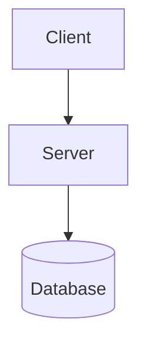
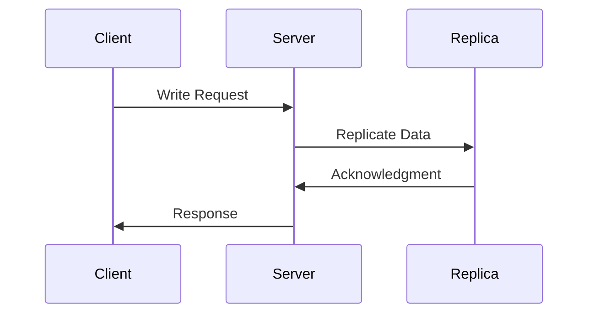
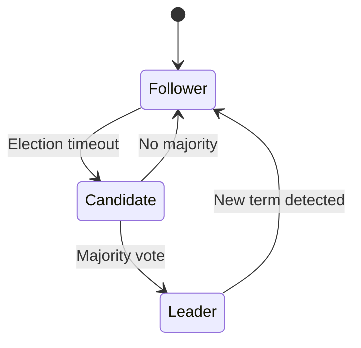

# Research: mdBook Structure & Best Practices

**Sources:**
- mdBook Official Documentation
- GitBook Documentation Best Practices
- Public mdBooks examples

---

## Recommended mdBook Structure

```
book.toml
src/
├── SUMMARY.md              # Table of Contents
├── introduction.md         # Course overview and setup
├── fundamentals/           # Sessions 1-2
│   ├── 01-what-is-ds.md
│   ├── 02-message-passing.md
│   └── 03-queue-system.md
├── data-store/             # Sessions 3-5
│   ├── 04-data-partitioning.md
│   ├── 05-cap-theorem.md
│   ├── 06-replication.md
│   └── 07-consistency.md
├── real-time/              # Sessions 6-7
│   ├── 08-websockets.md
│   ├── 09-pub-sub.md
│   └── 10-chat-system.md
├── consensus/              # Sessions 8-10
│   ├── 11-what-is-consensus.md
│   ├── 12-raft-algorithm.md
│   ├── 13-raft-leader-election.md
│   ├── 14-log-replication.md
│   └── 15-consensus-system.md
└── reference/
    ├── docker-setup.md
    ├── troubleshooting.md
    └── further-reading.md
```

---

## Content Pattern for Each Chapter

### 1. Chapter Structure Template
```markdown
# [Chapter Title]

## Learning Objectives
- [ ] Objective 1
- [ ] Objective 2

## Concept Explanation
[Clear explanation with diagrams]

## Architecture Diagram
[Mermaid diagram showing components]

## Implementation

### TypeScript Version
\`\`\`typescript
[code example]
\`\`\`

### Python Version
\`\`\`python
[code example]
\`\`\`

## Docker Compose Setup
\`\`\`yaml
[docker-compose.yml]
\`\`\`

## Running the Example
[Step-by-step instructions]

## Exercises
1. Exercise 1
2. Exercise 2

## Summary
[Key takeaways]
```

### 2. Code Example Guidelines
- **Dual Language**: Always show both TS and Python
- **Complete Examples**: Code should run as-is
- **Comments**: Explain distributed systems concepts in code comments
- **Error Handling**: Show basic failure scenarios
- **Simplicity**: Avoid over-engineering for teaching purposes

### 3. Diagram Guidelines
Use Mermaid for all diagrams:
- **Architecture**: Component relationships
- **Sequence**: Message flows between nodes
- **State**: State transitions (especially for Raft)
- **Gantt**: Session timing overview

---

## book.toml Configuration

```toml
[book]
title = "Distributed Systems: From Beginner to Advanced"
authors = ["[Your Name]"]
description = "A hands-on course covering distributed systems concepts with TypeScript and Python examples"
language = "en"
multilingual = false

[build]
build-dir = "book"

[preprocessor]

[renderer]
mdbook-katex = true  # For math notation if needed

[output.html]
default-theme = "light"
preferred-dark-theme = "coal"
git-repository-url = "https://github.com/yourusername/distributed-systems-course"
edit-url-template = "https://github.com/yourusername/distributed-systems-course/edit/main/{path}"

[output.html.search]
enable = true
limit-results = 30

[output.html.code]
# Highlight code blocks with line numbers
hard-break-line-numbers = true
```

---

## Pedagogical Best Practices

### 1. Progressive Disclosure
- Start with simple, working examples
- Add complexity incrementally
- Explain "why" before "how"

### 2. Active Learning
- Each session includes hands-on exercises
- "Try it yourself" sections
- Challenges that force deeper understanding

### 3. Visual Learning
- Architecture diagram for every system
- Sequence diagrams for message flows
- State diagrams for algorithms (especially Raft)

### 4. Dual Language Approach
| Pattern | Description |
|---------|-------------|
| Side-by-side | TS and Python examples on same topic |
| Concept parity | Same concepts demonstrated in both |
| Choice-based | Learners can focus on their preferred language |

### 5. Docker Compose Standards
Every chapter includes:
```yaml
# docker-compose.yml pattern
services:
  [component]-[number]:
    build: ./[component]
    networks:
      - ds-network
    environment:
      - NODE_ID=[number]
      - PEERS=...  # Comma-separated peer list
networks:
  ds-network:
```

---

## Session Time Distribution (1.5 hours each)

| Activity | Duration | Purpose |
|----------|----------|---------|
| Review | 5 min | Recap previous session |
| Concept | 20 min | New theory/concepts |
| Diagram Walkthrough | 10 min | Visual understanding |
| Code Demo | 15 min | Live coding walk-through |
| Hands-on Exercise | 25 min | Learners code along |
| Run & Test | 10 min | Docker compose up, test |
| Summary | 5 min | Key takeaways, next session preview |

---

## Mermaid Diagram Templates

### Architecture Diagram


### Sequence Diagram


### State Diagram

