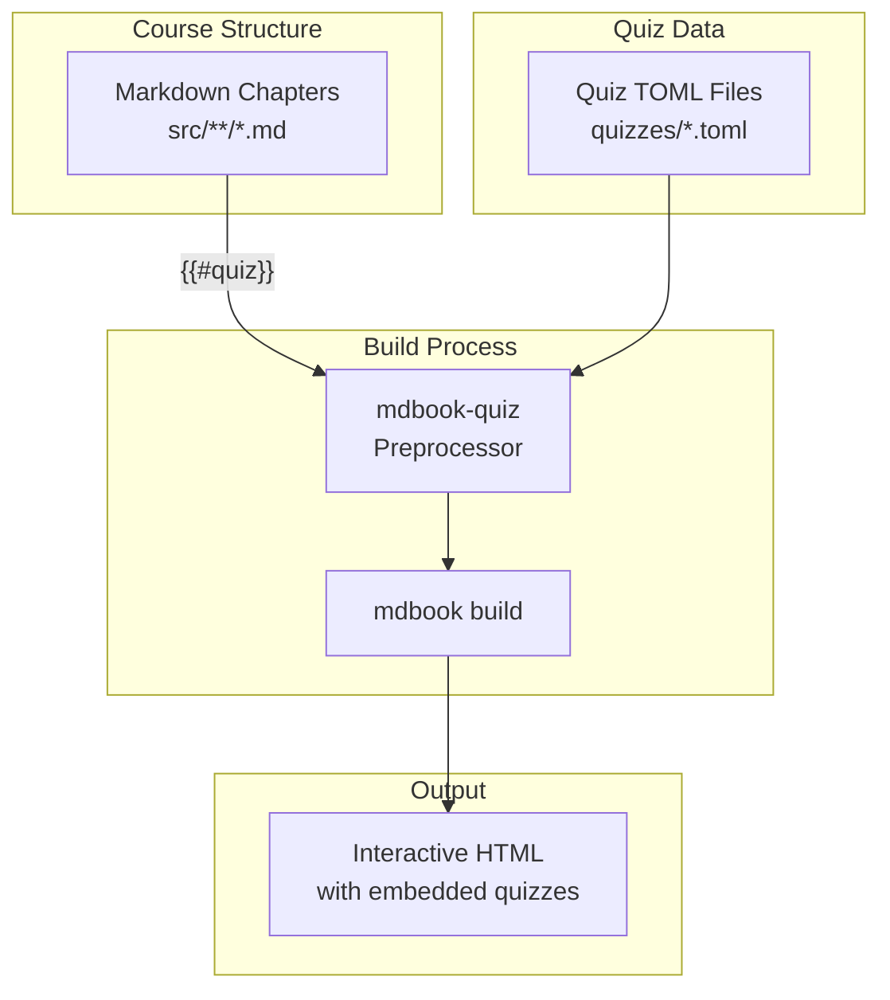

# Design: Interactive Quizzes for Distributed Systems Course

## Overview

Add end-of-chapter interactive quizzes to the Distributed Systems mdBook course using the `mdbook-quiz` plugin. Quizzes will be AI-generated with a playful yet challenging tone, testing cumulative knowledge across each chapter.

---

## Detailed Requirements

### Functional Requirements

| ID | Requirement |
|----|-------------|
| FR-1 | Each chapter (excluding introduction and reference materials) must have an end-of-chapter quiz |
| FR-2 | Quizzes must use the `mdbook-quiz` plugin (TOML format) |
| FR-3 | Each quiz must contain 1-3 questions per section, aggregated at chapter level |
| FR-4 | Questions must be a mix of MultipleChoice and ShortAnswer types |
| FR-5 | Each question must include a `context` field with explanation/feedback |
| FR-6 | Questions must have a playful, challenging tone |
| FR-7 | Questions may test cumulative knowledge from previous sections/chapters |
| FR-8 | Quizzes must be referenced at the end of each chapter markdown file |

### Non-Functional Requirements

| ID | Requirement |
|----|-------------|
| NFR-1 | Quiz files must be stored in `quizzes/` directory |
| NFR-2 | Quiz files must follow naming convention: `{chapter-name}.toml` |
| NFR-3 | Explanations must be informative yet concise |
| NFR-4 | Questions must be technically accurate for distributed systems concepts |

### Scope

**Include:**
- Part I: Fundamentals (3 chapters)
- Part II: Data Store with Replication (5 chapters)
- Part III: Real-Time Chat System (3 chapters)
- Part IV: Consensus System (5 chapters)

**Exclude:**
- introduction.md
- Reference materials (Docker Setup, Troubleshooting, Further Reading)

---

## Architecture Overview



---

## Components and Interfaces

### 1. Quiz File Structure

```
quizzes/
├── fundamentals-what-is-ds.toml
├── fundamentals-message-passing.toml
├── fundamentals-queue-system.toml
├── data-store-partitioning.toml
├── data-store-cap-theorem.toml
├── data-store-basics.toml
├── data-store-replication.toml
├── data-store-consistency.toml
├── real-time-websockets.toml
├── real-time-pub-sub.toml
├── real-time-chat-system.toml
├── consensus-what-is-consensus.toml
├── consensus-raft-algorithm.toml
├── consensus-leader-election.toml
├── consensus-log-replication.toml
└── consensus-consensus-system.toml
```

### 2. TOML Schema

```toml
# Quiz file template
[[questions]]
type = "MultipleChoice"  # or "ShortAnswer"
prompt.prompt = "Playful, challenging question text"
prompt.distractors = [
    "Wrong answer 1",
    "Wrong answer 2",
    "Wrong answer 3"
]
answer.answer = "Correct answer"
context = """
Explanation with feedback.
This is shown after the user answers.
"""

[[questions]]
type = "ShortAnswer"
prompt.prompt = "Question requiring specific answer"
answer.answer = "exact answer"
answer.alternatives = ["alternative1", "alternative2"]
context = "Explanation with feedback."
```

### 3. Markdown Integration

At the end of each chapter file:

```markdown
## 🧠 Chapter Quiz

Test your understanding of this chapter's concepts!

{{#quiz ../quizzes/[chapter-name].toml}}
```

### 4. book.toml Configuration

```toml
[preprocessor.quiz]
fullscreen = true
cache-answers = true
```

---

## Data Models

### Quiz Metadata

| Field | Type | Description |
|-------|------|-------------|
| `type` | string | `MultipleChoice` or `ShortAnswer` |
| `prompt.prompt` | string | The question text |
| `prompt.distractors` | string[] | Wrong answers (MultipleChoice only) |
| `answer.answer` | string | Correct answer |
| `answer.alternatives` | string[] | Acceptable alternatives (ShortAnswer, optional) |
| `context` | string | Explanation/feedback (markdown supported) |

### Question Distribution Guidelines

| Chapter Sections | Estimated Questions |
|------------------|---------------------|
| 2-3 sections | 3-5 questions |
| 4-5 sections | 5-8 questions |
| 6+ sections | 8-12 questions |

---

## Error Handling

### Potential Issues & Mitigations

| Issue | Mitigation |
|-------|------------|
| TOML syntax errors | Validate with `mdbook-quiz` schema before committing |
| Missing quiz reference | Build will fail visibly — add CI check |
| Incorrect answer key | Peer review questions for technical accuracy |
| Too many similar questions | Rotate question pool using alternatives |

---

## Acceptance Criteria (Given-When-Then)

### AC-1: Quiz File Creation
**Given** a chapter file with content
**When** I create the corresponding quiz TOML file
**Then** the file exists in `quizzes/` with valid syntax

### AC-2: Quiz Integration
**Given** a quiz TOML file exists
**When** I add `{{#quiz ../quizzes/file.toml}}` to the chapter
**And** run `mdbook build`
**Then** the quiz renders in the HTML output

### AC-3: Question Types
**Given** a quiz file
**When** I define questions
**Then** at least one MultipleChoice and one ShortAnswer question exists

### AC-4: Explanations
**Given** a user answers a question
**When** they submit their answer
**Then** the `context` field is displayed with feedback

### AC-5: Playful Tone
**Given** a question prompt
**When** I read the text
**Then** the language is playful yet challenging (not dry/formal)

### AC-6: Exclusions
**Given** the introduction.md or reference chapters
**When** I check for quiz references
**Then** no quizzes are present

---

## Testing Strategy

### Manual Testing
1. Run `mdbook build` and verify no errors
2. Open `book/index.html` in browser
3. Navigate to each chapter's quiz
4. Answer questions and verify feedback displays
5. Check answer validation (correct/incorrect)

### Automated Checks (Optional)
- TOML schema validation script
- Spell check on all question text
- Link checker for quiz references

### Content Review
- Technical accuracy by subject matter expert
- Tone review for playful/challenging style
- Cumulative knowledge progression check

---

## Appendices

### A. Technology Choices

| Technology | Justification |
|------------|---------------|
| **mdbook-quiz** | Native mdBook integration, interactive UI, local storage support |
| **TOML** | Human-readable, native to mdbook-quiz, easy to version control |
| **MultipleChoice** | Best for conceptual understanding with distractors |
| **ShortAnswer** | Good for recalling key terms/concepts |

### B. Research Findings Summary

From `research/mdbook-quiz.md`:
- Quizzes stored as separate TOML files in `quizzes/` directory
- Referenced via `{{#quiz ../quizzes/file.toml}}` in Markdown
- Three question types supported: ShortAnswer, MultipleChoice, Tracing
- `context` field provides explanations/feedback
- No native True/False — implement as MultipleChoice with 2 options
- Configuration via `[preprocessor.quiz]` in `book.toml`

### C. Alternative Approaches Considered

| Approach | Rejected Because |
|----------|------------------|
| `<details>` HTML tags in Markdown | No validation, no interactive scoring, manual implementation |
| Custom JavaScript | Higher maintenance, not mdBook-native |
| Third-party quiz platforms | External dependencies, breaks local workflow |

### D. Limitations

- mdbook-quiz creates `mdbook-quiz/` directory in source (add to .gitignore)
- No built-in analytics/scoring (would need custom implementation)
- Tracing questions specific to code execution (limited use for DS concepts)
