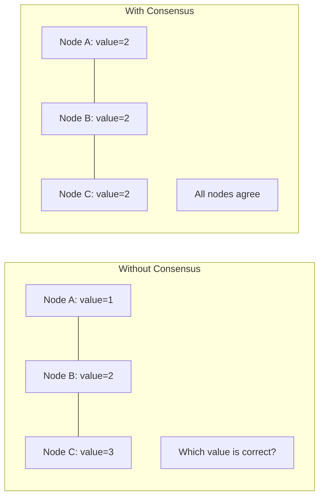
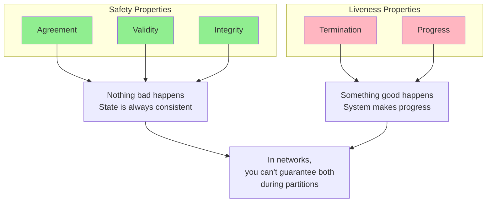
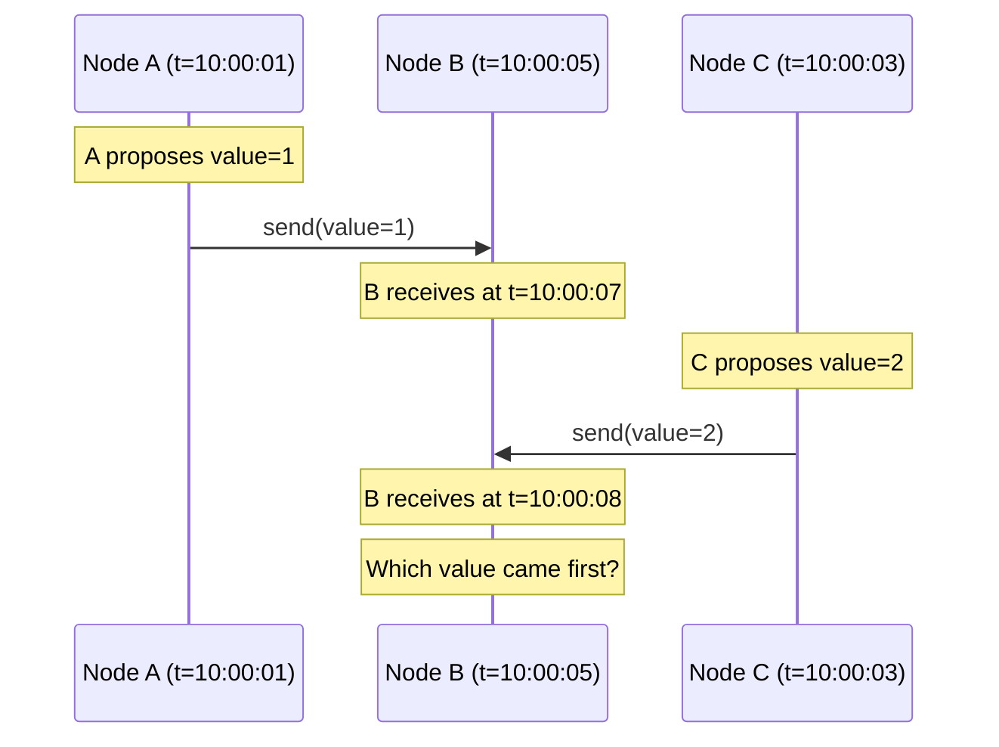
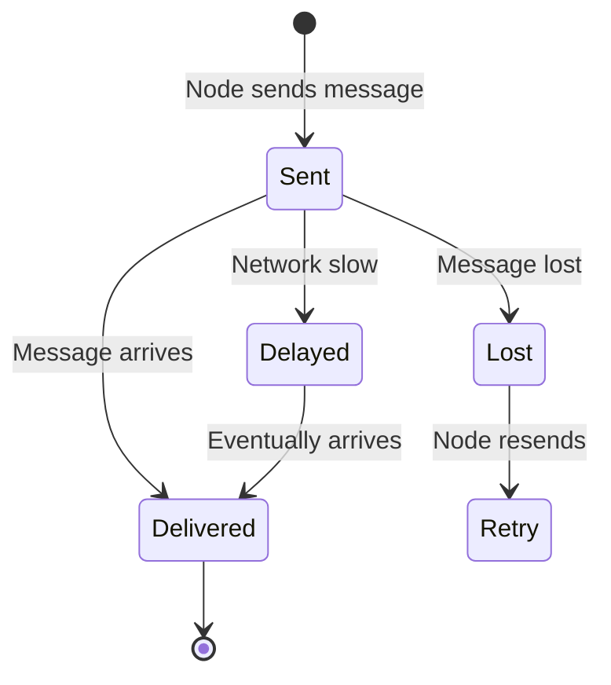
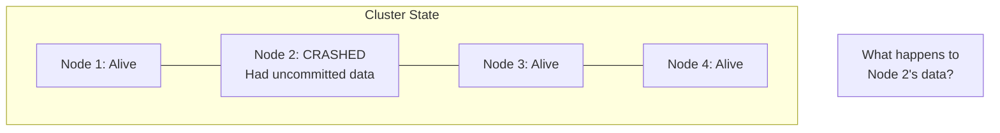
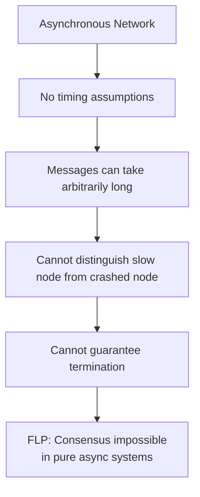
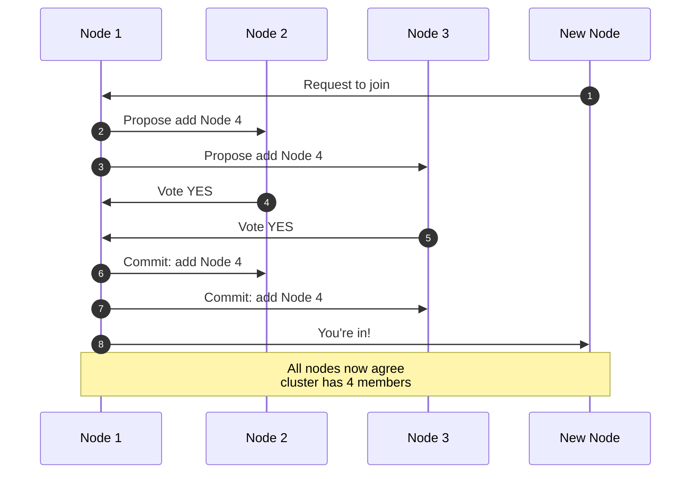
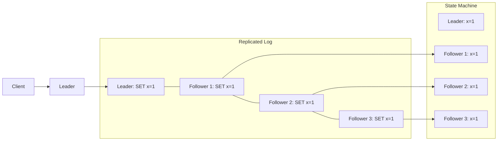
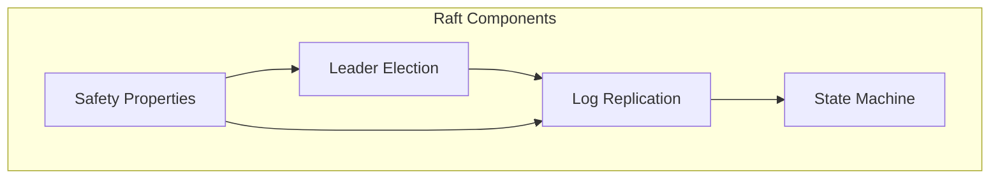

# What is Consensus?

> **Session 8** - Full session

## Learning Objectives

- [ ] Understand the consensus problem in distributed systems
- [ ] Learn the difference between safety and liveness properties
- [ ] Explore the FLP impossibility result
- [ ] Understand why consensus algorithms are necessary
- [ ] Compare Raft and Paxos approaches

---

## The Consensus Problem

In distributed systems, **consensus** is the problem of getting multiple nodes to agree on a single value. This sounds simple, but it's fundamental to building reliable distributed systems.

### Why Do We Need Consensus?

Consider these scenarios:

- **Leader Election**: Multiple nodes need to agree on who is the leader
- **Configuration Changes**: All nodes must agree on a new configuration
- **Replicated State Machines**: All nodes must apply operations in the same order
- **Distributed Transactions**: All participants must agree to commit or abort

Without consensus, distributed systems can suffer from:
- Split-brain scenarios (multiple leaders)
- Inconsistent state across nodes
- Data corruption from conflicting writes
- Unavailable systems during network partitions



---

## Formal Definition

The consensus problem requires a system to satisfy these properties:

### 1. **Agreement (Safety)**
All correct nodes must agree on the same value.

> If node A outputs `v` and node B outputs `v'`, then `v = v'`

### 2. **Validity**
If all correct nodes propose the same value `v`, then all correct nodes decide `v`.

> The decided value must have been proposed by some node

### 3. **Termination (Liveness)**
All correct nodes eventually decide on some value.

> The algorithm must make progress, not run forever

### 4. **Integrity**
Each node decides at most once.

> A node cannot change its decision after deciding

---

## Safety vs Liveness

Understanding the trade-off between safety and liveness is crucial for distributed systems:



| Safety | Liveness |
|--------|----------|
| "Nothing bad happens" | "Something good happens" |
| State is always valid | System makes progress |
| No corruption, no conflicts | Operations complete eventually |
| Can be maintained during partitions | May be sacrificed during partitions |

**Example**: During a network partition (CAP theorem), a CP system maintains safety (no inconsistent writes) but sacrifices liveness (writes may be rejected). An AP system maintains liveness (writes succeed) but may sacrifice safety (temporary inconsistencies).

---

## Why Consensus is Hard

### Challenge 1: No Global Clock

Nodes don't share a synchronized clock, making it hard to order events:



### Challenge 2: Message Loss and Delays

Messages can be lost, delayed, or reordered:



### Challenge 3: Node Failures

Nodes can crash at any time, potentially while holding critical information:



---

## The FLP Impossibility Result

In 1985, Fischer, Lynch, and Paterson proved the **FLP Impossibility Result**:

> **In an asynchronous network, even with only one faulty node, no deterministic consensus algorithm can guarantee safety, liveness, and termination.**

### What This Means



### How We Work Around It

Real systems handle FLP by relaxing some assumptions:

1. **Partial Synchrony**: Assume networks are eventually synchronous
2. **Randomization**: Use randomized algorithms (e.g., randomized election timeouts)
3. **Failure Detectors**: Use unreliable failure detectors
4. **Timeouts**: Assume messages arrive within some time bound

> **Key Insight**: Raft works in "partially synchronous" systems—networks may behave asynchronously for a while, but eventually become synchronous.

---

## Real-World Consensus Scenarios

### Scenario 1: Distributed Configuration

All nodes must agree on cluster membership:



### Scenario 2: Replicated State Machine

All replicas must apply operations in the same order:



---

## Consensus Algorithms: Raft vs Paxos

### Paxos (1998)

Paxos was the first practical consensus algorithm, but it's notoriously difficult to understand:

```
Phase 1a (Prepare):  Proposer chooses proposal number n, sends Prepare(n)
Phase 1b (Promise):  Acceptor promises not to accept proposals < n
Phase 2a (Accept):   Proposer sends Accept(n, value)
Phase 2b (Accepted): Acceptor accepts if no higher proposal seen
```

**Pros**:
- Proven correct
- Handles any number of failures
- Minimal message complexity

**Cons**:
- Extremely difficult to understand
- Hard to implement correctly
- Multi-Paxos adds complexity
- No leader by default

### Raft (2014)

Raft was designed specifically for understandability:



**Pros**:
- Designed for understandability
- Clear separation of concerns
- Strong leader simplifies logic
- Practical implementation guidance
- Widely adopted

**Cons**:
- Leader can be bottleneck
- Not as optimized as Multi-Paxos variants

---

## When Do You Need Consensus?

Use consensus when:

| Scenario | Need Consensus? | Reason |
|----------|----------------|--------|
| Single-node database | No | No distributed state |
| Multi-master replication | Yes | Must agree on write order |
| Leader election | Yes | Must agree on who is leader |
| Configuration management | Yes | All nodes need same config |
| Distributed lock service | Yes | Must agree on lock holder |
| Load balancer state | No | Stateless, can be rebuilt |
| Cache invalidation | Sometimes | Depends on consistency needs |

### When You DON'T Need Consensus

- **Read-only systems**: No state to agree on
- **Eventual consistency is enough**: Last-write-wins suffices
- **Conflict-free replicated data types (CRDTs)**: Mathematically resolve conflicts
- **Single source of truth**: Centralized authority

---

## Simple Consensus Example

Let's look at a simplified consensus scenario: agreeing on a counter value.

### TypeScript Example

```typescript
// A simple consensus simulation
interface Proposal {
  value: number;
  proposerId: string;
}

class ConsensusNode {
  private proposals: Map<string, Proposal> = new Map();
  private decidedValue?: number;
  private nodeId: string;

  constructor(nodeId: string) {
    this.nodeId = nodeId;
  }

  // Propose a value
  propose(value: number): void {
    const proposal: Proposal = {
      value,
      proposerId: this.nodeId
    };
    this.proposals.set(this.nodeId, proposal);
    this.broadcastProposal(proposal);
  }

  // Receive a proposal from another node
  receiveProposal(proposal: Proposal): void {
    this.proposals.set(proposal.proposerId, proposal);
    this.checkConsensus();
  }

  // Check if we have consensus
  private checkConsensus(): void {
    if (this.decidedValue !== undefined) return;

    const values = Array.from(this.proposals.values()).map(p => p.value);
    const counts = new Map<number, number>();

    for (const value of values) {
      counts.set(value, (counts.get(value) || 0) + 1);
    }

    // Simple majority consensus
    for (const [value, count] of counts.entries()) {
      if (count > Math.floor(this.proposals.size / 2)) {
        this.decidedValue = value;
        console.log(`Node ${this.nodeId} decided on value: ${value}`);
        return;
      }
    }
  }

  private broadcastProposal(proposal: Proposal): void {
    // In a real system, this would send to other nodes
    console.log(`Node ${this.nodeId} broadcasting proposal: ${proposal.value}`);
  }
}

// Example usage
const node1 = new ConsensusNode('node1');
const node2 = new ConsensusNode('node2');
const node3 = new ConsensusNode('node3');

node1.propose(42);
node2.propose(42);
node3.propose(99);  // Minority, should lose
```

### Python Example

```python
from dataclasses import dataclass
from typing import Optional, Dict
import random

@dataclass
class Proposal:
    value: int
    proposer_id: str

class ConsensusNode:
    def __init__(self, node_id: str):
        self.node_id = node_id
        self.proposals: Dict[str, Proposal] = {}
        self.decided_value: Optional[int] = None

    def propose(self, value: int) -> None:
        """Propose a value to the group."""
        proposal = Proposal(value, self.node_id)
        self.proposals[self.node_id] = proposal
        self._broadcast_proposal(proposal)
        self._check_consensus()

    def receive_proposal(self, proposal: Proposal) -> None:
        """Receive a proposal from another node."""
        self.proposals[proposal.proposer_id] = proposal
        self._check_consensus()

    def _check_consensus(self) -> None:
        """Check if we have consensus on a value."""
        if self.decided_value is not None:
            return

        if not self.proposals:
            return

        # Count occurrences of each value
        counts = {}
        for proposal in self.proposals.values():
            counts[proposal.value] = counts.get(proposal.value, 0) + 1

        # Simple majority consensus
        total_nodes = len(self.proposals)
        for value, count in counts.items():
            if count > total_nodes // 2:
                self.decided_value = value
                print(f"Node {self.node_id} decided on value: {value}")
                return

    def _broadcast_proposal(self, proposal: Proposal) -> None:
        """Broadcast proposal to other nodes."""
        print(f"Node {self.node_id} broadcasting proposal: {proposal.value}")

# Example usage
if __name__ == "__main__":
    node1 = ConsensusNode("node1")
    node2 = ConsensusNode("node2")
    node3 = ConsensusNode("node3")

    node1.propose(42)
    node2.propose(42)
    node3.propose(99)  # Minority, should lose
```

---

## Common Pitfalls

| Pitfall | Description | Solution |
|---------|-------------|----------|
| Split Brain | Multiple leaders think they're in charge | Use quorum-based voting |
| Stale Reads | Reading from nodes that haven't received updates | Read from leader or use quorum reads |
| Network Partition Handling | Nodes can't communicate but continue operating | Require quorum for operations |
| Partial Failures | Some nodes fail, others continue | Design for fault tolerance |
| Clock Skew | Different clocks cause ordering issues | Use logical clocks (Lamport timestamps) |

---

## Summary

### Key Takeaways

1. **Consensus** is the problem of getting multiple distributed nodes to agree on a single value
2. **Safety** ensures nothing bad happens (agreement, validity, integrity)
3. **Liveness** ensures something good happens (termination, progress)
4. **FLP Impossibility** proves consensus is impossible in pure asynchronous systems
5. **Real systems** work around FLP using partial synchrony and timeouts
6. **Raft** was designed for understandability, unlike the complex Paxos algorithm

### Next Session

In the next session, we'll dive into the **Raft algorithm** itself:
- Raft's design philosophy
- Node states (Follower, Candidate, Leader)
- How leader election works
- How log replication maintains consistency

### Exercises

1. **Safety vs Liveness**: Give an example of a system that prioritizes safety over liveness, and one that does the opposite.

2. **FLP Scenario**: Describe a scenario where FLP would cause problems in a real distributed system.

3. **Consensus Need**: For each of these systems, explain whether they need consensus and why:
   - A distributed key-value store
   - A CDN (content delivery network)
   - A distributed task queue
   - A blockchain system

4. **Simple Consensus**: Extend the simple consensus example to handle node failures (a node stops responding).

## 🧠 Chapter Quiz

Test your mastery of these concepts! These questions will challenge your understanding and reveal any gaps in your knowledge.

{{#quiz ../../quizzes/consensus-what-is-consensus.toml}}
