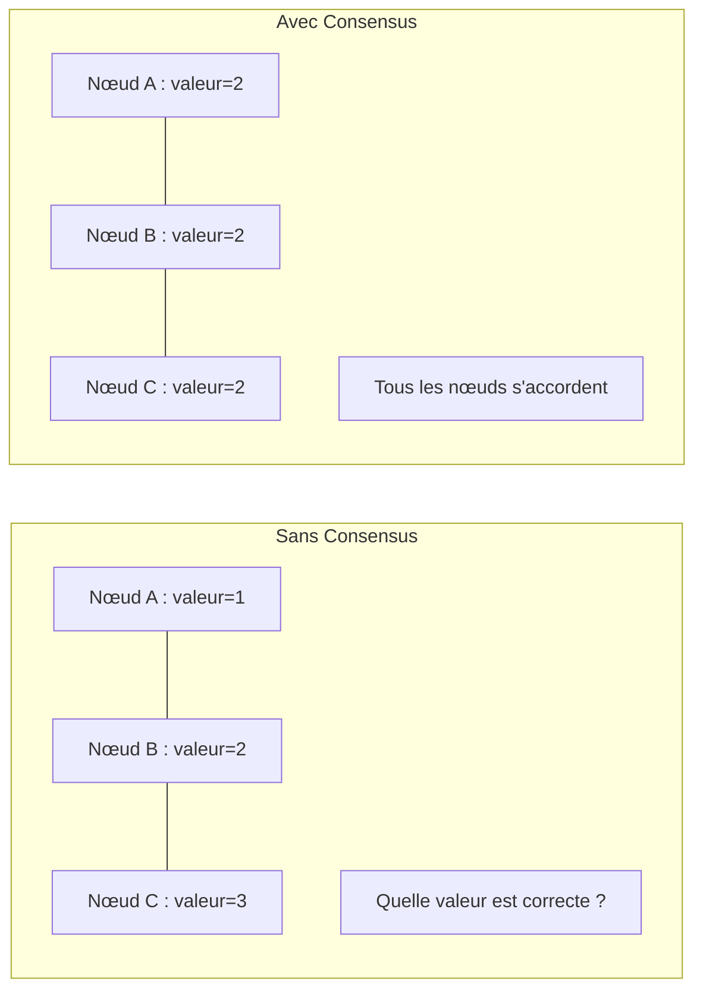
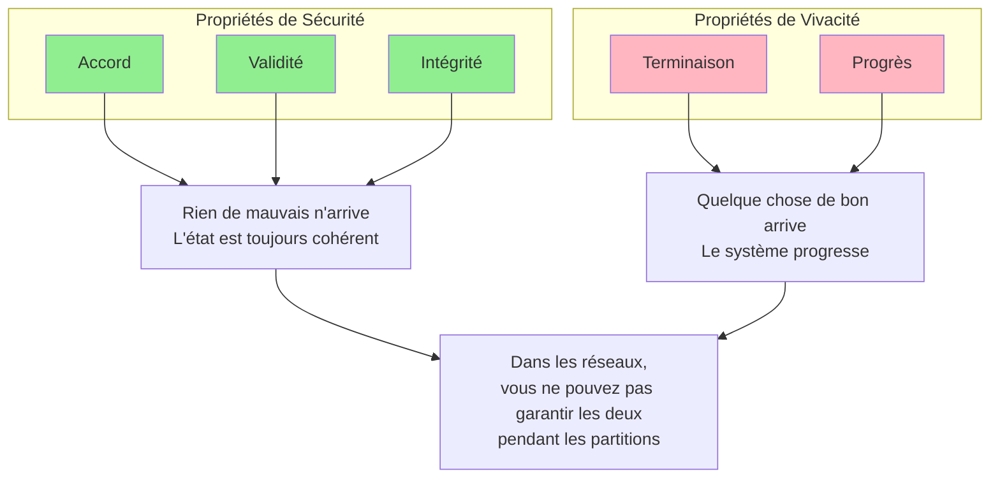
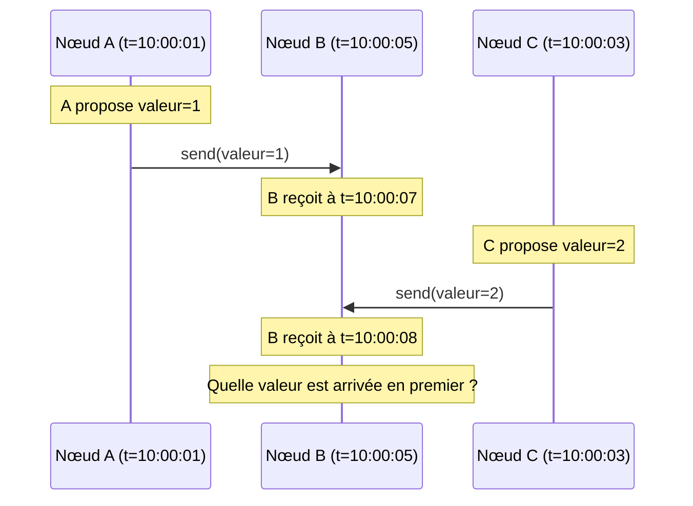
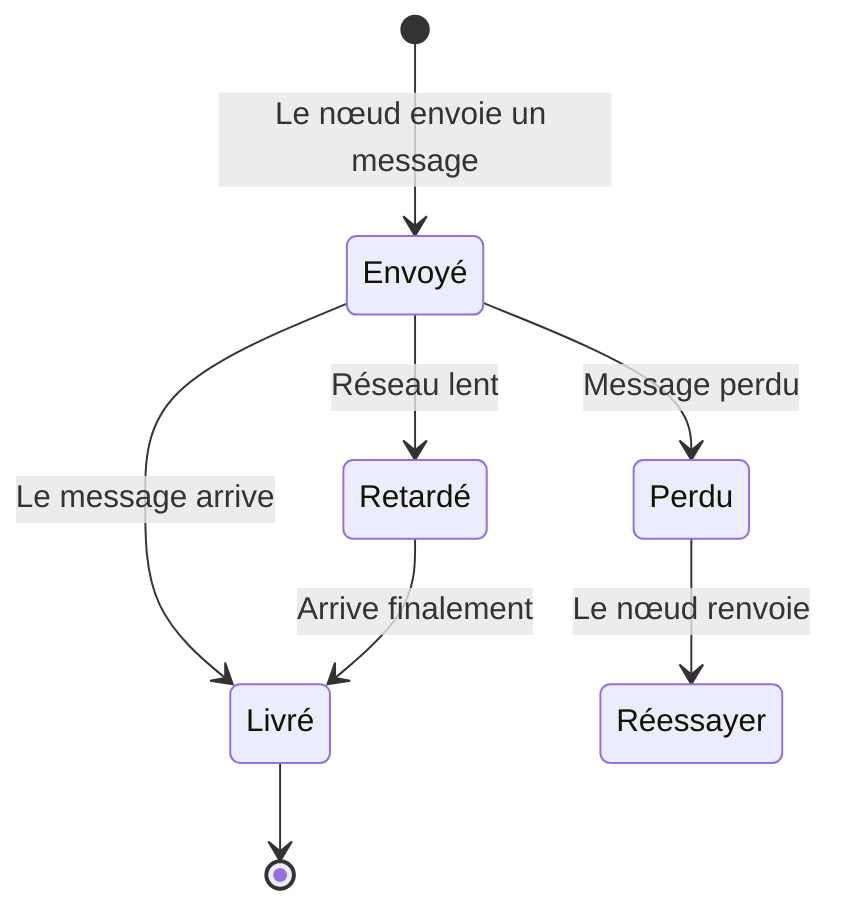
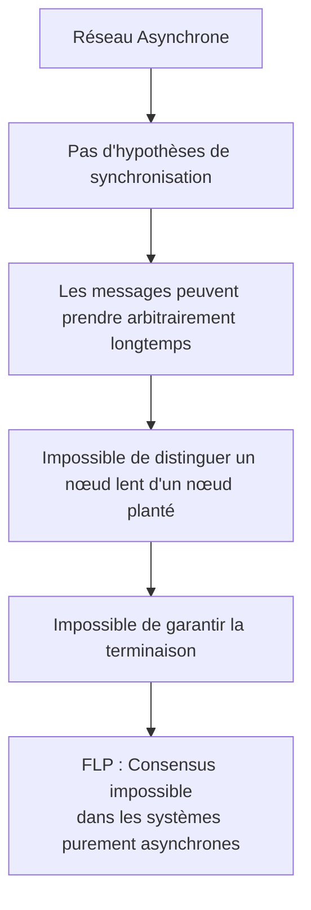
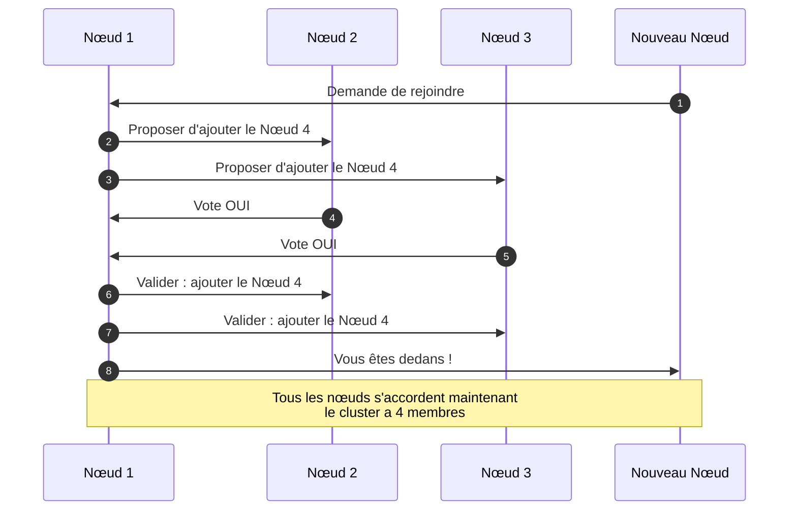
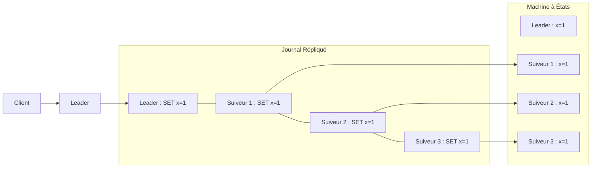
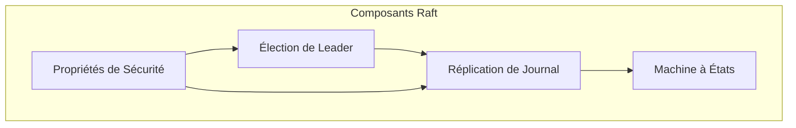

# Qu'est-ce que le Consensus ?

> **Session 8** - Session complète

## Objectifs d'Apprentissage

- [ ] Comprendre le problème du consensus dans les systèmes distribués
- [ ] Apprendre la différence entre les propriétés de sécurité et de vivacité
- [ ] Explorer le résultat d'impossibilité FLP
- [ ] Comprendre pourquoi les algorithmes de consensus sont nécessaires
- [ ] Comparer les approches Raft et Paxos

---

## Le Problème du Consensus

Dans les systèmes distribués, le **consensus (consensus)** est le problème consistant à faire s'accorder plusieurs nœuds sur une seule valeur. Cela semble simple, mais c'est fondamental pour construire des systèmes distribués fiables.

### Pourquoi avons-nous besoin du Consensus ?

Considérez ces scénarios :

- **Élection de Leader (Leader Election)** : Plusieurs nœuds doivent s'accorder sur qui est le leader
- **Changements de Configuration** : Tous les nœuds doivent s'accorder sur une nouvelle configuration
- **Machines à États Répliquées** : Tous les nœuds doivent appliquer les opérations dans le même ordre
- **Transactions Distribuées** : Tous les participants doivent s'accorder pour valider ou abandonner

Sans consensus, les systèmes distribués peuvent souffrir de :
- Scénarios de split-brain (multiple leaders)
- État incohérent entre les nœuds
- Corruption de données due à des écritures conflictuelles
- Systèmes indisponibles pendant les partitions réseau



---

## Définition Formelle

Le problème du consensus exige qu'un système satisfasse ces propriétés :

### 1. **Accord (Sécurité)**

Tous les nœuds corrects doivent s'accorder sur la même valeur.

> Si le nœud A produit `v` et le nœud B produit `v'`, alors `v = v'`

### 2. **Validité**

Si tous les nœuds corrects proposent la même valeur `v`, alors tous les nœuds corrects décident `v`.

> La valeur décidée doit avoir été proposée par un certain nœud

### 3. **Terminaison (Vivacité)**

Tous les nœuds corrects décident finalement d'une certaine valeur.

> L'algorithme doit progresser, pas tourner pour toujours

### 4. **Intégrité**

Chaque nœud décide au plus une fois.

> Un nœud ne peut pas changer sa décision après avoir décidé

---

## Sécurité vs Vivacité

Comprendre le compromis entre la sécurité (safety) et la vivacité (liveness) est crucial pour les systèmes distribués :



| Sécurité (Safety) | Vivacité (Liveness) |
|--------|----------|
| "Rien de mauvais n'arrive" | "Quelque chose de bon arrive" |
| L'état est toujours valide | Le système progresse |
| Pas de corruption, pas de conflits | Les opérations se terminent finalement |
| Peut être maintenue pendant les partitions | Peut être sacrifiée pendant les partitions |

**Exemple** : Pendant une partition réseau (théorème CAP), un système CP maintient la sécurité (pas d'écritures incohérentes) mais sacrifie la vivacité (les écritures peuvent être rejetées). Un système AP maintient la vivacité (les écritures réussissent) mais peut sacrifier la sécurité (incohérences temporaires).

---

## Pourquoi le Consensus est Difficile

### Défi 1 : Pas d'Horloge Globale

Les nœuds ne partagent pas d'horloge synchronisée, ce qui rend difficile l'ordonnancement des événements :



### Défi 2 : Perte et Retards de Messages

Les messages peuvent être perdus, retardés ou réordonnés :



### Défi 3 : Pannes de Nœuds

Les nœuds peuvent planter à tout moment, potentiellement en détenant des informations critiques :


---

## Le Résultat d'Impossibilité FLP

En 1985, Fischer, Lynch et Paterson ont prouvé le **Résultat d'Impossibilité FLP** :

> **Dans un réseau asynchrone, même avec un seul nœud défectueux, aucun algorithme de consensus déterministe ne peut garantir la sécurité, la vivacité et la terminaison.**

### Ce que cela signifie



### Comment nous contournons cela

Les systèmes réels gèrent FLP en relaxant certaines hypothèses :

1. **Synchronisme Partiel** : Supposer que les réseaux sont finalement synchrones
2. **Randomisation** : Utiliser des algorithmes randomisés (ex: délais d'élection randomisés)
3. **Détecteurs de Panne** : Utiliser des détecteurs de panne non fiables
4. **Délais d'Attente** : Supposer que les messages arrivent dans un certain délai

> **Aperçu Clé** : Raft fonctionne dans des systèmes "partiellement synchrones" — les réseaux peuvent se comporter de manière asynchrone pendant un moment, mais deviennent finalement synchrones.

---

## Scénarios Réels de Consensus

### Scénario 1 : Configuration Distribuée

Tous les nœuds doivent s'accorder sur l'appartenance au cluster :



### Scénario 2 : Machine à États Répliquée

Toutes les répliques doivent appliquer les opérations dans le même ordre :



---

## Algorithmes de Consensus : Raft vs Paxos

### Paxos (1998)

Paxos fut le premier algorithme de consensus pratique, mais il est notoirement difficile à comprendre :

```
Phase 1a (Préparer) :  Le proposant choisit le numéro de proposition n, envoie Prepare(n)
Phase 1b (Promesse) :  L'accepteur promet de ne pas accepter les propositions < n
Phase 2a (Accepter) :  Le proposant envoie Accept(n, valeur)
Phase 2b (Accepté) :  L'accepteur accepte si aucune proposition supérieure vue
```

**Avantages** :
- Preuve de correction
- Gère n'importe quel nombre de pannes
- Complexité de message minimale

**Inconvénients** :
- Extrêmement difficile à comprendre
- Difficile à implémenter correctement
- Multi-Paxos ajoute de la complexité
- Pas de leader par défaut

### Raft (2014)

Raft a été conçu spécifiquement pour la compréhension :



**Avantages** :
- Conçu pour la compréhension
- Séparation claire des préoccupations
- Leader fort simplifie la logique
- Guide d'implémentation pratique
- Large adoption

**Inconvénients** :
- Le leader peut être un goulot d'étranglement
- Pas aussi optimisé que les variantes Multi-Paxos

---

## Quand avez-vous besoin du Consensus ?

Utilisez le consensus lorsque :

| Scénario | Besoin de Consensus ? | Raison |
|----------|----------------|--------|
| Base de données à nœud unique | Non | Pas d'état distribué |
| Réplication multi-maître | Oui | Doit s'accorder sur l'ordre des écritures |
| Élection de leader | Oui | Doit s'accorder sur qui est le leader |
| Gestion de configuration | Oui | Tous les nœuds ont besoin de la même config |
| Service de verrou distribué | Oui | Doit s'accorder sur le détenteur du verrou |
| État du répartiteur de charge | Non | Sans état, peut être reconstruit |
| Invalidation de cache | Parfois | Dépend des besoins de cohérence |

### Quand vous N'avez PAS besoin du Consensus

- **Systèmes en lecture seule** : Pas d'état sur lequel s'accorder
- **La cohérence éventuelle suffit** : Last-write-wins suffit
- **Types de données répliquées sans conflit (CRDT)** : Résoudre mathématiquement les conflits
- **Source unique de vérité** : Autorité centralisée

---

## Exemple Simple de Consensus

Examinons un scénario de consensus simplifié : s'accorder sur une valeur de compteur.

### Exemple TypeScript

```typescript
// Une simulation de consensus simple
interface Proposal {
  value: number;
  proposerId: string;
}

class ConsensusNode {
  private proposals: Map<string, Proposal> = new Map();
  private decidedValue?: number;
  private nodeId: string;

  constructor(nodeId: string) {
    this.nodeId = nodeId;
  }

  // Proposer une valeur
  propose(value: number): void {
    const proposal: Proposal = {
      value,
      proposerId: this.nodeId
    };
    this.proposals.set(this.nodeId, proposal);
    this.broadcastProposal(proposal);
  }

  // Recevoir une proposition d'un autre nœud
  receiveProposal(proposal: Proposal): void {
    this.proposals.set(proposal.proposerId, proposal);
    this.checkConsensus();
  }

  // Vérifier si nous avons un consensus
  private checkConsensus(): void {
    if (this.decidedValue !== undefined) return;

    const values = Array.from(this.proposals.values()).map(p => p.value);
    const counts = new Map<number, number>();

    for (const value of values) {
      counts.set(value, (counts.get(value) || 0) + 1);
    }

    // Consensus à majorité simple
    for (const [value, count] of counts.entries()) {
      if (count > Math.floor(this.proposals.size / 2)) {
        this.decidedValue = value;
        console.log(`Nœud ${this.nodeId} a décidé de la valeur : ${value}`);
        return;
      }
    }
  }

  private broadcastProposal(proposal: Proposal): void {
    // Dans un système réel, cela enverrait aux autres nœuds
    console.log(`Nœud ${this.nodeId} diffuse la proposition : ${proposal.value}`);
  }
}

// Exemple d'utilisation
const node1 = new ConsensusNode('node1');
const node2 = new ConsensusNode('node2');
const node3 = new ConsensusNode('node3');

node1.propose(42);
node2.propose(42);
node3.propose(99);  // Minorité, devrait perdre
```

### Exemple Python

```python
from dataclasses import dataclass
from typing import Optional, Dict
import random

@dataclass
class Proposal:
    value: int
    proposer_id: str

class ConsensusNode:
    def __init__(self, node_id: str):
        self.node_id = node_id
        self.proposals: Dict[str, Proposal] = {}
        self.decided_value: Optional[int] = None

    def propose(self, value: int) -> None:
        """Proposer une valeur au groupe."""
        proposal = Proposal(value, self.node_id)
        self.proposals[self.node_id] = proposal
        self._broadcast_proposal(proposal)
        self._check_consensus()

    def receive_proposal(self, proposal: Proposal) -> None:
        """Recevoir une proposition d'un autre nœud."""
        self.proposals[proposal.proposer_id] = proposal
        self._check_consensus()

    def _check_consensus(self) -> None:
        """Vérifier si nous avons un consensus sur une valeur."""
        if self.decided_value is not None:
            return

        if not self.proposals:
            return

        # Compter les occurrences de chaque valeur
        counts = {}
        for proposal in self.proposals.values():
            counts[proposal.value] = counts.get(proposal.value, 0) + 1

        # Consensus à majorité simple
        total_nodes = len(self.proposals)
        for value, count in counts.items():
            if count > total_nodes // 2:
                self.decided_value = value
                print(f"Nœud {self.node_id} a décidé de la valeur : {value}")
                return

    def _broadcast_proposal(self, proposal: Proposal) -> None:
        """Diffuser la proposition aux autres nœuds."""
        print(f"Nœud {self.node_id} diffuse la proposition : {proposal.value}")

# Exemple d'utilisation
if __name__ == "__main__":
    node1 = ConsensusNode("node1")
    node2 = ConsensusNode("node2")
    node3 = ConsensusNode("node3")

    node1.propose(42)
    node2.propose(42)
    node3.propose(99)  # Minorité, devrait perdre
```

---

## Pièges Courants

| Piège | Description | Solution |
|---------|-------------|----------|
| Split Brain | Plusieurs leaders pensent qu'ils sont en charge | Utiliser un vote à quorum |
| Lectures Stalées | Lire à partir de nœuds qui n'ont pas reçu les mises à jour | Lire à partir du leader ou utiliser des lectures à quorum |
| Gestion de Partition Réseau | Les nœuds ne peuvent pas communiquer mais continuent à fonctionner | Exiger un quorum pour les opérations |
| Pannes Partielles | Certains nœuds plantent, d'autres continuent | Concevoir pour la tolérance aux pannes |
| Dérive d'Horloge | Des horloges différentes causent des problèmes d'ordonnancement | Utiliser des horloges logiques (horodatages Lamport) |

---

## Résumé

### Points Clés à Retenir

1. Le **Consensus** est le problème consistant à faire s'accorder plusieurs nœuds distribués sur une seule valeur
2. La **Sécurité (Safety)** assure que rien de mauvais n'arrive (accord, validité, intégrité)
3. La **Vivacité (Liveness)** assure que quelque chose de bon arrive (terminaison, progrès)
4. L'**Impossibilité FLP** prouve que le consensus est impossible dans les systèmes purement asynchrones
5. Les **Systèmes réels** contournent FLP en utilisant le synchronisme partiel et les délais d'attente
6. **Raft** a été conçu pour la compréhension, contrairement à l'algorithme Paxos complexe

### Prochaine Session

Dans la prochaine session, nous plongerons dans **l'algorithme Raft** lui-même :
- La philosophie de conception de Raft
- États des nœuds (Follower, Candidate, Leader)
- Le fonctionnement de l'élection de leader
- Comment la réplication de journal maintient la cohérence

### Exercices

1. **Sécurité vs Vivacité** : Donnez un exemple d'un système qui privilégie la sécurité à la vivacité, et un qui fait l'inverse.

2. **Scénario FLP** : Décrivez un scénario où FLP causerait des problèmes dans un système distribué réel.

3. **Besoin de Consensus** : Pour chacun de ces systèmes, expliquez s'ils ont besoin de consensus et pourquoi :
   - Un magasin clé-valeur distribué
   - Un CDN (réseau de diffusion de contenu)
   - Une file de tâches distribuée
   - Un système blockchain

4. **Consensus Simple** : Étendez l'exemple de consensus simple pour gérer les pannes de nœuds (un nœud cesse de répondre).

## 🧠 Quiz du Chapitre

Testez votre maîtrise de ces concepts ! Ces questions défieront votre compréhension et révéleront les lacunes dans vos connaissances.

{{#quiz ../../quizzes/consensus-what-is-consensus.toml}}
