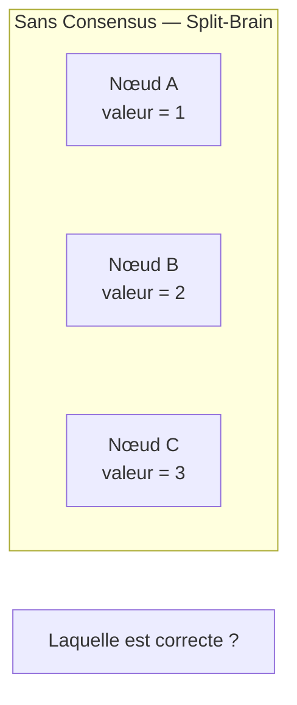
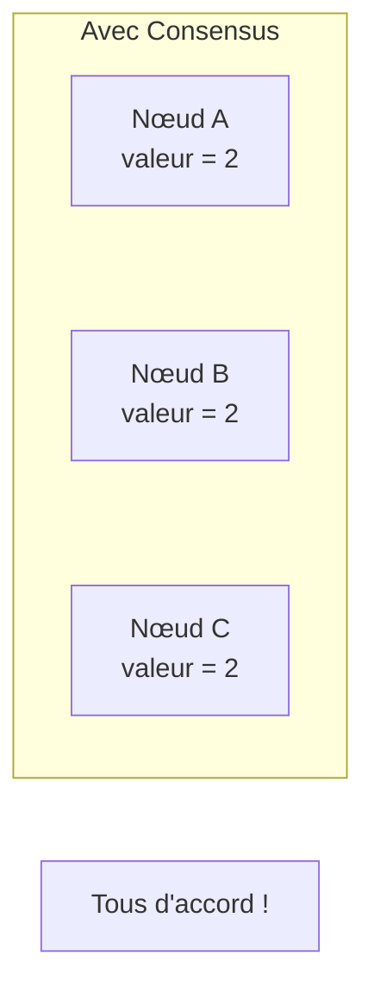
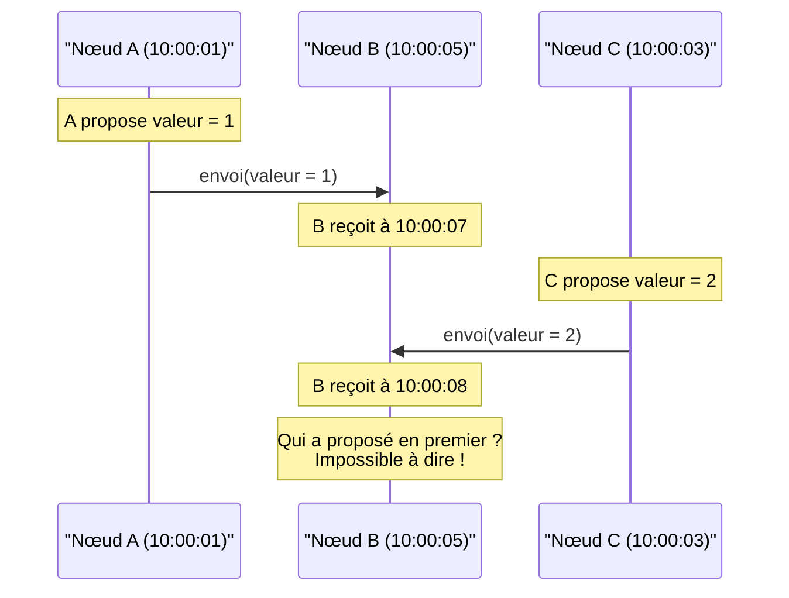
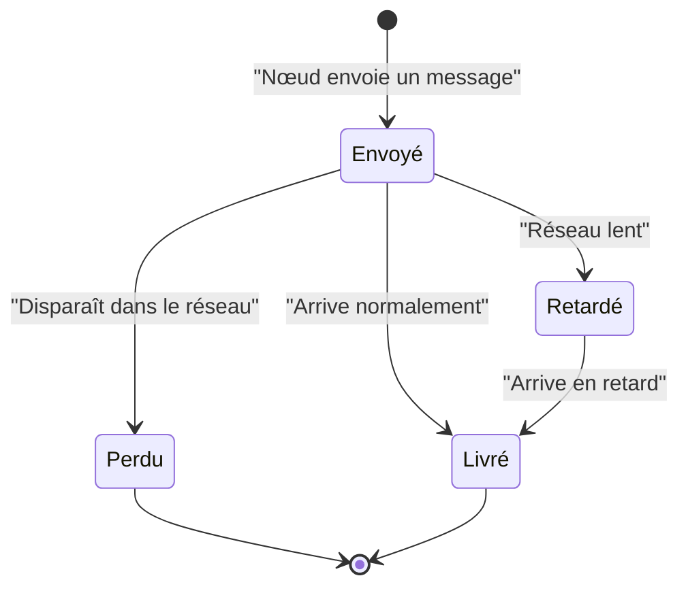
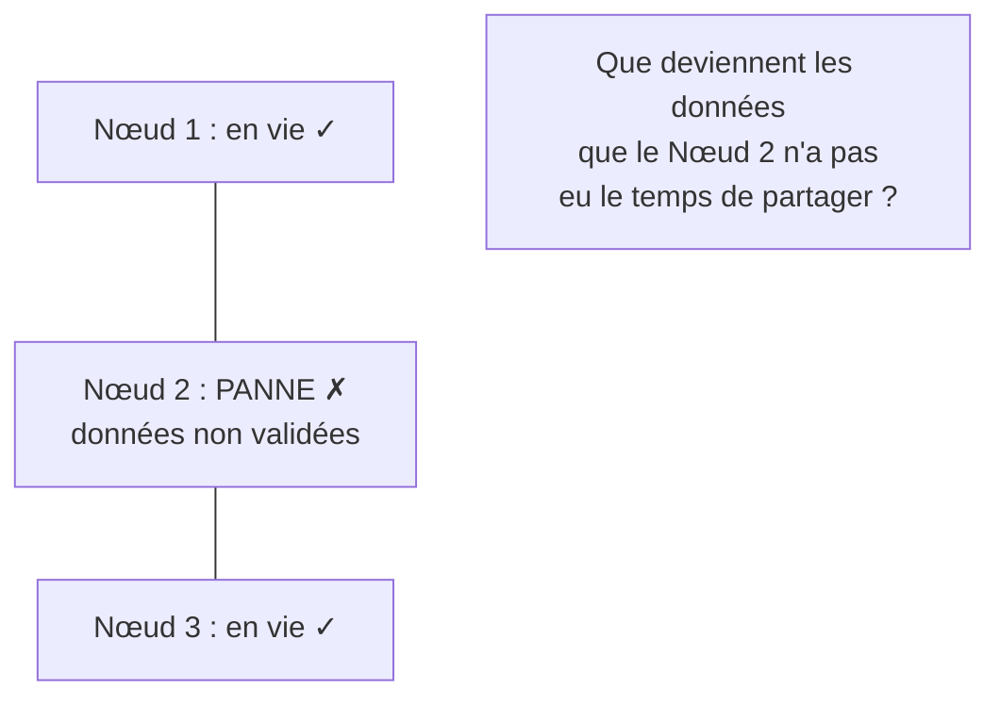
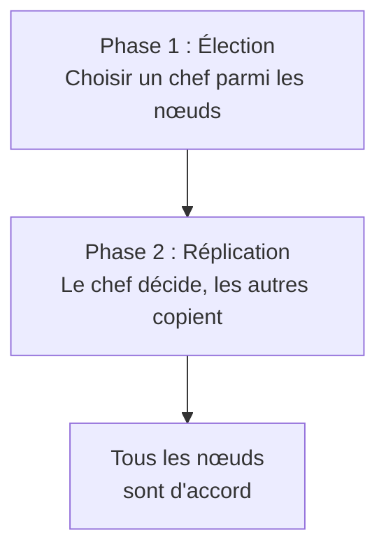

# Le Problème du Consensus

> **Chapitre 11** — Comment faire s'accorder plusieurs machines sur une même décision ?

## Histoire : La Cuisine Chaotique

Imagine une grande cuisine de restaurant. Il y a trois chefs : Alice, Bob et Carole. Chacun reçoit les commandes directement des serveurs, sans se concerter avec les autres.

Un soir de rush, le serveur dit à Alice : « Table 5, une pizza. » Un autre serveur dit à Bob : « Table 5, des pâtes. » Et un troisième dit à Carole : « Table 5, une salade. »

Que se passe-t-il ? Trois plats différents sortent pour la même table. Le client reçoit une pizza, des pâtes ET une salade — il n'en avait commandé qu'un seul. Le cuisinier est confus, le client est mécontent, et tout le monde perd du temps.

La semaine suivante, le restaurant change d'organisation. Maintenant, il y a un **chef principal**. Tous les serveurs transmettent les commandes au chef principal, qui décide de l'ordre et distribue les tâches : « Alice, tu fais la pizza. Bob, les pâtes. Carole, la salade. » Tout le monde est d'accord. Le service se déroule sans accroc.

Mieux encore : si le chef principal doit s'absenter, les autres chefs se mettent d'accord pour en choisir un nouveau. La cuisine continue de fonctionner. C'est ça, la robustesse d'un bon système de consensus.

> C'est exactement le problème du **consensus** : comment un groupe peut-il se mettre d'accord sur une décision unique, même quand chacun reçoit des informations différentes au départ ?

## Le Même Problème, en Informatique

Remplaçons nos chefs par des ordinateurs — des **nœuds** dans un système distribué. Trois machines reçoivent des requêtes en même temps. Si elles ne se coordonnent pas, chaque machine peut avoir une vision différente de ce qui s'est passé.

Imagine une base de données où le nœud A croit que le solde d'un compte est 100€, le nœud B croit qu'il est 200€, et le nœud C croit qu'il est 50€. Lequel a raison ? Si un client retire de l'argent, quelle valeur utiliser ? C'est le chaos — exactement comme notre cuisine sans chef principal.

Voici ce qui arrive quand les nœuds ne s'accordent pas. On appelle ça un **split-brain** (cerveau divisé) :

```mermaid
graph LR
    subgraph "Sans Consensus — Split-Brain"
        N1["Nœud A<br/>valeur = 1"]
        N2["Nœud B<br/>valeur = 2"]
        N3["Nœud C<br/>valeur = 3"]
    end
    N1 ~~~ N2 ~~~ N3
    Problem["Laquelle est correcte ?"]
```

Et voici ce qui se passe quand les nœuds parviennent à un consensus :

```mermaid
graph LR
    subgraph "Avec Consensus"
        A1["Nœud A<br/>valeur = 2"]
        A2["Nœud B<br/>valeur = 2"]
        A3["Nœud C<br/>valeur = 2"]
    end
    A1 ~~~ A2 ~~~ A3
    Solved["Tous d'accord !"]
```

La différence est simple : sans consensus, chaque nœud décide tout seul. Avec consensus, tous les nœuds choisissent la **même valeur**.

> Ce problème apparaît partout dans les systèmes distribués : élection d'un leader, réplication de données, verrous distribués, configuration partagée... Dès que plusieurs machines doivent se coordonner, on a besoin de consensus.

## Ce Dont Nous Avons Besoin

Pour qu'un consensus fonctionne correctement, il doit respecter quatre propriétés. Pas besoin de formules mathématiques — c'est du bon sens. Tu peux les retenir comme les règles d'un bon vote démocratique :

**« Tous les nœuds sont d'accord »** (Accord)
Si le nœud A décide « valeur = 5 », alors le nœud B doit aussi décider « valeur = 5 ». Personne ne peut décider quelque chose de différent. Sinon, à quoi bon ?

**« La valeur choisie a vraiment été proposée »** (Validité)
Le groupe ne peut pas inventer une valeur qui n'a jamais été proposée par personne. Si personne n'a suggéré « 7 », on ne peut pas décider « 7 ». C'est comme un vote : on ne peut élire que quelqu'un qui s'est présenté.

**« On finit par décider, on ne tourne pas en boucle »** (Terminaison)
L'algorithme doit s'arrêter un jour. On ne peut pas voter éternellement sans jamais aboutir. Le consensus doit être atteint en un temps fini — pas dans un million d'années.

**« Personne ne change d'avis »** (Intégrité)
Une fois qu'un nœud a pris sa décision, elle est définitive. Pas de retour en arrière. C'est comme signer un contrat : une fois signé, on ne peut pas annuler sa signature.

> Les trois premières (accord, validité, intégrité) sont des garanties de **sécurité** — rien de mauvais ne se produit. La terminaison est une garantie de **vitalité** — le système finit par avancer.

> Ces quatre propriétés forment un tout. Si une seule manque, le consensus ne fonctionne pas. Imagine un vote sans garantie de fin : les électeurs attendraient indéfiniment.

## Pourquoi C'est Si Difficile

Tu pourrais te dire : « C'est simple, on vote et c'est tout ! Trois nœuds, majorité de deux, fini. » Oui, dans un monde parfait. Mais dans un vrai réseau, trois problèmes rendent tout beaucoup plus compliqué qu'un simple vote.

### Pas d'horloge globale

Chaque ordinateur a sa propre horloge interne, et elles ne sont **jamais** parfaitement synchronisées. Même une différence de quelques millisecondes pose problème, car dans un système distribué, l'ordre des événements est crucial. On ne peut pas dire avec certitude « l'événement X s'est produit avant l'événement Y » :

```mermaid
sequenceDiagram
    participant A as "Nœud A (10:00:01)"
    participant B as "Nœud B (10:00:05)"
    participant C as "Nœud C (10:00:03)"
    Note over A: A propose valeur = 1
    A->>B: envoi(valeur = 1)
    Note over B: B reçoit à 10:00:07
    Note over C: C propose valeur = 2
    C->>B: envoi(valeur = 2)
    Note over B: B reçoit à 10:00:08
    Note over B: Qui a proposé en premier ?<br/>Impossible à dire !
```

Sans horloge commune, deux nœuds peuvent ordonner les mêmes événements différemment. C'est comme si deux personnes regardaient la même course mais chacune avec sa propre montre, légèrement décalée.

Pour résoudre ce problème, les systèmes distribués utilisent des **horloges logiques** (comme les horodatages de Lamport) au lieu d'horloges réelles. Mais ça, c'est une autre histoire.

### Messages perdus ou retardés

Sur internet, un message peut disparaître, arriver en retard, ou même arriver dans le désordre. Ce n'est pas de la mauvaise volonté — c'est la nature des réseaux informatiques. Un câble coupé, un routeur surchargé, une interférence wifi... et pouf, ton message disparaît :

```mermaid
stateDiagram-v2
    [*] --> Envoyé: "Nœud envoie un message"
    Envoyé --> Livré: "Arrive normalement"
    Envoyé --> Perdu: "Disparaît dans le réseau"
    Envoyé --> Retardé: "Réseau lent"
    Retardé --> Livré: "Arrive en retard"
    Perdu --> [*]
    Livré --> [*]
```

Pire encore : si un message n'arrive pas, on ne peut pas savoir s'il a été perdu ou s'il est simplement en retard. Peut-être qu'il arrivera dans 5 secondes, peut-être jamais. On ne peut pas attendre éternellement.

Ce problème est fondamental : impossible de distinguer un nœud lent d'un nœud en panne. C'est d'ailleurs la base du résultat FLP que nous allons voir juste après.

### Les nœuds peuvent tomber en panne

Un ordinateur peut planter à **n'importe quel moment** — y compris juste après avoir reçu une information critique mais avant de l'avoir partagée avec les autres :

```mermaid
graph TB
    N1["Nœud 1 : en vie ✓"]
    N2["Nœud 2 : PANNE ✗<br/>données non validées"]
    N3["Nœud 3 : en vie ✓"]
    N1 --- N2 --- N3
    Q["Que deviennent les données<br/>que le Nœud 2 n'a pas<br/>eu le temps de partager ?"]
```

C'est comme si un membre d'un jury s'évanouissait juste après avoir entendu un témoignage crucial, avant d'avoir pu le raconter aux autres jurés. L'information est perdue.

Et ce n'est pas tout : un nœud peut aussi redémarrer après une panne, en ayant oublié tout ce qui s'est passé avant. On appelle ça un **crash avec perte de mémoire**. Le système doit être capable de fonctionner même quand certains participants disparaissent temporairement.

> Ces trois problèmes sont **inévitables** dans tout réseau réel. Un bon algorithme de consensus doit fonctionner **malgré** eux.

## FLP (Version Simple)

En 1985, trois chercheurs — Fischer, Lynch et Paterson — ont prouvé quelque chose de déconcertant. Leur résultat, appelé **FLP**, dit ceci :

> Dans un réseau asynchrone (où les messages peuvent prendre un temps arbitraire), même avec un seul nœud qui peut tomber en panne, aucun algorithme déterministe ne peut garantir le consensus à coup sûr.

En d'autres termes : en théorie, le consensus parfait est impossible. Pas « difficile » — **impossible**.

Mais ne t'inquiète pas ! En pratique, ce n'est pas un problème bloquant. Les systèmes réels contournent FLP de deux façons :

- Ils utilisent des **délais d'attente** (timeouts) — si un message n'arrive pas dans un délai raisonnable, on suppose qu'il est perdu et on agit sans lui.
- Ils utilisent de l'**aléatoire** (randomisation) — au lieu de décider de façon déterministe, on introduit du hasard pour éviter les blocages.

Le réseau n'est jamais vraiment asynchrone pour toujours. Tôt ou tard, les messages finissent par arriver.

> En résumé : FLP dit « c'est impossible en théorie », mais la pratique dit « on s'en rapproche très bien avec des astuces simples ». C'est un peu comme voler — théoriquement impossible pour les humains, mais avec les bons outils (des avions), on y arrive très bien.

## La Bonne Nouvelle : Raft

Heureusement, en 2014, Diego Ongaro et John Ousterhout ont créé **Raft** — un algorithme conçu **exprès pour être compréhensible**.

L'ancêtre, **Paxos** (inventé par Leslie Lamport en 1998), fonctionne correctement et offre les mêmes garanties, mais il est notoirement difficile à comprendre. Même les experts s'arrachent les cheveux avec Paxos. Son créateur lui-même a écrit un papier intitulé « Paxos Made Simple »... que personne n'a trouvé simple.

Raft décompose le consensus en deux phases claires :

```mermaid
graph TB
    Election["Phase 1 : Élection<br/>Choisir un chef parmi les nœuds"]
    Replication["Phase 2 : Réplication<br/>Le chef décide, les autres copient"]
    Election --> Replication
    Replication --> Result["Tous les nœuds<br/>sont d'accord"]
```

C'est exactement comme notre cuisine : d'abord on choisit un chef principal (élection), puis le chef principal distribue les tâches (réplication). Simple, non ?

> Raft ne sacrifie aucune des quatre propriétés du consensus (accord, validité, terminaison, intégrité). Il offre les mêmes garanties que Paxos, mais avec une conception que l'on peut expliquer sur un tableau blanc en 10 minutes.

Dans les prochains chapitres, nous verrons en détail comment Raft gère l'élection du chef, puis comment il réplique les décisions pour que tous les nœuds restent synchronisés. Prépare-toi — on entre dans le cœur du moteur !

## Résumé

- Le **consensus** est le problème consistant à faire s'accorder plusieurs machines sur une même décision
- Il faut quatre propriétés : **accord** (tous d'accord), **validité** (la valeur a été proposée), **terminaison** (on finit par décider) et **intégrité** (pas de changement d'avis)
- C'est difficile car il n'y a **pas d'horloge globale**, les **messages se perdent** et les **nœuds tombent en panne**
- Le résultat **FLP** dit que le consensus parfait est théoriquement impossible en réseau asynchrone
- En pratique, on utilise des **délais d'attente** et de l'**aléatoire** pour contourner cette impossibilité
- **Raft** (2014) est un algorithme de consensus conçu pour être compréhensible, en deux phases : élection puis réplication

## Exercices

1. **Où est le consensus ?** Donne un exemple d'un système qui a besoin de consensus (par exemple, une base de données distribuée) et un qui n'en a pas besoin (par exemple, un cache CDN). Explique pourquoi dans chaque cas.

2. **Panne en cours de route** Imagine trois nœuds qui essaient de se mettre d'accord sur une valeur. Le nœud 3 tombe en panne au milieu du vote. Les deux autres peuvent-ils quand même prendre une décision ? Que se passe-t-il quand le nœud 3 revient ?

3. **Accord vs Terminaison** Si un système garantit l'accord (tous les nœuds décident la même chose) mais pas la terminaison, que peut-il se passer de pire ? Et si c'est l'inverse — terminaison garantie mais pas l'accord ?

## Quiz

{{#quiz ../../quizzes/consensus-what-is-consensus.toml}}
