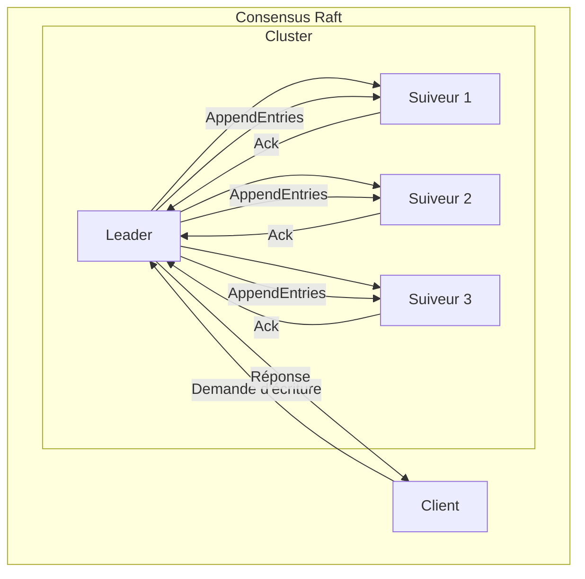
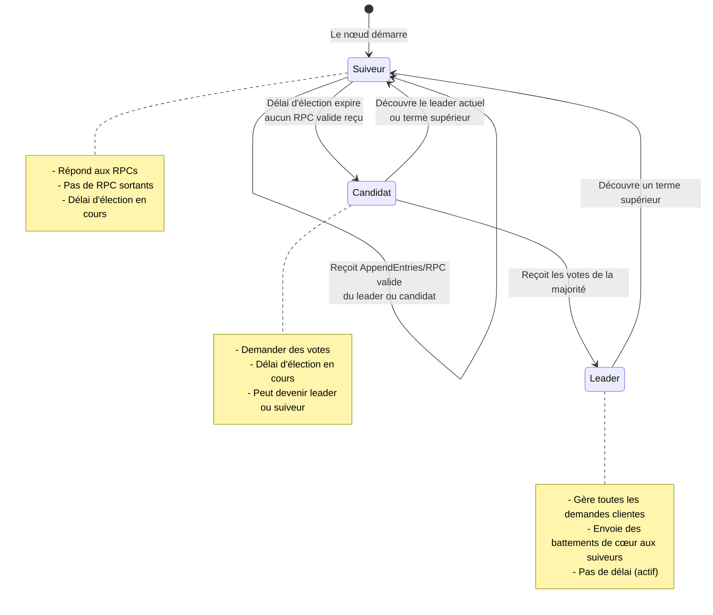
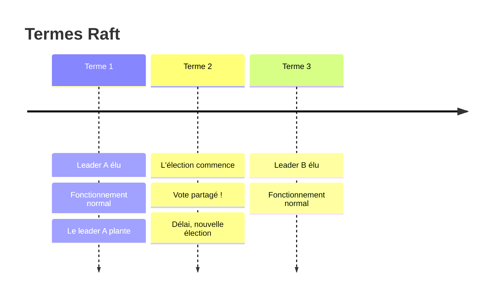
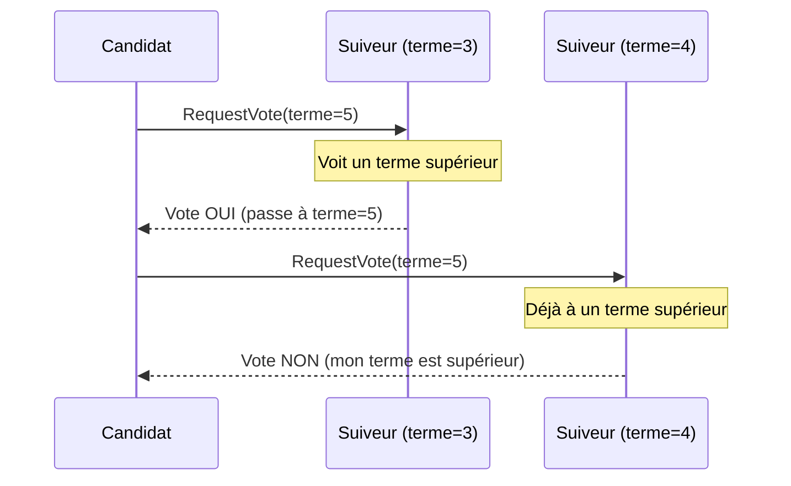
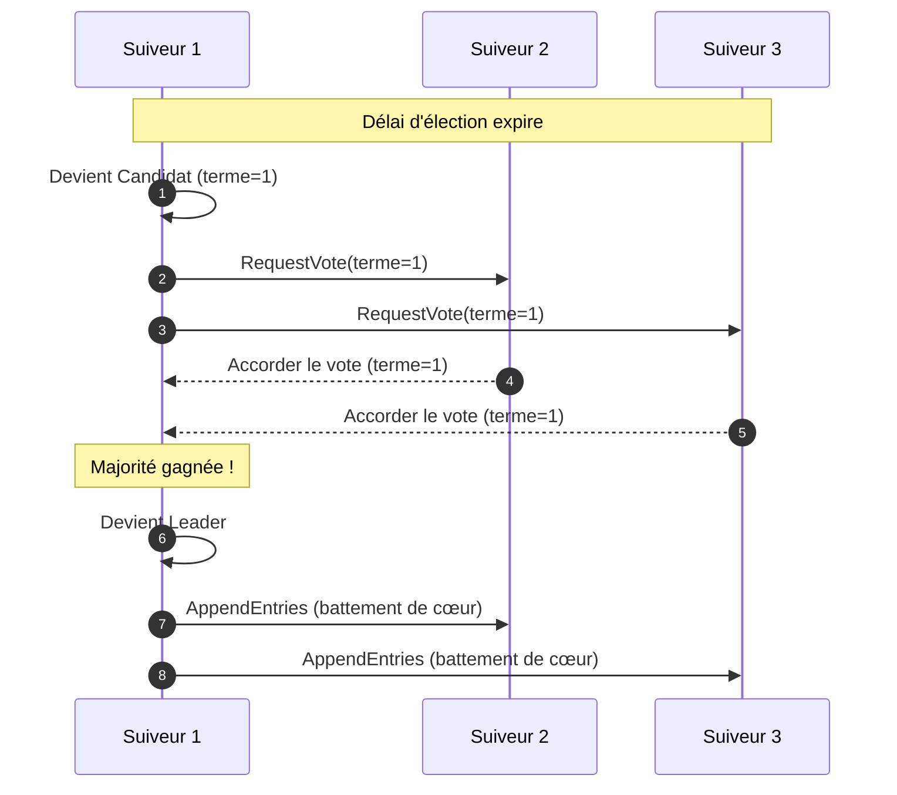
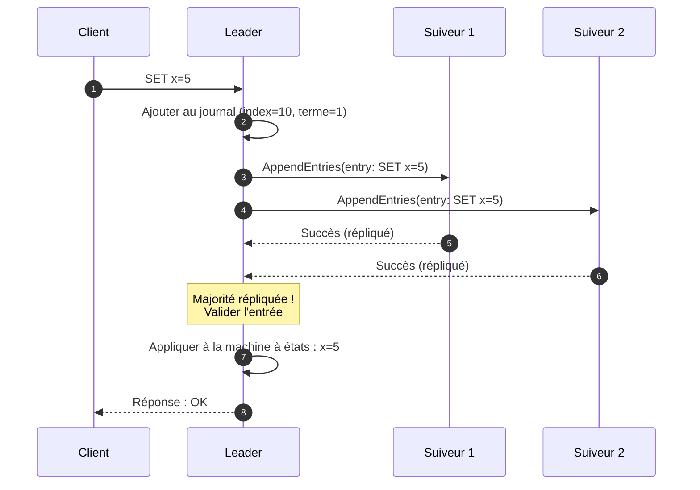
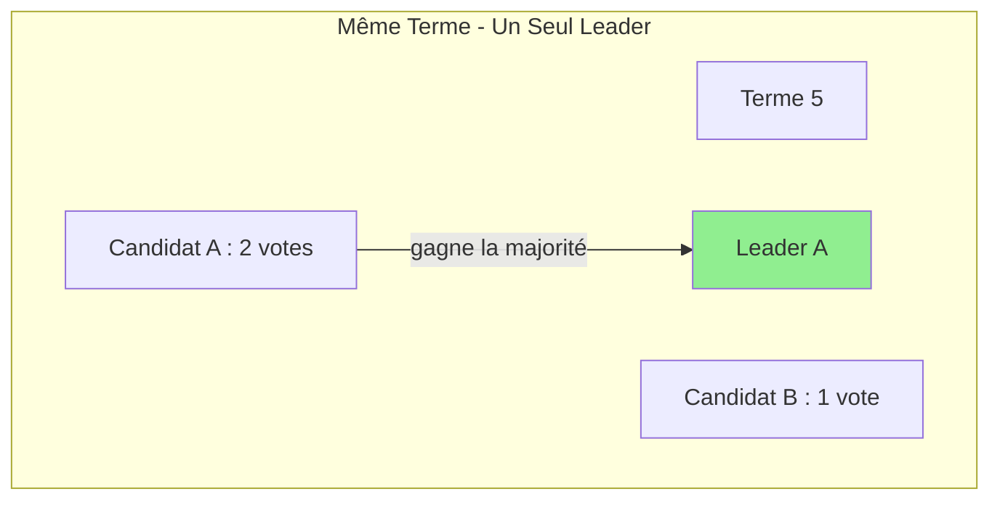
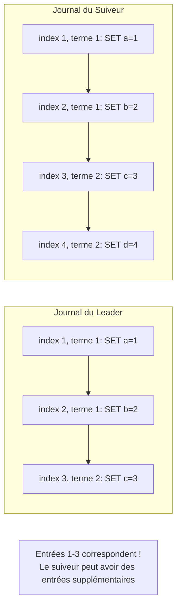
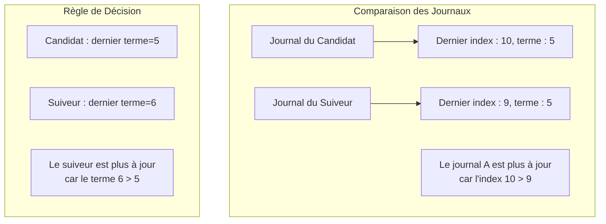
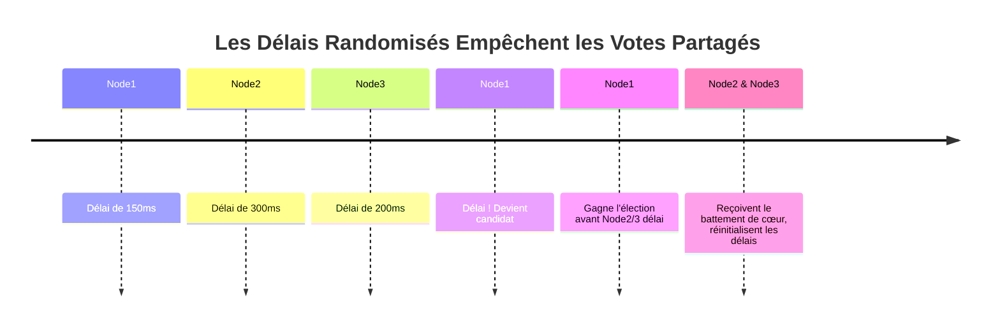

# L'Algorithme Raft

> **Session 9, Partie 1** - 25 minutes

## Objectifs d'Apprentissage

- [ ] Comprendre la philosophie de conception de Raft
- [ ] Apprendre les trois états d'un nœud Raft
- [ ] Explorer comment Raft gère le consensus à travers l'élection de leader et la réplication de journal
- [ ] Comprendre le concept des termes dans Raft
- [ ] Apprendre les propriétés de sécurité de Raft

---

## Philosophie de Conception de Raft

Raft a été conçu par Diego Ongaro et John Ousterhout en 2014 avec un objectif spécifique : **la compréhension**. Contrairement à Paxos, qui était notoirement difficile à comprendre et à implémenter correctement, Raft sépare le problème du consensus en sous-problèmes clairs et gérables.

### Principes de Conception Fondamentaux

1. **Leader Fort** : Raft utilise une approche de leader fort — toutes les entrées de journal passent par le leader
2. **Complétude du Leader** : Une fois qu'une entrée de journal est validée, elle reste dans le journal de tous les futurs leaders
3. **Décomposition** : Diviser le consensus en trois sous-problèmes :
   - Élection de leader
   - Réplication de journal
   - Sécurité

### Pourquoi "Raft" ?

Le nom est une analogie : un radeau (l'algorithme) garde tous les nœuds (journaux) ensemble et se déplaçant dans la même direction, tout comme un radeau garde les gens ensemble sur l'eau.

---

## Aperçu de Raft



### Concepts Clés

| Concept | Description |
|---------|-------------|
| **Leader** | Le seul nœud qui gère les demandes clientes et ajoute des entrées au journal |
| **Suiveur (Follower)** | Nœuds passifs qui répliquent le journal du leader |
| **Candidat** | Un nœud qui fait campagne pour devenir leader lors d'une élection |
| **Terme** | Une horloge logique divisée en termes de longueur arbitraire |
| **Journal (Log)** | Une séquence d'entrées contenant des commandes à appliquer à la machine à états |

---

## États des Nœuds

Chaque nœud Raft peut être dans l'un des trois états :



### Descriptions d'États

#### Suiveur (Follower)

- **État par défaut** pour tous les nœuds
- Reçoit passivement les entrées du leader
- Répond aux RPCs (RequestVote, AppendEntries)
- Si aucune communication pendant le **délai d'élection**, devient candidat

#### Candidat

- **Fait campagne** pour devenir leader
- Incrémente le terme actuel
- Vote pour lui-même
- Envoie des RPCs RequestVote à tous les autres nœuds
- Devient leader s'il reçoit les votes de la majorité
- Retourne à l'état de suiveur s'il découvre le leader actuel ou un terme supérieur

#### Leader

- **Gère toutes les demandes clientes**
- Envoie des **RPCs AppendEntries** à tous les suiveurs (battements de cœur)
- Valide les entrées une fois répliquées sur la majorité
- Descend s'il découvre un terme supérieur

---

## Termes

Un **terme** est le mécanisme de temps logique de Raft :



### Propriétés des Termes

1. **Croissance Monotone** : Les termes augmentent toujours, ne diminuent jamais
2. **Terme Actuel** : Chaque nœud stocke le numéro de terme actuel
3. **Transitions de Terme** :
   - Les nœuds incrémentent le terme lorsqu'ils deviennent candidats
   - Les nœuds mettent à jour le terme lorsqu'ils reçoivent un message de terme supérieur
   - Lorsque le terme change, le nœud devient suiveur

### Terme dans les Messages



---

## Approche en Deux Phases de Raft

Raft atteint le consensus à travers deux phases principales :

### Phase 1 : Élection de Leader



### Phase 2 : Réplication de Journal



---

## Propriétés de Sécurité

Raft garantit plusieurs propriétés de sécurité importantes :

### 1. Sécurité d'Élection

> Au plus un leader peut être élu par terme.

**Comment** : Chaque nœud vote au plus une fois par terme, et un candidat a besoin de la majorité des votes.



### 2. Ajout-Seulement du Leader

> Un leader ne jamais écrase ou supprime les entrées de son journal ; il ajoute seulement.

**Comment** : Les leaders ajoutent toujours de nouvelles entrées à la fin de leur journal.

### 3. Correspondance de Journal

> Si deux journaux contiennent une entrée avec le même index et terme, alors toutes les entrées précédentes sont identiques.



### 4. Complétude du Leader

> Si une entrée de journal est validée dans un terme donné, elle sera présente dans les journaux de tous les leaders pour les termes supérieurs.

**Comment** : Un candidat doit avoir toutes les entrées validées avant de pouvoir gagner une élection.

### 5. Sécurité de la Machine à États

> Si un serveur a appliqué une entrée de journal à un index donné à sa machine à états, aucun autre serveur n'appliquera jamais une entrée de journal différente pour le même index.

---

## RPCs Raft

Raft utilise deux types principaux de RPC :

### RPC RequestVote

```typescript
interface RequestVoteArgs {
  term: number;           // Terme du candidat
  candidateId: string;    // Candidat demandant le vote
  lastLogIndex: number;   // Index de la dernière entrée de journal du candidat
  lastLogTerm: number;    // Terme de la dernière entrée de journal du candidat
}

interface RequestVoteReply {
  term: number;           // Terme actuel (pour que le candidat mette à jour)
  voteGranted: boolean;   // Vrai si le candidat a reçu le vote
}
```

**Règles de Vote** :
1. Si `term < currentTerm` : refuser le vote
2. Si `votedFor` est null ou `candidateId` : accorder le vote
3. Si le journal du candidat est au moins à jour : accorder le vote

### RPC AppendEntries

```typescript
interface AppendEntriesArgs {
  term: number;           // Terme du leader
  leaderId: string;       // Pour que le suiveur puisse rediriger les clients
  prevLogIndex: number;   // Index de l'entrée de journal précédant les nouvelles
  prevLogTerm: number;    // Terme de l'entrée prevLogIndex
  entries: LogEntry[];    // Entrées de journal à stocker (vide pour battement de cœur)
  leaderCommit: number;   // Index de validation du leader
}

interface AppendEntriesReply {
  term: number;           // Terme actuel (pour que le leader mette à jour)
  success: boolean;       // Vrai si le suiveur avait l'entrée correspondant à prevLogIndex
}
```

**Utilisé pour les deux** :
- **Réplication de journal** : Envoyer de nouvelles entrées
- **Battements de cœur** : Entrées vides pour maintenir l'autorité

---

## Propriété de Complétude de Journal

Lors du vote, les nœuds comparent la complétude du journal :



**Comparaison de mise à jour** :
1. Comparer le **terme** des dernières entrées
2. Si les termes diffèrent, le journal avec le terme le plus élevé est plus à jour
3. Si les termes sont identiques, le journal avec la longueur la plus longue est plus à jour

---

## Délais d'Élection Randomisés

Raft utilise des **délais d'élection randomisés** pour empêcher les votes partagés :



**Sans randomisation** : Tous les suiveurs atteignent le délai simultanément → tous deviennent candidats → vote partagé → aucun leader élu.

**Avec randomisation** : Un seul suiveur atteint le délai en premier → devient candidat → susceptible de gagner l'élection.

---

## Structure d'Implémentation TypeScript

```typescript
// Définitions de types pour Raft
type NodeState = 'follower' | 'candidate' | 'leader';

interface LogEntry {
  index: number;
  term: number;
  command: { key: string; value: any };
}

interface RaftNode {
  // État persistant
  currentTerm: number;
  votedFor: string | null;
  log: LogEntry[];

  // État volatil
  commitIndex: number;
  lastApplied: number;
  state: NodeState;

  // État volatil uniquement pour le leader
  nextIndex: number[];
  matchIndex: number[];
}

class RaftNodeImpl implements RaftNode {
  currentTerm: number = 0;
  votedFor: string | null = null;
  log: LogEntry[] = [];
  commitIndex: number = 0;
  lastApplied: number = 0;
  state: NodeState = 'follower';
  nextIndex: number[] = [];
  matchIndex: number[] = [];

  // Gérer le RPC RequestVote
  requestVote(args: RequestVoteArgs): RequestVoteReply {
    if (args.term > this.currentTerm) {
      this.currentTerm = args.term;
      this.state = 'follower';
      this.votedFor = null;
    }

    const logOk = this.isLogAtLeastAsUpToDate(args.lastLogIndex, args.lastLogTerm);
    const voteOk = (this.votedFor === null || this.votedFor === args.candidateId);

    if (args.term === this.currentTerm && voteOk && logOk) {
      this.votedFor = args.candidateId;
      return { term: this.currentTerm, voteGranted: true };
    }

    return { term: this.currentTerm, voteGranted: false };
  }

  // Gérer le RPC AppendEntries
  appendEntries(args: AppendEntriesArgs): AppendEntriesReply {
    if (args.term > this.currentTerm) {
      this.currentTerm = args.term;
      this.state = 'follower';
    }

    if (args.term !== this.currentTerm) {
      return { term: this.currentTerm, success: false };
    }

    // Vérifier si le journal a une entrée à prevLogIndex avec prevLogTerm
    if (this.log[args.prevLogIndex]?.term !== args.prevLogTerm) {
      return { term: this.currentTerm, success: false };
    }

    // Ajouter de nouvelles entrées
    for (const entry of args.entries) {
      this.log[entry.index] = entry;
    }

    // Mettre à jour l'index de validation
    if (args.leaderCommit > this.commitIndex) {
      this.commitIndex = Math.min(args.leaderCommit, this.log.length - 1);
    }

    return { term: this.currentTerm, success: true };
  }

  private isLogAtLeastAsUpToDate(lastLogIndex: number, lastLogTerm: number): boolean {
    const myLastEntry = this.log[this.log.length - 1];
    const myLastTerm = myLastEntry?.term ?? 0;
    const myLastIndex = this.log.length - 1;

    if (lastLogTerm !== myLastTerm) {
      return lastLogTerm > myLastTerm;
    }
    return lastLogIndex >= myLastIndex;
  }
}
```

---

## Structure d'Implémentation Python

```python
from dataclasses import dataclass, field
from typing import Optional, List
from enum import Enum

class NodeState(Enum):
    FOLLOWER = "follower"
    CANDIDATE = "candidate"
    LEADER = "leader"

@dataclass
class LogEntry:
    index: int
    term: int
    command: dict

@dataclass
class RequestVoteArgs:
    term: int
    candidate_id: str
    last_log_index: int
    last_log_term: int

@dataclass
class RequestVoteReply:
    term: int
    vote_granted: bool

@dataclass
class AppendEntriesArgs:
    term: int
    leader_id: str
    prev_log_index: int
    prev_log_term: int
    entries: List[LogEntry]
    leader_commit: int

@dataclass
class AppendEntriesReply:
    term: int
    success: bool

class RaftNode:
    def __init__(self, node_id: str, peers: List[str]):
        # État persistant
        self.current_term: int = 0
        self.voted_for: Optional[str] = None
        self.log: List[LogEntry] = []

        # État volatil
        self.commit_index: int = 0
        self.last_applied: int = 0
        self.state: NodeState = NodeState.FOLLOWER

        # État uniquement pour le leader
        self.next_index: dict[str, int] = {}
        self.match_index: dict[str, int] = {}

        self.node_id = node_id
        self.peers = peers

    def request_vote(self, args: RequestVoteArgs) -> RequestVoteReply:
        """Gérer le RPC RequestVote."""
        if args.term > self.current_term:
            self.current_term = args.term
            self.state = NodeState.FOLLOWER
            self.voted_for = None

        log_ok = self._is_log_at_least_as_up_to_date(
            args.last_log_index, args.last_log_term
        )
        vote_ok = (self.voted_for is None or self.voted_for == args.candidate_id)

        if args.term == self.current_term and vote_ok and log_ok:
            self.voted_for = args.candidate_id
            return RequestVoteReply(self.current_term, True)

        return RequestVoteReply(self.current_term, False)

    def append_entries(self, args: AppendEntriesArgs) -> AppendEntriesReply:
        """Gérer le RPC AppendEntries."""
        if args.term > self.current_term:
            self.current_term = args.term
            self.state = NodeState.FOLLOWER

        if args.term != self.current_term:
            return AppendEntriesReply(self.current_term, False)

        # Vérifier si le journal a une entrée à prev_log_index avec prev_log_term
        if len(self.log) <= args.prev_log_index:
            return AppendEntriesReply(self.current_term, False)

        if self.log[args.prev_log_index].term != args.prev_log_term:
            return AppendEntriesReply(self.current_term, False)

        # Ajouter de nouvelles entrées
        for entry in args.entries:
            if len(self.log) > entry.index:
                if self.log[entry.index].term != entry.term:
                    # Conflit : supprimer à partir de ce point
                    self.log = self.log[:entry.index]
            if len(self.log) <= entry.index:
                self.log.append(entry)

        # Mettre à jour l'index de validation
        if args.leader_commit > self.commit_index:
            self.commit_index = min(args.leader_commit, len(self.log) - 1)

        return AppendEntriesReply(self.current_term, True)

    def _is_log_at_least_as_up_to_date(self, last_index: int, last_term: int) -> bool:
        """Vérifier si le journal du candidat est au moins aussi à jour que le nôtre."""
        if not self.log:
            return True

        my_last_entry = self.log[-1]
        my_last_term = my_last_entry.term
        my_last_index = len(self.log) - 1

        if last_term != my_last_term:
            return last_term > my_last_term
        return last_index >= my_last_index
```

---

## Résumé

### Points Clés à Retenir

1. **Raft** a été conçu pour la compréhension, séparant le consensus en sous-problèmes clairs
2. **Trois états de nœuds** : Suiveur → Candidat → Leader
3. **Termes** fournissent une horloge logique et empêchent les leaders obsolètes
4. **Deux RPCs principaux** : RequestVote (élection) et AppendEntries (réplication + battement de cœur)
5. **Délais randomisés** empêchent les votes partagés lors des élections
6. **Cinq propriétés de sécurité** garantissent la correction : sécurité d'élection, ajout-seulement, correspondance de journal, complétude du leader et sécurité de la machine à états

### Prochaine Session

Dans la prochaine session, nous plongerons dans **l'Élection de Leader** :
- Comment les élections sont déclenchées
- L'algorithme d'élection en détail
- Gérer les votes partagés
- Exemples d'élection de leader

### Exercices

1. **Transitions d'États** : Dessinez le diagramme de transition d'états pour un nœud qui commence comme suiveur, devient candidat, gagne l'élection comme leader, puis découvre un terme supérieur.

2. **Logique de Terme** : Si un nœud reçoit un AppendEntries avec terme=7 mais son terme actuel est 9, que doit-il faire ?

3. **Comparaison de Journal** : Comparez ces deux journaux et déterminez lequel est le plus à jour :
   - Journal A : dernier index=15, dernier terme=5
   - Journal B : dernier index=12, dernier terme=7

4. **Vote Partagé** : Décrivez un scénario où un vote partagé pourrait se produire, et comment Raft empêche qu'il persiste.

## 🧠 Quiz du Chapitre

Testez votre maîtrise de ces concepts ! Ces questions défieront votre compréhension et révéleront les lacunes dans vos connaissances.

{{#quiz ../../quizzes/consensus-raft-algorithm.toml}}
