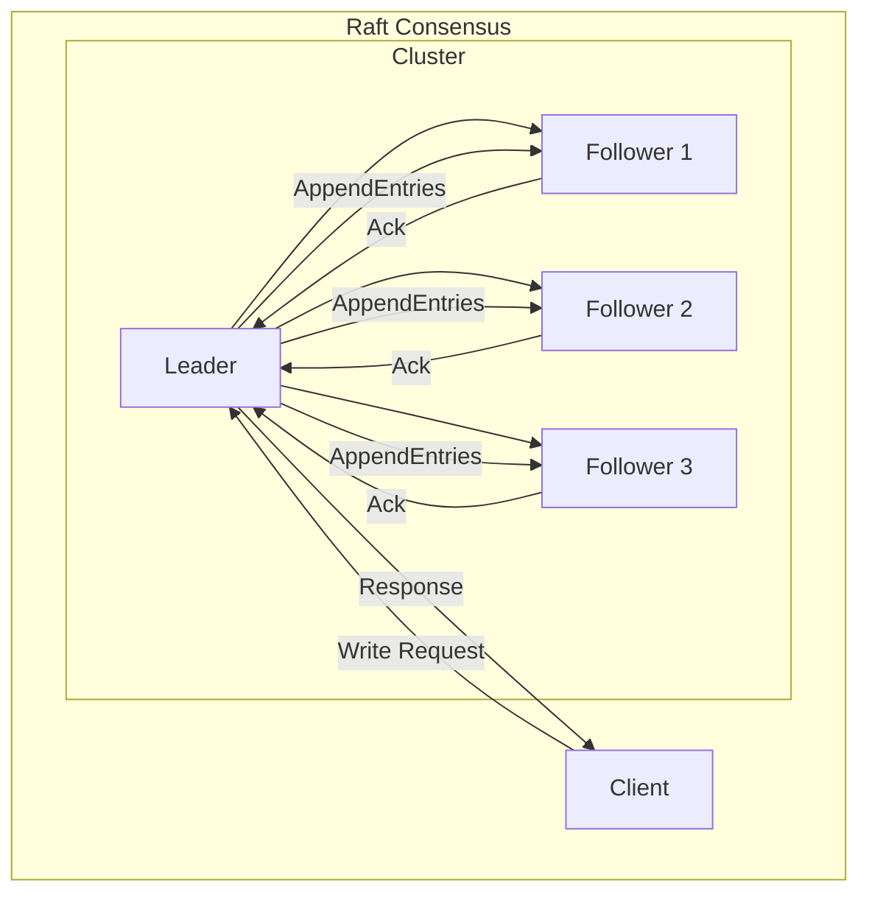
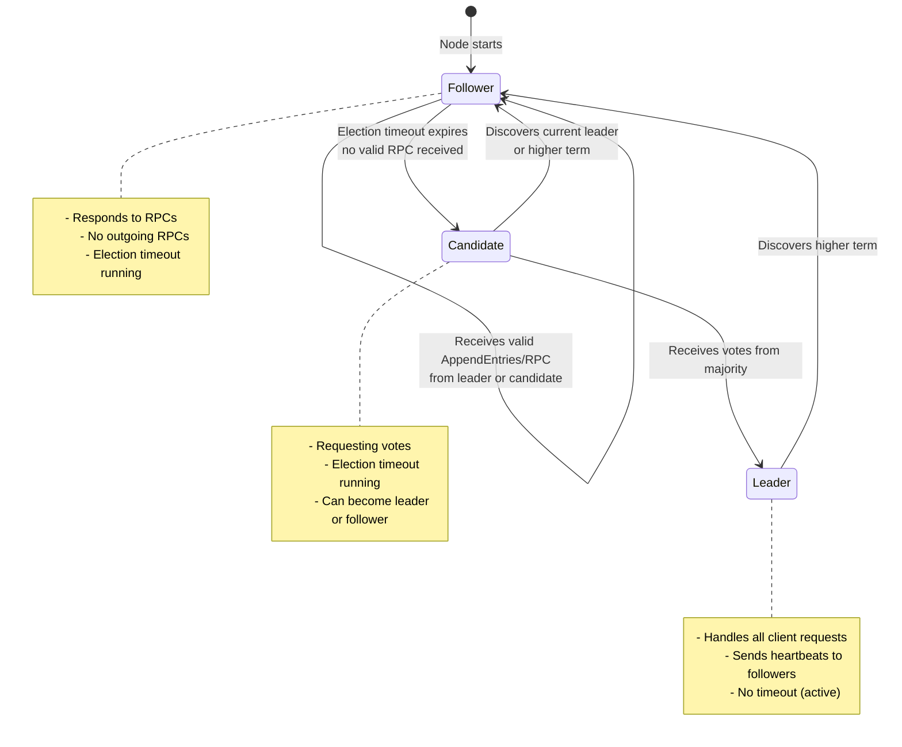
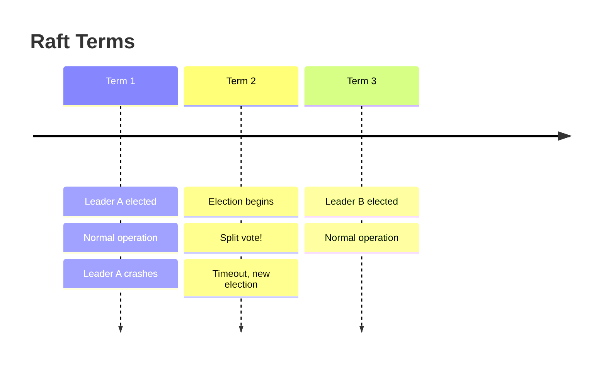
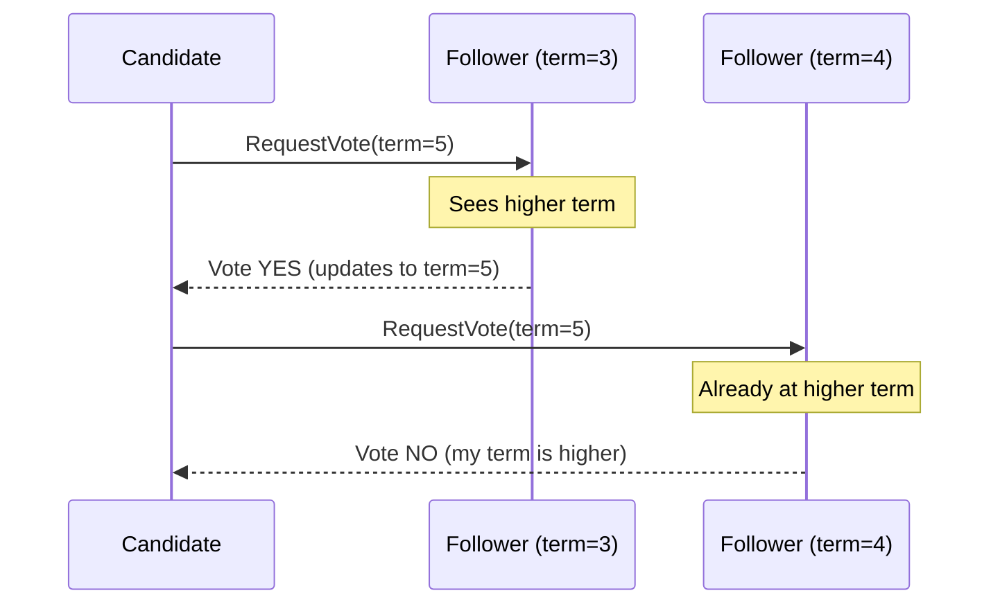
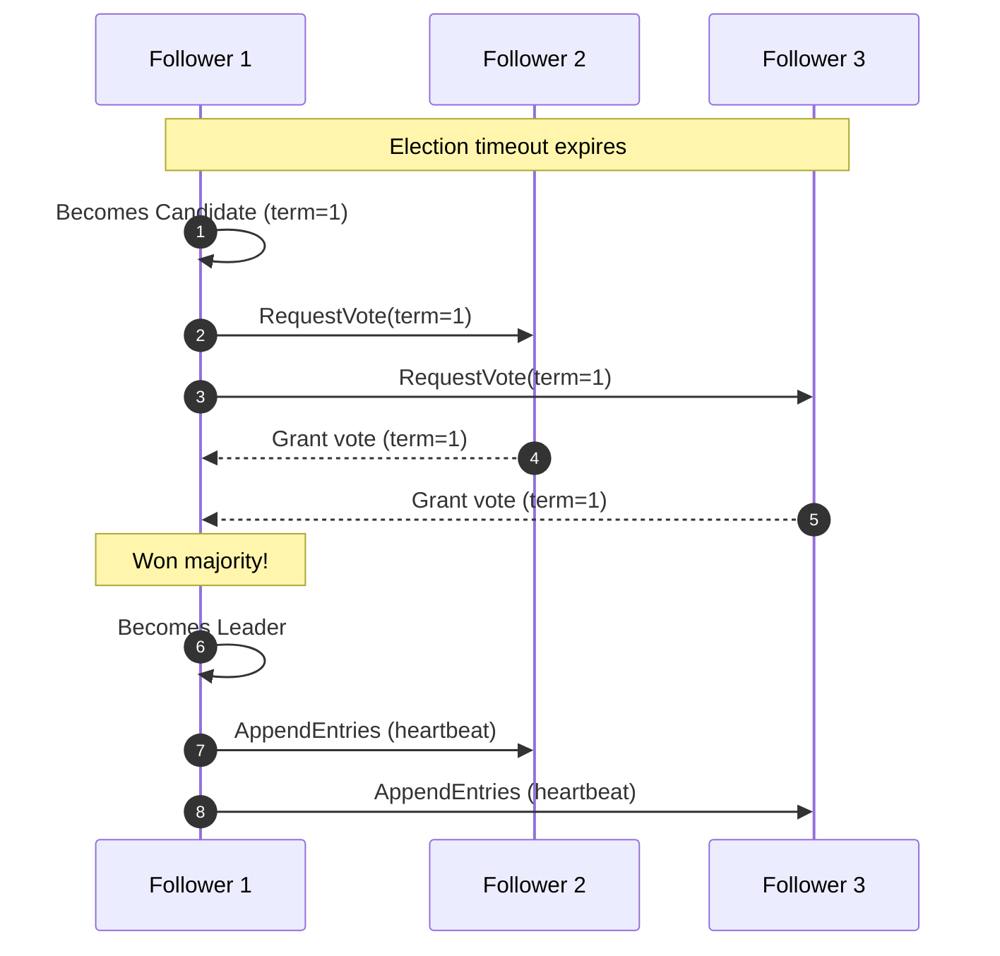
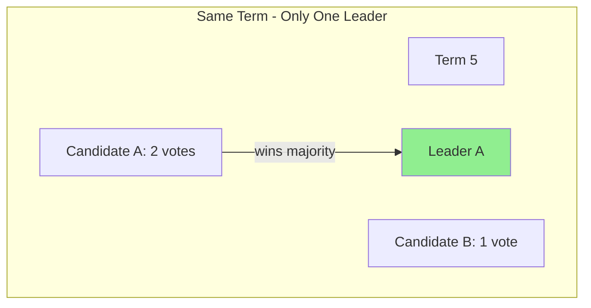
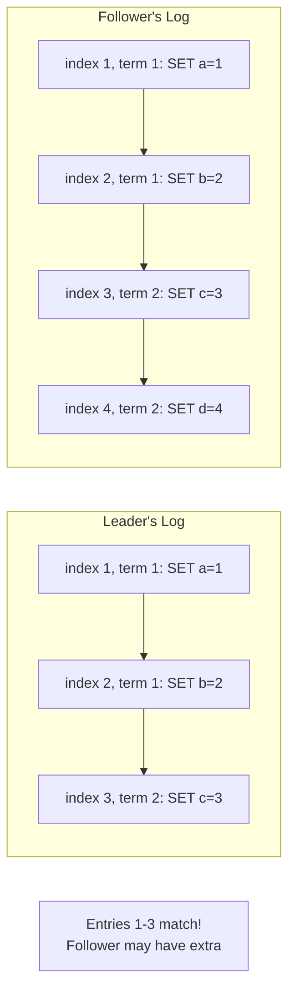
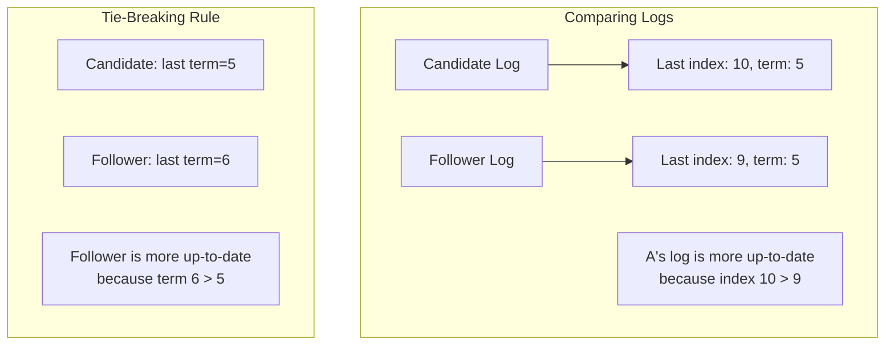
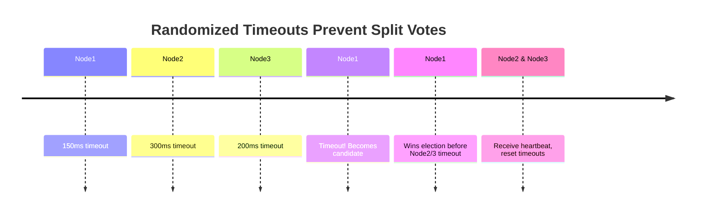

# The Raft Algorithm

> **Session 9, Part 1** - 25 minutes

## Learning Objectives

- [ ] Understand Raft's design philosophy
- [ ] Learn the three states of a Raft node
- [ ] Explore how Raft handles consensus through leader election and log replication
- [ ] Understand the concept of terms in Raft
- [ ] Learn Raft's safety properties

---

## Raft Design Philosophy

Raft was designed by Diego Ongaro and John Ousterhout in 2014 with a specific goal: **understandability**. Unlike Paxos, which was notoriously difficult to understand and implement correctly, Raft separates the consensus problem into clear, manageable subproblems.

### Core Design Principles

1. **Strong Leader**: Raft uses a strong leader approach—all log entries flow through the leader
2. **Leader Completeness**: Once a log entry is committed, it stays in the log of all future leaders
3. **Decomposition**: Break consensus into three subproblems:
   - Leader election
   - Log replication
   - Safety

### Why "Raft"?

The name is an analogy: a raft (the algorithm) keeps all nodes (logs) together and moving in the same direction, just like a raft keeps people together on water.

---

## Raft Overview



### Key Concepts

| Concept | Description |
|---------|-------------|
| **Leader** | The only node that handles client requests and appends entries to the log |
| **Follower** | Passive nodes that replicate the leader's log |
| **Candidate** | A node campaigning to become leader during an election |
| **Term** | A logical clock divided into terms of arbitrary length |
| **Log** | A sequence of entries containing commands to apply to the state machine |

---

## Node States

Each Raft node can be in one of three states:



### State Descriptions

#### Follower
- **Default state** for all nodes
- Passively receives entries from the leader
- Responds to RPCs (RequestVote, AppendEntries)
- If no communication for **election timeout**, becomes candidate

#### Candidate
- **Campaigning** to become leader
- Increments current term
- Votes for itself
- Sends RequestVote RPCs to all other nodes
- Becomes leader if it receives votes from majority
- Returns to follower if it discovers current leader or higher term

#### Leader
- **Handles all client requests**
- Sends **AppendEntries RPCs** to all followers (heartbeats)
- Commits entries once replicated to majority
- Steps down if it discovers a higher term

---

## Terms

A **term** is Raft's logical time mechanism:



### Term Properties

1. **Monotonically Increasing**: Terms always go up, never down
2. **Current Term**: Each node stores the current term number
3. **Term Transitions**:
   - Nodes increment term when becoming candidate
   - Nodes update term when receiving higher-term message
   - When term changes, node becomes follower

### Term in Messages



---

## Raft's Two-Phase Approach

Raft achieves consensus through two main phases:

### Phase 1: Leader Election



### Phase 2: Log Replication


---

## Safety Properties

Raft guarantees several important safety properties:

### 1. Election Safety

> At most one leader can be elected per term.

**How**: Each node votes at most once per term, and a candidate needs majority of votes.



### 2. Leader Append-Only

> A leader never overwrites or deletes entries in its log; it only appends.

**How**: Leaders always append new entries to the end of their log.

### 3. Log Matching

> If two logs contain an entry with the same index and term, then all preceding entries are identical.



### 4. Leader Completeness

> If a log entry is committed in a given term, it will be present in the logs of all leaders for higher terms.

**How**: A candidate must have all committed entries before it can win an election.

### 5. State Machine Safety

> If a server has applied a log entry at a given index to its state machine, no other server will ever apply a different log entry for the same index.

---

## Raft RPCs

Raft uses two main RPC types:

### RequestVote RPC

```typescript
interface RequestVoteArgs {
  term: number;           // Candidate's term
  candidateId: string;    // Candidate requesting vote
  lastLogIndex: number;   // Index of candidate's last log entry
  lastLogTerm: number;    // Term of candidate's last log entry
}

interface RequestVoteReply {
  term: number;           // Current term (for candidate to update)
  voteGranted: boolean;   // True if candidate received vote
}
```

**Voting Rules**:
1. If `term < currentTerm`: deny vote
2. If `votedFor` is null or `candidateId`: grant vote
3. If candidate's log is at least as up-to-date: grant vote

### AppendEntries RPC

```typescript
interface AppendEntriesArgs {
  term: number;           // Leader's term
  leaderId: string;       // So follower can redirect clients
  prevLogIndex: number;   // Index of log entry preceding new ones
  prevLogTerm: number;    // Term of prevLogIndex entry
  entries: LogEntry[];    // Log entries to store (empty for heartbeat)
  leaderCommit: number;   // Leader's commit index
}

interface AppendEntriesReply {
  term: number;           // Current term (for leader to update)
  success: boolean;       // True if follower had entry matching prevLogIndex
}
```

**Used for both**:
- **Log replication**: Sending new entries
- **Heartbeats**: Empty entries to maintain authority

---

## Log Completeness Property

When voting, nodes compare log completeness:



**Up-to-date comparison**:
1. Compare the **term** of the last entries
2. If terms differ, the log with the higher term is more up-to-date
3. If terms are same, the log with the longer length is more up-to-date

---

## Randomized Election Timeouts

Raft uses **randomized election timeouts** to prevent split votes:



**Without randomization**: All followers timeout simultaneously → all become candidates → split vote → no leader elected.

**With randomization**: Only one follower times out first → becomes candidate → likely to win election.

---

## TypeScript Implementation Structure

```typescript
// Type definitions for Raft
type NodeState = 'follower' | 'candidate' | 'leader';

interface LogEntry {
  index: number;
  term: number;
  command: { key: string; value: any };
}

interface RaftNode {
  // Persistent state
  currentTerm: number;
  votedFor: string | null;
  log: LogEntry[];

  // Volatile state
  commitIndex: number;
  lastApplied: number;
  state: NodeState;

  // Leader-only volatile state
  nextIndex: number[];
  matchIndex: number[];
}

class RaftNodeImpl implements RaftNode {
  currentTerm: number = 0;
  votedFor: string | null = null;
  log: LogEntry[] = [];
  commitIndex: number = 0;
  lastApplied: number = 0;
  state: NodeState = 'follower';
  nextIndex: number[] = [];
  matchIndex: number[] = [];

  // Handle RequestVote RPC
  requestVote(args: RequestVoteArgs): RequestVoteReply {
    if (args.term > this.currentTerm) {
      this.currentTerm = args.term;
      this.state = 'follower';
      this.votedFor = null;
    }

    const logOk = this.isLogAtLeastAsUpToDate(args.lastLogIndex, args.lastLogTerm);
    const voteOk = (this.votedFor === null || this.votedFor === args.candidateId);

    if (args.term === this.currentTerm && voteOk && logOk) {
      this.votedFor = args.candidateId;
      return { term: this.currentTerm, voteGranted: true };
    }

    return { term: this.currentTerm, voteGranted: false };
  }

  // Handle AppendEntries RPC
  appendEntries(args: AppendEntriesArgs): AppendEntriesReply {
    if (args.term > this.currentTerm) {
      this.currentTerm = args.term;
      this.state = 'follower';
    }

    if (args.term !== this.currentTerm) {
      return { term: this.currentTerm, success: false };
    }

    // Check if log has entry at prevLogIndex with prevLogTerm
    if (this.log[args.prevLogIndex]?.term !== args.prevLogTerm) {
      return { term: this.currentTerm, success: false };
    }

    // Append new entries
    for (const entry of args.entries) {
      this.log[entry.index] = entry;
    }

    // Update commit index
    if (args.leaderCommit > this.commitIndex) {
      this.commitIndex = Math.min(args.leaderCommit, this.log.length - 1);
    }

    return { term: this.currentTerm, success: true };
  }

  private isLogAtLeastAsUpToDate(lastLogIndex: number, lastLogTerm: number): boolean {
    const myLastEntry = this.log[this.log.length - 1];
    const myLastTerm = myLastEntry?.term ?? 0;
    const myLastIndex = this.log.length - 1;

    if (lastLogTerm !== myLastTerm) {
      return lastLogTerm > myLastTerm;
    }
    return lastLogIndex >= myLastIndex;
  }
}
```

---

## Python Implementation Structure

```python
from dataclasses import dataclass, field
from typing import Optional, List
from enum import Enum

class NodeState(Enum):
    FOLLOWER = "follower"
    CANDIDATE = "candidate"
    LEADER = "leader"

@dataclass
class LogEntry:
    index: int
    term: int
    command: dict

@dataclass
class RequestVoteArgs:
    term: int
    candidate_id: str
    last_log_index: int
    last_log_term: int

@dataclass
class RequestVoteReply:
    term: int
    vote_granted: bool

@dataclass
class AppendEntriesArgs:
    term: int
    leader_id: str
    prev_log_index: int
    prev_log_term: int
    entries: List[LogEntry]
    leader_commit: int

@dataclass
class AppendEntriesReply:
    term: int
    success: bool

class RaftNode:
    def __init__(self, node_id: str, peers: List[str]):
        # Persistent state
        self.current_term: int = 0
        self.voted_for: Optional[str] = None
        self.log: List[LogEntry] = []

        # Volatile state
        self.commit_index: int = 0
        self.last_applied: int = 0
        self.state: NodeState = NodeState.FOLLOWER

        # Leader-only state
        self.next_index: dict[str, int] = {}
        self.match_index: dict[str, int] = {}

        self.node_id = node_id
        self.peers = peers

    def request_vote(self, args: RequestVoteArgs) -> RequestVoteReply:
        """Handle RequestVote RPC."""
        if args.term > self.current_term:
            self.current_term = args.term
            self.state = NodeState.FOLLOWER
            self.voted_for = None

        log_ok = self._is_log_at_least_as_up_to_date(
            args.last_log_index, args.last_log_term
        )
        vote_ok = (self.voted_for is None or self.voted_for == args.candidate_id)

        if args.term == self.current_term and vote_ok and log_ok:
            self.voted_for = args.candidate_id
            return RequestVoteReply(self.current_term, True)

        return RequestVoteReply(self.current_term, False)

    def append_entries(self, args: AppendEntriesArgs) -> AppendEntriesReply:
        """Handle AppendEntries RPC."""
        if args.term > self.current_term:
            self.current_term = args.term
            self.state = NodeState.FOLLOWER

        if args.term != self.current_term:
            return AppendEntriesReply(self.current_term, False)

        # Check if log has entry at prev_log_index with prev_log_term
        if len(self.log) <= args.prev_log_index:
            return AppendEntriesReply(self.current_term, False)

        if self.log[args.prev_log_index].term != args.prev_log_term:
            return AppendEntriesReply(self.current_term, False)

        # Append new entries
        for entry in args.entries:
            if len(self.log) > entry.index:
                if self.log[entry.index].term != entry.term:
                    # Conflict: delete from this point
                    self.log = self.log[:entry.index]
            if len(self.log) <= entry.index:
                self.log.append(entry)

        # Update commit index
        if args.leader_commit > self.commit_index:
            self.commit_index = min(args.leader_commit, len(self.log) - 1)

        return AppendEntriesReply(self.current_term, True)

    def _is_log_at_least_as_up_to_date(self, last_index: int, last_term: int) -> bool:
        """Check if candidate's log is at least as up-to-date as ours."""
        if not self.log:
            return True

        my_last_entry = self.log[-1]
        my_last_term = my_last_entry.term
        my_last_index = len(self.log) - 1

        if last_term != my_last_term:
            return last_term > my_last_term
        return last_index >= my_last_index
```

---

## Summary

### Key Takeaways

1. **Raft** was designed for understandability, separating consensus into clear subproblems
2. **Three node states**: Follower → Candidate → Leader
3. **Terms** provide a logical clock and prevent stale leaders
4. **Two main RPCs**: RequestVote (election) and AppendEntries (replication + heartbeat)
5. **Randomized timeouts** prevent split votes during elections
6. **Five safety properties** guarantee correctness: election safety, append-only, log matching, leader completeness, and state machine safety

### Next Session

In the next session, we'll dive into **Leader Election**:
- How elections are triggered
- The election algorithm in detail
- Handling split votes
- Leader election examples

### Exercises

1. **State Transitions**: Draw the state transition diagram for a node that starts as follower, becomes candidate, wins election as leader, then discovers a higher term.

2. **Term Logic**: If a node receives an AppendEntries with term=7 but its current term is 9, what should it do?

3. **Log Comparison**: Compare these two logs and determine which is more up-to-date:
   - Log A: last index=15, last term=5
   - Log B: last index=12, last term=7

4. **Split Vote**: Describe a scenario where a split vote could occur, and how Raft prevents it from persisting.

## 🧠 Chapter Quiz

Test your mastery of these concepts! These questions will challenge your understanding and reveal any gaps in your knowledge.

{{#quiz ../../quizzes/consensus-raft-algorithm.toml}}
