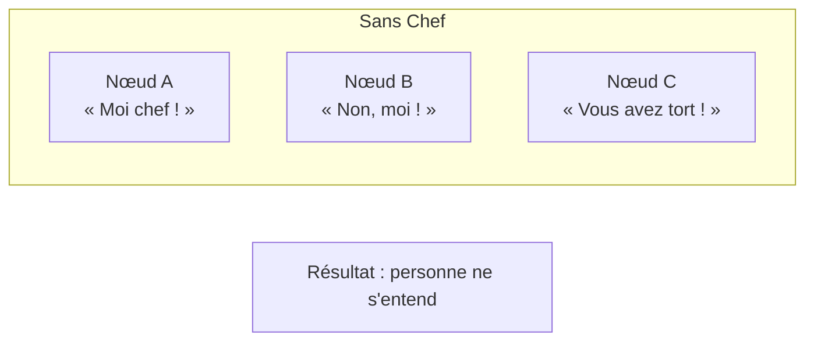
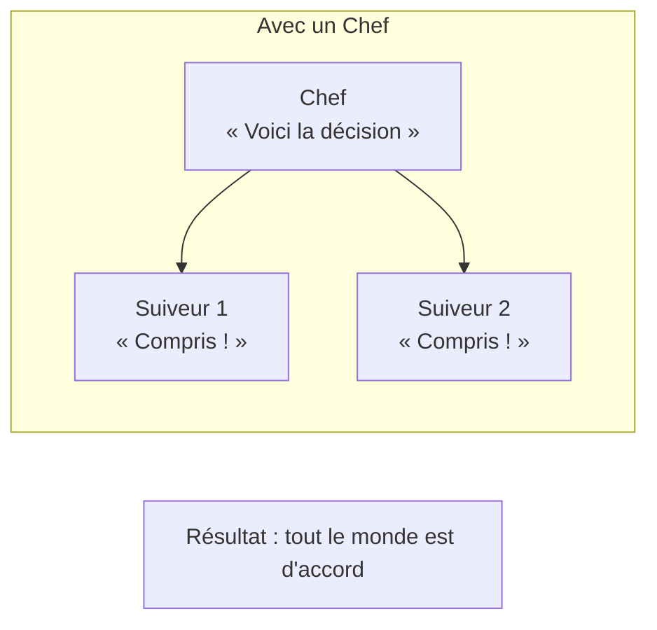
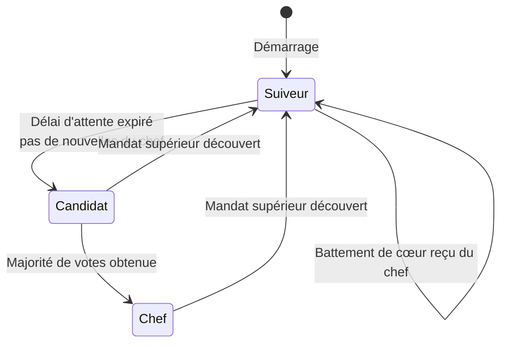
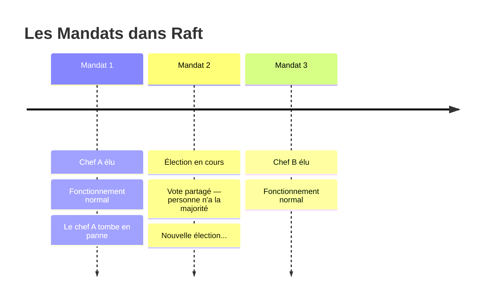
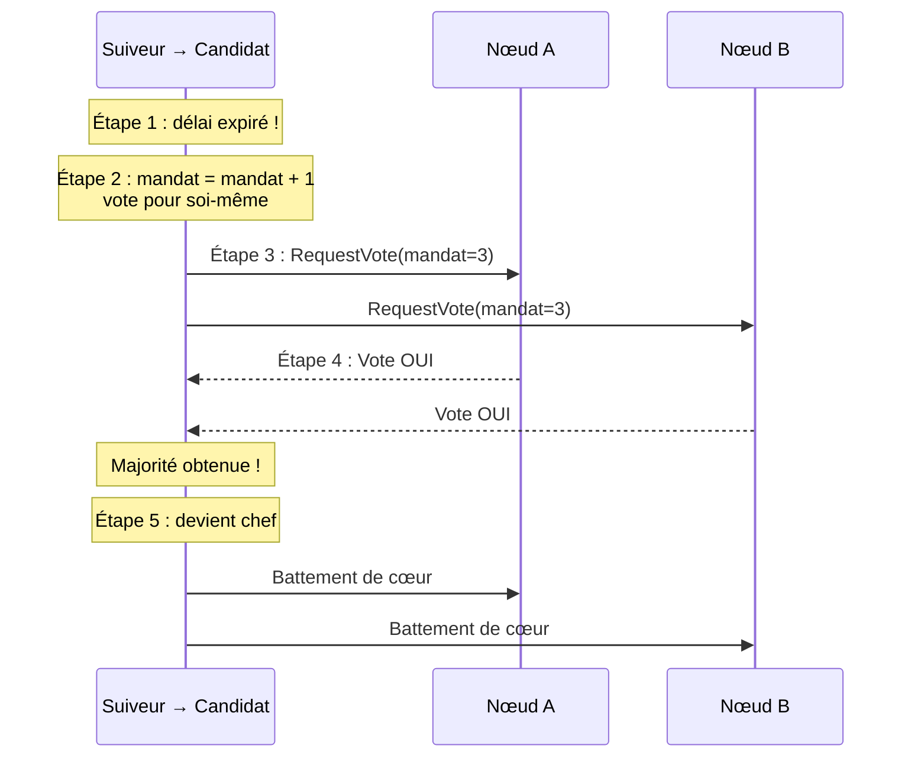
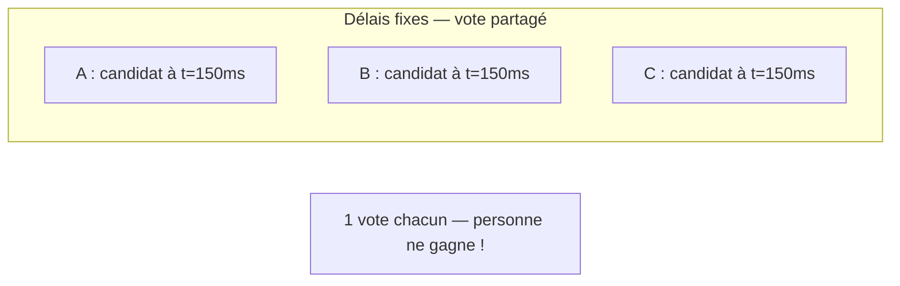

# Élire un Chef

> **Chapitre 12** — Comment un groupe de machines choisit-il son coordinateur ?

## Histoire : L'Élection du Délégué

Imagine une classe de 30 élèves. Le professeur demande : « On a besoin d'un délégué. Levez la main si vous êtes candidat ! »

Trois élèves lèvent la main : Alice, Bob et Carole. Chacun explique pourquoi il ou elle serait un bon délégué. Puis tout le monde vote — mais il faut la **majorité** pour gagner. Si personne ne l'obtient, on recommence. Alice reçoit 16 voix sur 30. Elle devient déléguée.

Son rôle ? Coordonner les demandes, transmettre les messages au professeur, s'assurer que tout le monde est sur la même longueur d'onde. Si Alice déménage, la classe organise une nouvelle élection. C'est exactement comme ça que Raft choisit son **chef** (leader).

> Dans Raft, le chef est le nœud qui coordonne tout. Les autres nœuds sont des **suiveurs** (followers). Si le chef tombe en panne, les suiveurs organisent une nouvelle élection automatiquement.

## Pourquoi un Chef ?

Sans chef, tous les nœuds parlent en même temps. Chacun essaie de coordonner les autres, personne ne s'écoute, et le résultat est le chaos :



Avec un chef, un seul nœud prend les décisions et les autres suivent. C'est plus simple, plus rapide, et plus fiable :



> Raft utilise un **leader fort** : toutes les décisions passent par le chef. Ça simplifie énormément les choses, car un seul nœud est responsable de la coordination.

## Les Trois Rôles

Chaque nœud Raft peut jouer trois rôles, exactement comme dans notre élection de délégué :

- **Suiveur** (follower) : comme un élève qui attend les instructions du délégué. Il écoute, obéit, et ne prend pas d'initiative.
- **Candidat** (candidate) : comme un élève qui lève la main pour se présenter. Il demande des votes pour devenir chef.
- **Chef** (leader) : comme le délégué élu. Il coordonne tout le groupe et prend les décisions.

Voici comment un nœud passe d'un rôle à l'autre :



> Au démarrage, tous les nœuds sont des suiveurs. Si un suiveur n'entend pas le chef pendant un certain temps, il devient candidat et lance une élection.

## Les Mandats (Terms)

Raft organise le temps en **mandats** (terms) — comme des mandats présidentiels. Chaque élection démarre un nouveau mandat, et les numéros de mandat ne font qu'augmenter. Jamais de retour en arrière.

Voici à quoi ressemble une succession de mandats :



Trois règles importantes :

- Les mandats ne font qu'**augmenter** — jamais de retour en arrière.
- Si un nœud découvre un mandat supérieur au sien, il **redescend** immédiatement au rang de suiveur.
- Un seul chef par mandat — c'est garanti par les règles de vote.

> Si l'ancien chef revient après une panne et essaie de donner des ordres avec un vieux mandat, les autres nœuds l'ignorent. Il doit redevenir suiveur et attendre les instructions du nouveau chef.

## L'Élection, Étape par Étape

Voici comment se déroule une élection, du début à la fin.

**Étape 1 : Un suiveur s'impatiente.** Le chef n'a pas envoyé de message depuis un moment. Le **délai d'attente** (timeout) du suiveur expire — il suppose que le chef est en panne.

**Étape 2 : Il devient candidat.** Le suiveur incrémente le numéro de mandat et vote pour lui-même.

**Étape 3 : Il demande des votes.** Il envoie un message `RequestVote` à tous les nœuds du cluster.

**Étape 4 : Les votes arrivent.** Chaque nœud décide d'accorder ou refuser son vote selon des règles strictes.

**Étape 5 : Il devient chef.** S'il obtient la majorité, il envoie des **battements de cœur** (heartbeats) pour annoncer sa victoire et empêcher de nouvelles élections.

Ce diagramme montre les 5 étapes en action :



> Le candidat vote toujours pour lui-même. Avec 5 nœuds, il lui faut au moins 3 votes (lui-même + 2 autres) pour gagner.

## Et Si Deux Candidats Se Présentent ?

Parfois, deux suiveurs s'impatientent en même temps. Les deux deviennent candidats, et les votes se divisent. Personne n'obtient la majorité — c'est un **vote partagé** (split vote).

Voici ce qui arrive avec des délais identiques :



La solution ? Des **délais aléatoires**. Chaque nœud choisit un temps d'attente différent dans une plage (par exemple 150-300ms) :

```mermaid
gantt
    title Délais aléatoires : un seul candidat démarre en premier
    dateFormat x
    axisFormat %L

    Nœud A (180ms) :a1, 0, 180
    Nœud B (280ms) :b1, 0, 280
    Nœud C (200ms) :c1, 0, 200

    C devient candidat :milestone, m1, 200, 0s
```



Le Nœud C atteint son délai en premier (200ms) et devient candidat. Les Nœuds A et B reçoivent sa demande de vote et réinitialisent leur délai. Résultat : C obtient la majorité avant que les autres ne deviennent candidats.

> Les délais aléatoires sont la clé qui permet à Raft de contourner le résultat FLP vu au chapitre précédent. C'est l'astuce qui rend le consensus possible en pratique.

## Les Règles de Vote (en pseudocode)

Quand un nœud reçoit une demande de vote, il suit trois règles strictes :

```
fonction voteDemande(mandat_candidat, id_candidat, journal_candidat):
    si mandat_candidat < mon_mandat        → NON
    si j'ai déjà voté ce mandat            → NON
    si journal_candidat pas à jour         → NON
    sinon                                   → OUI
```

- **Règle 1** : Un mandat inférieur ? Refusé. Ce candidat est en retard sur l'état actuel du cluster.
- **Règle 2** : Déjà voté dans ce mandat ? Refusé. Un seul vote par nœud et par mandat — ça garantit qu'un seul chef peut être élu.
- **Règle 3** : Le **journal** (log) du candidat doit être à jour. On ne veut pas élire un chef qui a manqué des informations. On compare d'abord le mandat de la dernière entrée, puis l'index.

> La règle du journal est cruciale : elle garantit qu'un chef élu possède toutes les informations validées par les mandats précédents. C'est ce qui assure la **sécurité** du consensus.

## Résumé

- Raft utilise un **chef** (leader) unique pour coordonner toutes les décisions du cluster
- Chaque nœud peut jouer trois rôles : **suiveur**, **candidat** ou **chef**
- Le temps est divisé en **mandats** (terms) qui ne font qu'augmenter — un seul chef par mandat
- L'élection se déclenche quand un suiveur n'entend plus le chef : il devient candidat et demande des votes
- Les **délais aléatoires** empêchent les votes partagés et garantissent qu'une élection aboutit rapidement
- Les trois règles de vote assurent qu'**un seul chef** est élu par mandat, avec un journal complet

## Exercices

1. **Timeouts en action** : Nœud A (délai 150ms), B (délai 280ms), C (délai 200ms). Qui devient candidat en premier ? Que se passe-t-il si A et C tombent en panne juste avant l'élection ?

2. **Le journal du candidat** : Le Nœud A a un journal avec 10 entrées au mandat 3. Le Nœud B a 12 entrées au mandat 2. Si B demande le vote de A, A doit-il accepter ? Pourquoi ?

3. **Mandat obsolète** : Un chef envoie un ordre avec le mandat 3, mais les autres nœuds sont au mandat 5. Que se passe-t-il ? Et si le chef envoie avec le mandat 6 ?

## Quiz

{{#quiz ../../quizzes/consensus-leader-election.toml}}
