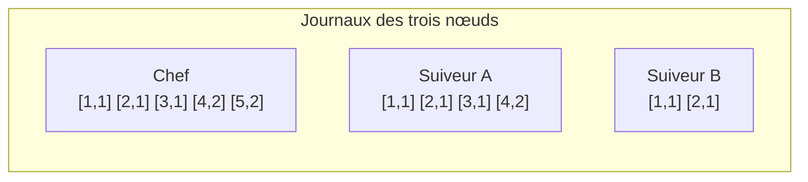
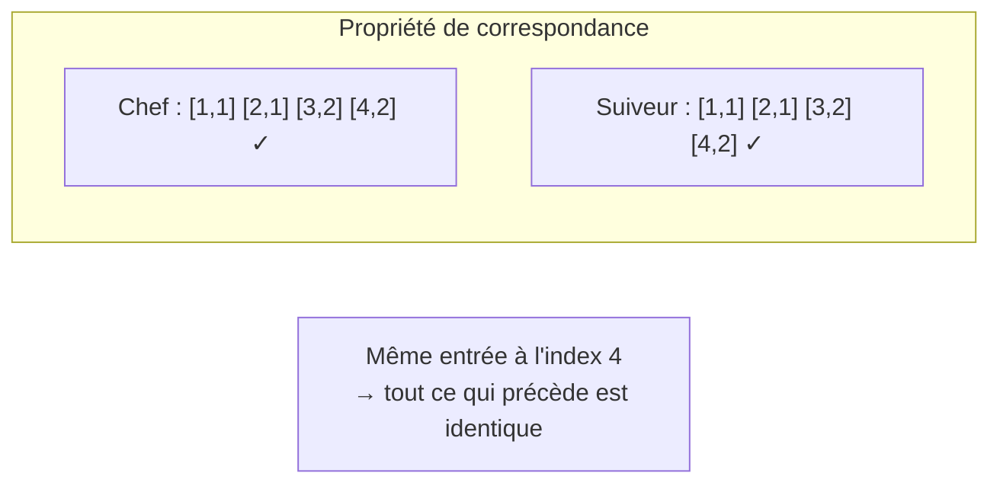
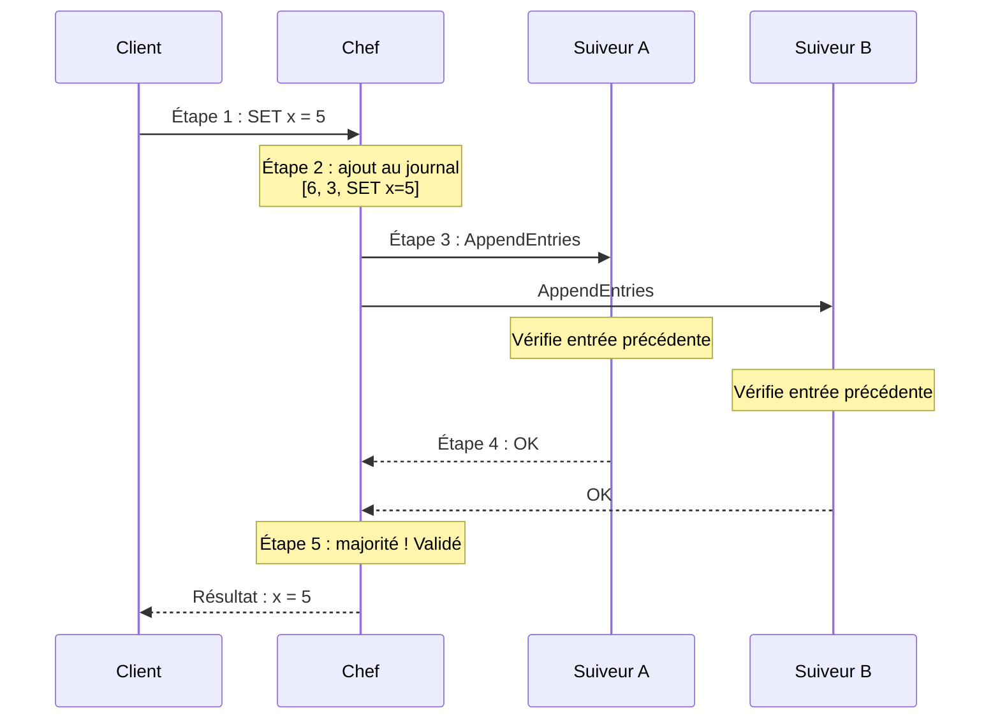
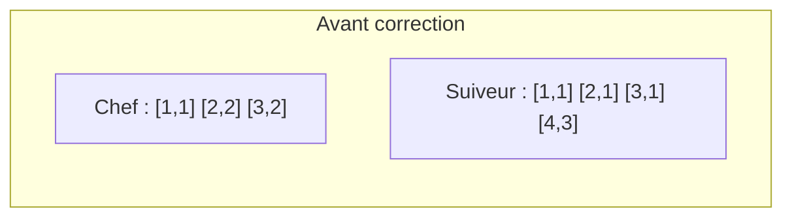
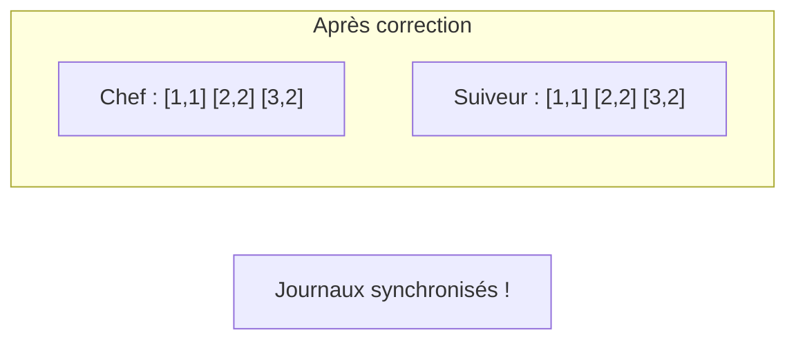
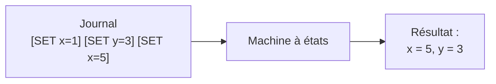

# Le Journal Partagé

> **Chapitre 13** — Comment le chef fait-il pour que tous les nœuds gardent la même trace des décisions ?

## Histoire : Le Cahier de Décisions

Imagine une équipe de cinq personnes qui gèrent un projet ensemble. Chaque jour, l'équipière principale — appelons-la Alice — note toutes les décisions du jour dans un grand cahier : « Lundi : on utilise React. Mardi : la base sera PostgreSQL. Mercredi : on déploie vendredi. »

Chaque membre de l'équipe possède son propre cahier et copie scrupuleusement les décisions d'Alice. À la fin de chaque journée, tous les cahiers sont identiques. Si jamais il y a un doute, il suffit de comparer les pages : « Page 3, on a la même chose ? Oui ? Alors tout va bien. »

Mais que se passe-t-il si Bob était absent mardi ? Pas de panique : le mercredi, Alice lui montre ce qu'il a manqué. « Regarde, mardi on a décidé PostgreSQL, c'est la page 2 de mon cahier. Recopie ça dans ton cahier à la bonne page. » Bob recopie, et son cahier est à jour.

Et si un jour Alice est malade ? L'équipe élit une nouvelle équipière principale. Celle-ci utilise son cahier — qui est à jour car elle a tout copié — pour continuer à noter les décisions. Personne ne perd aucune information, le projet continue sans interruption.

> Dans Raft, ce cahier de décisions s'appelle le **journal** (log). Le chef écrit les décisions, les suiveurs les recopient. Si le chef tombe en panne, le nouveau chef possède un journal complet et peut continuer. Tout est dans le cahier.

## Qu'est-ce qu'un Journal ?

Un **journal** est une liste ordonnée d'entrées, comme les pages d'un cahier. Chaque entrée contient trois choses :

- un **index** (le numéro de page — 1, 2, 3...)
- un **mandat** (quel était le numéro de mandat quand cette entrée a été ajoutée)
- une **commande** (la décision elle-même, comme « SET x = 5 »)

Dans notre cahier d'équipe, l'entrée numéro 3 ressemblerait à ça : page 3, décision prise sous le mandat d'Alice, commande « SET y = 2 ». Chaque nœud du cluster possède son propre journal et s'assure qu'il correspond à celui du chef. L'index augmente toujours (1, 2, 3, ...), mais le mandat peut rester le même ou changer quand un nouveau chef est élu.

Voici trois nœuds avec leurs journaux. Certains sont en avance, d'autres en retard. La notation `[index, mandat]` signifie « entrée à cet index, ajoutée pendant ce mandat » :

Le chef a 5 entrées, le Suiveur A en a 4 (il lui manque la dernière), le Suiveur B seulement 2 (il a pris du retard). Le chef va aider les suiveurs à se mettre à jour en leur envoyant les entrées manquantes — c'est la **réplication**.

> Tu remarques que les mandats changent en cours de journal : les entrées 1-3 sont du mandat 1, les entrées 4-5 du mandat 2. Ça arrive quand un nouveau chef est élu — il continue le journal là où l'ancien chef s'est arrêté, mais avec son propre numéro de mandat.

> Le journal est la mémoire du cluster. Tout ce qui a été décidé s'y trouve, dans l'ordre exact où ça a été décidé. C'est la source de vérité commune de tout le système.

## La Règle d'Or

Raft repose sur une propriété fondamentale appelée **propriété de correspondance du journal** (log matching property). Elle est si importante qu'on peut l'appeler la Règle d'Or de Raft :

> Si deux journaux possèdent une entrée avec le même index et le même mandat, alors toutes les entrées précédentes sont identiques.

C'est comme nos cahiers d'équipe : si ton cahier et le mien sont d'accord sur la page 5, alors nous sommes forcément d'accord sur les pages 1 à 4. Pourquoi ? Parce que chaque nouvelle page dépend de la précédente — on ne peut pas avoir la bonne page 5 sans avoir eu la bonne page 4 avant.

Cette propriété est garantie par la façon dont Raft ajoute les entrées : le chef envoie toujours l'index et le mandat de l'entrée **précédente** avec chaque nouvelle entrée. Si le suiveur ne trouve pas cette entrée précédente à la bonne place, il refuse d'ajouter la nouvelle. C'est un mécanisme de vérification en cascade : chaque entrée confirme la précédente, qui confirme la sienne, et ainsi de suite.

Résultat : les journaux ne peuvent diverger qu'à partir de la fin. Les entrées déjà validées ne sont jamais remises en question — elles sont gravées dans le marbre.

## La Réplication en 5 Étapes

Voici comment une commande client voyage du chef jusqu'à tous les journaux. Chaque étape est essentielle pour garantir que personne n'est laissé pour compte. C'est le cœur battant de Raft.

**Étape 1 : Le client envoie une commande.** Un client demande au chef : « SET x = 5 ». Seul le chef reçoit les demandes des clients — c'est son rôle de coordinateur.

**Étape 2 : Le chef ajoute à son journal.** Le chef crée une nouvelle entrée avec le prochain index disponible, le mandat courant, et la commande. Il l'ajoute à la fin de son journal, mais ne la valide pas encore. Pour l'instant, c'est provisoire.

**Étape 3 : Le chef envoie AppendEntries.** Le chef envoie un message `AppendEntries` à tous les suiveurs en parallèle. Ce message contient la nouvelle entrée + l'index et le mandat de l'entrée **précédente** (c'est ça qui garantit la propriété de correspondance vue plus haut). Ce message sert aussi de **battement de cœur** (heartbeat) — même s'il n'y a pas de nouvelle entrée, le chef envoie des AppendEntries vides régulièrement pour signaler « je suis toujours là ».

**Étape 4 : Les suiveurs ajoutent et répondent.** Chaque suiveur vérifie d'abord que l'entrée précédente correspond bien à ce qu'il a dans son journal. Si oui, il ajoute la nouvelle entrée et répond « OK ». Si non, il refuse — le chef devra revenir à une étape précédente.

**Étape 5 : Majorité → validé !** Quand le chef reçoit des réponses positives de la majorité des nœuds (lui-même inclus), l'entrée est **validée** (committed). Il applique alors la commande à la **machine à états** et répond au client. La commande est maintenant définitive — elle ne sera jamais annulée.

> Le client attend que l'entrée soit validée avant de recevoir une réponse. Ça garantit qu'il ne reçoit un « OK » que si la majorité du cluster a enregistré sa commande. Pas de faux espoirs : si le client reçoit un accusé de réception, c'est que c'est définitif.

> Note que le chef n'attend pas **tous** les suiveurs — juste la **majorité**. Dans un cluster de 5, si 3 nœuds (le chef + 2 suiveurs) ont l'entrée, c'est suffisant. Les deux autres suiveurs seront mis à jour plus tard, à leur rythme. C'est ce qui rend Raft rapide : il avance à la vitesse de la majorité, pas du plus lent.

## Et Si les Journaux Divergent ?

Parfois, un suiveur a des entrées que le chef n'a pas — par exemple, si un ancien chef (d'un mandat précédent) avait commencé à répliquer des entrées avant de tomber en panne. Ces entrées n'ont jamais été validées par la majorité, donc elles ne sont pas définitives. Le nouveau chef doit les corriger.

C'est comme si un ancien équipier principal avait noté des décisions provisoires dans son cahier avant de partir. Le nouvel équipier principal les efface et les remplace par les bonnes. Seules les pages validées (signées par la majorité de l'équipe) sont protégées.

Voici un exemple concret de divergence :

Les journaux divergent à l'index 2 : le chef a `[2,2]` mais le suiveur a `[2,1]`. Le suiveur a même une entrée supplémentaire `[4,3]` d'un ancien mandat qui n'a jamais été validée.

Le chef résout ça en reculant étape par étape, comme quelqu'un qui chercherait la dernière page commune entre deux cahiers :

1. Le chef envoie `AppendEntries` pour l'index 4 avec l'entrée précédente `[3,2]`.
2. Le suiveur vérifie : son entrée à l'index 3 est `[3,1]` — ça ne correspond pas.
3. Le suiveur répond « NON ». Le chef recule d'un cran et essaie l'index 3.
4. Même problème : le suiveur a `[2,1]`, le chef attend `[2,2]`. Encore « NON ».
5. Le chef essaie l'index 1 : les deux ont `[1,1]` — correspondance trouvée !
6. À partir de là, le chef envoie les entrées correctes (index 2, puis 3). Le suiveur écrase ses vieilles entrées incorrectes.

Ce processus est entièrement automatique — le chef et le suiveur n'ont pas besoin d'intervention humaine. Le chef persévère jusqu'à trouver le point de divergence, puis corrige. C'est méthodique et fiable.

> Les entrées non validées d'un ancien mandat sont simplement écrasées. Seules les entrées **validées** (commises par la majorité) sont garanties de ne jamais être perdues. C'est pour ça que la distinction entre « présent dans le journal » et « validé » est si importante.

## La Validation (Commit)

Jusqu'ici, on a vu comment les entrées sont ajoutées aux journaux. Mais il y a une différence cruciale entre « présent dans le journal » et « définitivement accepté ». C'est la **validation**.

Une entrée est **validée** (committed) quand le chef sait qu'elle est stockée sur la majorité des nœuds. À partir de ce moment, elle ne sera **jamais perdue** — même si la moitié du cluster tombe en panne juste après.

La règle est simple : une entrée est validée dès que la majorité des nœuds l'ont dans leur journal. Dans un cluster de 5, il suffit que 3 nœuds (le chef + 2 suiveurs) l'aient stockée. Pas besoin d'unanimité — la majorité suffit.

Mais il y a une subtilité importante. Le chef ne valide une entrée d'un ancien mandat que lorsqu'au moins une entrée du mandat **courant** est stockée sur la majorité des nœuds. Pourquoi ? Parce que c'est l'élection du nouveau chef qui prouve indirectement que les anciennes entrées étaient bien répliquées. Ça garantit qu'une entrée validée ne sera jamais écrasée par un futur chef. C'est un mécanisme indirect mais très élégant.

> Pense à la validation comme un contrat signé : avant la signature, tout peut changer. Après, c'est définitif. Le client ne reçoit une réponse qu'après la validation — il n'a jamais à s'inquiéter qu'une décision soit annulée.

> En pratique, le chef inclut son **index de validation** dans chaque `AppendEntries`. Ça permet aux suiveurs de savoir quelles entrées sont définitives et de les appliquer à leur machine à états. C'est un mécanisme simple mais puissant : une seule valeur qui dit « jusque-là, c'est sûr ».

## La Machine à États

Le journal contient les décisions, mais qui les exécute réellement ? C'est le rôle de la **machine à états** (state machine). Chaque nœud possède sa propre machine à états qui lit les entrées du journal, dans l'ordre, et les applique une par une.

Pense à la machine à états comme un interprète : elle prend chaque commande du journal et l'exécute pour construire la base de données finale.

Si le journal dit « SET x=1, puis SET y=3, puis SET x=5 », la machine à états exécute ces trois commandes dans l'ordre et arrive à l'état final `x=5, y=3`.

L'analogie est simple : le journal est la recette, la machine à états est le plat cuisiné. La recette dit « ajoute un œuf, puis du sucre, puis de la farine ». La machine à états suit la recette dans l'ordre et produit le gâteau. Si tu suis la même recette, tu obtiens le même gâteau — garanti.

Et c'est là que tout s'assemble. Souviens-toi du chapitre 11 : on voulait que tous les nœuds soient d'accord. Le journal garantit que tous les nœuds voient les mêmes commandes. La machine à états garantit qu'ils les exécutent dans le même ordre. Donc ils arrivent tous au même résultat. Le consensus est atteint, commande par commande, entrée par entrée.

Chaque nœud applique les entrées **validées** seulement — jamais les entrées provisoires. Comme tous les journaux sont identiques jusqu'à l'index validé (merci la propriété de correspondance), toutes les machines à états produisent le **même résultat**. C'est comme ça que Raft garantit que tous les nœuds sont d'accord sur l'état du système.

> La machine à états est **déterministe** : les mêmes entrées dans le même ordre produisent toujours le même état. C'est ce qui permet à chaque nœud de construire une copie identique de la base de données, indépendamment et sans communication supplémentaire.

> Le jour où un nœud redémarre après une panne, il lui suffit de relire son journal depuis le début et de rejouer chaque commande dans la machine à états. En quelques secondes, il retrouve son état complet. Le journal est la mémoire permanente, la machine à états est reconstruite à la volée.

## Résumé

- Le **journal** (log) est la liste ordonnée de toutes les décisions du cluster — chaque entrée a un index, un mandat et une commande
- La **propriété de correspondance** garantit que si deux journaux sont identiques à un index donné, tout ce qui précède est aussi identique
- La **réplication** se fait en 5 étapes : client → chef ajoute → AppendEntries → suiveurs vérifient et ajoutent → majorité = validé
- Quand les journaux **divergent**, le chef recule jusqu'à trouver la dernière correspondance, puis écrase les entrées incorrectes
- Une entrée est **validée** (committed) quand la majorité l'a stockée — à partir de ce moment, elle ne sera jamais perdue
- La **machine à états** applique les entrées validées dans l'ordre pour construire l'état final — tous les nœuds obtiennent le même résultat
- Le journal et la machine à états ensemble réalisent le **consensus** : mêmes commandes, même ordre, même résultat

## Exercices

1. **Réplication en action** : Le chef a le journal `[SET x=1, SET y=2, SET z=3]`. Le suiveur a `[SET x=1]`. Que doit envoyer le chef au suiveur pour le rattraper ? Quels index et mandats le suiveur vérifie-t-il avant d'accepter les nouvelles entrées ? Que se passe-t-il si le suiveur refuse ?

2. **Entrée validée** : Un cluster de 5 nœuds. Le chef envoie `AppendEntries` à 4 suiveurs. 3 répondent OK (plus le chef lui-même = 4 sur 5). L'entrée est-elle validée ? Que se passerait-il si seulement 1 suiveur répondait OK ?

3. **Divergence de journal** : Le chef a `[1,1] [2,2] [3,2]`. Le suiveur a `[1,1] [2,1] [3,1]`. À quel index les journaux divergent-ils ? Combien d'étapes le chef devra-t-il reculer pour trouver la dernière correspondance ? Que se passe-t-il après ?

## Quiz

{{#quiz ../../quizzes/consensus-log-replication.toml}}
