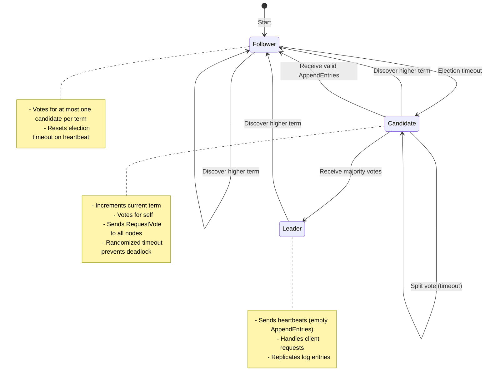
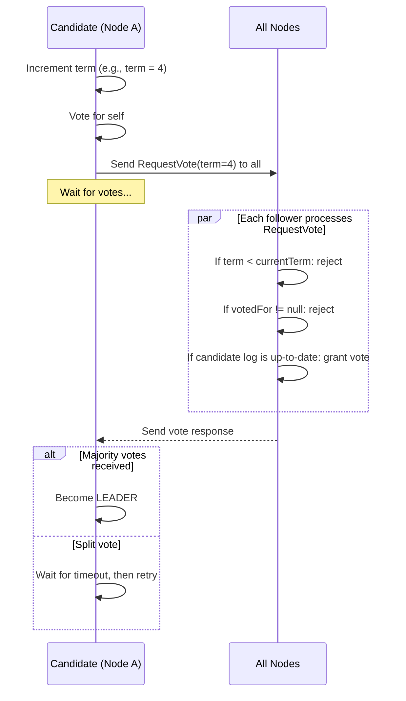
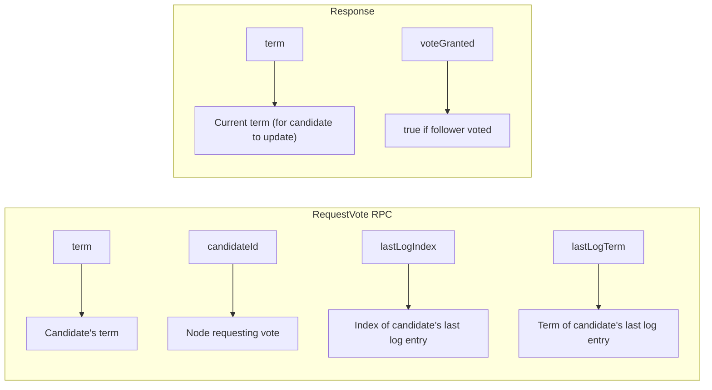

# Raft Leader Election

> **Session 9, Part 1** - 45 minutes

## Learning Objectives

- [ ] Understand how Raft elects a leader democratically
- [ ] Implement the RequestVote RPC
- [ ] Handle election timeouts and randomized intervals
- [ ] Prevent split votes with election safety
- [ ] Build a working leader election system

---

## Concept: Democratic Leader Election

In the previous chapter, we learned about Raft's design philosophy. Now let's dive into the **leader election** mechanism — the democratic process by which nodes agree on who should lead.

### Why Do We Need a Leader?

```
Without a Leader:
┌─────────┐     ┌─────────┐     ┌─────────┐
│ Node A  │     │ Node B  │     │ Node C  │
│         │     │         │     │         │
│ "I'm    │     │ "No,    │     │ "Both   │
│ leader!" │     │ I am!"  │     │ wrong!" │
└─────────┘     └─────────┘     └─────────┘
     Chaos!        Split brain!   Confusion!

With Raft Leader Election:
┌─────────┐     ┌─────────┐     ┌─────────┐
│ Node A  │     │ Node B  │     │ Node C  │
│         │     │         │     │         │
│ "I      │     │ "I      │     │ "I vote │
│ vote    │---> │ vote    │---> │ for     │
│ for B"   │     │ for B"   │     │ B"      │
└────┬────┘     └────┬────┘     └────┬────┘
     │               │               │
     └───────────────┴───────────────┘
                     │
                     ▼
              ┌──────────┐
              │ Node B   │
              │ = LEADER │
              └──────────┘
```

**Key Insight**: Nodes vote for each other. The node with **majority votes** becomes leader.

---

## State Transitions During Election

Raft nodes cycle through three states during leader election:



---

## The Election Algorithm Step by Step

### Step 1: Follower Timeout

When a follower doesn't hear from a leader within the **election timeout**:

```
Time ────────────────────────────────────────────────────────>

Node A: [waiting...] [waiting...] ⏱️ TIMEOUT! → Become Candidate
Node B: [waiting...] [waiting...] [waiting...]
Node C: [waiting...] [waiting...] [waiting...]
```

### Step 2: Become Candidate

The node transitions to candidate state:



### Step 3: RequestVote RPC

The `RequestVote` RPC is the ballot paper in Raft's election:



**Voting Rule**: A follower grants vote if:
1. Candidate's term > follower's currentTerm, OR
2. Terms equal AND follower hasn't voted yet AND candidate's log is at least as up-to-date

---

## Randomized Election Timeouts

### The Split Vote Problem

Without randomization, simultaneous elections cause deadlocks:

```
Bad: Fixed timeouts cause repeated split votes
Node A: timeout at T=100 → Candidate, gets 1 vote
Node B: timeout at T=100 → Candidate, gets 1 vote
Node C: timeout at T=100 → Candidate, gets 1 vote

Result: Nobody wins! Election timeout...
Same thing repeats forever!
```

### Solution: Randomized Intervals

Each node picks a random timeout within a range:

```mermaid
gantt
    title Election Timeouts (Randomized: 150-300ms)
    dateFormat X
    axisFormat %L

    Node A :a1, 0, 180
    Node B :b1, 0, 220
    Node C :c1, 0, 160

    Node A becomes Candidate :milestone, m1, 180, 0s
    Node C becomes Candidate :milestone, m2, 160, 0s
```



**Node C times out first** and starts election. Node A and B reset their timeouts when they receive `RequestVote`, allowing Node C to gather votes.

**Probability Analysis**: For a cluster of N nodes with timeout range [T, 2T]:
- Probability of simultaneous timeout: ~1/N
- With 5 nodes and 150-300ms range: P < 5%

---

## TypeScript Implementation

Let's build a working Raft leader election system:

### Core Types

```typescript
// types/raft.ts

export type NodeState = 'follower' | 'candidate' | 'leader';

export interface LogEntry {
  index: number;
  term: number;
  command: unknown;
}

export interface RaftNodeConfig {
  id: string;
  peers: string[];  // List of peer node IDs
  electionTimeoutMin: number;  // Minimum timeout in ms
  electionTimeoutMax: number;  // Maximum timeout in ms
}

export interface RequestVoteArgs {
  term: number;
  candidateId: string;
  lastLogIndex: number;
  lastLogTerm: number;
}

export interface RequestVoteReply {
  term: number;
  voteGranted: boolean;
}

export interface AppendEntriesArgs {
  term: number;
  leaderId: string;
  prevLogIndex: number;
  prevLogTerm: number;
  entries: LogEntry[];
  leaderCommit: number;
}

export interface AppendEntriesReply {
  term: number;
  success: boolean;
}
```

### Raft Node Implementation

```typescript
// raft-node.ts

import { RaftNodeConfig, NodeState, LogEntry, RequestVoteArgs, RequestVoteReply } from './types';

export class RaftNode {
  private state: NodeState = 'follower';
  private currentTerm: number = 0;
  private votedFor: string | null = null;
  private log: LogEntry[] = [];

  // Election timeout
  private electionTimer: NodeJS.Timeout | null = null;
  private lastHeartbeat: number = Date.now();

  // Leader-only state
  private leaderId: string | null = null;

  constructor(private config: RaftNodeConfig) {
    this.startElectionTimer();
  }

  // ========== Public API ==========

  getState(): NodeState {
    return this.state;
  }

  getCurrentTerm(): number {
    return this.currentTerm;
  }

  getLeader(): string | null {
    return this.leaderId;
  }

  // ========== RPC Handlers ==========

  /**
   * Invoked by candidates to gather votes
   */
  requestVote(args: RequestVoteArgs): RequestVoteReply {
    const reply: RequestVoteReply = {
      term: this.currentTerm,
      voteGranted: false
    };

    // Rule 1: If candidate's term is lower, reject
    if (args.term < this.currentTerm) {
      return reply;
    }

    // Rule 2: If candidate's term is higher, update and become follower
    if (args.term > this.currentTerm) {
      this.becomeFollower(args.term);
      reply.term = args.term;
    }

    // Rule 3: If we already voted for someone else this term, reject
    if (this.votedFor !== null && this.votedFor !== args.candidateId) {
      return reply;
    }

    // Rule 4: Check if candidate's log is at least as up-to-date as ours
    const lastEntry = this.log.length > 0 ? this.log[this.log.length - 1] : null;
    const lastLogIndex = lastEntry ? lastEntry.index : 0;
    const lastLogTerm = lastEntry ? lastEntry.term : 0;

    const logIsUpToDate =
      (args.lastLogTerm > lastLogTerm) ||
      (args.lastLogTerm === lastLogTerm && args.lastLogIndex >= lastLogIndex);

    if (!logIsUpToDate) {
      return reply;
    }

    // Grant vote
    this.votedFor = args.candidateId;
    reply.voteGranted = true;
    this.resetElectionTimer();

    console.log(`Node ${this.config.id} voted for ${args.candidateId} in term ${args.term}`);
    return reply;
  }

  /**
   * Invoked by leader to assert authority (heartbeat or log replication)
   */
  receiveHeartbeat(term: number, leaderId: string): void {
    if (term >= this.currentTerm) {
      if (term > this.currentTerm) {
        this.becomeFollower(term);
      }
      this.leaderId = leaderId;
      this.resetElectionTimer();
    }
  }

  // ========== State Transitions ==========

  private becomeFollower(term: number): void {
    this.state = 'follower';
    this.currentTerm = term;
    this.votedFor = null;
    this.leaderId = null;
    this.resetElectionTimer();
    console.log(`Node ${this.config.id} became follower in term ${term}`);
  }

  private becomeCandidate(): void {
    this.state = 'candidate';
    this.currentTerm += 1;
    this.votedFor = this.config.id;
    this.leaderId = null;

    console.log(`Node ${this.config.id} became candidate in term ${this.currentTerm}`);

    // Start election
    this.startElection();
  }

  private becomeLeader(): void {
    this.state = 'leader';
    this.leaderId = this.config.id;

    console.log(`Node ${this.config.id} became LEADER in term ${this.currentTerm}`);

    // Start sending heartbeats
    this.startHeartbeats();
  }

  // ========== Election Logic ==========

  private startElectionTimer(): void {
    if (this.electionTimer) {
      clearTimeout(this.electionTimer);
    }

    const timeout = this.getRandomElectionTimeout();

    this.electionTimer = setTimeout(() => {
      // Only transition if we haven't heard from a leader
      if (this.state === 'follower') {
        console.log(`Node ${this.config.id} election timeout`);
        this.becomeCandidate();
      }
    }, timeout);
  }

  private resetElectionTimer(): void {
    this.startElectionTimer();
  }

  private getRandomElectionTimeout(): number {
    const { electionTimeoutMin, electionTimeoutMax } = this.config;
    return Math.floor(
      Math.random() * (electionTimeoutMax - electionTimeoutMin + 1)
    ) + electionTimeoutMin;
  }

  private async startElection(): Promise<void> {
    const args: RequestVoteArgs = {
      term: this.currentTerm,
      candidateId: this.config.id,
      lastLogIndex: this.log.length > 0 ? this.log[this.log.length - 1].index : 0,
      lastLogTerm: this.log.length > 0 ? this.log[this.log.length - 1].term : 0
    };

    let votesReceived = 1; // Vote for self
    const majority = Math.floor(this.config.peers.length / 2) + 1;

    // Send RequestVote to all peers
    const promises = this.config.peers.map(peerId =>
      this.sendRequestVote(peerId, args)
    );

    const responses = await Promise.allSettled(promises);

    // Count votes
    for (const result of responses) {
      if (result.status === 'fulfilled' && result.value.voteGranted) {
        votesReceived++;
      }
    }

    // Check if we won
    if (votesReceived >= majority && this.state === 'candidate') {
      this.becomeLeader();
    }
  }

  // ========== Network Simulation ==========

  private async sendRequestVote(
    peerId: string,
    args: RequestVoteArgs
  ): Promise<RequestVoteReply> {
    // In a real implementation, this would be an HTTP/gRPC call
    // For this example, we simulate by calling directly
    // In the full example below, we'll use actual HTTP

    return {
      term: 0,
      voteGranted: false
    };
  }

  private startHeartbeats(): void {
    // Leader sends periodic heartbeats
    // Implementation in full example
  }

  stop(): void {
    if (this.electionTimer) {
      clearTimeout(this.electionTimer);
    }
  }
}
```

### HTTP Server with Raft

```typescript
// server.ts

import express, { Request, Response } from 'express';
import { RaftNode } from './raft-node';
import { RequestVoteArgs, RequestVoteReply } from './types';

export class RaftServer {
  private app: express.Application;
  private node: RaftNode;
  private server: any;

  constructor(
    private nodeId: string,
    private port: number,
    peers: string[]
  ) {
    this.app = express();
    this.app.use(express.json());

    this.node = new RaftNode({
      id: nodeId,
      peers: peers,
      electionTimeoutMin: 150,
      electionTimeoutMax: 300
    });

    this.setupRoutes();
  }

  private setupRoutes(): void {
    // RequestVote RPC endpoint
    this.app.post('/raft/request-vote', (req: Request, res: Response) => {
      const args: RequestVoteArgs = req.body;
      const reply: RequestVoteReply = this.node.requestVote(args);
      res.json(reply);
    });

    // Heartbeat endpoint
    this.app.post('/raft/heartbeat', (req: Request, res: Response) => {
      const { term, leaderId } = req.body;
      this.node.receiveHeartbeat(term, leaderId);
      res.json({ success: true });
    });

    // Status endpoint
    this.app.get('/status', (req: Request, res: Response) => {
      res.json({
        id: this.nodeId,
        state: this.node.getState(),
        term: this.node.getCurrentTerm(),
        leader: this.node.getLeader()
      });
    });
  }

  async start(): Promise<void> {
    this.server = this.app.listen(this.port, () => {
      console.log(`Node ${this.nodeId} listening on port ${this.port}`);
    });
  }

  stop(): void {
    this.node.stop();
    if (this.server) {
      this.server.close();
    }
  }

  getNode(): RaftNode {
    return this.node;
  }
}
```

---

## Python Implementation

The same logic in Python:

```python
# raft_node.py

import asyncio
import random
from dataclasses import dataclass
from enum import Enum
from typing import Optional, List
from datetime import datetime, timedelta

class NodeState(Enum):
    FOLLOWER = "follower"
    CANDIDATE = "candidate"
    LEADER = "leader"

@dataclass
class LogEntry:
    index: int
    term: int
    command: dict

@dataclass
class RequestVoteArgs:
    term: int
    candidate_id: str
    last_log_index: int
    last_log_term: int

@dataclass
class RequestVoteReply:
    term: int
    vote_granted: bool

class RaftNode:
    def __init__(self, node_id: str, peers: List[str],
                 election_timeout_min: int = 150,
                 election_timeout_max: int = 300):
        self.node_id = node_id
        self.peers = peers

        # Persistent state
        self.current_term = 0
        self.voted_for: Optional[str] = None
        self.log: List[LogEntry] = []

        # Volatile state
        self.state = NodeState.FOLLOWER
        self.leader_id: Optional[str] = None

        # Election timeout
        self.election_timeout_min = election_timeout_min
        self.election_timeout_max = election_timeout_max
        self.election_task: Optional[asyncio.Task] = None
        self.heartbeat_task: Optional[asyncio.Task] = None

        # Start election timer
        self.start_election_timer()

    async def request_vote(self, args: RequestVoteArgs) -> RequestVoteReply:
        """Handle RequestVote RPC from candidate"""
        reply = RequestVoteReply(
            term=self.current_term,
            vote_granted=False
        )

        # Rule 1: Reject if candidate's term is lower
        if args.term < self.current_term:
            return reply

        # Rule 2: Update to higher term and become follower
        if args.term > self.current_term:
            await self.become_follower(args.term)
            reply.term = args.term

        # Rule 3: Reject if already voted for another candidate
        if self.voted_for is not None and self.voted_for != args.candidate_id:
            return reply

        # Rule 4: Check if candidate's log is up-to-date
        last_entry = self.log[-1] if self.log else None
        last_log_index = last_entry.index if last_entry else 0
        last_log_term = last_entry.term if last_entry else 0

        log_is_up_to_date = (
            args.last_log_term > last_log_term or
            (args.last_log_term == last_log_term and
             args.last_log_index >= last_log_index)
        )

        if not log_is_up_to_date:
            return reply

        # Grant vote
        self.voted_for = args.candidate_id
        reply.vote_granted = True
        self.reset_election_timer()

        print(f"Node {self.node_id} voted for {args.candidate_id} in term {args.term}")
        return reply

    async def receive_heartbeat(self, term: int, leader_id: str):
        """Handle heartbeat from leader"""
        if term >= self.current_term:
            if term > self.current_term:
                await self.become_follower(term)
            self.leader_id = leader_id
            self.reset_election_timer()

    async def become_follower(self, term: int):
        """Transition to follower state"""
        self.state = NodeState.FOLLOWER
        self.current_term = term
        self.voted_for = None
        self.leader_id = None

        # Cancel heartbeat task if running
        if self.heartbeat_task:
            self.heartbeat_task.cancel()
            self.heartbeat_task = None

        self.reset_election_timer()
        print(f"Node {self.node_id} became follower in term {term}")

    async def become_candidate(self):
        """Transition to candidate state and start election"""
        self.state = NodeState.CANDIDATE
        self.current_term += 1
        self.voted_for = self.node_id
        self.leader_id = None

        print(f"Node {self.node_id} became candidate in term {self.current_term}")
        await self.start_election()

    async def become_leader(self):
        """Transition to leader state"""
        self.state = NodeState.LEADER
        self.leader_id = self.node_id

        print(f"Node {self.node_id} became LEADER in term {self.current_term}")
        self.start_heartbeats()

    def start_election_timer(self):
        """Start or reset the election timeout timer"""
        if self.election_task:
            self.election_task.cancel()

        timeout = self.get_random_election_timeout()
        self.election_task = asyncio.create_task(self.election_timeout(timeout))

    def reset_election_timer(self):
        """Reset the election timeout timer"""
        self.start_election_timer()

    def get_random_election_timeout(self) -> int:
        """Get random timeout within configured range"""
        return random.randint(
            self.election_timeout_min,
            self.election_timeout_max
        )

    async def election_timeout(self, timeout_ms: int):
        """Wait for timeout, then start election if still follower"""
        try:
            await asyncio.sleep(timeout_ms / 1000)
            if self.state == NodeState.FOLLOWER:
                print(f"Node {self.node_id} election timeout")
                await self.become_candidate()
        except asyncio.CancelledError:
            pass  # Timer was reset

    async def start_election(self):
        """Start leader election by sending RequestVote to all peers"""
        args = RequestVoteArgs(
            term=self.current_term,
            candidate_id=self.node_id,
            last_log_index=self.log[-1].index if self.log else 0,
            last_log_term=self.log[-1].term if self.log else 0
        )

        votes_received = 1  # Vote for self
        majority = len(self.peers) // 2 + 1

        # Send RequestVote to all peers concurrently
        tasks = [
            self.send_request_vote(peer_id, args)
            for peer_id in self.peers
        ]

        results = await asyncio.gather(*tasks, return_exceptions=True)

        # Count votes
        for result in results:
            if isinstance(result, RequestVoteReply) and result.vote_granted:
                votes_received += 1

        # Check if we won the election
        if votes_received >= majority and self.state == NodeState.CANDIDATE:
            await self.become_leader()

    async def send_request_vote(self, peer_id: str, args: RequestVoteArgs) -> RequestVoteReply:
        """Send RequestVote RPC to peer (simulated)"""
        # In real implementation, use HTTP/aiohttp
        # For this example, return mock response
        return RequestVoteReply(term=0, vote_granted=False)

    def start_heartbeats(self):
        """Leader sends periodic heartbeats"""
        if self.heartbeat_task:
            self.heartbeat_task.cancel()

        self.heartbeat_task = asyncio.create_task(self.send_heartbeats())

    async def send_heartbeats(self):
        """Send empty AppendEntries (heartbeats) to all followers"""
        while self.state == NodeState.LEADER:
            for peer_id in self.peers:
                # In real implementation, send HTTP POST
                await asyncio.sleep(0.05)  # Heartbeat interval: 50ms

    def stop(self):
        """Stop the node"""
        if self.election_task:
            self.election_task.cancel()
        if self.heartbeat_task:
            self.heartbeat_task.cancel()
```

### Flask Server with Raft

```python
# server.py

from flask import Flask, request, jsonify
from raft_node import RaftNode, RequestVoteArgs
import asyncio

app = Flask(__name__)

class RaftServer:
    def __init__(self, node_id: str, port: int, peers: list):
        self.node_id = node_id
        self.port = port
        self.node = RaftNode(node_id, peers)
        self.app = app
        self.setup_routes()

    def setup_routes(self):
        @self.app.route('/raft/request-vote', methods=['POST'])
        def request_vote():
            args = RequestVoteArgs(**request.json)
            reply = asyncio.run(self.node.request_vote(args))
            return jsonify({
                'term': reply.term,
                'voteGranted': reply.vote_granted
            })

        @self.app.route('/raft/heartbeat', methods=['POST'])
        def heartbeat():
            data = request.json
            asyncio.run(self.node.receive_heartbeat(
                data['term'], data['leaderId']
            ))
            return jsonify({'success': True})

        @self.app.route('/status', methods=['GET'])
        def status():
            return jsonify({
                'id': self.node_id,
                'state': self.node.state.value,
                'term': self.node.current_term,
                'leader': self.node.leader_id
            })

    def run(self):
        self.app.run(port=self.port, debug=False)
```

---

## Docker Compose Setup

Let's deploy a 3-node Raft cluster:

```yaml
# docker-compose.yml

version: '3.8'

services:
  node1:
    build:
      context: ./examples/04-consensus
      dockerfile: Dockerfile.typescript
    container_name: raft-node1
    environment:
      - NODE_ID=node1
      - PORT=3001
      - PEERS=node2:3002,node3:3003
    ports:
      - "3001:3001"
    networks:
      - raft-network

  node2:
    build:
      context: ./examples/04-consensus
      dockerfile: Dockerfile.typescript
    container_name: raft-node2
    environment:
      - NODE_ID=node2
      - PORT=3002
      - PEERS=node1:3001,node3:3003
    ports:
      - "3002:3002"
    networks:
      - raft-network

  node3:
    build:
      context: ./examples/04-consensus
      dockerfile: Dockerfile.typescript
    container_name: raft-node3
    environment:
      - NODE_ID=node3
      - PORT=3003
      - PEERS=node1:3001,node2:3002
    ports:
      - "3003:3003"
    networks:
      - raft-network

networks:
  raft-network:
    driver: bridge
```

---

## Running the Example

### TypeScript Version

```bash
# 1. Build and start the cluster
cd distributed-systems-course/examples/04-consensus
docker-compose up

# 2. Watch the election happen in the logs
# You'll see nodes transition from follower → candidate → leader

# 3. Check the status of each node
curl http://localhost:3001/status
curl http://localhost:3002/status
curl http://localhost:3003/status

# 4. Kill the leader and watch re-election
docker-compose stop node1  # If node1 was leader
# Watch the logs to see a new leader elected!

# 5. Clean up
docker-compose down
```

### Python Version

```bash
# 1. Build and start the cluster
cd distributed-systems-course/examples/04-consensus
docker-compose -f docker-compose.python.yml up

# 2-5. Same as above, using ports 4001-4003 for Python nodes
```

---

## Exercises

### Exercise 1: Observe Election Safety

Run the cluster and answer these questions:
1. How long does it take for a leader to be elected?
2. What happens if you start nodes at different times?
3. Can you observe a split vote scenario? (Hint: cause a network partition)

### Exercise 2: Implement Pre-Vote

Pre-vote is an optimization that prevents disrupting a stable leader:
1. Research the pre-vote mechanism
2. Modify the RequestVote handler to check if leader is alive first
3. Test that pre-vote prevents unnecessary elections

### Exercise 3: Election Timeout Tuning

Experiment with different timeout ranges:
1. Try 50-100ms: What happens? (Hint: too many elections)
2. Try 500-1000ms: What happens? (Hint: slow leader failover)
3. Find the optimal range for a 3-node cluster

### Exercise 4: Network Partition Simulation

Simulate a network partition:
1. Start the cluster and wait for leader election
2. Isolate node1 from the network (using Docker network isolation)
3. Observe: Does node1 think it's still leader?
4. Reconnect: Does the cluster recover correctly?

---

## Summary

In this chapter, you learned:

- **Why leader election matters**: Prevents split-brain and confusion
- **Raft's democratic process**: Nodes vote for each other
- **State transitions**: Follower → Candidate → Leader
- **RequestVote RPC**: The ballot paper of Raft elections
- **Randomized timeouts**: Prevent split votes and deadlocks
- **Election safety**: At most one leader per term

**Next Chapter**: Log Replication — Once we have a leader, how do we safely replicate data across the cluster?

## 🧠 Chapter Quiz

Test your mastery of these concepts! These questions will challenge your understanding and reveal any gaps in your knowledge.

{{#quiz ../../quizzes/consensus-leader-election.toml}}
