# Élection de Leader Raft

> **Session 9, Partie 1** - 45 minutes

## Objectifs d'Apprentissage

- [ ] Comprendre comment Raft élit un leader démocratiquement
- [ ] Implémenter le RPC RequestVote
- [ ] Gérer les délais d'élection et les intervalles randomisés
- [ ] Empêcher les votes partagés avec la sécurité d'élection
- [ ] Construire un système d'élection de leader fonctionnel

---

## Concept : Élection Démocratique de Leader

Dans le chapitre précédent, nous avons appris la philosophie de conception de Raft. Maintenant, plongeons dans le mécanisme d'**élection de leader** — le processus démocratique par lequel les nœuds s'accordent sur qui doit diriger.

### Pourquoi avons-nous besoin d'un Leader ?

```
Sans Leader :
┌─────────┐     ┌─────────┐     ┌─────────┐
│ Nœud A  │     │ Nœud B  │     │ Nœud C  │
│         │     │         │     │         │
│ "Je     │     │ "Non,   │     │ "Les    │
│ suis    │     │ moi !   │     │ deux    │
│ leader!" │     │         │     │ tort !" │
└─────────┘     └─────────┘     └─────────┘
     Chaos !      Split brain !   Confusion !

Avec Élection de Leader Raft :
┌─────────┐     ┌─────────┐     ┌─────────┐
│ Nœud A  │     │ Nœud B  │     │ Nœud C  │
│         │     │         │     │         │
│ "Je     │     │ "Je     │     │ "Je vote │
│ vote    │---> │ vote    │---> │ pour    │
│ pour B"  │     │ pour B"  │     │ B"      │
└────┬────┘     └────┬────┘     └────┬────┘
     │               │               │
     └───────────────┴───────────────┘
                     │
                     ▼
              ┌──────────┐
              │ Nœud B   │
              │ = LEADER │
              └──────────┘
```

**Aperçu Clé** : Les nœuds votent les uns pour les autres. Le nœud avec **la majorité des votes** devient leader.

---

## Transitions d'États Pendant l'Élection

Les nœuds Raft passent par trois états pendant l'élection de leader :

```mermaid
stateDiagram-v2
    [*] --> Suiveur: Démarrage

    Suiveur --> Candidat: Délai d'élection
    Suiveur --> Suiveur: Recevoir AppendEntries valide
    Suiveur --> Suiveur: Découvrir un terme supérieur

    Candidat --> Leader: Recevoir la majorité des votes
    Candidat --> Candidat: Vote partagé (délai)
    Candidat --> Suiveur: Découvrir un terme supérieur
    Candidat --> Suiveur: Recevoir AppendEntries valide

    Leader --> Suiveur: Découvrir un terme supérieur

    note right of Suiveur
        - Vote pour au plus un candidat par terme
        - Réinitialise le délai d'élection sur battement de cœur
    end note

    note right of Candidat
        - Incrémente le terme actuel
        - Vote pour lui-même
        - Envoie RequestVote à tous les nœuds
        - Le délai randomisé empêche l'interblocage
    end note

    note right of Leader
        - Envoie des battements de cœur (AppendEntries vides)
        - Gère les demandes clientes
        - Réplique les entrées de journal
    end note
```



---

## L'Algorithme d'Élection Étape par Étape

### Étape 1 : Délai du Suiveur

Lorsqu'un suiveur n'entend pas le leader dans le **délai d'élection** :

```
Temps ────────────────────────────────────────────────────────>

Nœud A : [en attente...] [en attente...] ⏱️ DÉLAI ! → Devenir Candidat
Nœud B : [en attente...] [en attente...] [en attente...]
Nœud C : [en attente...] [en attente...] [en attente...]
```

### Étape 2 : Devenir Candidat

Le nœud passe à l'état de candidat :

```mermaid
sequenceDiagram
    participant C as Candidat (Nœud A)
    participant A as Tous les Nœuds

    C->>C: Incrémenter le terme (ex: terme = 4)
    C->>C: Voter pour soi-même
    C->>A: Envoyer RequestVote(terme=4) à tous

    Note over C: Attendre les votes...

    par Chaque suiveur traite RequestVote
        A->>A: Si terme < termeActuel : rejeter
        A->>A: Si votéPour != null : rejeter
        A->>A: Si le journal du candidat est à jour : accorder le vote
    end

    A-->>C: Envoyer la réponse de vote

    alt Majorité de votes reçue
        C->>C: Devenir LEADER
    else Vote partagé
        C->>C: Attendre le délai, puis réessayer
    end
```



### Étape 3 : RPC RequestVote

Le `RequestVote` RPC est le bulletin de vote dans l'élection de Raft :

```mermaid
graph LR
    subgraph RequestVote RPC
        C[term] --> D["Terme du candidat"]
        E[candidateId] --> F["Nœud demandant le vote"]
        G[lastLogIndex] --> H["Index de la dernière entrée de journal du candidat"]
        I[lastLogTerm] --> J["Terme de la dernière entrée de journal du candidat"]
    end

    subgraph Réponse
        K[term] --> L["Terme actuel (pour que le candidat mette à jour)"]
        M[voteGranted] --> N["vrai si le suiveur a voté"]
    end
```

**Règle de Vote** : Un suiveur accorde le vote si :
1. Le terme du candidat > termeActuel du suiveur, OU
2. Les termes sont égaux ET le suiveur n'a pas encore voté ET le journal du candidat est au moins à jour

---

## Délais d'Élection Randomisés

### Le Problème du Vote Partagé

Sans randomisation, les élections simultanées causent des interblocages :

```
Mauvais : Les délais fixes causent des votes partagés répétés
Nœud A : délai à T=100 → Candidat, obtient 1 vote
Nœud B : délai à T=100 → Candidat, obtient 1 vote
Nœud C : délai à T=100 → Candidat, obtient 1 vote

Résultat : Personne ne gagne ! Délai d'élection...
La même chose se répète pour toujours !
```

### Solution : Intervalles Randomisés

Chaque nœud choisit un délai aléatoire dans une plage :

```mermaid
gantt
    title Délais d'Élection (Randomisés : 150-300ms)
    dateFormat X
    axisFormat %L

    Nœud A :a1, 0, 180
    Nœud B :b1, 0, 220
    Nœud C :c1, 0, 160

    Nœud A devient Candidat :milestone, m1, 180, 0s
    Nœud C devient Candidat :milestone, m2, 160, 0s
```



**Le Nœud C atteint le délai en premier** et commence l'élection. Les Nœuds A et B réinitialisent leurs délais lorsqu'ils reçoivent `RequestVote`, permettant au Nœud C de rassembler les votes.

**Analyse de Probabilité** : Pour un cluster de N nœuds avec une plage de délai [T, 2T] :
- Probabilité de délai simultané : ~1/N
- Avec 5 nœuds et une plage de 150-300ms : P < 5%

---

## Implémentation TypeScript

Construisons un système d'élection de leader Raft fonctionnel :

### Types Fondamentaux

```typescript
// types/raft.ts

export type NodeState = 'follower' | 'candidate' | 'leader';

export interface LogEntry {
  index: number;
  term: number;
  command: unknown;
}

export interface RaftNodeConfig {
  id: string;
  peers: string[];  // Liste des IDs de nœuds pairs
  electionTimeoutMin: number;  // Délai minimum en ms
  electionTimeoutMax: number;  // Délai maximum en ms
}

export interface RequestVoteArgs {
  term: number;
  candidateId: string;
  lastLogIndex: number;
  lastLogTerm: number;
}

export interface RequestVoteReply {
  term: number;
  voteGranted: boolean;
}

export interface AppendEntriesArgs {
  term: number;
  leaderId: string;
  prevLogIndex: number;
  prevLogTerm: number;
  entries: LogEntry[];
  leaderCommit: number;
}

export interface AppendEntriesReply {
  term: number;
  success: boolean;
}
```

### Implémentation du Nœud Raft

```typescript
// raft-node.ts

import { RaftNodeConfig, NodeState, LogEntry, RequestVoteArgs, RequestVoteReply } from './types';

export class RaftNode {
  private state: NodeState = 'follower';
  private currentTerm: number = 0;
  private votedFor: string | null = null;
  private log: LogEntry[] = [];

  // Délai d'élection
  private electionTimer: NodeJS.Timeout | null = null;
  private lastHeartbeat: number = Date.now();

  // État uniquement pour le leader
  private leaderId: string | null = null;

  constructor(private config: RaftNodeConfig) {
    this.startElectionTimer();
  }

  // ========== API Publique ==========

  getState(): NodeState {
    return this.state;
  }

  getCurrentTerm(): number {
    return this.currentTerm;
  }

  getLeader(): string | null {
    return this.leaderId;
  }

  // ========== Gestionnaires RPC ==========

  /**
   * Invoqué par les candidats pour rassembler les votes
   */
  requestVote(args: RequestVoteArgs): RequestVoteReply {
    const reply: RequestVoteReply = {
      term: this.currentTerm,
      voteGranted: false
    };

    // Règle 1 : Si le terme du candidat est inférieur, rejeter
    if (args.term < this.currentTerm) {
      return reply;
    }

    // Règle 2 : Si le terme du candidat est supérieur, mettre à jour et devenir suiveur
    if (args.term > this.currentTerm) {
      this.becomeFollower(args.term);
      reply.term = args.term;
    }

    // Règle 3 : Si nous avons déjà voté pour quelqu'un d'autre ce terme, rejeter
    if (this.votedFor !== null && this.votedFor !== args.candidateId) {
      return reply;
    }

    // Règle 4 : Vérifier si le journal du candidat est au moins à jour que le nôtre
    const lastEntry = this.log.length > 0 ? this.log[this.log.length - 1] : null;
    const lastLogIndex = lastEntry ? lastEntry.index : 0;
    const lastLogTerm = lastEntry ? lastEntry.term : 0;

    const logIsUpToDate =
      (args.lastLogTerm > lastLogTerm) ||
      (args.lastLogTerm === lastLogTerm && args.lastLogIndex >= lastLogIndex);

    if (!logIsUpToDate) {
      return reply;
    }

    // Accorder le vote
    this.votedFor = args.candidateId;
    reply.voteGranted = true;
    this.resetElectionTimer();

    console.log(`Nœud ${this.config.id} a voté pour ${args.candidateId} au terme ${args.term}`);
    return reply;
  }

  /**
   * Invoqué par le leader pour affirmer l'autorité (battement de cœur ou réplication de journal)
   */
  receiveHeartbeat(term: number, leaderId: string): void {
    if (term >= this.currentTerm) {
      if (term > this.currentTerm) {
        this.becomeFollower(term);
      }
      this.leaderId = leaderId;
      this.resetElectionTimer();
    }
  }

  // ========== Transitions d'États ==========

  private becomeFollower(term: number): void {
    this.state = 'follower';
    this.currentTerm = term;
    this.votedFor = null;
    this.leaderId = null;
    this.resetElectionTimer();
    console.log(`Nœud ${this.config.id} est devenu suiveur au terme ${term}`);
  }

  private becomeCandidate(): void {
    this.state = 'candidate';
    this.currentTerm += 1;
    this.votedFor = this.config.id;
    this.leaderId = null;

    console.log(`Nœud ${this.config.id} est devenu candidat au terme ${this.currentTerm}`);

    // Démarrer l'élection
    this.startElection();
  }

  private becomeLeader(): void {
    this.state = 'leader';
    this.leaderId = this.config.id;

    console.log(`Nœud ${this.config.id} est devenu LEADER au terme ${this.currentTerm}`);

    // Commencer à envoyer des battements de cœur
    this.startHeartbeats();
  }

  // ========== Logique d'Élection ==========

  private startElectionTimer(): void {
    if (this.electionTimer) {
      clearTimeout(this.electionTimer);
    }

    const timeout = this.getRandomElectionTimeout();

    this.electionTimer = setTimeout(() => {
      // Ne transitionner que si nous n'avons pas entendu d'un leader
      if (this.state === 'follower') {
        console.log(`Nœud ${this.config.id} délai d'élection`);
        this.becomeCandidate();
      }
    }, timeout);
  }

  private resetElectionTimer(): void {
    this.startElectionTimer();
  }

  private getRandomElectionTimeout(): number {
    const { electionTimeoutMin, electionTimeoutMax } = this.config;
    return Math.floor(
      Math.random() * (electionTimeoutMax - electionTimeoutMin + 1)
    ) + electionTimeoutMin;
  }

  private async startElection(): Promise<void> {
    const args: RequestVoteArgs = {
      term: this.currentTerm,
      candidateId: this.config.id,
      lastLogIndex: this.log.length > 0 ? this.log[this.log.length - 1].index : 0,
      lastLogTerm: this.log.length > 0 ? this.log[this.log.length - 1].term : 0
    };

    let votesReceived = 1; // Vote pour soi-même
    const majority = Math.floor(this.config.peers.length / 2) + 1;

    // Envoyer RequestVote à tous les pairs
    const promises = this.config.peers.map(peerId =>
      this.sendRequestVote(peerId, args)
    );

    const responses = await Promise.allSettled(promises);

    // Compter les votes
    for (const result of responses) {
      if (result.status === 'fulfilled' && result.value.voteGranted) {
        votesReceived++;
      }
    }

    // Vérifier si nous avons gagné
    if (votesReceived >= majority && this.state === 'candidate') {
      this.becomeLeader();
    }
  }

  // ========== Simulation Réseau ==========

  private async sendRequestVote(
    peerId: string,
    args: RequestVoteArgs
  ): Promise<RequestVoteReply> {
    // Dans une implémentation réelle, ce serait un appel HTTP/gRPC
    // Pour cet exemple, nous simulons en appelant directement
    // Dans l'exemple complet ci-dessous, nous utiliserons HTTP réel

    return {
      term: 0,
      voteGranted: false
    };
  }

  private startHeartbeats(): void {
    // Le leader envoie des battements de cœur périodiques
    // Implémentation dans l'exemple complet
  }

  stop(): void {
    if (this.electionTimer) {
      clearTimeout(this.electionTimer);
    }
  }
}
```

### Serveur HTTP avec Raft

```typescript
// server.ts

import express, { Request, Response } from 'express';
import { RaftNode } from './raft-node';
import { RequestVoteArgs, RequestVoteReply } from './types';

export class RaftServer {
  private app: express.Application;
  private node: RaftNode;
  private server: any;

  constructor(
    private nodeId: string,
    private port: number,
    peers: string[]
  ) {
    this.app = express();
    this.app.use(express.json());

    this.node = new RaftNode({
      id: nodeId,
      peers: peers,
      electionTimeoutMin: 150,
      electionTimeoutMax: 300
    });

    this.setupRoutes();
  }

  private setupRoutes(): void {
    // Point de terminaison RPC RequestVote
    this.app.post('/raft/request-vote', (req: Request, res: Response) => {
      const args: RequestVoteArgs = req.body;
      const reply: RequestVoteReply = this.node.requestVote(args);
      res.json(reply);
    });

    // Point de terminaison de battement de cœur
    this.app.post('/raft/heartbeat', (req: Request, res: Response) => {
      const { term, leaderId } = req.body;
      this.node.receiveHeartbeat(term, leaderId);
      res.json({ success: true });
    });

    // Point de terminaison d'état
    this.app.get('/status', (req: Request, res: Response) => {
      res.json({
        id: this.nodeId,
        state: this.node.getState(),
        term: this.node.getCurrentTerm(),
        leader: this.node.getLeader()
      });
    });
  }

  async start(): Promise<void> {
    this.server = this.app.listen(this.port, () => {
      console.log(`Nœud ${this.nodeId} écoute sur le port ${this.port}`);
    });
  }

  stop(): void {
    this.node.stop();
    if (this.server) {
      this.server.close();
    }
  }

  getNode(): RaftNode {
    return this.node;
  }
}
```

---

## Implémentation Python

La même logique en Python :

```python
# raft_node.py

import asyncio
import random
from dataclasses import dataclass
from enum import Enum
from typing import Optional, List
from datetime import datetime, timedelta

class NodeState(Enum):
    FOLLOWER = "follower"
    CANDIDATE = "candidate"
    LEADER = "leader"

@dataclass
class LogEntry:
    index: int
    term: int
    command: dict

@dataclass
class RequestVoteArgs:
    term: int
    candidate_id: str
    last_log_index: int
    last_log_term: int

@dataclass
class RequestVoteReply:
    term: int
    vote_granted: bool

class RaftNode:
    def __init__(self, node_id: str, peers: List[str],
                 election_timeout_min: int = 150,
                 election_timeout_max: int = 300):
        self.node_id = node_id
        self.peers = peers

        # État persistant
        self.current_term = 0
        self.voted_for: Optional[str] = None
        self.log: List[LogEntry] = []

        # État volatil
        self.state = NodeState.FOLLOWER
        self.leader_id: Optional[str] = None

        # Délai d'élection
        self.election_timeout_min = election_timeout_min
        self.election_timeout_max = election_timeout_max
        self.election_task: Optional[asyncio.Task] = None
        self.heartbeat_task: Optional[asyncio.Task] = None

        # Démarrer le timer d'élection
        self.start_election_timer()

    async def request_vote(self, args: RequestVoteArgs) -> RequestVoteReply:
        """Gérer le RPC RequestVote du candidat"""
        reply = RequestVoteReply(
            term=self.current_term,
            vote_granted=False
        )

        # Règle 1 : Rejeter si le terme du candidat est inférieur
        if args.term < self.current_term:
            return reply

        # Règle 2 : Mettre à jour au terme supérieur et devenir suiveur
        if args.term > self.current_term:
            await self.become_follower(args.term)
            reply.term = args.term

        # Règle 3 : Rejeter si déjà voté pour un autre candidat
        if self.voted_for is not None and self.voted_for != args.candidate_id:
            return reply

        # Règle 4 : Vérifier si le journal du candidat est à jour
        last_entry = self.log[-1] if self.log else None
        last_log_index = last_entry.index if last_entry else 0
        last_log_term = last_entry.term if last_entry else 0

        log_is_up_to_date = (
            args.last_log_term > last_log_term or
            (args.last_log_term == last_log_term and
             args.last_log_index >= last_log_index)
        )

        if not log_is_up_to_date:
            return reply

        # Accorder le vote
        self.voted_for = args.candidate_id
        reply.vote_granted = True
        self.reset_election_timer()

        print(f"Nœud {self.node_id} a voté pour {args.candidate_id} au terme {args.term}")
        return reply

    async def receive_heartbeat(self, term: int, leader_id: str):
        """Gérer le battement de cœur du leader"""
        if term >= self.current_term:
            if term > self.current_term:
                await self.become_follower(term)
            self.leader_id = leader_id
            self.reset_election_timer()

    async def become_follower(self, term: int):
        """Transitionner vers l'état de suiveur"""
        self.state = NodeState.FOLLOWER
        self.current_term = term
        self.voted_for = None
        self.leader_id = None

        # Annuler la tâche de battement de cœur si en cours
        if self.heartbeat_task:
            self.heartbeat_task.cancel()
            self.heartbeat_task = None

        self.reset_election_timer()
        print(f"Nœud {self.node_id} est devenu suiveur au terme {term}")

    async def become_candidate(self):
        """Transitionner vers l'état de candidat et démarrer l'élection"""
        self.state = NodeState.CANDIDATE
        self.current_term += 1
        self.voted_for = self.node_id
        self.leader_id = None

        print(f"Nœud {self.node_id} est devenu candidat au terme {self.current_term}")
        await self.start_election()

    async def become_leader(self):
        """Transitionner vers l'état de leader"""
        self.state = NodeState.LEADER
        self.leader_id = self.node_id

        print(f"Nœud {self.node_id} est devenu LEADER au terme {self.current_term}")
        self.start_heartbeats()

    def start_election_timer(self):
        """Démarrer ou réinitialiser le timer de délai d'élection"""
        if self.election_task:
            self.election_task.cancel()

        timeout = self.get_random_election_timeout()
        self.election_task = asyncio.create_task(self.election_timeout(timeout))

    def reset_election_timer(self):
        """Réinitialiser le timer de délai d'élection"""
        self.start_election_timer()

    def get_random_election_timeout(self) -> int:
        """Obtenir un délai aléatoire dans la plage configurée"""
        return random.randint(
            self.election_timeout_min,
            self.election_timeout_max
        )

    async def election_timeout(self, timeout_ms: int):
        """Attendre le délai, puis démarrer l'élection si toujours suiveur"""
        try:
            await asyncio.sleep(timeout_ms / 1000)
            if self.state == NodeState.FOLLOWER:
                print(f"Nœud {self.node_id} délai d'élection")
                await self.become_candidate()
        except asyncio.CancelledError:
            pass  # Le timer a été réinitialisé

    async def start_election(self):
        """Démarrer l'élection de leader en envoyant RequestVote à tous les pairs"""
        args = RequestVoteArgs(
            term=self.current_term,
            candidate_id=self.node_id,
            last_log_index=self.log[-1].index if self.log else 0,
            last_log_term=self.log[-1].term if self.log else 0
        )

        votes_received = 1  # Vote pour soi-même
        majority = len(self.peers) // 2 + 1

        # Envoyer RequestVote à tous les pairs simultanément
        tasks = [
            self.send_request_vote(peer_id, args)
            for peer_id in self.peers
        ]

        results = await asyncio.gather(*tasks, return_exceptions=True)

        # Compter les votes
        for result in results:
            if isinstance(result, RequestVoteReply) and result.vote_granted:
                votes_received += 1

        # Vérifier si nous avons gagné l'élection
        if votes_received >= majority and self.state == NodeState.CANDIDATE:
            await self.become_leader()

    async def send_request_vote(self, peer_id: str, args: RequestVoteArgs) -> RequestVoteReply:
        """Envoyer le RPC RequestVote au pair (simulé)"""
        # Dans une implémentation réelle, utiliser HTTP/aiohttp
        # Pour cet exemple, retourner une réponse simulée
        return RequestVoteReply(term=0, vote_granted=False)

    def start_heartbeats(self):
        """Le leader envoie des battements de cœur périodiques"""
        if self.heartbeat_task:
            self.heartbeat_task.cancel()

        self.heartbeat_task = asyncio.create_task(self.send_heartbeats())

    async def send_heartbeats(self):
        """Envoyer des AppendEntries vides (battements de cœur) à tous les suiveurs"""
        while self.state == NodeState.LEADER:
            for peer_id in self.peers:
                # Dans une implémentation réelle, envoyer HTTP POST
                await asyncio.sleep(0.05)  # Intervalle de battement de cœur : 50ms

    def stop(self):
        """Arrêter le nœud"""
        if self.election_task:
            self.election_task.cancel()
        if self.heartbeat_task:
            self.heartbeat_task.cancel()
```

### Serveur Flask avec Raft

```python
# server.py

from flask import Flask, request, jsonify
from raft_node import RaftNode, RequestVoteArgs
import asyncio

app = Flask(__name__)

class RaftServer:
    def __init__(self, node_id: str, port: int, peers: list):
        self.node_id = node_id
        self.port = port
        self.node = RaftNode(node_id, peers)
        self.app = app
        self.setup_routes()

    def setup_routes(self):
        @self.app.route('/raft/request-vote', methods=['POST'])
        def request_vote():
            args = RequestVoteArgs(**request.json)
            reply = asyncio.run(self.node.request_vote(args))
            return jsonify({
                'term': reply.term,
                'voteGranted': reply.vote_granted
            })

        @self.app.route('/raft/heartbeat', methods=['POST'])
        def heartbeat():
            data = request.json
            asyncio.run(self.node.receive_heartbeat(
                data['term'], data['leaderId']
            ))
            return jsonify({'success': True})

        @self.app.route('/status', methods=['GET'])
        def status():
            return jsonify({
                'id': self.node_id,
                'state': self.node.state.value,
                'term': self.node.current_term,
                'leader': self.node.leader_id
            })

    def run(self):
        self.app.run(port=self.port, debug=False)
```

---

## Configuration Docker Compose

Déployons un cluster Raft à 3 nœuds :

```yaml
# docker-compose.yml

version: '3.8'

services:
  node1:
    build:
      context: ./examples/04-consensus
      dockerfile: Dockerfile.typescript
    container_name: raft-node1
    environment:
      - NODE_ID=node1
      - PORT=3001
      - PEERS=node2:3002,node3:3003
    ports:
      - "3001:3001"
    networks:
      - raft-network

  node2:
    build:
      context: ./examples/04-consensus
      dockerfile: Dockerfile.typescript
    container_name: raft-node2
    environment:
      - NODE_ID=node2
      - PORT=3002
      - PEERS=node1:3001,node3:3003
    ports:
      - "3002:3002"
    networks:
      - raft-network

  node3:
    build:
      context: ./examples/04-consensus
      dockerfile: Dockerfile.typescript
    container_name: raft-node3
    environment:
      - NODE_ID=node3
      - PORT=3003
      - PEERS=node1:3001,node2:3002
    ports:
      - "3003:3003"
    networks:
      - raft-network

networks:
  raft-network:
    driver: bridge
```

---

## Exécution de l'Exemple

### Version TypeScript

```bash
# 1. Construire et démarrer le cluster
cd distributed-systems-course/examples/04-consensus
docker-compose up

# 2. Observer l'élection se produire dans les journaux
# Vous verrez les nœuds transitionner de suiveur → candidat → leader

# 3. Vérifier l'état de chaque nœud
curl http://localhost:3001/status
curl http://localhost:3002/status
curl http://localhost:3003/status

# 4. Tuer le leader et observer la réélection
docker-compose stop node1  # Si node1 était leader
# Observer les journaux pour voir un nouveau leader élu !

# 5. Nettoyer
docker-compose down
```

### Version Python

```bash
# 1. Construire et démarrer le cluster
cd distributed-systems-course/examples/04-consensus
docker-compose -f docker-compose.python.yml up

# 2-5. Identique à ci-dessus, utilisant les ports 4001-4003 pour les nœuds Python
```

---

## Exercices

### Exercice 1 : Observer la Sécurité d'Élection

Exécutez le cluster et répondez à ces questions :
1. Combien de temps faut-il pour qu'un leader soit élu ?
2. Que se passe-t-il si vous démarrez les nœuds à des moments différents ?
3. Pouvez-vous observer un scénario de vote partagé ? (Indice : causez une partition réseau)

### Exercice 2 : Implémenter le Pré-Vote

Le pré-vote est une optimisation qui empêche de perturber un leader stable :
1. Renseignez-vous sur le mécanisme de pré-vote
2. Modifiez le gestionnaire RequestVote pour vérifier d'abord si le leader est en vie
3. Testez que le pré-vote empêche les élections inutiles

### Exercice 3 : Réglage du Délai d'Élection

Expérimentez avec différentes plages de délai :
1. Essayez 50-100ms : Que se passe-t-il ? (Indice : trop d'élections)
2. Essayez 500-1000ms : Que se passe-t-il ? (Indice : basculement de leader lent)
3. Trouvez la plage optimale pour un cluster à 3 nœuds

### Exercice 4 : Simulation de Partition Réseau

Simulez une partition réseau :
1. Démarrez le cluster et attendez l'élection du leader
2. Isolez node1 du réseau (en utilisant l'isolement du réseau Docker)
3. Observez : Est-ce que node1 pense toujours être leader ?
4. Reconnectez : Est-ce que le cluster récupère correctement ?

---

## Résumé

Dans ce chapitre, vous avez appris :

- **Pourquoi l'élection de leader est importante** : Empêche le split-brain et la confusion
- **Le processus démocratique de Raft** : Les nœuds votent les uns pour les autres
- **Transitions d'états** : Suiveur → Candidat → Leader
- **RPC RequestVote** : Le bulletin de vote des élections Raft
- **Délais randomisés** : Empêchent les votes partagés et les interblocages
- **Sécurité d'élection** : Au plus un leader par terme

**Prochain Chapitre** : Réplication de Journal — Une fois que nous avons un leader, comment répliquons-nous en toute sécurité les données à travers le cluster ?

## 🧠 Quiz du Chapitre

Testez votre maîtrise de ces concepts ! Ces questions défieront votre compréhension et révéleront les lacunes dans vos connaissances.

{{#quiz ../../quizzes/consensus-leader-election.toml}}
