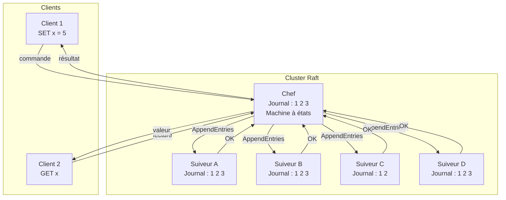
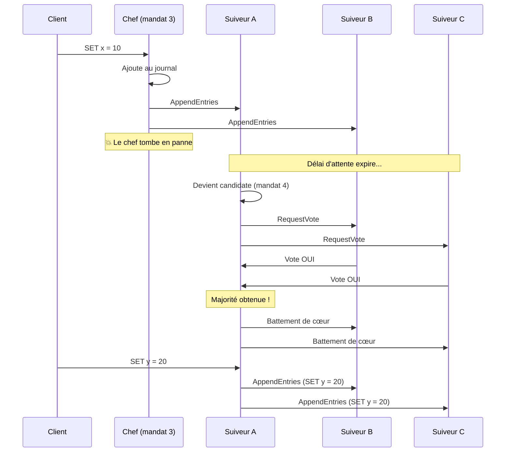
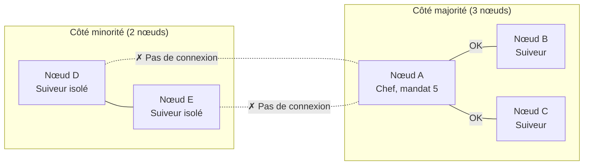
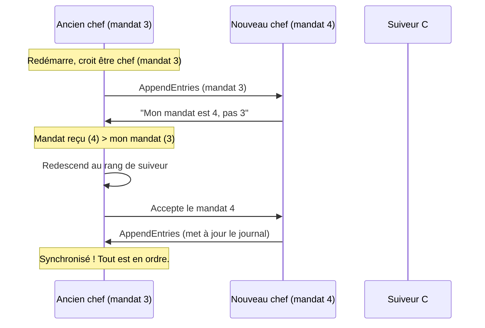
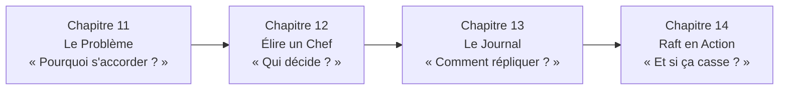

# Raft en Action

> **Chapitre 14** — Tu as construit le moteur. Maintenant, conduisons — et voyons ce qui se passe quand les choses cassent.

Tu connais maintenant les trois piliers de Raft : le **consensus** (chapitre 11), l'**élection du chef** (chapitre 12) et la **réplication du journal** (chapitre 13). Chaque pièce du puzzle est en place. Mais un système distribué ne vit pas dans un monde parfait. Les pannes arrivent, le réseau se coupe, et les nœuds reviennent avec des informations obsolètes.

Ce chapitre met tout ensemble. On va regarder le système complet en action, puis simuler trois scénarios de panne réels. Accroche-toi — c'est là que Raft montre sa force.

## Le Système Complet

Avant de casser quoi que ce soit, voici l'architecture complète de Raft. Tu as déjà vu chaque élément individuellement. Maintenant, regarde comment ils s'emboîtent :

Rappel rapide des rôles : le **chef** reçoit les commandes des clients, les ajoute à son **journal** (log), et les envoie aux **suiveurs** (followers) via AppendEntries. Quand la majorité a confirmé, l'entrée est **validée** (committed) et appliquée à la **machine à états** (state machine). Le client reçoit alors sa réponse.

> Raft fonctionne en deux phases : élire un chef (chapitre 12), puis répliquer les décisions via le journal (chapitre 13). Tout le reste — les pannes, les réseaux coupés, les retours en arrière — est géré automatiquement.

## Scénario 1 : Le Chef Tombe en Panne

Le cluster tourne normalement. Le chef envoie ses **battements de cœur** (heartbeats) réguliers. Soudain, le chef plante — plus de réponse, plus de battements de cœur. Que se passe-t-il ?

Voici le scénario étape par étape :

Pas de panique — tout est automatique :

1. Les suiveurs attendent les battements de cœur du chef. Quand leur **délai d'attente** (timeout) expire, ils savent que le chef est injoignable.
2. Le premier suiveur dont le délai expire devient **candidat** et lance une élection (chapitre 12).
3. S'il obtient la majorité, il devient le nouveau chef et commence à envoyer des battements de cœur.
4. Le nouveau chef utilise son journal — qui est à jour car il a tout répliqué — pour continuer. Les suiveurs en retard se mettent à jour via AppendEntries.

> La transition est invisible pour le client. Le client réessaie sa commande auprès du nouveau chef. Dans un système réel, cette transition prend quelques dizaines de millisecondes.

## Scénario 2 : Le Réseau Se Coupe

Cinq nœuds fonctionnent en harmonie. Puis le réseau se coupe : trois nœuds (A, B, C) restent connectés entre eux, et deux nœuds (D, E) sont isolés. C'est une **partition réseau** (network partition).

Que se passe-t-il de chaque côté ?

**Côté majorité (3 nœuds sur 5)** : le chef A continue d'envoyer des battements de cœur à B et C. Il a toujours la majorité (3 sur 5), donc il peut **valider** de nouvelles entrées. Le système continue de fonctionner normalement.

**Côté minorité (2 nœuds sur 5)** : les suiveurs D et E ne reçoivent plus de battements de cœur. Leurs délais d'attente expirent. L'un d'eux devient candidat et demande des votes. Mais avec seulement 2 nœuds, impossible d'obtenir la majorité (il faut 3 sur 5). Les élections échouent, encore et encore. Aucune entrée ne peut être validée de ce côté.

> C'est la sécurité de Raft : le côté minorité **ne peut rien valider**. S'il le pouvait, on aurait deux clusters indépendants avec des données différentes — un split-brain. La règle de majorité empêche ça.

Quand le réseau se répare, D et E reçoivent des AppendEntries du chef A (mandat 5). Ils constatent que le mandat d'A est plus élevé que le leur. Ils acceptent immédiatement de redevenir suiveurs et se synchronisent avec le journal d'A. Tout rentre dans l'ordre.

## Scénario 3 : L'Ancien Chef Revient

Le chef du mandat 3 plante. Une élection a lieu, et le nœud B devient le nouveau chef (mandat 4). Le système continue normalement. Puis, le nœud A — l'ancien chef — redémarre et revient dans le cluster.

L'ancien chef pense encore être le chef du mandat 3. Il essaie d'envoyer des commandes aux autres nœuds. Mais dès qu'il reçoit un message avec le mandat 4 (supérieur au sien), la règle est claire :

> Si tu reçois un message avec un mandat supérieur au tien, tu redescends immédiatement au rang de suiveur. Pas de débat, pas de négociation.

C'est la beauté des **mandats** (terms) : ils ne font qu'augmenter. Un ancien chef ne peut jamais « voler » le leadership. Dès qu'il contacte le cluster, il découvre le nouveau mandat et se soumet automatiquement. Son journal est ensuite corrigé par le nouveau chef via AppendEntries.

## Quand Avez-Vous Besoin du Consensus ?

Tu n'as pas besoin de consensus partout. Voici un guide pour décider :

| Situation | Consensus nécessaire ? | Pourquoi |
|-----------|----------------------|----------|
| Base de données distribuée | **Oui** | Tous les nœuds doivent être d'accord sur les données |
| Cache CDN | **Non** | La **cohérence éventuelle** (eventual consistency) suffit |
| Verrou distribué | **Oui** | Un seul nœud doit détenir le verrou à la fois |
| Élection de leader | **Oui** | Un seul leader à la fois, pas de split-brain |
| Système en lecture seule | **Non** | Pas de décision à prendre ensemble |
| File de messages | **Ça dépend** | Si l'ordre exact compte, oui. Sinon, non. |

> La règle est simple : si plusieurs nœuds doivent être **strictement d'accord** sur l'état → consensus. Si la cohérence éventuelle suffit → pas besoin. Le consensus a un coût (plus lent, plus complexe), donc ne l'utilise que quand c'est nécessaire.

## Paxos vs Raft (En Bref)

Tu as peut-être entendu parler de **Paxos**, l'ancêtre des algorithmes de consensus. Il a été publié en 1998 et est correct mathématiquement, mais il est tellement complexe que même des chercheurs expérimentés ont du mal à le comprendre — et encore plus à l'implémenter correctement.

**Raft** a été créé en 2014 avec un objectif différent : être compréhensible. Il offre les **mêmes garanties** que Paxos, mais sa structure est beaucoup plus claire.

| | Paxos | Raft |
|---|-------|------|
| **Année** | 1998 | 2014 |
| **Philosophie** | Correct mais opaque | Correct **et** compréhensible |
| **Leader** | Pas toujours clair | Toujours un chef unique |
| **Journal** | Non structuré | Structuré et ordonné |
| **Facilité d'implémentation** | Très difficile | Beaucoup plus simple |

> Si Paxos est la théorie, Raft en est la pratique. Les deux garantissent la même chose — mais Raft est celui que tu peux expliquer à un collègue autour d'un café.

## Dans le Vrai Monde

Raft n'est pas qu'une théorie. Voici des systèmes que tu utilises peut-être tous les jours :

- **etcd** — Le magasin clé-valeur derrière Kubernetes. Chaque cluster Kubernetes utilise etcd pour stocker sa configuration, et etcd utilise Raft pour rester cohérent.
- **Consul** (HashiCorp) — Un outil de découverte de services et de configuration. Utilise Raft pour garantir que tous les nœuds voient la même configuration.
- **CockroachDB** — Une base de données SQL distribuée. Utilise une variante de Raft pour répliquer les données à travers plusieurs datacenters.

## Résumé du Parcours

Bravo — tu viens de traverser les quatre chapitres sur le consensus. Voici le voyage complet :

Ce que tu as appris :

- **Chapitre 11** : Le consensus est le problème fondamental — faire s'accorder plusieurs machines malgré les pannes et les retards.
- **Chapitre 12** : Raft élit un chef avec des mandats, des votes et des délais aléatoires. Un seul chef par mandat.
- **Chapitre 13** : Le chef réplique son journal via AppendEntries. La majorité valide. Les conflits se résolvent automatiquement.
- **Chapitre 14** : Le système complet gère les pannes de chef, les partitions réseau et les retours d'anciens chefs. La règle de majorité empêche les split-brain.

> Raft n'est pas parfait — il a des limites (latence, coût de la majorité). Mais c'est l'un des algorithmes les plus élégants pour résoudre l'un des problèmes les plus difficiles de l'informatique distribuée. Et maintenant, tu le comprends.

## Exercices

1. **Partition réseau** : Un cluster de 5 nœuds se coupe en deux groupes (3 et 2). Le côté 3 peut-il valider une entrée ? Le côté 2 peut-il ? Que se passe-t-il quand le réseau se répare ?

2. **Ancien chef** : Le chef du mandat 7 plante. Un nouveau chef est élu (mandat 8). L'ancien chef redémarre et envoie un AppendEntries avec mandat 7 au nouveau chef. Que se passe-t-il ?

3. **Choisir le bon outil** : Tu dois construire un système où 3 serveurs gèrent un compteur partagé. Chaque incrémentation doit être exacte — pas de doublon, pas de perte. As-tu besoin de consensus ? Pourquoi ?

## Quiz

{{#quiz ../../quizzes/consensus-consensus-system.toml}}
