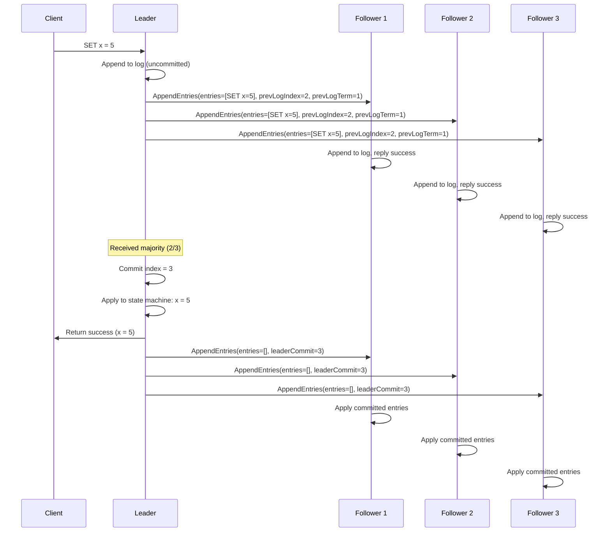
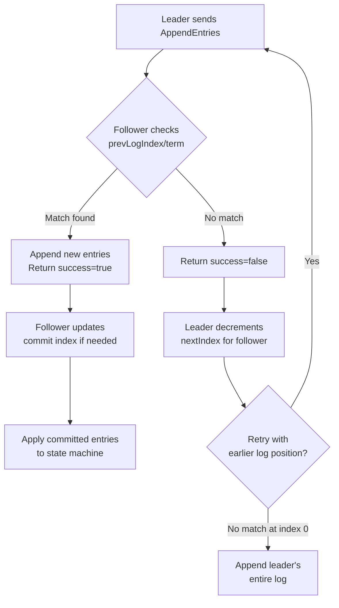
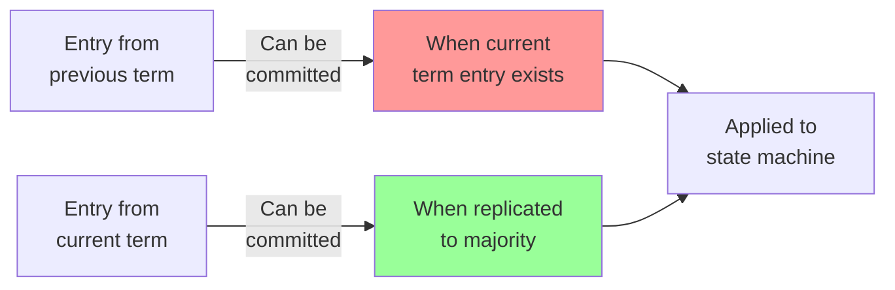

# Log Replication

> **Session 10, Part 1** - 30 minutes

## Learning Objectives

- [ ] Understand how Raft replicates logs across nodes
- [ ] Learn the log matching property that ensures consistency
- [ ] Implement the AppendEntries RPC
- [ ] Handle log consistency conflicts
- [ ] Understand commit index and state machine application

---

## Concept: Keeping Everyone in Sync

Once a leader is elected, it needs to replicate client commands to all followers. This is the **log replication** phase of Raft.

### The Challenge

```
Client sends "SET x = 5" to Leader

┌──────────┐         ┌──────────┐         ┌──────────┐
│  Leader  │         │ Follower │         │ Follower │
│          │         │    A     │         │    B     │
└────┬─────┘         └──────────┘         └──────────┘
     │
     │ How do we ensure ALL nodes
     │ have the SAME command log?
     │
     │ What if network fails?
     │ What if follower crashes?
     ▼

┌─────────────────────────────────────────┐
│         Log Replication Protocol        │
└─────────────────────────────────────────┘
```

---

## Log Structure

Each node maintains a log of commands. A log entry contains:

```typescript
interface LogEntry {
  index: number;      // Position in the log (starts at 1)
  term: number;       // Term when entry was received
  command: string;    // The actual command (e.g., "SET x = 5")
}
```

```python
@dataclass
class LogEntry:
    index: int       # Position in the log (starts at 1)
    term: int        # Term when entry was received
    command: str     # The actual command (e.g., "SET x = 5")
```

### Visual Log Representation

```
Node 1 (Leader)              Node 2 (Follower)           Node 3 (Follower)
┌─────────────────┐         ┌─────────────────┐         ┌─────────────────┐
│ Index │ Term │ Cmd│         │ Index │ Term │ Cmd│         │ Index │ Term │ Cmd│
├───────┼──────┼────┤         ├───────┼──────┼────┤         ├───────┼──────┼────┤
│   1   │  1   │SET │         │   1   │  1   │SET │         │   1   │  1   │SET │
│   2   │  2   │SET │         │   2   │  2   │SET │         │   2   │  2   │SET │
│   3   │  2   │SET │         │   3   │  2   │SET │         │       │      │    │
│   4   │  2   │SET │         │       │      │    │         │       │      │    │
└───────┴──────┴────┘         └───────┴──────┴────┘         └───────┴──────┴────┘
```

---

## The Log Matching Property

This is Raft's key safety guarantee. If two logs contain an entry with the **same index and term**, then all preceding entries are identical and in the same order.

```
         Log Matching Property
┌────────────────────────────────────────────────────────┐
│                                                        │
│   If logs[i].term == logs[j].term AND                  │
│   logs[i].index == logs[j].index                       │
│                                                        │
│   THEN:                                                │
│   logs[k] == logs[k] for all k < i                     │
│                                                        │
└────────────────────────────────────────────────────────┘

Example:

Node A: [1,1] [2,1] [3,2] [4,2] [5,2]
              │
Node B: [1,1] [2,1] [3,2] [4,2] [5,3] [6,3]
              │
              └─ Same index 3, term 2
                  Therefore entries 1-2 are IDENTICAL
```

This property allows Raft to efficiently detect and fix inconsistencies.

---

## AppendEntries RPC

The leader uses AppendEntries to replicate log entries and also as a heartbeat.

### RPC Specification

```typescript
interface AppendEntriesRequest {
  term: number;           // Leader's term
  leaderId: string;       // So follower can redirect clients
  prevLogIndex: number;   // Index of log entry immediately preceding new ones
  prevLogTerm: number;    // Term of prevLogIndex entry
  entries: LogEntry[];    // Log entries to store (empty for heartbeat)
  leaderCommit: number;   // Leader's commit index
}

interface AppendEntriesResponse {
  term: number;           // Current term, for leader to update itself
  success: boolean;       // True if follower contained entry matching prevLogIndex/term
}
```

```python
@dataclass
class AppendEntriesRequest:
    term: int              # Leader's term
    leader_id: str         # So follower can redirect clients
    prev_log_index: int    # Index of log entry immediately preceding new ones
    prev_log_term: int     # Term of prevLogIndex entry
    entries: List[LogEntry]  # Log entries to store (empty for heartbeat)
    leader_commit: int     # Leader's commit index

@dataclass
class AppendEntriesResponse:
    term: int              # Current term, for leader to update itself
    success: bool          # True if follower contained entry matching prevLogIndex/term
```

---

## Log Replication Flow



---

## Handling Consistency Conflicts

When a follower's log conflicts with the leader's, the leader resolves it:



### Conflict Example

```
Before Conflict Resolution:

Leader:  [1,1] [2,2] [3,2]
Follower:[1,1] [2,1] [3,1] [4,3]  ← Diverged at index 2!

Step 1: Leader sends AppendEntries(prevLogIndex=2, prevLogTerm=2)
        Follower: No match! (has term 1, not 2) → Return success=false

Step 2: Leader decrements nextIndex, sends AppendEntries(prevLogIndex=1, prevLogTerm=1)
        Follower: Match! → Return success=true

Step 3: Leader sends entries starting from index 2
        Follower overwrites [2,1] [3,1] [4,3] with [2,2] [3,2]

After Conflict Resolution:

Leader:  [1,1] [2,2] [3,2]
Follower:[1,1] [2,2] [3,2]  ← Now consistent!
```

---

## Commit Index

The commit index tracks which log entries are committed (durable and safe to apply).

```typescript
let commitIndex = 0;  // Index of highest committed entry

// Leader rule: An entry from current term is committed
// once it's stored on a majority of servers
function updateCommitIndex(): void {
  const N = this.log.length;

  // Find the largest N such that:
  // 1. A majority of nodes have log entries up to N
  // 2. log[N].term == currentTerm (safety rule!)
  for (let i = N; i > this.commitIndex; i--) {
    if (this.log[i - 1].term === this.currentTerm && this.isMajorityReplicated(i)) {
      this.commitIndex = i;
      break;
    }
  }
}
```

```python
commit_index: int = 0  # Index of highest committed entry

# Leader rule: An entry from current term is committed
# once it's stored on a majority of servers
def update_commit_index(self) -> None:
    N = len(self.log)

    # Find the largest N such that:
    # 1. A majority of nodes have log entries up to N
    # 2. log[N].term == currentTerm (safety rule!)
    for i in range(N, self.commit_index, -1):
        if self.log[i - 1].term == self.current_term and self.is_majority_replicated(i):
            self.commit_index = i
            break
```

### Safety Rule: Only Commit Current Term Entries



**Why?** Prevents a leader from committing uncommitted entries from previous terms that could be overwritten.

---

## TypeScript Implementation

Let's extend our Raft implementation with log replication:

```typescript
// types.ts
export interface LogEntry {
  index: number;
  term: number;
  command: string;
}

export interface AppendEntriesRequest {
  term: number;
  leaderId: string;
  prevLogIndex: number;
  prevLogTerm: number;
  entries: LogEntry[];
  leaderCommit: number;
}

export interface AppendEntriesResponse {
  term: number;
  success: boolean;
}
```

```typescript
// raft-node.ts
export class RaftNode {
  private log: LogEntry[] = [];
  private commitIndex = 0;
  private lastApplied = 0;

  // For each follower, track next log index to send
  private nextIndex: Map<string, number> = new Map();
  private matchIndex: Map<string, number> = new Map();

  // ... (previous code from leader election)

  /**
   * Handle AppendEntries RPC from leader
   */
  handleAppendEntries(req: AppendEntriesRequest): AppendEntriesResponse {
    // Reply false if term < currentTerm
    if (req.term < this.currentTerm) {
      return { term: this.currentTerm, success: false };
    }

    // Update current term if needed
    if (req.term > this.currentTerm) {
      this.currentTerm = req.term;
      this.state = NodeState.Follower;
      this.votedFor = null;
    }

    // Reset election timeout
    this.resetElectionTimeout();

    // Check log consistency
    if (req.prevLogIndex > 0) {
      if (this.log.length < req.prevLogIndex) {
        return { term: this.currentTerm, success: false };
      }

      const prevEntry = this.log[req.prevLogIndex - 1];
      if (prevEntry.term !== req.prevLogTerm) {
        return { term: this.currentTerm, success: false };
      }
    }

    // Append new entries
    if (req.entries.length > 0) {
      // Find first conflicting entry
      let insertIndex = req.prevLogIndex;
      for (const entry of req.entries) {
        if (insertIndex < this.log.length) {
          const existing = this.log[insertIndex];
          if (existing.index === entry.index && existing.term === entry.term) {
            // Already matches, skip
            insertIndex++;
            continue;
          }
          // Conflict! Delete from here and append
          this.log = this.log.slice(0, insertIndex);
        }
        this.log.push(entry);
        insertIndex++;
      }
    }

    // Update commit index
    if (req.leaderCommit > this.commitIndex) {
      this.commitIndex = Math.min(req.leaderCommit, this.log.length);
      this.applyCommittedEntries();
    }

    return { term: this.currentTerm, success: true };
  }

  /**
   * Apply committed entries to state machine
   */
  private applyCommittedEntries(): void {
    while (this.lastApplied < this.commitIndex) {
      this.lastApplied++;
      const entry = this.log[this.lastApplied - 1];
      this.stateMachine.apply(entry);
      console.log(`Node ${this.nodeId} applied: ${entry.command}`);
    }
  }

  /**
   * Leader: replicate log to followers
   */
  private replicateLog(): void {
    if (this.state !== NodeState.Leader) return;

    for (const followerId of this.clusterConfig.peerIds) {
      const nextIdx = this.nextIndex.get(followerId) || 1;

      const prevLogIndex = nextIdx - 1;
      const prevLogTerm = prevLogIndex > 0 ? this.log[prevLogIndex - 1].term : 0;
      const entries = this.log.slice(nextIdx - 1);

      const req: AppendEntriesRequest = {
        term: this.currentTerm,
        leaderId: this.nodeId,
        prevLogIndex,
        prevLogTerm,
        entries,
        leaderCommit: this.commitIndex,
      };

      this.sendAppendEntries(followerId, req);
    }
  }

  /**
   * Leader: handle AppendEntries response
   */
  private handleAppendEntriesResponse(
    followerId: string,
    resp: AppendEntriesResponse,
    req: AppendEntriesRequest
  ): void {
    if (this.state !== NodeState.Leader) return;

    if (resp.term > this.currentTerm) {
      // Follower has higher term, step down
      this.currentTerm = resp.term;
      this.state = NodeState.Follower;
      this.votedFor = null;
      return;
    }

    if (resp.success) {
      // Update match index and next index
      const lastIndex = req.prevLogIndex + req.entries.length;
      this.matchIndex.set(followerId, lastIndex);
      this.nextIndex.set(followerId, lastIndex + 1);

      // Try to commit more entries
      this.updateCommitIndex();
    } else {
      // Follower's log is inconsistent, backtrack
      const currentNext = this.nextIndex.get(followerId) || 1;
      this.nextIndex.set(followerId, Math.max(1, currentNext - 1));

      // Retry immediately
      setTimeout(() => this.replicateLog(), 50);
    }
  }

  /**
   * Leader: update commit index if majority has entry
   */
  private updateCommitIndex(): void {
    if (this.state !== NodeState.Leader) return;

    const N = this.log.length;

    // Find the largest N such that a majority have log entries up to N
    for (let i = N; i > this.commitIndex; i--) {
      if (this.log[i - 1].term !== this.currentTerm) {
        // Only commit entries from current term
        continue;
      }

      let count = 1; // Leader has it
      for (const matchIdx of this.matchIndex.values()) {
        if (matchIdx >= i) count++;
      }

      const majority = Math.floor(this.clusterConfig.peerIds.length / 2) + 1;
      if (count >= majority) {
        this.commitIndex = i;
        this.applyCommittedEntries();
        break;
      }
    }
  }

  /**
   * Client: submit command to cluster
   */
  async submitCommand(command: string): Promise<void> {
    if (this.state !== NodeState.Leader) {
      throw new Error('Not a leader. Redirect to actual leader.');
    }

    // Append to local log
    const entry: LogEntry = {
      index: this.log.length + 1,
      term: this.currentTerm,
      command,
    };
    this.log.push(entry);

    // Replicate to followers
    this.replicateLog();

    // Wait for commit
    await this.waitForCommit(entry.index);
  }

  private async waitForCommit(index: number): Promise<void> {
    return new Promise((resolve) => {
      const check = () => {
        if (this.commitIndex >= index) {
          resolve();
        } else {
          setTimeout(check, 50);
        }
      };
      check();
    });
  }
}
```

---

## Python Implementation

```python
# types.py
from dataclasses import dataclass
from typing import List, Optional

@dataclass
class LogEntry:
    index: int
    term: int
    command: str

@dataclass
class AppendEntriesRequest:
    term: int
    leader_id: str
    prev_log_index: int
    prev_log_term: int
    entries: List[LogEntry]
    leader_commit: int

@dataclass
class AppendEntriesResponse:
    term: int
    success: bool
```

```python
# raft_node.py
import asyncio
from enum import Enum
from typing import List, Dict, Optional

class NodeState(Enum):
    FOLLOWER = "follower"
    CANDIDATE = "candidate"
    LEADER = "leader"

class RaftNode:
    def __init__(self, node_id: str, peer_ids: List[str]):
        self.node_id = node_id
        self.peer_ids = peer_ids

        # Persistent state
        self.current_term = 0
        self.voted_for: Optional[str] = None
        self.log: List[LogEntry] = []

        # Volatile state
        self.commit_index = 0
        self.last_applied = 0
        self.state = NodeState.FOLLOWER

        # Leader state
        self.next_index: Dict[str, int] = {}
        self.match_index: Dict[str, int] = {}

        # State machine
        self.state_machine = StateMachine()

        # Election timeout
        self.election_timeout: Optional[asyncio.Task] = None

    async def handle_append_entries(self, req: AppendEntriesRequest) -> AppendEntriesResponse:
        """Handle AppendEntries RPC from leader"""

        # Reply false if term < currentTerm
        if req.term < self.current_term:
            return AppendEntriesResponse(term=self.current_term, success=False)

        # Update current term if needed
        if req.term > self.current_term:
            self.current_term = req.term
            self.state = NodeState.FOLLOWER
            self.voted_for = None

        # Reset election timeout
        self.reset_election_timeout()

        # Check log consistency
        if req.prev_log_index > 0:
            if len(self.log) < req.prev_log_index:
                return AppendEntriesResponse(term=self.current_term, success=False)

            prev_entry = self.log[req.prev_log_index - 1]
            if prev_entry.term != req.prev_log_term:
                return AppendEntriesResponse(term=self.current_term, success=False)

        # Append new entries
        if req.entries:
            # Find first conflicting entry
            insert_index = req.prev_log_index
            for entry in req.entries:
                if insert_index < len(self.log):
                    existing = self.log[insert_index]
                    if existing.index == entry.index and existing.term == entry.term:
                        # Already matches, skip
                        insert_index += 1
                        continue
                    # Conflict! Delete from here and append
                    self.log = self.log[:insert_index]
                self.log.append(entry)
                insert_index += 1

        # Update commit index
        if req.leader_commit > self.commit_index:
            self.commit_index = min(req.leader_commit, len(self.log))
            await self.apply_committed_entries()

        return AppendEntriesResponse(term=self.current_term, success=True)

    async def apply_committed_entries(self):
        """Apply committed entries to state machine"""
        while self.last_applied < self.commit_index:
            self.last_applied += 1
            entry = self.log[self.last_applied - 1]
            self.state_machine.apply(entry)
            print(f"Node {self.node_id} applied: {entry.command}")

    async def replicate_log(self):
        """Leader: replicate log to followers"""
        if self.state != NodeState.LEADER:
            return

        for follower_id in self.peer_ids:
            next_idx = self.next_index.get(follower_id, 1)

            prev_log_index = next_idx - 1
            prev_log_term = self.log[prev_log_index - 1].term if prev_log_index > 0 else 0
            entries = self.log[next_idx - 1:]

            req = AppendEntriesRequest(
                term=self.current_term,
                leader_id=self.node_id,
                prev_log_index=prev_log_index,
                prev_log_term=prev_log_term,
                entries=entries,
                leader_commit=self.commit_index
            )

            await self.send_append_entries(follower_id, req)

    async def handle_append_entries_response(
        self,
        follower_id: str,
        resp: AppendEntriesResponse,
        req: AppendEntriesRequest
    ):
        """Leader: handle AppendEntries response"""
        if self.state != NodeState.LEADER:
            return

        if resp.term > self.current_term:
            # Follower has higher term, step down
            self.current_term = resp.term
            self.state = NodeState.FOLLOWER
            self.voted_for = None
            return

        if resp.success:
            # Update match index and next index
            last_index = req.prev_log_index + len(req.entries)
            self.match_index[follower_id] = last_index
            self.next_index[follower_id] = last_index + 1

            # Try to commit more entries
            await self.update_commit_index()
        else:
            # Follower's log is inconsistent, backtrack
            current_next = self.next_index.get(follower_id, 1)
            self.next_index[follower_id] = max(1, current_next - 1)

            # Retry immediately
            asyncio.create_task(self.replicate_log())

    async def update_commit_index(self):
        """Leader: update commit index if majority has entry"""
        if self.state != NodeState.LEADER:
            return

        N = len(self.log)

        # Find the largest N such that a majority have log entries up to N
        for i in range(N, self.commit_index, -1):
            if self.log[i - 1].term != self.current_term:
                # Only commit entries from current term
                continue

            count = 1  # Leader has it
            for match_idx in self.match_index.values():
                if match_idx >= i:
                    count += 1

            majority = len(self.peer_ids) // 2 + 1
            if count >= majority:
                self.commit_index = i
                await self.apply_committed_entries()
                break

    async def submit_command(self, command: str) -> None:
        """Client: submit command to cluster"""
        if self.state != NodeState.LEADER:
            raise Exception("Not a leader. Redirect to actual leader.")

        # Append to local log
        entry = LogEntry(
            index=len(self.log) + 1,
            term=self.current_term,
            command=command
        )
        self.log.append(entry)

        # Replicate to followers
        await self.replicate_log()

        # Wait for commit
        await self._wait_for_commit(entry.index)

    async def _wait_for_commit(self, index: int):
        """Wait for an entry to be committed"""
        while self.commit_index < index:
            await asyncio.sleep(0.05)
```

```python
# state_machine.py
class StateMachine:
    """Simple key-value store state machine"""
    def __init__(self):
        self.data: Dict[str, str] = {}

    def apply(self, entry: LogEntry):
        """Apply a committed log entry to the state machine"""
        parts = entry.command.split()
        if parts[0] == "SET" and len(parts) == 3:
            key, value = parts[1], parts[2]
            self.data[key] = value
            print(f"Applied: {key} = {value}")
        elif parts[0] == "DELETE" and len(parts) == 2:
            key = parts[1]
            if key in self.data:
                del self.data[key]
                print(f"Deleted: {key}")
```

---

## Testing Log Replication

### TypeScript Test

```typescript
// test-log-replication.ts
async function testLogReplication() {
  const nodes = [
    new RaftNode('node1', ['node2', 'node3']),
    new RaftNode('node2', ['node1', 'node3']),
    new RaftNode('node3', ['node1', 'node2']),
  ];

  // Simulate leader election (node1 wins)
  await nodes[0].becomeLeader();

  // Submit command to leader
  await nodes[0].submitCommand('SET x = 5');

  // Verify all nodes have the entry
  for (const node of nodes) {
    const entry = node.getLog()[0];
    console.log(`${node.nodeId}: ${entry.command}`);
  }
}
```

### Python Test

```python
# test_log_replication.py
import asyncio

async def test_log_replication():
    nodes = [
        RaftNode('node1', ['node2', 'node3']),
        RaftNode('node2', ['node1', 'node3']),
        RaftNode('node3', ['node1', 'node2']),
    ]

    # Simulate leader election (node1 wins)
    await nodes[0].become_leader()

    # Submit command to leader
    await nodes[0].submit_command('SET x = 5')

    # Verify all nodes have the entry
    for node in nodes:
        entry = node.get_log()[0]
        print(f"{node.node_id}: {entry.command}")

asyncio.run(test_log_replication())
```

---

## Exercises

### Exercise 1: Basic Log Replication
1. Start a 3-node cluster
2. Elect a leader
3. Submit `SET x = 10` to the leader
4. Verify the entry is on all nodes
5. Check commit index advancement

**Expected Result:** The entry appears on all nodes after being committed.

### Exercise 2: Conflict Resolution
1. Start a 3-node cluster
2. Create a log divergence (manually edit follower logs)
3. Have the leader replicate new entries
4. Observe how the follower's log is corrected

**Expected Result:** The follower's conflicting entries are overwritten.

### Exercise 3: Commit Index Safety
1. Start a 5-node cluster
2. Partition the network (2 nodes isolated)
3. Submit commands to the leader
4. Verify entries are committed with majority (3 nodes)
5. Heal the partition
6. Verify isolated nodes catch up

**Expected Result:** Commands commit with 3 nodes, isolated nodes catch up after healing.

### Exercise 4: State Machine Application
1. Implement a key-value store state machine
2. Submit multiple SET commands
3. Verify the state machine applies them in order
4. Kill and restart a node
5. Verify the state machine is rebuilt from the log

**Expected Result:** State machine reflects all committed commands, even after restart.

---

## Common Pitfalls

| Pitfall | Symptom | Solution |
|---------|---------|----------|
| Committing previous term entries | Entries get lost | Only commit entries from current term |
| Not applying entries in order | Inconsistent state | Apply from lastApplied+1 to commitIndex |
| Infinite conflict resolution loop | CPU spike | Ensure nextIndex doesn't go below 1 |
| Applying uncommitted entries | Data loss on leader crash | Never apply before commitIndex |

---

## Key Takeaways

1. **Log replication** ensures all nodes execute the same commands in the same order
2. **AppendEntries RPC** handles both replication and heartbeats
3. **Log matching property** enables efficient conflict resolution
4. **Commit index** tracks which entries are safely replicated
5. **State machine** applies committed entries deterministically

---

**Next:** Complete Consensus System Implementation →

## 🧠 Chapter Quiz

Test your mastery of these concepts! These questions will challenge your understanding and reveal any gaps in your knowledge.

{{#quiz ../../quizzes/consensus-log-replication.toml}}
