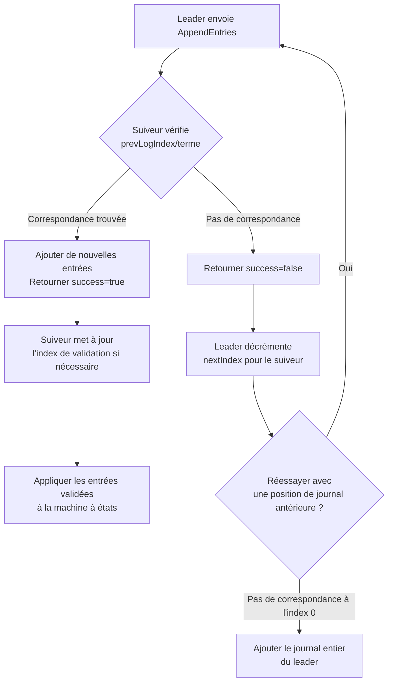
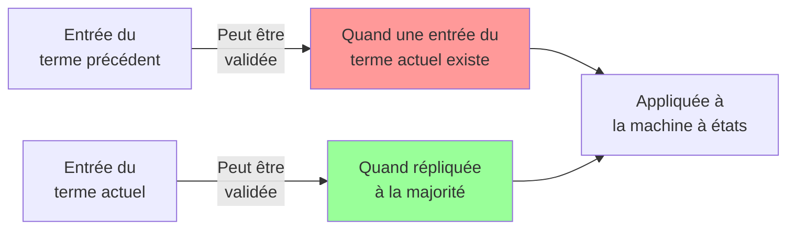

# Réplication de Journal

> **Session 10, Partie 1** - 30 minutes

## Objectifs d'Apprentissage

- [ ] Comprendre comment Raft réplique les journaux à travers les nœuds
- [ ] Apprendre la propriété de correspondance de journal qui assure la cohérence
- [ ] Implémenter le RPC AppendEntries
- [ ] Gérer les conflits de cohérence de journal
- [ ] Comprendre l'index de validation et l'application de la machine à états

---

## Concept : Garder Tout le Monde Synchronisé

Une fois qu'un leader est élu, il doit répliquer les commandes clientes à tous les suiveurs. C'est la phase de **réplication de journal** de Raft.

### Le Défi

```
Le Client envoie "SET x = 5" au Leader

┌──────────┐         ┌──────────┐         ┌──────────┐
│  Leader  │         │ Suiveur  │         │ Suiveur  │
│          │         │    A     │         │    B     │
└────┬─────┘         └──────────┘         └──────────┘
     │
     │ Comment nous assurer que TOUS les nœuds
     │ ont le MÊME journal de commandes ?
     │
     │ Que se passe-t-il si le réseau échoue ?
     │ Que se passe-t-il si le suiveur plante ?
     ▼

┌─────────────────────────────────────────┐
│     Protocole de Réplication de Journal │
└─────────────────────────────────────────┘
```

---

## Structure du Journal

Chaque nœud maintient un journal de commandes. Une entrée de journal contient :

```typescript
interface LogEntry {
  index: number;      // Position dans le journal (commence à 1)
  term: number;       // Terme quand l'entrée a été reçue
  command: string;    // La commande actuelle (ex: "SET x = 5")
}
```

```python
@dataclass
class LogEntry:
    index: int       # Position dans le journal (commence à 1)
    term: int        # Terme quand l'entrée a été reçue
    command: str     # La commande actuelle (ex: "SET x = 5")
```

### Représentation Visuelle du Journal

```
Nœud 1 (Leader)              Nœud 2 (Suiveur)           Nœud 3 (Suiveur)
┌─────────────────┐         ┌─────────────────┐         ┌─────────────────┐
│ Index │ Terme │ Cmd│         │ Index │ Terme │ Cmd│         │ Index │ Terme │ Cmd│
├───────┼──────┼────┤         ├───────┼──────┼────┤         ├───────┼──────┼────┤
│   1   │  1   │SET │         │   1   │  1   │SET │         │   1   │  1   │SET │
│   2   │  2   │SET │         │   2   │  2   │SET │         │   2   │  2   │SET │
│   3   │  2   │SET │         │   3   │  2   │SET │         │       │      │    │
│   4   │  2   │SET │         │       │      │    │         │       │      │    │
└───────┴──────┴────┘         └───────┴──────┴────┘         └───────┴──────┴────┘
```

---

## La Propriété de Correspondance de Journal

C'est la garantie de sécurité clé de Raft. Si deux journaux contiennent une entrée avec le **même index et terme**, alors toutes les entrées précédentes sont identiques et dans le même ordre.

```
         Propriété de Correspondance de Journal
┌────────────────────────────────────────────────────────┐
│                                                        │
│   Si journaux[i].terme == journaux[j].terme ET        │
│   journaux[i].index == journaux[j].index              │
│                                                        │
│   ALORS :                                               │
│   journaux[k] == journaux[k] pour tout k < i          │
│                                                        │
└────────────────────────────────────────────────────────┘

Exemple :

Nœud A : [1,1] [2,1] [3,2] [4,2] [5,2]
              │
Nœud B : [1,1] [2,1] [3,2] [4,2] [5,3] [6,3]
              │
              └─ Même index 3, terme 2
                  Par conséquent les entrées 1-2 sont IDENTIQUES
```

Cette propriété permet à Raft de détecter et corriger efficacement les incohérences.

---

## RPC AppendEntries

Le leader utilise AppendEntries pour répliquer les entrées de journal et aussi comme un battement de cœur.

### Spécification RPC

```typescript
interface AppendEntriesRequest {
  term: number;           // Terme du leader
  leaderId: string;       // Pour que le suiveur puisse rediriger les clients
  prevLogIndex: number;   // Index de l'entrée de journal précédant immédiatement les nouvelles
  prevLogTerm: number;    // Terme de l'entrée prevLogIndex
  entries: LogEntry[];    // Entrées de journal à stocker (vide pour battement de cœur)
  leaderCommit: number;   // Index de validation du leader
}

interface AppendEntriesResponse {
  term: number;           // Terme actuel, pour que le leader se mette à jour
  success: boolean;       // Vrai si le suiveur avait l'entrée correspondant à prevLogIndex/terme
}
```

```python
@dataclass
class AppendEntriesRequest:
    term: int              # Terme du leader
    leader_id: str         # Pour que le suiveur puisse rediriger les clients
    prev_log_index: int    # Index de l'entrée de journal précédant immédiatement les nouvelles
    prev_log_term: int     # Terme de l'entrée prevLogIndex
    entries: List[LogEntry]  # Entrées de journal à stocker (vide pour battement de cœur)
    leader_commit: int     # Index de validation du leader

@dataclass
class AppendEntriesResponse:
    term: int              # Terme actuel, pour que le leader se mette à jour
    success: bool          # Vrai si le suiveur avait l'entrée correspondant à prevLogIndex/terme
```

---

## Flux de Réplication de Journal


---

## Gestion des Conflits de Cohérence

Lorsque le journal d'un suiveur entre en conflit avec celui du leader, le leader le résout :



### Exemple de Conflit

```
Avant Résolution de Conflit :

Leader :  [1,1] [2,2] [3,2]
Suiveur :[1,1] [2,1] [3,1] [4,3]  ← Divergence à l'index 2 !

Étape 1 : Le leader envoie AppendEntries(prevLogIndex=2, prevLogTerm=2)
        Suiveur : Pas de correspondance ! (a le terme 1, pas 2) → Retourner success=false

Étape 2 : Le leader décrémente nextIndex, envoie AppendEntries(prevLogIndex=1, prevLogTerm=1)
        Suiveur : Correspondance ! → Retourner success=true

Étape 3 : Le leader envoie les entrées à partir de l'index 2
        Le suiveur écrase [2,1] [3,1] [4,3] avec [2,2] [3,2]

Après Résolution de Conflit :

Leader :  [1,1] [2,2] [3,2]
Suiveur :[1,1] [2,2] [3,2]  ← Maintenant cohérent !
```

---

## Index de Validation

L'index de validation suit quelles entrées de journal sont validées (durables et sûres à appliquer).

```typescript
let commitIndex = 0;  // Index de l'entrée validée la plus élevée

// Règle du leader : Une entrée du terme actuel est validée
// une fois stockée sur une majorité de serveurs
function updateCommitIndex(): void {
  const N = this.log.length;

  // Trouver le plus grand N tel que :
  // 1. Une majorité de nœuds ont des entrées de journal jusqu'à N
  // 2. log[N].term == currentTerm (règle de sécurité !)
  for (let i = N; i > this.commitIndex; i--) {
    if (this.log[i - 1].term === this.currentTerm && this.isMajorityReplicated(i)) {
      this.commitIndex = i;
      break;
    }
  }
}
```

```python
commit_index: int = 0  # Index de l'entrée validée la plus élevée

# Règle du leader : Une entrée du terme actuel est validée
# une fois stockée sur une majorité de serveurs
def update_commit_index(self) -> None:
    N = len(self.log)

    # Trouver le plus grand N tel que :
    # 1. Une majorité de nœuds ont des entrées de journal jusqu'à N
    # 2. log[N].term == currentTerm (règle de sécurité !)
    for i in range(N, self.commit_index, -1):
        if self.log[i - 1].term == self.current_term and self.is_majority_replicated(i):
            self.commit_index = i
            break
```

### Règle de Sécurité : Valider Seulement les Entrées du Terme Actuel



**Pourquoi ?** Empêche un leader de valider des entrées non validées de termes précédents qui pourraient être écrasées.

---

## Implémentation TypeScript

Étendons notre implémentation Raft avec la réplication de journal :

```typescript
// types.ts
export interface LogEntry {
  index: number;
  term: number;
  command: string;
}

export interface AppendEntriesRequest {
  term: number;
  leaderId: string;
  prevLogIndex: number;
  prevLogTerm: number;
  entries: LogEntry[];
  leaderCommit: number;
}

export interface AppendEntriesResponse {
  term: number;
  success: boolean;
}
```

```typescript
// raft-node.ts
export class RaftNode {
  private log: LogEntry[] = [];
  private commitIndex = 0;
  private lastApplied = 0;

  // Pour chaque suiveur, suivre le prochain index de journal à envoyer
  private nextIndex: Map<string, number> = new Map();
  private matchIndex: Map<string, number> = new Map();

  // ... (code précédent de l'élection de leader)

  /**
   * Gérer le RPC AppendEntries du leader
   */
  handleAppendEntries(req: AppendEntriesRequest): AppendEntriesResponse {
    // Répondre faux si term < currentTerm
    if (req.term < this.currentTerm) {
      return { term: this.currentTerm, success: false };
    }

    // Mettre à jour le terme actuel si nécessaire
    if (req.term > this.currentTerm) {
      this.currentTerm = req.term;
      this.state = NodeState.Follower;
      this.votedFor = null;
    }

    // Réinitialiser le délai d'élection
    this.resetElectionTimeout();

    // Vérifier la cohérence du journal
    if (req.prevLogIndex > 0) {
      if (this.log.length < req.prevLogIndex) {
        return { term: this.currentTerm, success: false };
      }

      const prevEntry = this.log[req.prevLogIndex - 1];
      if (prevEntry.term !== req.prevLogTerm) {
        return { term: this.currentTerm, success: false };
      }
    }

    // Ajouter de nouvelles entrées
    if (req.entries.length > 0) {
      // Trouver la première entrée en conflit
      let insertIndex = req.prevLogIndex;
      for (const entry of req.entries) {
        if (insertIndex < this.log.length) {
          const existing = this.log[insertIndex];
          if (existing.index === entry.index && existing.term === entry.term) {
            // Correspond déjà, sauter
            insertIndex++;
            continue;
          }
          // Conflit ! Supprimer à partir d'ici et ajouter
          this.log = this.log.slice(0, insertIndex);
        }
        this.log.push(entry);
        insertIndex++;
      }
    }

    // Mettre à jour l'index de validation
    if (req.leaderCommit > this.commitIndex) {
      this.commitIndex = Math.min(req.leaderCommit, this.log.length);
      this.applyCommittedEntries();
    }

    return { term: this.currentTerm, success: true };
  }

  /**
   * Appliquer les entrées validées à la machine à états
   */
  private applyCommittedEntries(): void {
    while (this.lastApplied < this.commitIndex) {
      this.lastApplied++;
      const entry = this.log[this.lastApplied - 1];
      this.stateMachine.apply(entry);
      console.log(`Nœud ${this.nodeId} appliqué : ${entry.command}`);
    }
  }

  /**
   * Leader : répliquer le journal aux suiveurs
   */
  private replicateLog(): void {
    if (this.state !== NodeState.Leader) return;

    for (const followerId of this.clusterConfig.peerIds) {
      const nextIdx = this.nextIndex.get(followerId) || 1;

      const prevLogIndex = nextIdx - 1;
      const prevLogTerm = nextIdx > 1 ? this.log[nextIdx - 2].term : 0;
      const entries = this.log.slice(nextIdx - 1);

      const req: AppendEntriesRequest = {
        term: this.currentTerm,
        leaderId: this.nodeId,
        prevLogIndex,
        prevLogTerm,
        entries,
        leaderCommit: this.commitIndex,
      };

      this.sendAppendEntries(followerId, req);
    }
  }

  /**
   * Leader : gérer la réponse AppendEntries
   */
  private handleAppendEntriesResponse(
    followerId: string,
    resp: AppendEntriesResponse,
    req: AppendEntriesRequest
  ): void {
    if (this.state !== NodeState.Leader) return;

    if (resp.term > this.currentTerm) {
      // Le suiveur a un terme supérieur, descendre
      this.currentTerm = resp.term;
      this.state = NodeState.Follower;
      this.votedFor = null;
      return;
    }

    if (resp.success) {
      // Mettre à jour l'index de correspondance et le prochain index
      const lastIndex = req.prevLogIndex + req.entries.length;
      this.matchIndex.set(followerId, lastIndex);
      this.nextIndex.set(followerId, lastIndex + 1);

      // Essayer de valider plus d'entrées
      this.updateCommitIndex();
    } else {
      // Le journal du suiveur est incohérent, revenir en arrière
      const currentNext = this.nextIndex.get(followerId) || 1;
      this.nextIndex.set(followerId, Math.max(1, currentNext - 1));

      // Réessayer immédiatement
      setTimeout(() => this.replicateLog(), 50);
    }
  }

  /**
   * Leader : mettre à jour l'index de validation si la majorité a l'entrée
   */
  private updateCommitIndex(): void {
    if (this.state !== NodeState.Leader) return;

    const N = this.log.length;

    // Trouver le plus grand N tel qu'une majorité ait des entrées de journal jusqu'à N
    for (let i = N; i > this.commitIndex; i--) {
      if (this.log[i - 1].term !== this.currentTerm) {
        continue;
      }

      let count = 1; // Le leader l'a
      for (const matchIdx of this.matchIndex.values()) {
        if (matchIdx >= i) count++;
      }

      const majority = Math.floor(this.clusterConfig.peerIds.length / 2) + 1;
      if (count >= majority) {
        this.commitIndex = i;
        this.applyCommittedEntries();
        break;
      }
    }
  }

  /**
   * Client : soumettre une commande au cluster
   */
  async submitCommand(command: string): Promise<void> {
    if (this.state !== NodeState.Leader) {
      throw new Error('Pas un leader. Rediriger vers le leader actuel.');
    }

    // Ajouter au journal local
    const entry: LogEntry = {
      index: this.log.length + 1,
      term: this.currentTerm,
      command,
    };
    this.log.push(entry);

    // Répliquer aux suiveurs
    this.replicateLog();

    // Attendre la validation
    await this.waitForCommit(entry.index);
  }

  private async waitForCommit(index: number): Promise<void> {
    return new Promise((resolve) => {
      const check = () => {
        if (this.commitIndex >= index) {
          resolve();
        } else {
          setTimeout(check, 50);
        }
      };
      check();
    });
  }
}
```

---

## Implémentation Python

```python
# types.py
from dataclasses import dataclass
from typing import List, Optional

@dataclass
class LogEntry:
    index: int
    term: int
    command: str

@dataclass
class AppendEntriesRequest:
    term: int
    leader_id: str
    prev_log_index: int
    prev_log_term: int
    entries: List[LogEntry]
    leader_commit: int

@dataclass
class AppendEntriesResponse:
    term: int
    success: bool
```

```python
# raft_node.py
import asyncio
from enum import Enum
from typing import List, Dict

class RaftNode:
    def __init__(self, node_id: str, peer_ids: List[str]):
        self.node_id = node_id
        self.peer_ids = peer_ids

        # État persistant
        self.current_term = 0
        self.voted_for: Optional[str] = None
        self.log: List[LogEntry] = []

        # État volatil
        self.commit_index = 0
        self.last_applied = 0
        self.state = NodeState.FOLLOWER

        # État du leader
        self.next_index: Dict[str, int] = {}
        self.match_index: Dict[str, int] = {}

        # Machine à états
        self.state_machine = StateMachine()

        # Délai d'élection
        self.election_timeout: Optional[asyncio.Task] = None

    async def handle_append_entries(self, req: AppendEntriesRequest) -> AppendEntriesResponse:
        """Gérer le RPC AppendEntries du leader"""

        # Répondre faux si term < currentTerm
        if req.term < self.current_term:
            return AppendEntriesResponse(term=self.current_term, success=False)

        # Mettre à jour le terme actuel si nécessaire
        if req.term > self.current_term:
            self.current_term = req.term
            self.state = NodeState.FOLLOWER
            self.voted_for = None

        # Réinitialiser le délai d'élection
        self.reset_election_timeout()

        # Vérifier la cohérence du journal
        if req.prev_log_index > 0:
            if len(self.log) < req.prev_log_index:
                return AppendEntriesResponse(term=self.current_term, success=False)

            prev_entry = self.log[req.prev_log_index - 1]
            if prev_entry.term != req.prev_log_term:
                return AppendEntriesResponse(term=self.current_term, success=False)

        # Ajouter de nouvelles entrées
        if req.entries:
            # Trouver la première entrée en conflit
            insert_index = req.prev_log_index
            for entry in req.entries:
                if insert_index < len(self.log):
                    existing = self.log[insert_index]
                    if existing.index == entry.index and existing.term == entry.term:
                        # Correspond déjà, sauter
                        insert_index += 1
                        continue
                    # Conflit ! Supprimer à partir d'ici et ajouter
                    self.log = self.log[:insert_index]
                self.log.append(entry)
                insert_index += 1

        # Mettre à jour l'index de validation
        if req.leader_commit > self.commit_index:
            self.commit_index = min(req.leader_commit, len(self.log))
            await self.apply_committed_entries()

        return AppendEntriesResponse(term=self.current_term, success=True)

    async def apply_committed_entries(self):
        """Appliquer les entrées validées à la machine à états"""
        while self.last_applied < self.commit_index:
            self.last_applied += 1
            entry = self.log[self.last_applied - 1]
            self.state_machine.apply(entry)
            print(f"Nœud {self.node_id} appliqué : {entry.command}")

    async def replicate_log(self):
        """Leader : répliquer le journal aux suiveurs"""
        if self.state != NodeState.LEADER:
            return

        for follower_id in self.peer_ids:
            next_idx = self.next_index.get(follower_id, 1)

            prev_log_index = next_idx - 1
            prev_log_term = self.log[prev_log_index - 1].term if prev_log_index > 0 else 0
            entries = self.log[next_idx - 1:]

            req = AppendEntriesRequest(
                term=self.current_term,
                leader_id=self.node_id,
                prev_log_index=prev_log_index,
                prev_log_term=prev_log_term,
                entries=entries,
                leader_commit=self.commit_index
            )

            await self.send_append_entries(follower_id, req)

    async def handle_append_entries_response(
        self,
        follower_id: str,
        resp: AppendEntriesResponse,
        req: AppendEntriesRequest
    ):
        """Leader : gérer la réponse AppendEntries"""
        if self.state != NodeState.LEADER:
            return

        if resp.term > self.current_term:
            # Le suiveur a un terme supérieur, descendre
            self.current_term = resp.term
            self.state = NodeState.FOLLOWER
            self.voted_for = None
            return

        if resp.success:
            # Mettre à jour l'index de correspondance et le prochain index
            last_index = req.prev_log_index + len(req.entries)
            self.match_index[follower_id] = last_index
            self.next_index[follower_id] = last_index + 1

            # Essayer de valider plus d'entrées
            await self.update_commit_index()
        else:
            # Le journal du suiveur est incohérent, revenir en arrière
            current_next = self.next_index.get(follower_id, 1)
            self.next_index[follower_id] = max(1, current_next - 1)

            # Réessayer immédiatement
            asyncio.create_task(self.replicate_log())

    async def update_commit_index(self):
        """Leader : mettre à jour l'index de validation si la majorité a l'entrée"""
        if self.state != NodeState.LEADER:
            return

        N = len(self.log)

        # Trouver le plus grand N tel qu'une majorité ait des entrées de journal jusqu'à N
        for i in range(N, self.commit_index, -1):
            if self.log[i - 1].term != self.current_term:
                # Ne valider que les entrées du terme actuel
                continue

            count = 1  # Le leader l'a
            for match_idx in self.match_index.values():
                if match_idx >= i:
                    count += 1

            majority = len(self.peer_ids) // 2 + 1
            if count >= majority:
                self.commit_index = i
                await self.apply_committed_entries()
                break

    async def submit_command(self, command: str) -> None:
        """Client : soumettre une commande au cluster"""
        if self.state != NodeState.LEADER:
            raise Exception("Pas un leader. Rediriger vers le leader actuel.")

        # Ajouter au journal local
        entry = LogEntry(
            index=len(self.log) + 1,
            term=self.current_term,
            command=command
        )
        self.log.append(entry)

        # Répliquer aux suiveurs
        await self.replicate_log()

        # Attendre la validation
        await self._wait_for_commit(entry.index)

    async def _wait_for_commit(self, index: int):
        """Attendre qu'une entrée soit validée"""
        while self.commit_index < index:
            await asyncio.sleep(0.05)
```

```python
# state_machine.py
class StateMachine:
    """Machine à états de magasin clé-valeur simple"""
    def __init__(self):
        self.data: Dict[str, str] = {}

    def apply(self, entry: LogEntry):
        """Appliquer une entrée de journal validée à la machine à états"""
        parts = entry.command.split()
        if parts[0] == "SET" and len(parts) == 3:
            key, value = parts[1], parts[2]
            self.data[key] = value
            print(f"Appliqué : {key} = {value}")
        elif parts[0] == "DELETE" and len(parts) == 2:
            key = parts[1]
            if key in self.data:
                del self.data[key]
                print(f"Supprimé : {key}")
```

---

## Tests de Réplication de Journal

### Test TypeScript

```typescript
// test-log-replication.ts
async function testLogReplication() {
  const nodes = [
    new RaftNode('node1', ['node2', 'node3']),
    new RaftNode('node2', ['node1', 'node3']),
    new RaftNode('node3', ['node1', 'node2']),
  ];

  // Simuler l'élection de leader (node1 gagne)
  await nodes[0].becomeLeader();

  // Soumettre une commande au leader
  await nodes[0].submitCommand('SET x = 5');

  // Vérifier que tous les nœuds ont l'entrée
  for (const node of nodes) {
    const entry = node.getLog()[0];
    console.log(`${node.nodeId}: ${entry.command}`);
  }
}
```

### Test Python

```python
# test_log_replication.py
import asyncio

async def test_log_replication():
    nodes = [
        RaftNode('node1', ['node2', 'node3']),
        RaftNode('node2', ['node1', 'node3']),
        RaftNode('node3', ['node1', 'node2']),
    ]

    # Simuler l'élection de leader (node1 gagne)
    await nodes[0].become_leader()

    # Soumettre une commande au leader
    await nodes[0].submit_command('SET x = 5')

    # Vérifier que tous les nœuds ont l'entrée
    for node in nodes:
        entry = node.get_log()[0]
        print(f"{node.node_id}: {entry.command}")

asyncio.run(test_log_replication())
```

---

## Exercices

### Exercice 1 : Réplication de Journal de Base

1. Démarrer un cluster à 3 nœuds
2. Élire un leader
3. Soumettre `SET x = 10` au leader
4. Vérifier que l'entrée est sur tous les nœuds
5. Vérifier l'avancement de l'index de validation

**Résultat Attendu :** L'entrée apparaît sur tous les nœuds après validation.

### Exercice 2 : Résolution de Conflit

1. Démarrer un cluster à 3 nœuds
2. Créer une divergence de journal (modifier manuellement les journaux des suiveurs)
3. Faire répliquer de nouvelles entrées au leader
4. Observer comment le journal du suiveur est corrigé

**Résultat Attendu :** Les entrées conflictuelles du suiveur sont écrasées.

### Exercice 3 : Sécurité de l'Index de Validation

1. Démarrer un cluster à 5 nœuds
2. Partitionner le réseau (2 nœuds isolés)
3. Soumettre des commandes au leader
4. Vérifier que les entrées sont validées avec la majorité (3 nœuds)
5. Guérir la partition
6. Vérifier que les nœuds isolés rattrapent

**Résultat Attendu :** Les commandes sont validées avec 3 nœuds, les nœuds isolés rattrapent après guérison.

### Exercice 4 : Application de la Machine à États

1. Implémenter une machine à états de magasin clé-valeur
2. Soumettre plusieurs commandes SET
3. Vérifier que la machine à états les applique dans l'ordre
4. Tuer et redémarrer un nœud
5. Vérifier que la machine à états est reconstruite à partir du journal

**Résultat Attendu :** La machine à états reflète toutes les commandes validées, même après redémarrage.

---

## Pièges Courants

| Piège | Symptôme | Solution |
|---------|---------|----------|
| Valider les entrées du terme précédent | Les entrées sont perdues | Ne valider que les entrées du terme actuel |
| Ne pas appliquer les entrées dans l'ordre | État incohérent | Appliquer de lastApplied+1 à commitIndex |
| Boucle de résolution de conflit infinie | Pic de CPU | S'assurer que nextIndex ne descend pas en dessous de 1 |
| Appliquer des entrées non validées | Perte de données lors de la panne du leader | Ne jamais appliquer avant commitIndex |

---

## Points Clés à Retenir

1. La **réplication de journal** assure que tous les nœuds exécutent les mêmes commandes dans le même ordre
2. Le **RPC AppendEntries** gère à la fois la réplication et les battements de cœur
3. La **propriété de correspondance de journal** permet une résolution de conflit efficace
4. **L'index de validation** suit quelles entrées sont répliquées en toute sécurité
5. La **machine à états** applique les entrées validées de manière déterministe

---

**Suite :** Implémentation Complète du Système de Consensus →

## 🧠 Quiz du Chapitre

Testez votre maîtrise de ces concepts ! Ces questions défieront votre compréhension et révéleront les lacunes dans vos connaissances.

{{#quiz ../../quizzes/consensus-log-replication.toml}}
