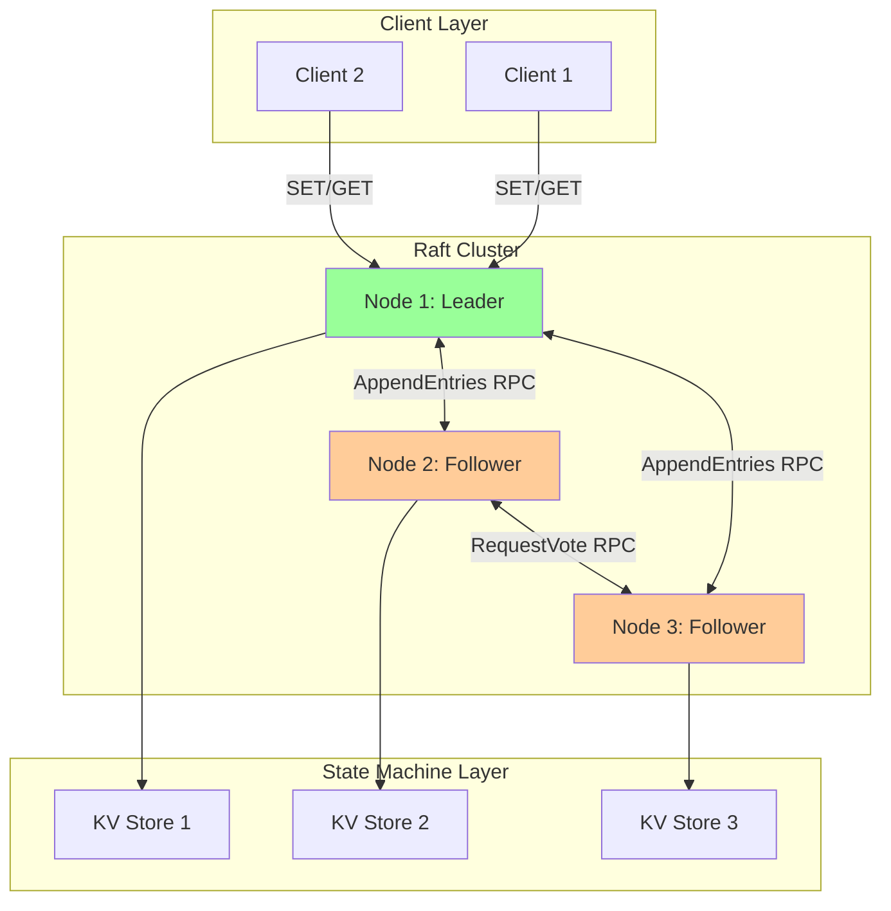

# Consensus System Implementation

> **Session 10, Part 2** - 60 minutes

## Learning Objectives

- [ ] Build a complete Raft-based consensus system
- [ ] Implement a state machine abstraction (key-value store)
- [ ] Create client APIs for get/set operations
- [ ] Deploy and test the full system with Docker Compose
- [ ] Verify safety and liveness properties

---

## Overview: Putting It All Together

In the previous chapters, we implemented Raft's two core components:

1. **Leader Election** (Session 9) - Democratic voting to select a leader
2. **Log Replication** (Session 10, Part 1) - Replicating commands across nodes

Now we combine them into a **complete consensus system** - a distributed key-value store that provides strong consistency guarantees.

```
┌────────────────────────────────────────────────────────────┐
│                  Raft Consensus System                     │
├────────────────────────────────────────────────────────────┤
│                                                             │
│  Client  ──→  Leader  ──→  Log Replication  ──→  Followers │
│     │            │              │                    │      │
│     │            ▼              ▼                    ▼      │
│     │         Leader Election (if needed)                   │
│     │            │                                          │
│     ▼            ▼                                          ▼
│  State Machine (all nodes apply same commands)             │
│                                                             │
└────────────────────────────────────────────────────────────┘
```

---

## System Architecture



---

## Complete TypeScript Implementation

### Project Structure

```
typescript-raft/
├── package.json
├── tsconfig.json
├── src/
│   ├── types.ts              # Shared types
│   ├── state-machine.ts      # KV store state machine
│   ├── raft-node.ts          # Complete Raft implementation
│   ├── server.ts             # HTTP API server
│   └── index.ts              # Entry point
└── docker-compose.yml
```

### package.json

```json
{
  "name": "typescript-raft-kv-store",
  "version": "1.0.0",
  "description": "Distributed key-value store using Raft consensus",
  "main": "dist/index.js",
  "scripts": {
    "build": "tsc",
    "start": "node dist/index.js",
    "dev": "ts-node src/index.ts"
  },
  "dependencies": {
    "express": "^4.18.2",
    "axios": "^1.6.0"
  },
  "devDependencies": {
    "@types/express": "^4.17.21",
    "@types/node": "^20.10.0",
    "ts-node": "^10.9.2",
    "typescript": "^5.3.3"
  }
}
```

### types.ts

```typescript
// Node states
export enum NodeState {
  FOLLOWER = 'follower',
  CANDIDATE = 'candidate',
  LEADER = 'leader'
}

// Log entry
export interface LogEntry {
  index: number;
  term: number;
  command: string;
}

// RequestVote RPC
export interface RequestVoteRequest {
  term: number;
  candidateId: string;
  lastLogIndex: number;
  lastLogTerm: number;
}

export interface RequestVoteResponse {
  term: number;
  voteGranted: boolean;
}

// AppendEntries RPC
export interface AppendEntriesRequest {
  term: number;
  leaderId: string;
  prevLogIndex: number;
  prevLogTerm: number;
  entries: LogEntry[];
  leaderCommit: number;
}

export interface AppendEntriesResponse {
  term: number;
  success: boolean;
}

// Client commands
export interface SetCommand {
  type: 'SET';
  key: string;
  value: string;
}

export interface GetCommand {
  type: 'GET';
  key: string;
}

export interface DeleteCommand {
  type: 'DELETE';
  key: string;
}

export type Command = SetCommand | GetCommand | DeleteCommand;
```

### state-machine.ts

```typescript
import { LogEntry } from './types';

/**
 * Key-Value Store State Machine
 * Applies committed log entries to build consistent state
 */
export class KVStoreStateMachine {
  private data: Map<string, string> = new Map();

  /**
   * Apply a committed log entry to the state machine
   */
  apply(entry: LogEntry): void {
    try {
      const command = JSON.parse(entry.command);

      switch (command.type) {
        case 'SET':
          this.data.set(command.key, command.value);
          console.log(`[State Machine] SET ${command.key} = ${command.value}`);
          break;

        case 'DELETE':
          if (this.data.has(command.key)) {
            this.data.delete(command.key);
            console.log(`[State Machine] DELETE ${command.key}`);
          }
          break;

        case 'GET':
          // Read-only commands don't modify state
          break;

        default:
          console.warn(`[State Machine] Unknown command type: ${command.type}`);
      }
    } catch (error) {
      console.error(`[State Machine] Failed to apply entry:`, error);
    }
  }

  /**
   * Get a value from the state machine
   */
  get(key: string): string | undefined {
    return this.data.get(key);
  }

  /**
   * Get all key-value pairs
   */
  getAll(): Record<string, string> {
    return Object.fromEntries(this.data);
  }

  /**
   * Clear the state machine (for testing)
   */
  clear(): void {
    this.data.clear();
  }
}
```

### raft-node.ts

```typescript
import {
  NodeState,
  LogEntry,
  RequestVoteRequest,
  RequestVoteResponse,
  AppendEntriesRequest,
  AppendEntriesResponse,
  Command
} from './types';
import { KVStoreStateMachine } from './state-machine';
import axios from 'axios';

interface ClusterConfig {
  nodeId: string;
  peerIds: string[];
  electionTimeoutMin: number;
  electionTimeoutMax: number;
  heartbeatInterval: number;
}

export class RaftNode {
  // Configuration
  private config: ClusterConfig;

  // Persistent state (survives restarts)
  private currentTerm: number = 0;
  private votedFor: string | null = null;
  private log: LogEntry[] = [];

  // Volatile state (reset on restart)
  private commitIndex: number = 0;
  private lastApplied: number = 0;
  private state: NodeState = NodeState.FOLLOWER;

  // Leader state (reset on election)
  private nextIndex: Map<string, number> = new Map();
  private matchIndex: Map<string, number> = new Map();

  // Components
  private stateMachine: KVStoreStateMachine;
  private leaderId: string | null = null;

  // Timers
  private electionTimer: NodeJS.Timeout | null = null;
  private heartbeatTimer: NodeJS.Timeout | null = null;

  constructor(config: ClusterConfig) {
    this.config = config;
    this.stateMachine = new KVStoreStateMachine();
    this.resetElectionTimeout();
  }

  // ========== Public API ==========

  /**
   * Client: Submit a command to the cluster
   */
  async submitCommand(command: Command): Promise<any> {
    // Redirect to leader if not leader
    if (this.state !== NodeState.LeADER) {
      if (this.leaderId) {
        throw new Error(`Not a leader. Please redirect to ${this.leaderId}`);
      }
      throw new Error('No leader known. Please retry.');
    }

    // Handle GET commands (read-only, no consensus needed)
    if (command.type === 'GET') {
      return this.stateMachine.get(command.key);
    }

    // Append to local log
    const entry: LogEntry = {
      index: this.log.length + 1,
      term: this.currentTerm,
      command: JSON.stringify(command)
    };
    this.log.push(entry);

    // Replicate to followers
    this.replicateLog();

    // Wait for commit
    await this.waitForCommit(entry.index);

    // Return result
    if (command.type === 'SET') {
      return { key: command.key, value: command.value };
    } else if (command.type === 'DELETE') {
      return { key: command.key, deleted: true };
    }
  }

  /**
   * Start the node (begin election timeout)
   */
  start(): void {
    this.resetElectionTimeout();
  }

  /**
   * Stop the node (clear timers)
   */
  stop(): void {
    if (this.electionTimer) clearTimeout(this.electionTimer);
    if (this.heartbeatTimer) clearTimeout(this.heartbeatTimer);
  }

  // ========== RPC Handlers ==========

  /**
   * Handle RequestVote RPC
   */
  handleRequestVote(req: RequestVoteRequest): RequestVoteResponse {
    // If term < currentTerm, reject
    if (req.term < this.currentTerm) {
      return { term: this.currentTerm, voteGranted: false };
    }

    // If term > currentTerm, update and become follower
    if (req.term > this.currentTerm) {
      this.currentTerm = req.term;
      this.state = NodeState.FOLLOWER;
      this.votedFor = null;
    }

    // Grant vote if:
    // 1. We haven't voted this term, OR
    // 2. We voted for this candidate
    // AND candidate's log is at least as up-to-date as ours
    const logOk = req.lastLogTerm > this.getLastLogTerm() ||
      (req.lastLogTerm === this.getLastLogTerm() && req.lastLogIndex >= this.log.length);

    const canVote = this.votedFor === null || this.votedFor === req.candidateId;

    if (canVote && logOk) {
      this.votedFor = req.candidateId;
      this.resetElectionTimeout();
      return { term: this.currentTerm, voteGranted: true };
    }

    return { term: this.currentTerm, voteGranted: false };
  }

  /**
   * Handle AppendEntries RPC
   */
  handleAppendEntries(req: AppendEntriesRequest): AppendEntriesResponse {
    // If term < currentTerm, reject
    if (req.term < this.currentTerm) {
      return { term: this.currentTerm, success: false };
    }

    // Recognize leader
    this.leaderId = req.leaderId;

    // If term > currentTerm, update and become follower
    if (req.term > this.currentTerm) {
      this.currentTerm = req.term;
      this.state = NodeState.FOLLOWER;
      this.votedFor = null;
    }

    // Reset election timeout
    this.resetElectionTimeout();

    // Check log consistency
    if (req.prevLogIndex > 0) {
      if (this.log.length < req.prevLogIndex) {
        return { term: this.currentTerm, success: false };
      }

      const prevEntry = this.log[req.prevLogIndex - 1];
      if (prevEntry.term !== req.prevLogTerm) {
        return { term: this.currentTerm, success: false };
      }
    }

    // Append new entries
    if (req.entries.length > 0) {
      let insertIndex = req.prevLogIndex;
      for (const entry of req.entries) {
        if (insertIndex < this.log.length) {
          const existing = this.log[insertIndex];
          if (existing.index === entry.index && existing.term === entry.term) {
            insertIndex++;
            continue;
          }
          // Conflict! Delete from here
          this.log = this.log.slice(0, insertIndex);
        }
        this.log.push(entry);
        insertIndex++;
      }
    }

    // Update commit index
    if (req.leaderCommit > this.commitIndex) {
      this.commitIndex = Math.min(req.leaderCommit, this.log.length);
      this.applyCommittedEntries();
    }

    return { term: this.currentTerm, success: true };
  }

  // ========== Private Methods ==========

  /**
   * Start election (convert to candidate)
   */
  private startElection(): void {
    this.state = NodeState.CANDIDATE;
    this.currentTerm++;
    this.votedFor = this.config.nodeId;
    this.leaderId = null;

    console.log(`[Node ${this.config.nodeId}] Starting election for term ${this.currentTerm}`);

    // Request votes from peers
    const req: RequestVoteRequest = {
      term: this.currentTerm,
      candidateId: this.config.nodeId,
      lastLogIndex: this.log.length,
      lastLogTerm: this.getLastLogTerm()
    };

    let votesReceived = 1; // Vote for self
    const majority = Math.floor(this.config.peerIds.length / 2) + 1;

    for (const peerId of this.config.peerIds) {
      this.sendRequestVote(peerId, req).then(resp => {
        if (resp.voteGranted) {
          votesReceived++;
          if (votesReceived >= majority && this.state === NodeState.CANDIDATE) {
            this.becomeLeader();
          }
        } else if (resp.term > this.currentTerm) {
          this.currentTerm = resp.term;
          this.state = NodeState.FOLLOWER;
          this.votedFor = null;
        }
      }).catch(() => {
        // Peer unavailable, ignore
      });
    }

    // Reset election timeout for next round
    this.resetElectionTimeout();
  }

  /**
   * Become leader after winning election
   */
  private becomeLeader(): void {
    this.state = NodeState.LEADER;
    this.leaderId = this.config.nodeId;
    console.log(`[Node ${this.config.nodeId}] Became leader for term ${this.currentTerm}`);

    // Initialize leader state
    for (const peerId of this.config.peerIds) {
      this.nextIndex.set(peerId, this.log.length + 1);
      this.matchIndex.set(peerId, 0);
    }

    // Start sending heartbeats
    this.startHeartbeats();
  }

  /**
   * Send heartbeats to all followers
   */
  private startHeartbeats(): void {
    if (this.heartbeatTimer) clearInterval(this.heartbeatTimer);

    this.heartbeatTimer = setInterval(() => {
      if (this.state === NodeState.LEADER) {
        this.replicateLog();
      }
    }, this.config.heartbeatInterval);
  }

  /**
   * Replicate log to followers (also sends heartbeats)
   */
  private replicateLog(): void {
    if (this.state !== NodeState.LEADER) return;

    for (const followerId of this.config.peerIds) {
      const nextIdx = this.nextIndex.get(followerId) || 1;
      const prevLogIndex = nextIdx - 1;
      const prevLogTerm = prevLogIndex > 0 ? this.log[prevLogIndex - 1].term : 0;
      const entries = this.log.slice(nextIdx - 1);

      const req: AppendEntriesRequest = {
        term: this.currentTerm,
        leaderId: this.config.nodeId,
        prevLogIndex,
        prevLogTerm,
        entries,
        leaderCommit: this.commitIndex
      };

      this.sendAppendEntries(followerId, req).then(resp => {
        if (this.state !== NodeState.LEADER) return;

        if (resp.term > this.currentTerm) {
          this.currentTerm = resp.term;
          this.state = NodeState.FOLLOWER;
          this.votedFor = null;
          if (this.heartbeatTimer) clearInterval(this.heartbeatTimer);
          return;
        }

        if (resp.success) {
          const lastIndex = prevLogIndex + entries.length;
          this.matchIndex.set(followerId, lastIndex);
          this.nextIndex.set(followerId, lastIndex + 1);
          this.updateCommitIndex();
        } else {
          const currentNext = this.nextIndex.get(followerId) || 1;
          this.nextIndex.set(followerId, Math.max(1, currentNext - 1));
        }
      }).catch(() => {
        // Follower unavailable, will retry
      });
    }
  }

  /**
   * Update commit index if majority has entry
   */
  private updateCommitIndex(): void {
    if (this.state !== NodeState.LEADER) return;

    const N = this.log.length;
    const majority = Math.floor(this.config.peerIds.length / 2) + 1;

    for (let i = N; i > this.commitIndex; i--) {
      if (this.log[i - 1].term !== this.currentTerm) continue;

      let count = 1; // Leader has it
      for (const matchIdx of this.matchIndex.values()) {
        if (matchIdx >= i) count++;
      }

      if (count >= majority) {
        this.commitIndex = i;
        this.applyCommittedEntries();
        break;
      }
    }
  }

  /**
   * Apply committed entries to state machine
   */
  private applyCommittedEntries(): void {
    while (this.lastApplied < this.commitIndex) {
      this.lastApplied++;
      const entry = this.log[this.lastApplied - 1];
      this.stateMachine.apply(entry);
    }
  }

  /**
   * Wait for an entry to be committed
   */
  private async waitForCommit(index: number): Promise<void> {
    return new Promise((resolve) => {
      const check = () => {
        if (this.commitIndex >= index) {
          resolve();
        } else {
          setTimeout(check, 50);
        }
      };
      check();
    });
  }

  /**
   * Reset election timeout with random value
   */
  private resetElectionTimeout(): void {
    if (this.electionTimer) clearTimeout(this.electionTimer);

    const timeout = this.randomTimeout();
    this.electionTimer = setTimeout(() => {
      if (this.state !== NodeState.LEADER) {
        this.startElection();
      }
    }, timeout);
  }

  private randomTimeout(): number {
    const min = this.config.electionTimeoutMin;
    const max = this.config.electionTimeoutMax;
    return Math.floor(Math.random() * (max - min + 1)) + min;
  }

  private getLastLogTerm(): number {
    if (this.log.length === 0) return 0;
    return this.log[this.log.length - 1].term;
  }

  // ========== Network Layer (simplified) ==========

  private async sendRequestVote(peerId: string, req: RequestVoteRequest): Promise<RequestVoteResponse> {
    const url = `http://${peerId}/raft/request-vote`;
    const response = await axios.post(url, req);
    return response.data;
  }

  private async sendAppendEntries(peerId: string, req: AppendEntriesRequest): Promise<AppendEntriesResponse> {
    const url = `http://${peerId}/raft/append-entries`;
    const response = await axios.post(url, req);
    return response.data;
  }

  // ========== Debug Methods ==========

  getState() {
    return {
      nodeId: this.config.nodeId,
      state: this.state,
      term: this.currentTerm,
      leaderId: this.leaderId,
      logLength: this.log.length,
      commitIndex: this.commitIndex,
      stateMachine: this.stateMachine.getAll()
    };
  }
}
```

### server.ts

```typescript
import express from 'express';
import { RaftNode } from './raft-node';
import { Command } from './types';

export function createServer(node: RaftNode, port: number): express.Application {
  const app = express();
  app.use(express.json());

  // Raft RPC endpoints
  app.post('/raft/request-vote', (req, res) => {
    const response = node.handleRequestVote(req.body);
    res.json(response);
  });

  app.post('/raft/append-entries', (req, res) => {
    const response = node.handleAppendEntries(req.body);
    res.json(response);
  });

  // Client API endpoints
  app.get('/kv/:key', (req, res) => {
    const command: Command = { type: 'GET', key: req.params.key };
    node.submitCommand(command)
      .then(value => res.json({ key: req.params.key, value }))
      .catch(err => res.status(500).json({ error: err.message }));
  });

  app.post('/kv', (req, res) => {
    const command: Command = { type: 'SET', key: req.body.key, value: req.body.value };
    node.submitCommand(command)
      .then(result => res.json(result))
      .catch(err => res.status(500).json({ error: err.message }));
  });

  app.delete('/kv/:key', (req, res) => {
    const command: Command = { type: 'DELETE', key: req.params.key };
    node.submitCommand(command)
      .then(result => res.json(result))
      .catch(err => res.status(500).json({ error: err.message }));
  });

  // Debug endpoint
  app.get('/debug', (req, res) => {
    res.json(node.getState());
  });

  return app;
}
```

### index.ts

```typescript
import { RaftNode } from './raft-node';
import { createServer } from './server';

const NODE_ID = process.env.NODE_ID || 'node1';
const PEER_IDS = process.env.PEER_IDS?.split(',') || [];
const PORT = parseInt(process.env.PORT || '3000');

const node = new RaftNode({
  nodeId: NODE_ID,
  peerIds: PEER_IDS,
  electionTimeoutMin: 150,
  electionTimeoutMax: 300,
  heartbeatInterval: 50
});

node.start();

const app = createServer(node, PORT);
app.listen(PORT, () => {
  console.log(`Node ${NODE_ID} listening on port ${PORT}`);
  console.log(`Peers: ${PEER_IDS.join(', ')}`);
});
```

### docker-compose.yml

```yaml
version: '3.8'

services:
  node1:
    build: .
    container_name: raft-node1
    environment:
      - NODE_ID=node1
      - PEER_IDS=node2:3000,node3:3000
      - PORT=3000
    ports:
      - "3001:3000"

  node2:
    build: .
    container_name: raft-node2
    environment:
      - NODE_ID=node2
      - PEER_IDS=node1:3000,node3:3000
      - PORT=3000
    ports:
      - "3002:3000"

  node3:
    build: .
    container_name: raft-node3
    environment:
      - NODE_ID=node3
      - PEER_IDS=node1:3000,node2:3000
      - PORT=3000
    ports:
      - "3003:3000"
```

### Dockerfile

```dockerfile
FROM node:20-alpine

WORKDIR /app

COPY package*.json ./
RUN npm ci --only=production

COPY . .
RUN npm run build

EXPOSE 3000

CMD ["npm", "start"]
```

---

## Complete Python Implementation

### Project Structure

```
python-raft/
├── requirements.txt
├── src/
│   ├── types.py              # Shared types
│   ├── state_machine.py      # KV store state machine
│   ├── raft_node.py          # Complete Raft implementation
│   ├── server.py             # Flask API server
│   └── __init__.py
├── app.py                    # Entry point
└── docker-compose.yml
```

### requirements.txt

```
flask==3.0.0
requests==2.31.0
gunicorn==21.2.0
```

### types.py

```python
from enum import Enum
from dataclasses import dataclass
from typing import List, Optional, Union

class NodeState(Enum):
    FOLLOWER = "follower"
    CANDIDATE = "candidate"
    LEADER = "leader"

@dataclass
class LogEntry:
    index: int
    term: int
    command: str

@dataclass
class RequestVoteRequest:
    term: int
    candidate_id: str
    last_log_index: int
    last_log_term: int

@dataclass
class RequestVoteResponse:
    term: int
    vote_granted: bool

@dataclass
class AppendEntriesRequest:
    term: int
    leader_id: str
    prev_log_index: int
    prev_log_term: int
    entries: List[LogEntry]
    leader_commit: int

@dataclass
class AppendEntriesResponse:
    term: int
    success: bool

@dataclass
class SetCommand:
    type: str = 'SET'
    key: str = ''
    value: str = ''

@dataclass
class GetCommand:
    type: str = 'GET'
    key: str = ''

@dataclass
class DeleteCommand:
    type: str = 'DELETE'
    key: str = ''

Command = Union[SetCommand, GetCommand, DeleteCommand]
```

### state_machine.py

```python
from typing import Dict, Optional
import json
from .types import LogEntry

class KVStoreStateMachine:
    """Key-Value Store State Machine"""

    def __init__(self):
        self.data: Dict[str, str] = {}

    def apply(self, entry: LogEntry) -> None:
        """Apply a committed log entry to the state machine"""
        try:
            command = json.loads(entry.command)

            if command['type'] == 'SET':
                self.data[command['key']] = command['value']
                print(f"[State Machine] SET {command['key']} = {command['value']}")

            elif command['type'] == 'DELETE':
                if command['key'] in self.data:
                    del self.data[command['key']]
                    print(f"[State Machine] DELETE {command['key']}")

            elif command['type'] == 'GET':
                # Read-only, no state change
                pass

        except Exception as e:
            print(f"[State Machine] Failed to apply entry: {e}")

    def get(self, key: str) -> Optional[str]:
        """Get a value from the state machine"""
        return self.data.get(key)

    def get_all(self) -> Dict[str, str]:
        """Get all key-value pairs"""
        return dict(self.data)

    def clear(self) -> None:
        """Clear the state machine (for testing)"""
        self.data.clear()
```

### raft_node.py

```python
import asyncio
import random
import json
from typing import Dict, List, Optional
from .types import (
    NodeState, LogEntry, RequestVoteRequest, RequestVoteResponse,
    AppendEntriesRequest, AppendEntriesResponse, Command
)
from .state_machine import KVStoreStateMachine
import requests

class ClusterConfig:
    nodeId: str
    peer_ids: List[str]
    election_timeout_min: int
    election_timeout_max: int
    heartbeat_interval: int

    def __init__(self, node_id: str, peer_ids: List[str],
                 election_timeout_min: int = 150,
                 election_timeout_max: int = 300,
                 heartbeat_interval: int = 50):
        self.nodeId = node_id
        self.peer_ids = peer_ids
        self.election_timeout_min = election_timeout_min
        self.election_timeout_max = election_timeout_max
        self.heartbeat_interval = heartbeat_interval

class RaftNode:
    def __init__(self, config: ClusterConfig):
        self.config = config
        self.state_machine = KVStoreStateMachine()

        # Persistent state
        self.current_term = 0
        self.voted_for: Optional[str] = None
        self.log: List[LogEntry] = []

        # Volatile state
        self.commit_index = 0
        self.last_applied = 0
        self.state = NodeState.FOLLOWER
        self.leader_id: Optional[str] = None

        # Leader state
        self.next_index: Dict[str, int] = {}
        self.match_index: Dict[str, int] = {}

        # Timers
        self.election_task: Optional[asyncio.Task] = None
        self.heartbeat_task: Optional[asyncio.Task] = None

    # ========== Public API ==========

    async def submit_command(self, command: Command) -> any:
        """Client: Submit a command to the cluster"""

        # Redirect to leader if not leader
        if self.state != NodeState.LEADER:
            if self.leader_id:
                raise Exception(f"Not a leader. Please redirect to {self.leader_id}")
            raise Exception("No leader known. Please retry.")

        # Handle GET commands (read-only)
        if command.type == 'GET':
            return self.state_machine.get(command.key)

        # Append to local log
        entry = LogEntry(
            index=len(self.log) + 1,
            term=self.current_term,
            command=json.dumps(command.__dict__)
        )
        self.log.append(entry)

        # Replicate to followers
        await self.replicate_log()

        # Wait for commit
        await self._wait_for_commit(entry.index)

        # Return result
        if command.type == 'SET':
            return {"key": command.key, "value": command.value}
        elif command.type == 'DELETE':
            return {"key": command.key, "deleted": True}

    def start(self):
        """Start the node"""
        asyncio.create_task(self._election_loop())

    def stop(self):
        """Stop the node"""
        if self.election_task:
            self.election_task.cancel()
        if self.heartbeat_task:
            self.heartbeat_task.cancel()

    # ========== RPC Handlers ==========

    def handle_request_vote(self, req: RequestVoteRequest) -> RequestVoteResponse:
        """Handle RequestVote RPC"""

        if req.term < self.current_term:
            return RequestVoteResponse(term=self.current_term, vote_granted=False)

        if req.term > self.current_term:
            self.current_term = req.term
            self.state = NodeState.FOLLOWER
            self.voted_for = None

        log_ok = (req.last_log_term > self._get_last_log_term() or
                  (req.last_log_term == self._get_last_log_term() and
                   req.last_log_index >= len(self.log)))

        can_vote = self.voted_for is None or self.voted_for == req.candidate_id

        if can_vote and log_ok:
            self.voted_for = req.candidate_id
            return RequestVoteResponse(term=self.current_term, vote_granted=True)

        return RequestVoteResponse(term=self.current_term, vote_granted=False)

    def handle_append_entries(self, req: AppendEntriesRequest) -> AppendEntriesResponse:
        """Handle AppendEntries RPC"""

        if req.term < self.current_term:
            return AppendEntriesResponse(term=self.current_term, success=False)

        # Recognize leader
        self.leader_id = req.leader_id

        if req.term > self.current_term:
            self.current_term = req.term
            self.state = NodeState.FOLLOWER
            self.voted_for = None

        # Check log consistency
        if req.prev_log_index > 0:
            if len(self.log) < req.prev_log_index:
                return AppendEntriesResponse(term=self.current_term, success=False)

            prev_entry = self.log[req.prev_log_index - 1]
            if prev_entry.term != req.prev_log_term:
                return AppendEntriesResponse(term=self.current_term, success=False)

        # Append new entries
        if req.entries:
            insert_index = req.prev_log_index
            for entry in req.entries:
                if insert_index < len(self.log):
                    existing = self.log[insert_index]
                    if existing.index == entry.index and existing.term == entry.term:
                        insert_index += 1
                        continue
                    self.log = self.log[:insert_index]
                self.log.append(entry)
                insert_index += 1

        # Update commit index
        if req.leader_commit > self.commit_index:
            self.commit_index = min(req.leader_commit, len(self.log))
            self._apply_committed_entries()

        return AppendEntriesResponse(term=self.current_term, success=True)

    # ========== Private Methods ==========

    async def _election_loop(self):
        """Election timeout loop"""
        while True:
            timeout = self._random_timeout()
            await asyncio.sleep(timeout / 1000)

            if self.state != NodeState.LEADER:
                await self._start_election()

    async def _start_election(self):
        """Start election (convert to candidate)"""
        self.state = NodeState.CANDIDATE
        self.current_term += 1
        self.voted_for = self.config.nodeId
        self.leader_id = None

        print(f"[Node {self.config.nodeId}] Starting election for term {self.current_term}")

        req = RequestVoteRequest(
            term=self.current_term,
            candidate_id=self.config.nodeId,
            last_log_index=len(self.log),
            last_log_term=self._get_last_log_term()
        )

        votes_received = 1  # Vote for self
        majority = len(self.config.peer_ids) // 2 + 1

        tasks = []
        for peer_id in self.config.peer_ids:
            tasks.append(self._send_request_vote(peer_id, req))

        results = await asyncio.gather(*tasks, return_exceptions=True)

        for result in results:
            if isinstance(result, RequestVoteResponse):
                if result.vote_granted:
                    votes_received += 1
                    if votes_received >= majority and self.state == NodeState.CANDIDATE:
                        self._become_leader()
                elif result.term > self.current_term:
                    self.current_term = result.term
                    self.state = NodeState.FOLLOWER
                    self.voted_for = None

    def _become_leader(self):
        """Become leader after winning election"""
        self.state = NodeState.LEADER
        self.leader_id = self.config.nodeId
        print(f"[Node {self.config.nodeId}] Became leader for term {self.current_term}")

        # Initialize leader state
        for peer_id in self.config.peer_ids:
            self.next_index[peer_id] = len(self.log) + 1
            self.match_index[peer_id] = 0

        # Start heartbeats
        asyncio.create_task(self._heartbeat_loop())

    async def _heartbeat_loop(self):
        """Send heartbeats to followers"""
        while self.state == NodeState.LEADER:
            await self.replicate_log()
            await asyncio.sleep(self.config.heartbeat_interval / 1000)

    async def replicate_log(self):
        """Replicate log to followers"""
        if self.state != NodeState.LEADER:
            return

        tasks = []
        for follower_id in self.config.peer_ids:
            next_idx = self.next_index.get(follower_id, 1)
            prev_log_index = next_idx - 1
            prev_log_term = self.log[prev_log_index - 1].term if prev_log_index > 0 else 0
            entries = self.log[next_idx - 1:]

            req = AppendEntriesRequest(
                term=self.current_term,
                leader_id=self.config.nodeId,
                prev_log_index=prev_log_index,
                prev_log_term=prev_log_term,
                entries=entries,
                leader_commit=self.commit_index
            )

            tasks.append(self._send_append_entries(follower_id, req))

        results = await asyncio.gather(*tasks, return_exceptions=True)

        for i, result in enumerate(results):
            follower_id = self.config.peer_ids[i]
            if isinstance(result, AppendEntriesResponse):
                if result.term > self.current_term:
                    self.current_term = result.term
                    self.state = NodeState.FOLLOWER
                    self.voted_for = None
                    return

                if result.success:
                    last_index = self.log[len(self.log) - 1].index if self.log else 0
                    self.match_index[follower_id] = last_index
                    self.next_index[follower_id] = last_index + 1
                    await self._update_commit_index()
                else:
                    current_next = self.next_index.get(follower_id, 1)
                    self.next_index[follower_id] = max(1, current_next - 1)

    async def _update_commit_index(self):
        """Update commit index if majority has entry"""
        if self.state != NodeState.LEADER:
            return

        N = len(self.log)
        majority = len(self.config.peer_ids) // 2 + 1

        for i in range(N, self.commit_index, -1):
            if self.log[i - 1].term != self.current_term:
                continue

            count = 1  # Leader has it
            for match_idx in self.match_index.values():
                if match_idx >= i:
                    count += 1

            if count >= majority:
                self.commit_index = i
                self._apply_committed_entries()
                break

    def _apply_committed_entries(self):
        """Apply committed entries to state machine"""
        while self.last_applied < self.commit_index:
            self.last_applied += 1
            entry = self.log[self.last_applied - 1]
            self.state_machine.apply(entry)

    async def _wait_for_commit(self, index: int):
        """Wait for an entry to be committed"""
        while self.commit_index < index:
            await asyncio.sleep(0.05)

    def _random_timeout(self) -> int:
        """Generate random election timeout"""
        return random.randint(
            self.config.election_timeout_min,
            self.config.election_timeout_max
        )

    def _get_last_log_term(self) -> int:
        """Get the term of the last log entry"""
        if not self.log:
            return 0
        return self.log[-1].term

    # ========== Network Layer ==========

    async def _send_request_vote(self, peer_id: str, req: RequestVoteRequest) -> RequestVoteResponse:
        """Send RequestVote RPC to peer"""
        url = f"http://{peer_id}/raft/request-vote"
        try:
            response = requests.post(url, json=req.__dict__, timeout=1)
            return RequestVoteResponse(**response.json())
        except:
            return RequestVoteResponse(term=self.current_term, vote_granted=False)

    async def _send_append_entries(self, peer_id: str, req: AppendEntriesRequest) -> AppendEntriesResponse:
        """Send AppendEntries RPC to peer"""
        url = f"http://{peer_id}/raft/append-entries"
        try:
            data = {
                'term': req.term,
                'leaderId': req.leader_id,
                'prevLogIndex': req.prev_log_index,
                'prevLogTerm': req.prev_log_term,
                'entries': [e.__dict__ for e in req.entries],
                'leaderCommit': req.leader_commit
            }
            response = requests.post(url, json=data, timeout=1)
            return AppendEntriesResponse(**response.json())
        except:
            return AppendEntriesResponse(term=self.current_term, success=False)

    # ========== Debug Methods ==========

    def get_state(self) -> dict:
        """Get node state for debugging"""
        return {
            'nodeId': self.config.nodeId,
            'state': self.state.value,
            'term': self.current_term,
            'leaderId': self.leader_id,
            'logLength': len(self.log),
            'commitIndex': self.commit_index,
            'stateMachine': self.state_machine.get_all()
        }
```

### server.py

```python
from flask import Flask, request, jsonify
from .raft_node import RaftNode, ClusterConfig

def create_server(node: RaftNode):
    app = Flask(__name__)

    # Raft RPC endpoints
    @app.route('/raft/request-vote', methods=['POST'])
    def request_vote():
        response = node.handle_request_vote(
            RequestVoteResponse(**request.json)
        )
        return jsonify(response.__dict__)

    @app.route('/raft/append-entries', methods=['POST'])
    def append_entries():
        # Convert request to proper format
        data = request.json
        entries = [LogEntry(**e) for e in data.get('entries', [])]
        req = AppendEntriesRequest(
            term=data['term'],
            leader_id=data['leaderId'],
            prev_log_index=data['prevLogIndex'],
            prev_log_term=data['prevLogTerm'],
            entries=entries,
            leader_commit=data['leaderCommit']
        )
        response = node.handle_append_entries(req)
        return jsonify(response.__dict__)

    # Client API endpoints
    @app.route('/kv/<key>', methods=['GET'])
    def get_key(key):
        command = GetCommand(key=key)
        try:
            value = asyncio.run(node.submit_command(command))
            return jsonify({'key': key, 'value': value})
        except Exception as e:
            return jsonify({'error': str(e)}), 500

    @app.route('/kv', methods=['POST'])
    def set_key():
        command = SetCommand(key=request.json['key'], value=request.json['value'])
        try:
            result = asyncio.run(node.submit_command(command))
            return jsonify(result)
        except Exception as e:
            return jsonify({'error': str(e)}), 500

    @app.route('/kv/<key>', methods=['DELETE'])
    def delete_key(key):
        command = DeleteCommand(key=key)
        try:
            result = asyncio.run(node.submit_command(command))
            return jsonify(result)
        except Exception as e:
            return jsonify({'error': str(e)}), 500

    # Debug endpoint
    @app.route('/debug', methods=['GET'])
    def debug():
        return jsonify(node.get_state())

    return app
```

### app.py

```python
import os
from src.types import ClusterConfig
from src.raft_node import RaftNode
from src.server import create_server

NODE_ID = os.getenv('NODE_ID', 'node1')
PEER_IDS = os.getenv('PEER_IDS', '').split(',') if os.getenv('PEER_IDS') else []
PORT = int(os.getenv('PORT', '5000'))

config = ClusterConfig(
    node_id=NODE_ID,
    peer_ids=PEER_IDS
)

node = RaftNode(config)
node.start()

app = create_server(node)

if __name__ == '__main__':
    app.run(host='0.0.0.0', port=PORT)
```

### docker-compose.yml (Python)

```yaml
version: '3.8'

services:
  node1:
    build: .
    container_name: python-raft-node1
    environment:
      - NODE_ID=node1
      - PEER_IDS=node2:5000,node3:5000
      - PORT=5000
    ports:
      - "5001:5000"

  node2:
    build: .
    container_name: python-raft-node2
    environment:
      - NODE_ID=node2
      - PEER_IDS=node1:5000,node3:5000
      - PORT=5000
    ports:
      - "5002:5000"

  node3:
    build: .
    container_name: python-raft-node3
    environment:
      - NODE_ID=node3
      - PEER_IDS=node1:5000,node2:5000
      - PORT=5000
    ports:
      - "5003:5000"
```

### Dockerfile (Python)

```dockerfile
FROM python:3.11-alpine

WORKDIR /app

COPY requirements.txt .
RUN pip install --no-cache-dir -r requirements.txt

COPY . .

EXPOSE 5000

CMD ["gunicorn", "-b", "0.0.0.0:5000", "app:app"]
```

---

## Running the System

### TypeScript

```bash
# Build
npm run build

# Run with Docker Compose
docker-compose up

# Test the cluster
curl -X POST http://localhost:3001/kv -H "Content-Type: application/json" -d '{"key":"foo","value":"bar"}'
curl http://localhost:3001/kv/foo
curl http://localhost:3002/debug  # Check node state
```

### Python

```bash
# Run with Docker Compose
docker-compose up

# Test the cluster
curl -X POST http://localhost:5001/kv -H "Content-Type: application/json" -d '{"key":"foo","value":"bar"}'
curl http://localhost:5001/kv/foo
curl http://localhost:5002/debug  # Check node state
```

---

## Exercises

### Exercise 1: Basic Operations
1. Start the 3-node cluster
2. Wait for leader election
3. SET key=value on the leader
4. GET the key from all nodes
5. Verify all nodes return the same value

**Expected Result:** All nodes return the committed value.

### Exercise 2: Leader Failover
1. Start the cluster and write some data
2. Kill the leader container
3. Observe a new leader being elected
4. Continue writing data
4. Restart the old leader
5. Verify it catches up

**Expected Result:** System continues operating with new leader, old leader rejoins as follower.

### Exercise 3: Network Partition
1. Start a 5-node cluster
2. Isolate 2 nodes (simulate partition)
3. Verify majority (3 nodes) can still commit
4. Heal the partition
5. Verify isolated nodes catch up

**Expected Result:** Majority side continues, minority cannot commit, rejoin works.

### Exercise 4: Persistence Test
1. Write data to the cluster
2. Stop all nodes
3. Restart all nodes
4. Verify data is recovered

**Expected Result:** All data survives restart.

---

## Common Pitfalls

| Pitfall | Symptom | Solution |
|---------|---------|----------|
| Reading from followers | Stale reads | Always read from leader or implement lease reads |
| No heartbeats | Unnecessary elections | Ensure heartbeat timer runs continuously |
| Client timeout | Failed writes | Wait for commit, don't return immediately |
| Split brain | Multiple leaders | Randomized timeouts + voting rules prevent this |

---

## Key Takeaways

1. **Complete Raft** combines leader election + log replication for consensus
2. **State machine** applies committed commands deterministically
3. **Client API** provides transparent access to the distributed system
4. **Failover** is automatic - new leader elected when old one fails
5. **Safety** guarantees ensure no conflicting commits

---

**Congratulations!** You've completed the Consensus System. You now understand one of the hardest concepts in distributed systems!

**Next:** Reference Materials →

## 🧠 Chapter Quiz

Test your mastery of these concepts! These questions will challenge your understanding and reveal any gaps in your knowledge.

{{#quiz ../../quizzes/consensus-consensus-system.toml}}
