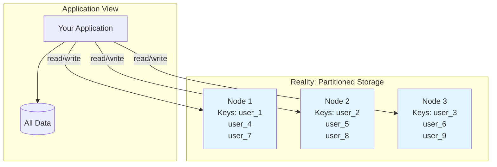
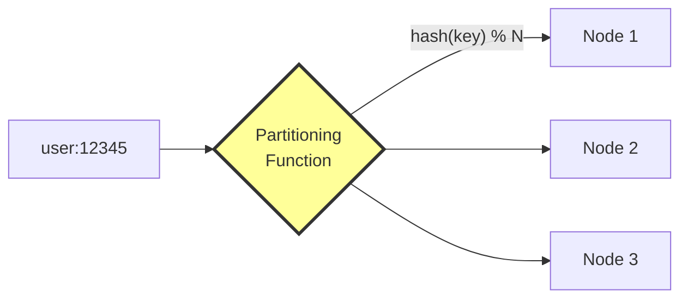
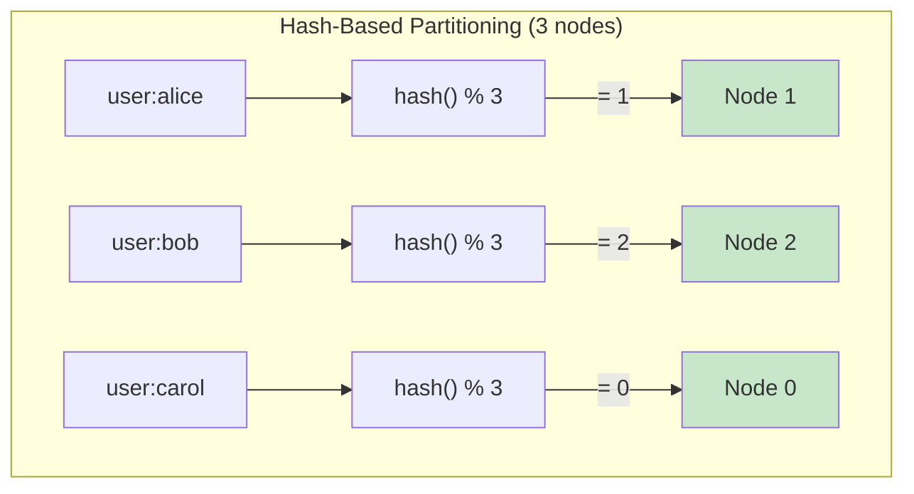
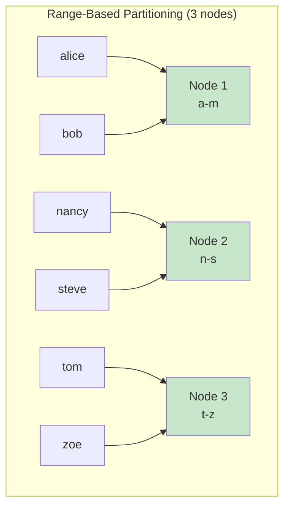
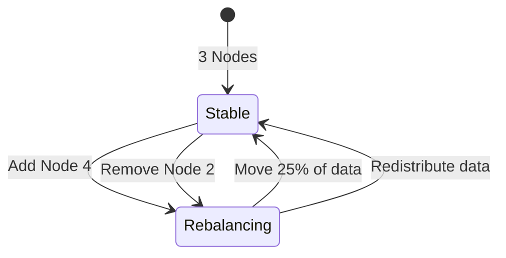
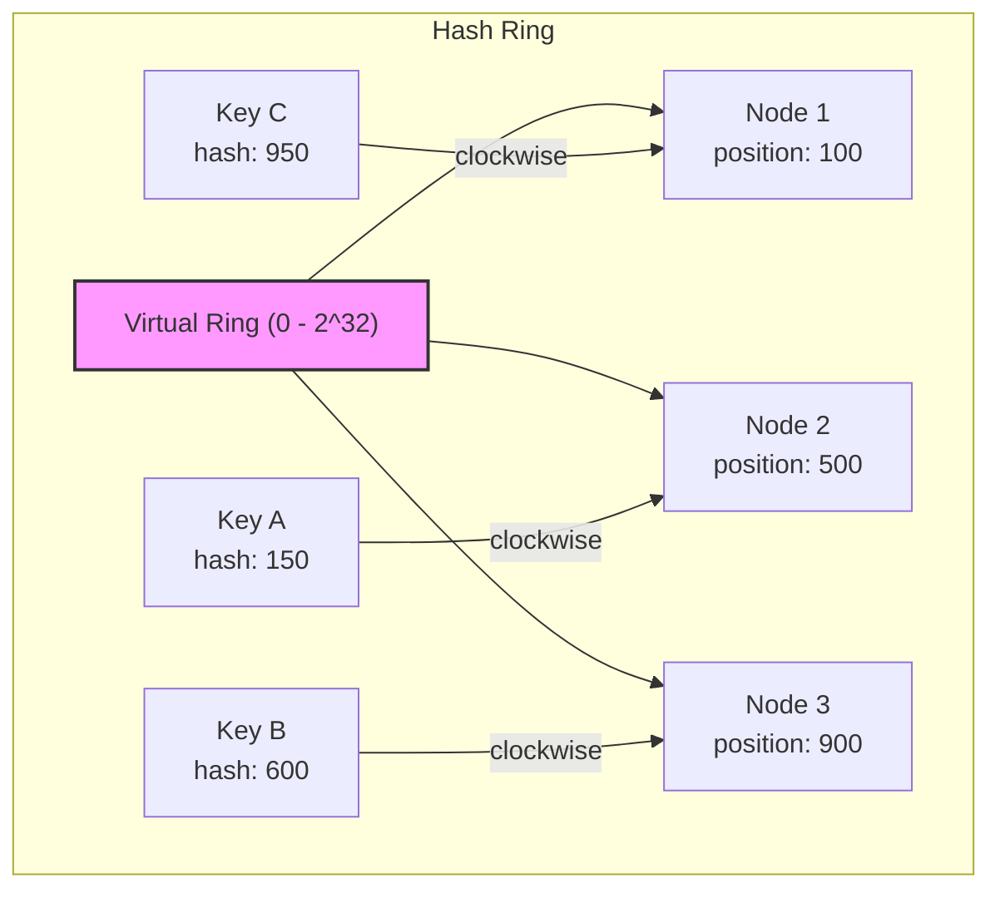
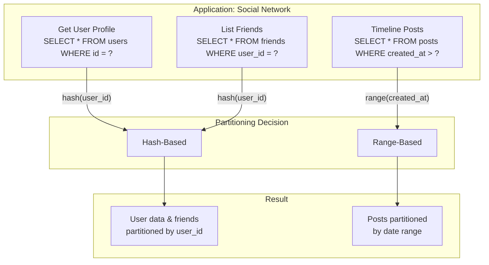

# Data Partitioning

> **Session 3, Part 1** - 25 minutes

## Learning Objectives

- [ ] Understand what data partitioning (sharding) is
- [ ] Compare hash-based vs range-based partitioning
- [ ] Learn how partitioning affects query performance
- [ ] Recognize the trade-offs of different partitioning strategies

## What is Partitioning?

**Data partitioning** (also called **sharding**) is the process of splitting your data across multiple nodes based on a partitioning key. Each node holds a subset of the total data.



### Why Partition Data?

| Benefit | Description |
|---------|-------------|
| **Scalability** | Store more data than fits on one machine |
| **Performance** | Distribute load across multiple nodes |
| **Availability** | One partition failure doesn't affect others |

### The Partitioning Challenge

The key question is: **How do we decide which data goes on which node?**



## Partitioning Strategies

### 1. Hash-Based Partitioning

Apply a hash function to the key, then modulo the number of nodes:

```
node = hash(key) % number_of_nodes
```



**TypeScript Example:**
```typescript
function getNode(key: string, totalNodes: number): number {
    // Simple hash function
    let hash = 0;
    for (let i = 0; i < key.length; i++) {
        hash = ((hash << 5) - hash) + key.charCodeAt(i);
        hash = hash & hash; // Convert to 32bit integer
    }
    return Math.abs(hash) % totalNodes;
}

// Examples
console.log(getNode('user:alice', 3));  // => 1
console.log(getNode('user:bob', 3));    // => 2
console.log(getNode('user:carol', 3));  // => 0
```

**Python Example:**
```python
def get_node(key: str, total_nodes: int) -> int:
    """Determine which node should store this key."""
    hash_value = hash(key)  # Built-in hash function
    return abs(hash_value) % total_nodes

# Examples
print(get_node('user:alice', 3))   # => 1
print(get_node('user:bob', 3))     # => 2
print(get_node('user:carol', 3))   # => 0
```

**Advantages:**
- ✅ Even data distribution
- ✅ Simple to implement
- ✅ No hotspots (assuming good hash function)

**Disadvantages:**
- ❌ Cannot do efficient range queries
- ❌ Rebalancing is expensive when adding/removing nodes

### 2. Range-Based Partitioning

Assign key ranges to each node:



**TypeScript Example:**
```typescript
interface Range {
    start: string;
    end: string;
    node: number;
}

const ranges: Range[] = [
    { start: 'a', end: 'm', node: 1 },
    { start: 'n', end: 's', node: 2 },
    { start: 't', end: 'z', node: 3 }
];

function getNodeByRange(key: string): number {
    for (const range of ranges) {
        if (key >= range.start && key <= range.end) {
            return range.node;
        }
    }
    throw new Error(`No range found for key: ${key}`);
}

// Examples
console.log(getNodeByRange('alice'));  // => 1
console.log(getNodeByRange('nancy'));  // => 2
console.log(getNodeByRange('tom'));    // => 3
```

**Python Example:**
```python
from typing import List, Tuple

ranges: List[Tuple[str, str, int]] = [
    ('a', 'm', 1),
    ('n', 's', 2),
    ('t', 'z', 3)
]

def get_node_by_range(key: str) -> int:
    """Determine which node based on key range."""
    for start, end, node in ranges:
        if start <= key <= end:
            return node
    raise ValueError(f"No range found for key: {key}")

# Examples
print(get_node_by_range('alice'))  # => 1
print(get_node_by_range('nancy'))  # => 2
print(get_node_by_range('tom'))    # => 3
```

**Advantages:**
- ✅ Efficient range queries
- ✅ Can optimize for data access patterns

**Disadvantages:**
- ❌ Uneven distribution (hotspots)
- ❌ Complex to load balance

## The Rebalancing Problem

What happens when you add or remove nodes?



### Simple Modulo Hashing Problem

With `hash(key) % N`, changing N from 3 to 4 means **most keys move to different nodes**:

| Key | hash % 3 | hash % 4 | Moved? |
|-----|----------|----------|--------|
| user:1 | 1 | 1 | ❌ |
| user:2 | 2 | 2 | ❌ |
| user:3 | 0 | 3 | ✅ |
| user:4 | 1 | 0 | ✅ |
| user:5 | 2 | 1 | ✅ |
| user:6 | 0 | 2 | ✅ |

**75% of keys moved!**

### Consistent Hashing (Advanced)

A technique to minimize data movement when nodes change:



**Key Idea:** Each key is assigned to the first node clockwise from its hash position.

When adding/removing a node, only keys in that node's range move.

## Query Patterns and Partitioning

Your query patterns should influence your partitioning strategy:

### Common Query Patterns

| Query Type | Best Partitioning | Example |
|------------|-------------------|---------|
| **Key-value lookups** | Hash-based | Get user by ID |
| **Range scans** | Range-based | Users registered last week |
| **Multi-key access** | Composite hash | Orders by customer |
| **Geographic queries** | Location-based | Nearby restaurants |

### Example: User Data Partitioning



## Trade-offs Summary

| Strategy | Distribution | Range Queries | Rebalancing | Complexity |
|----------|--------------|---------------|-------------|------------|
| **Hash-based** | Even | Poor | Expensive | Low |
| **Range-based** | Potentially uneven | Excellent | Moderate | Medium |
| **Consistent hashing** | Even | Poor | Minimal | High |

## Real-World Examples

| System | Partitioning Strategy | Notes |
|--------|----------------------|-------|
| **Redis Cluster** | Hash slots (16384 slots) | Consistent hashing |
| **Cassandra** | Token-aware (hash ring) | Configurable partitioner |
| **MongoDB** | Shard key ranges | Range-based on shard key |
| **DynamoDB** | Hash + range (composite) | Supports composite keys |
| **PostgreSQL** | Not native | Use extensions like Citus |

## Summary

### Key Takeaways

1. **Partitioning splits data** across multiple nodes for scalability
2. **Hash-based** gives even distribution but poor range queries
3. **Range-based** enables range scans but can create hotspots
4. **Rebalancing** is a key challenge when nodes change
5. **Query patterns** should drive your partitioning strategy

### Check Your Understanding

- [ ] Why is hash-based partitioning better for even distribution?
- [ ] When would you choose range-based over hash-based?
- [ ] What happens to data placement when you add a new node with simple modulo hashing?
- [ ] How does consistent hashing minimize data movement?

## 🧠 Chapter Quiz

Test your mastery of these concepts! These questions will challenge your understanding and reveal any gaps in your knowledge.

{{#quiz ../../quizzes/data-store-partitioning.toml}}

## What's Next

Now that we understand how to partition data, let's explore the fundamental trade-offs in distributed data systems: [CAP Theorem](./02-cap-theorem.md)
