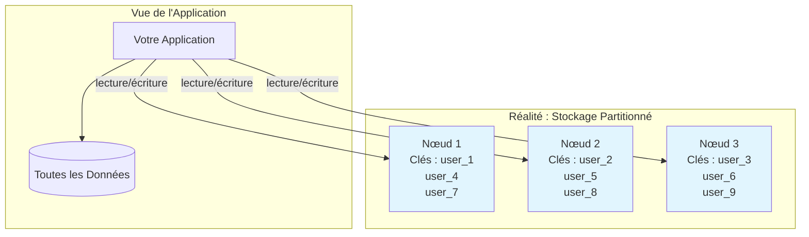
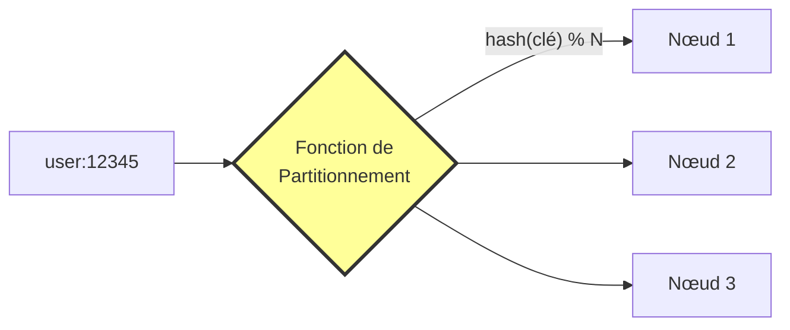
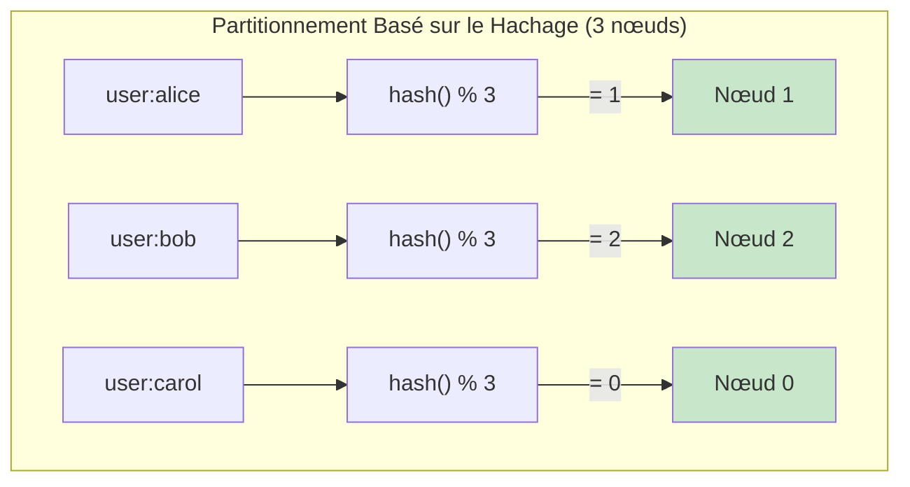
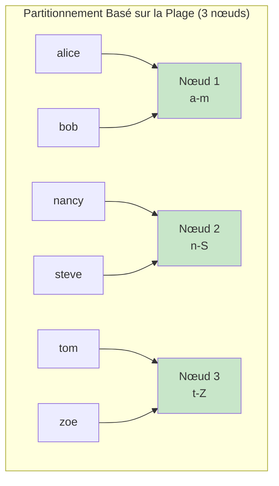
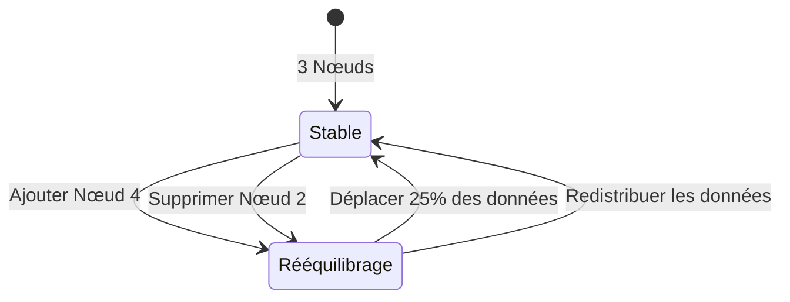
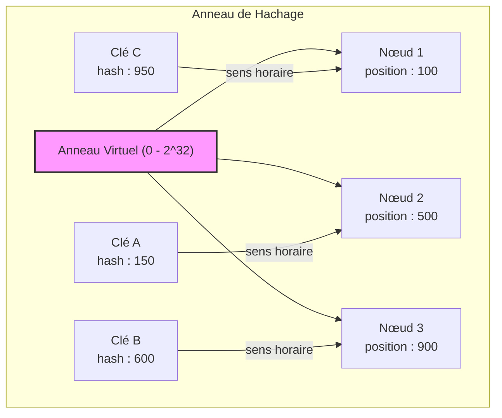
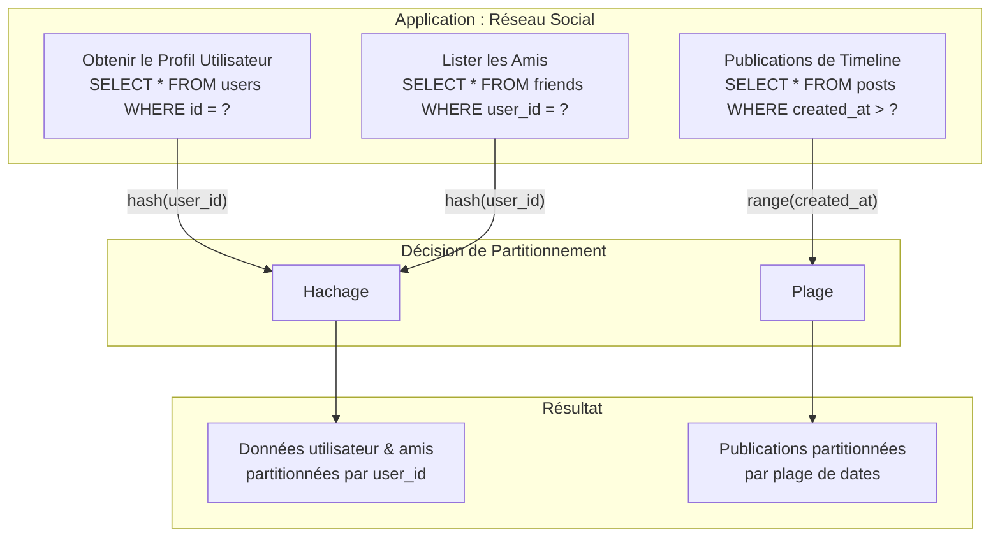

# Partitionnement des Données

> **Session 3, Partie 1** - 25 minutes

## Objectifs d'Apprentissage

- [ ] Comprendre ce qu'est le partitionnement des données (sharding)
- [ ] Comparer le partitionnement basé sur le hachage vs par plage
- [ ] Apprendre comment le partitionnement affecte les performances des requêtes
- [ ] Reconnaître les compromis des différentes stratégies de partitionnement

## Qu'est-ce que le Partitionnement ?

Le **partitionnement des données** (aussi appelé **sharding**) est le processus de répartition de vos données sur plusieurs nœuds basé sur une clé de partitionnement. Chaque nœud contient un sous-ensemble des données totales.



### Pourquoi Partitionner les Données ?

| Avantage | Description |
|---------|-------------|
| **Mise à l'échelle** | Stocker plus de données que ce qui tient sur une seule machine |
| **Performance** | Distribuer la charge sur plusieurs nœuds |
| **Disponibilité** | La défaillance d'une partition n'affecte pas les autres |

### Le Défi du Partitionnement

La question clé est : **Comment décider quelles données vont sur quel nœud ?**



## Stratégies de Partitionnement

### 1. Partitionnement Basé sur le Hachage

Appliquer une fonction de hachage à la clé, puis modulo le nombre de nœuds :

```
nœud = hash(clé) % nombre_de_nœuds
```



**Exemple TypeScript :**
```typescript
function getNode(key: string, totalNodes: number): number {
    // Fonction de hachage simple
    let hash = 0;
    for (let i = 0; i < key.length; i++) {
        hash = ((hash << 5) - hash) + key.charCodeAt(i);
        hash = hash & hash; // Convertir en entier 32bit
    }
    return Math.abs(hash) % totalNodes;
}

// Exemples
console.log(getNode('user:alice', 3));  // => 1
console.log(getNode('user:bob', 3));    // => 2
console.log(getNode('user:carol', 3));  // => 0
```

**Exemple Python :**
```python
def get_node(key: str, total_nodes: int) -> int:
    """Déterminer quel nœud doit stocker cette clé."""
    hash_value = hash(key)  # Fonction de hachage intégrée
    return abs(hash_value) % total_nodes

# Exemples
print(get_node('user:alice', 3))   # => 1
print(get_node('user:bob', 3))     # => 2
print(get_node('user:carol', 3))   # => 0
```

**Avantages :**
- ✅ Distribution uniforme des données
- ✅ Simple à implémenter
- ✅ Pas de points chauds (en supposant une bonne fonction de hachage)

**Désavantages :**
- ❌ Ne permet pas des requêtes de plage efficaces
- ❌ Le rééquilibrage est coûteux lors de l'ajout/suppression de nœuds

### 2. Partitionnement Basé sur la Plage

Assigner des plages de clés à chaque nœud :



**Exemple TypeScript :**
```typescript
interface Range {
    start: string;
    end: string;
    node: number;
}

const ranges: Range[] = [
    { start: 'a', end: 'm', node: 1 },
    { start: 'n', end: 's', node: 2 },
    { start: 't', end: 'z', node: 3 }
];

function getNodeByRange(key: string): number {
    for (const range of ranges) {
        if (key >= range.start && key <= range.end) {
            return range.node;
        }
    }
    throw new Error(`Aucune plage trouvée pour la clé : ${key}`);
}

// Exemples
console.log(getNodeByRange('alice'));  // => 1
console.log(getNodeByRange('nancy'));  // => 2
console.log(getNodeByRange('tom'));    // => 3
```

**Exemple Python :**
```python
from typing import List, Tuple

ranges: List[Tuple[str, str, int]] = [
    ('a', 'm', 1),
    ('n', 's', 2),
    ('t', 'z', 3)
]

def get_node_by_range(key: str) -> int:
    """Déterminer quel nœud basé sur la plage de clés."""
    for start, end, node in ranges:
        if start <= key <= end:
            return node
    raise ValueError(f"Aucune plage trouvée pour la clé : {key}")

# Exemples
print(get_node_by_range('alice'))  # => 1
print(get_node_by_range('nancy'))  # => 2
print(get_node_by_range('tom'))    # => 3
```

**Avantages :**
- ✅ Requêtes de plage efficaces
- ✅ Peut optimiser pour les modèles d'accès aux données

**Désavantages :**
- ❌ Distribution inégale (points chauds)
- ❌ Complexe à équilibrer la charge

## Le Problème du Rééquilibrage

Que se passe-t-il lorsque vous ajoutez ou supprimez des nœuds ?



### Problème du Hachage Modulo Simple

Avec `hash(clé) % N`, changer N de 3 à 4 signifie que **la plupart des clés se déplacent vers différents nœuds** :

| Clé | hash % 3 | hash % 4 | Déplacée ? |
|-----|----------|----------|--------------|
| user:1 | 1 | 1 | ❌ |
| user:2 | 2 | 2 | ❌ |
| user:3 | 0 | 3 | ✅ |
| user:4 | 1 | 0 | ✅ |
| user:5 | 2 | 1 | ✅ |
| user:6 | 0 | 2 | ✅ |

**75% des clés se sont déplacées !**

### Hachage Cohérent (Avancé)

Une technique pour minimiser le déplacement de données lorsque les nœuds changent :



**Idée Clé :** Chaque clé est assignée au premier nœud dans le sens horaire à partir de sa position de hachage.

Lors de l'ajout/suppression d'un nœud, seules les clés dans la plage de ce nœud se déplacent.

## Modèles de Requêtes et Partitionnement

Vos modèles de requêtes devraient influencer votre stratégie de partitionnement :

### Modèles de Requêtes Courants

| Type de Requête | Meilleur Partitionnement | Exemple |
|-----------------|----------------------|---------|
| **Recherches clé-valeur** | Basé sur le hachage | Obtenir un utilisateur par ID |
| **Analyses de plage** | Basé sur la plage | Utilisateurs inscrits la semaine dernière |
| **Accès multi-clés** | Hachage composite | Commandes par client |
| **Requêtes géographiques** | Basé sur la localisation | Restaurants proches |

### Exemple : Partitionnement des Données Utilisateur



## Résumé des Compromis

| Stratégie | Distribution | Requêtes de Plage | Rééquilibrage | Complexité |
|----------|--------------|---------------|-------------|------------|
| **Basé sur le hachage** | Uniforme | Pauvre | Coûteux | Faible |
| **Basé sur la plage** | Potentiellement inégale | Excellent | Modéré | Moyen |
| **Hachage cohérent** | Uniforme | Pauvre | Minimal | Élevé |

## Exemples Réels

| Système | Stratégie de Partitionnement | Notes |
|--------|----------------------|-------|
| **Redis Cluster** | Slots de hachage (16384 slots) | Hachage cohérent |
| **Cassandra** | Sensible aux jetons (anneau de hachage) | Partitionneur configurable |
| **MongoDB** | Plages de clés de sharding | Basé sur la plage sur la clé de sharding |
| **DynamoDB** | Hachage + plage (composite) | Supporte les clés composites |
| **PostgreSQL** | Pas natif | Utiliser des extensions comme Citus |

## Résumé

### Points Clés à Retenir

1. **Le partitionnement divise les données** sur plusieurs nœuds pour la mise à l'échelle
2. **Le hachage** donne une distribution uniforme mais de mauvaises requêtes de plage
3. **La plage** permet les analyses de plage mais peut créer des points chauds
4. **Le rééquilibrage** est un défi clé lorsque les nœuds changent
5. **Les modèles de requêtes** devraient dicter votre stratégie de partitionnement

### Vérifiez Votre Compréhension

- [ ] Pourquoi le partitionnement basé sur le hachage est-il meilleur pour une distribution uniforme ?
- [ ] Quand choisiriez-vous le partitionnement par plage plutôt que par hachage ?
- [ ] Qu'arrive-t-il au placement des données lorsque vous ajoutez un nouveau nœud avec le hachage modulo simple ?
- [ ] Comment le hachage cohérent minimise-t-il le déplacement de données ?

## 🧠 Quiz du Chapitre

Testez votre maîtrise de ces concepts ! Ces questions mettront au défi votre compréhension et révéleront toute lacune dans vos connaissances.

{{#quiz ../../quizzes/data-store-partitioning.toml}}

## Et Ensuite

Maintenant que nous comprenons comment partitionner les données, explorons les compromis fondamentaux dans les systèmes de données distribués : [Théorème CAP](./02-cap-theorem.md)
