# Théorème CAP

> **Session 3, Partie 2** - 30 minutes

## Objectifs d'Apprentissage

- [ ] Comprendre le théorème CAP et ses trois composantes
- [ ] Explorer les compromis entre Cohérence, Disponibilité et Tolérance aux Partitions
- [ ] Identifier les systèmes réels et leurs choix CAP
- [ ] Apprendre à appliquer la pensée CAP à la conception de systèmes

## Qu'est-ce que le Théorème CAP ?

Le **théorème CAP** stipule qu'un magasin de données distribué ne peut fournir que **deux** des trois garanties suivantes :

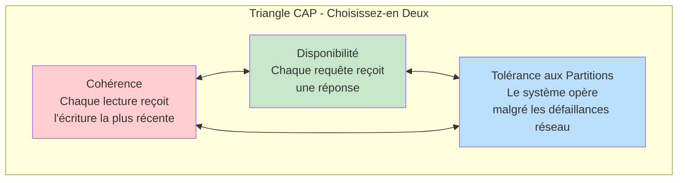

## Les Trois Composantes

### 1. Cohérence (C)

**Chaque lecture reçoit l'écriture la plus récente ou une erreur.**

Tous les nœuds voient les mêmes données au même moment. Si vous écrivez une valeur et la lisez immédiatement, vous obtenez la valeur que vous venez d'écrire.

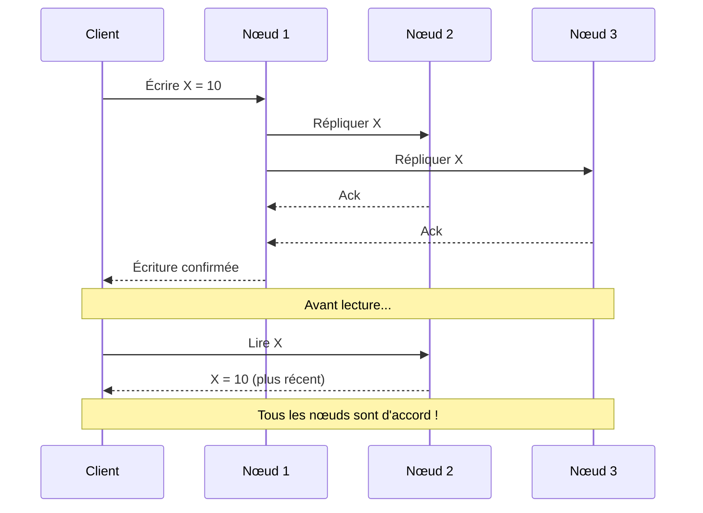

**Exemple :** Un système bancaire où votre solde doit être précis sur toutes les agences.

### 2. Disponibilité (A)

**Chaque requête reçoit une réponse (non-erreur), sans garantie qu'elle contient l'écriture la plus récente.**

Le système reste opérationnel même lorsque certains nœuds échouent. Vous pouvez toujours lire et écrire, même si les données peuvent être obsolètes.

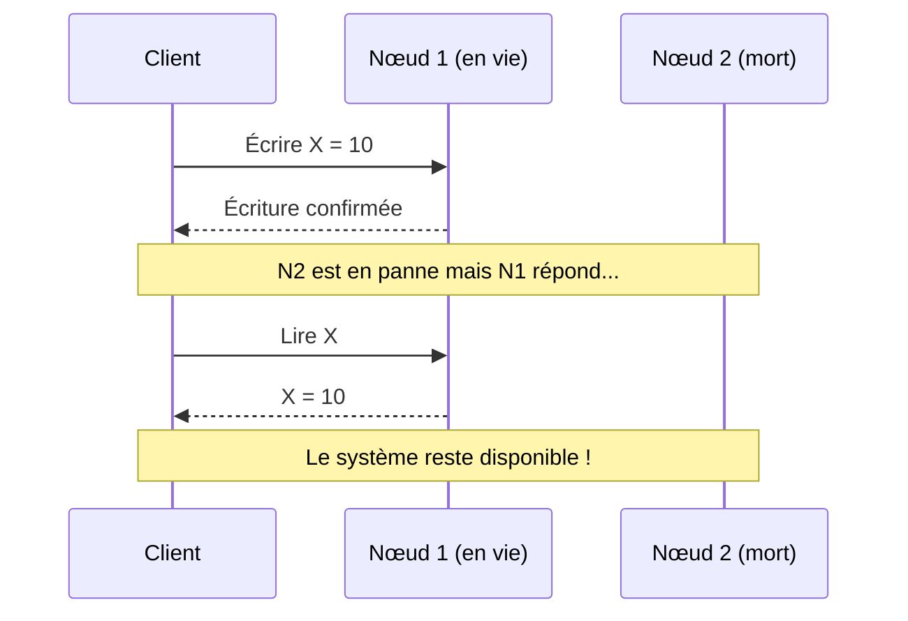

**Exemple :** Un fil d'actualités sociales où montrer un contenu légèrement ancien est acceptable.

### 3. Tolérance aux Partitions (P)

**Le système continue à opérer malgré un nombre arbitraire de messages étant abandonnés ou retardés par le réseau entre les nœuds.**

Les partitions réseau sont inévitables dans les systèmes distribués. Le système doit les gérer avec grâce.

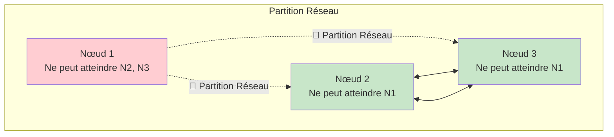

**Aperçu Clé :** Dans les systèmes distribués, **P n'est pas optionnel** — les partitions réseau ARRIVERONT.

## Les Compromis

Puisque les partitions sont inévitables dans les systèmes distribués, le vrai choix est entre **C** et **A** pendant une partition :

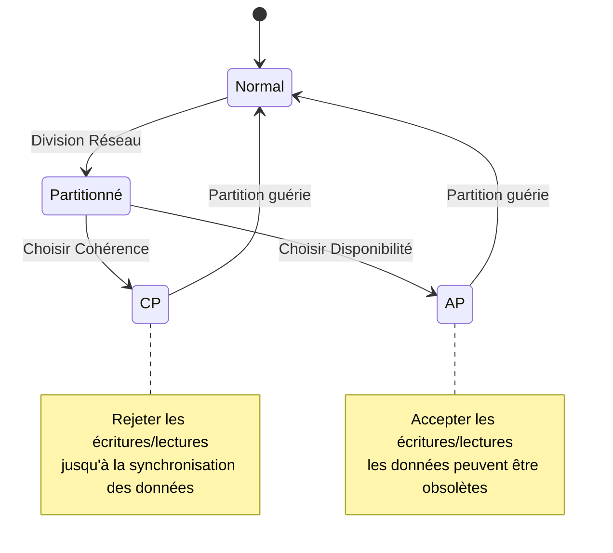

### CP : Cohérence + Tolérance aux Partitions

**Sacrifier la Disponibilité**

Pendant une partition, le système retourne des erreurs ou bloque jusqu'à ce que la cohérence puisse être garantie.

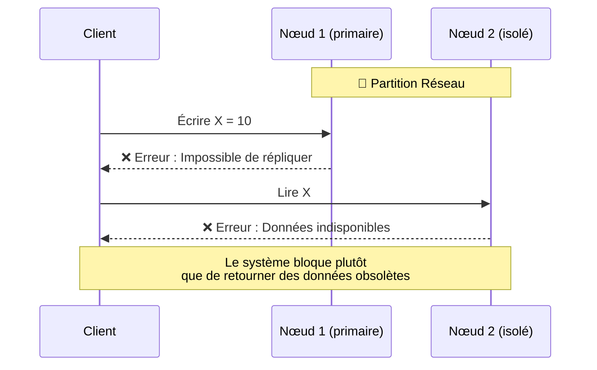

**Exemples :**
- **MongoDB** (avec souci d'écriture majoritaire)
- **HBase**
- **Redis** (avec configuration appropriée)
- **SGBD traditionnels** avec réplication synchrone

**Utiliser lorsque :** La précision des données est critique (systèmes financiers, inventaire)

### AP : Disponibilité + Tolérance aux Partitions

**Sacrifier la Cohérence**

Pendant une partition, le système accepte les lectures et écritures, pouvant retourner des données obsolètes.

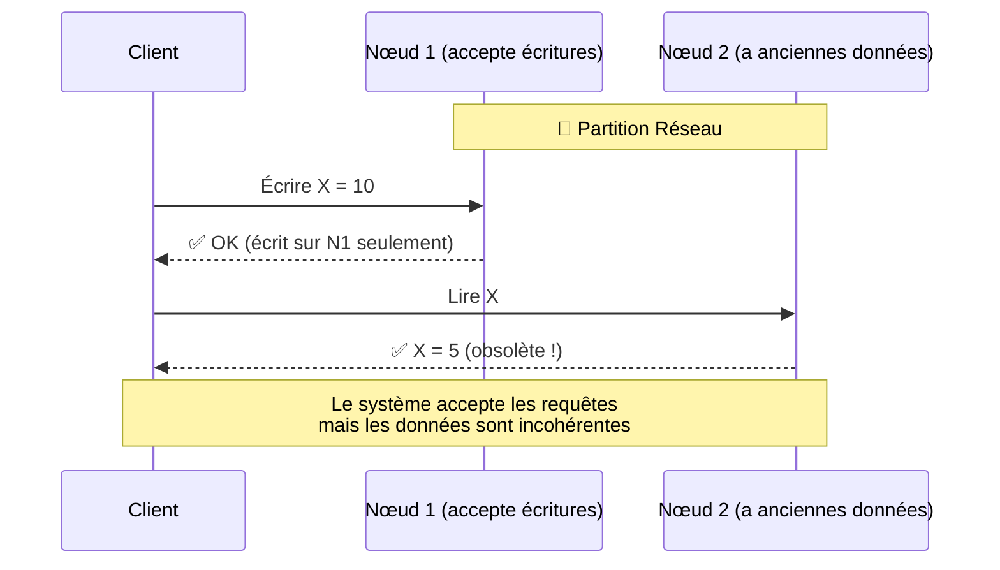

**Exemples :**
- **Cassandra**
- **DynamoDB**
- **CouchDB**
- **Riak**

**Utiliser lorsque :** Toujours répondre est plus important que la cohérence immédiate (médias sociaux, mise en cache, analyses)

### CA : Cohérence + Disponibilité

**Possible uniquement dans les systèmes à nœud unique**

Sans partitions réseau (nœud unique ou réseau parfaitement fiable), vous pouvez avoir à la fois C et A.

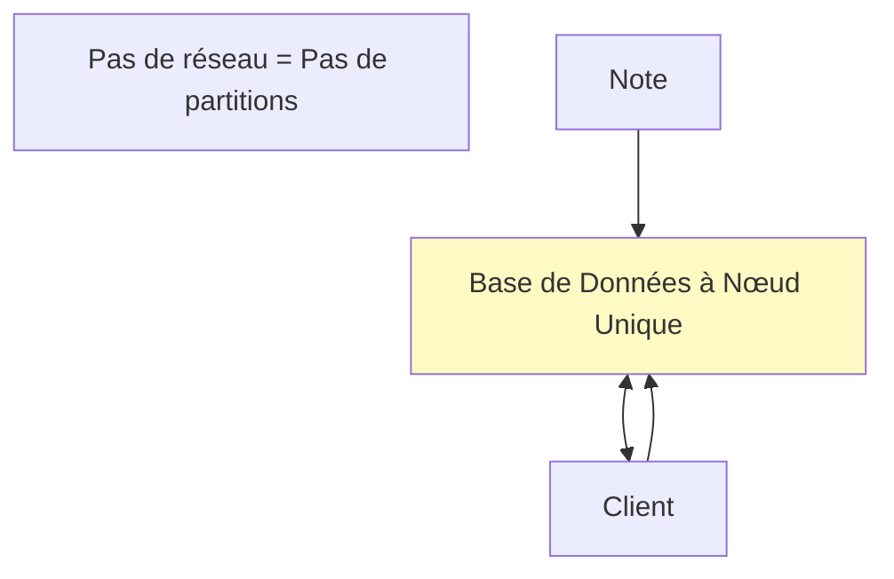

**Exemples :**
- PostgreSQL à nœud unique
- MongoDB à nœud unique
- SGBD traditionnels sur un serveur

**Réalité :** Dans les systèmes distribués, CA n'est pas achievable car les réseaux ne sont pas parfaitement fiables.

## Exemples CAP Réels

| Système | Choix CAP | Notes |
|--------|-----------|-------|
| **Google Spanner** | CP | Cohérence externe, toujours cohérent |
| **Amazon DynamoDB** | AP | Cohérence configurable |
| **Cassandra** | AP | Toujours inscriptible, cohérence ajustable |
| **MongoDB** | CP (par défaut) | Configurable en AP |
| **Redis Cluster** | AP | Réplication asynchrone |
| **PostgreSQL** | CA | Mode nœud unique |
| **CockroachDB** | CP | Sérialisabilité, gère les partitions |
| **Couchbase** | AP | Réplication Inter-Centres de Données |

## Modèles de Cohérence

La "Cohérence" du théorème CAP est en fait la **linéarisabilité** (cohérence forte). Il existe plusieurs modèles de cohérence :

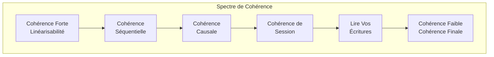

### Modèles de Cohérence Forte

| Modèle | Description | Exemple |
|-------|-------------|---------|
| **Linéarisable** | Lecture la plus récente garantie | Transferts bancaires |
| **Séquentielle** | Les opérations apparaissent dans un certain ordre | Contrôle de version |
| **Causale** | Opérations causalement liées ordonnées | Applications de chat |

### Modèles de Cohérence Faible

| Modèle | Description | Exemple |
|-------|-------------|---------|
| **Lire Vos Écritures** | L'utilisateur voit ses propres écritures | Profil de médias sociaux |
| **Cohérence de Session** | Cohérence dans une session | Panier d'achat |
| **Cohérence Finale** | Le système converge au fil du temps | DNS, CDN |

## Exemple Pratique : Panier d'Achat

Voyons comment différents choix CAP affectent un système de panier d'achat :

### Approche CP (Bloquer sur Partition)

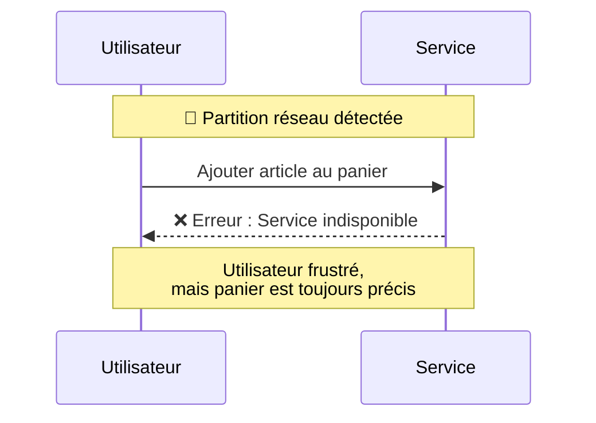

**Compromis :** Ventes perdues, panier précis

### Approche AP (Accepter Écritures)

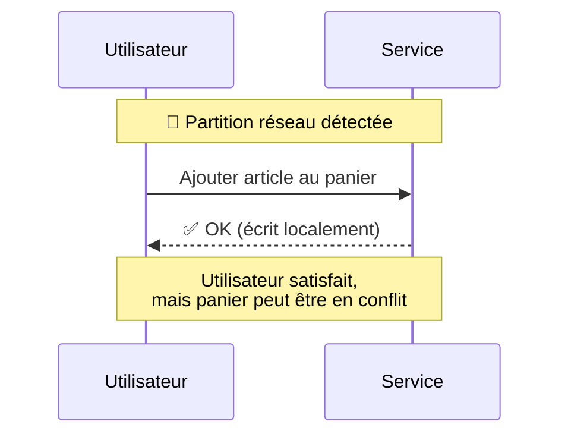

**Compromis :** Utilisateurs satisfaits, conflits de fusion possibles ultérieurement

## La Simplification "2 sur 3"

Le théorème CAP est souvent mal compris. La réalité est plus nuancée :

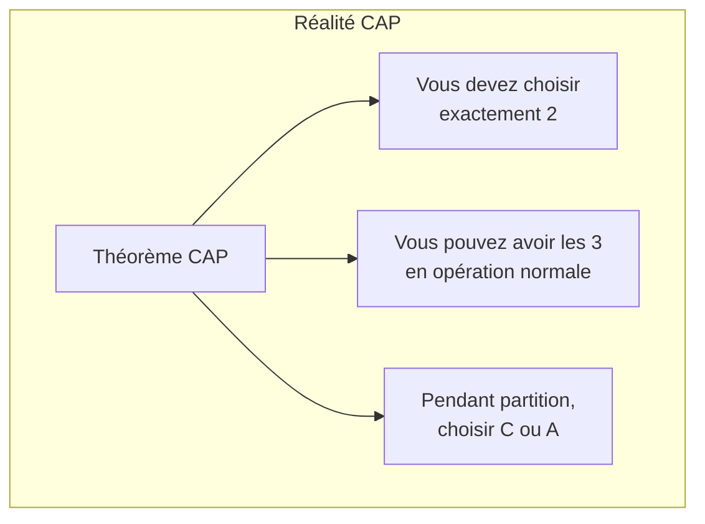

**Aperçus Clés :**
1. **P est obligatoire** dans les systèmes distribués
2. Pendant l'opération normale, vous pouvez avoir C + A + P
3. Pendant une partition, vous choisissez entre C et A
4. Plusieurs systèmes sont **configurables** (par exemple, DynamoDB)

## Directives de Conception

### Choisir CP Lorsque :

- ✅ Transactions financières
- ✅ Gestion d'inventaire
- ✅ Authentification/autorisation
- ✅ Tout système où les données obsolètes sont inacceptables

### Choisir AP Lorsque :

- ✅ Fils d'actualités sociaux
- ✅ Recommandations de produits
- ✅ Analyses et journalisation
- ✅ Tout système où la disponibilité est critique

### Techniques pour Équilibrer C et A :

| Technique | Description | Exemple |
|-----------|-------------|---------|
| **Lectures/écritures de quorum** | Nécessite une reconnaissance majoritaire | DynamoDB |
| **Cohérence ajustable** | Laisser le client choisir par opération | Cassandra |
| **Dégradation gracieuse** | Changer de modes pendant partition | Plusieurs systèmes |
| **Résolution de conflits** | Fusionner les données divergentes ultérieurement | CRDTs |

## Résumé

### Points Clés à Retenir

1. **Théorème CAP :** Vous ne pouvez pas avoir les trois dans une partition
2. **La tolérance aux partitions est obligatoire** dans les systèmes distribués
3. **Le vrai choix :** Cohérence vs Disponibilité pendant partition
4. **Plusieurs systèmes offrent des** niveaux de cohérence ajustables
5. **Votre cas d'utilisation détermine** le bon compromis

### Vérifiez Votre Compréhension

- [ ] Pourquoi la tolérance aux partitions n'est-elle pas optionnelle dans les systèmes distribués ?
- [ ] Donnez un exemple où vous choisiriez CP plutôt que AP
- [ ] Qu'arrive-t-il à un système AP pendant une partition réseau ?
- [ ] Comment les lectures/écritures de quorum peuvent-elles aider à équilibrer C et A ?

## 🧠 Quiz du Chapitre

Testez votre maîtrise de ces concepts ! Ces questions mettront au défi votre compréhension et révéleront toute lacune dans vos connaissances.

{{#quiz ../../quizzes/data-store-cap-theorem.toml}}

## Et Ensuite

Maintenant que nous comprenons les compromis CAP, construisons un simple magasin clé-valeur : [Bases du Magasin](./03-store-basics.md)
