# CAP Theorem

> **Session 3, Part 2** - 30 minutes

## Learning Objectives

- [ ] Understand the CAP theorem and its three components
- [ ] Explore the trade-offs between Consistency, Availability, and Partition tolerance
- [ ] Identify real-world systems and their CAP choices
- [ ] Learn how to apply CAP thinking to system design

## What is the CAP Theorem?

The **CAP theorem** states that a distributed data store can only provide **two** of the following three guarantees:

## The Three Components

### 1. Consistency (C)

**Every read receives the most recent write or an error.**

All nodes see the same data at the same time. If you write a value and immediately read it, you get the value you just wrote.

**Example:** A bank system where your balance must be accurate across all branches.

### 2. Availability (A)

**Every request receives a (non-error) response, without the guarantee that it contains the most recent write.**

The system remains operational even when some nodes fail. You can always read and write, even if the data might be stale.

**Example:** A social media feed where showing slightly old content is acceptable.

### 3. Partition Tolerance (P)

**The system continues to operate despite an arbitrary number of messages being dropped or delayed by the network between nodes.**

Network partitions are inevitable in distributed systems. The system must handle them gracefully.

```mermaid
graph TB
    subgraph "Network Partition"
        N1["Node 1<br/>Can't reach N2, N3"]
        N2["Node 2<br/>Can't reach N1"]
        N3["Node 3<br/>Can't reach N1"]
    end

    N1 -.->|"🔴 Network Partition"| N2
    N1 -.->|"🔴 Network Partition"| N3
    N2 <--> N3
    N2 <--> N3

    style N1 fill:#ffcdd2
    style N2 fill:#c8e6c9
    style N3 fill:#c8e6c9
```

**Key Insight:** In distributed systems, **P is not optional**—network partitions WILL happen.

## The Trade-offs

Since partitions are inevitable in distributed systems, the real choice is between **C** and **A** during a partition:

### CP: Consistency + Partition Tolerance

**Sacrifice Availability**

During a partition, the system returns errors or blocks until consistency can be guaranteed.

**Examples:**
- **MongoDB** (with majority write concern)
- **HBase**
- **Redis** (with proper configuration)
- **Traditional RDBMS** with synchronous replication

**Use when:** Data accuracy is critical (financial systems, inventory)

### AP: Availability + Partition Tolerance

**Sacrifice Consistency**

During a partition, the system accepts reads and writes, possibly returning stale data.

```mermaid
sequenceDiagram
    participant C as Client
    participant N1 as Node 1 (accepts writes)
    participant N2 as Node 2 (has old data)

    Note over N1,N2: 🔴 Network Partition

    C->>N1: Write X = 10
    N1-->>C: ✅ OK (written to N1 only)

    C->>N2: Read X
    N2-->>C: ✅ X = 5 (stale!)

    Note over C,N2: System accepts requests<br/>but data is inconsistent
```

**Examples:**
- **Cassandra**
- **DynamoDB**
- **CouchDB**
- **Riak**

**Use when:** Always responding is more important than immediate consistency (social media, caching, analytics)

### CA: Consistency + Availability

**Only possible in single-node systems**

Without network partitions (single node or perfectly reliable network), you can have both C and A.

**Examples:**
- Single-node PostgreSQL
- Single-node MongoDB
- Traditional RDBMS on one server

**Reality:** In distributed systems, CA is not achievable because networks are not perfectly reliable.

## Real-World CAP Examples

| System | CAP Choice | Notes |
|--------|-----------|-------|
| **Google Spanner** | CP | External consistency, always consistent |
| **Amazon DynamoDB** | AP | Configurable consistency |
| **Cassandra** | AP | Always writable, tunable consistency |
| **MongoDB** | CP (default) | Configurable to AP |
| **Redis Cluster** | AP | Async replication |
| **PostgreSQL** | CA | Single-node mode |
| **CockroachDB** | CP | Serializability, handles partitions |
| **Couchbase** | AP | Cross Data Center Replication |

## Consistency Models

The CAP theorem's "Consistency" is actually **linearizability** (strong consistency). There are many consistency models:

### Strong Consistency Models

| Model | Description | Example |
|-------|-------------|---------|
| **Linearizable** | Most recent read guaranteed | Bank transfers |
| **Sequential** | Operations appear in some order | Version control |
| **Causal** | Causally related operations ordered | Chat applications |

### Weak Consistency Models

| Model | Description | Example |
|-------|-------------|---------|
| **Read Your Writes** | User sees their own writes | Social media profile |
| **Session Consistency** | Consistency within a session | Shopping cart |
| **Eventual Consistency** | System converges over time | DNS, CDN |

## Practical Example: Shopping Cart

Let's see how different CAP choices affect a shopping cart system:

### CP Approach (Block on Partition)

```mermaid
sequenceDiagram
    participant U as User
    participant S as Service

    Note over U,S: 🔴 Network partition detected

    U->>S: Add item to cart
    S-->>U: ❌ Error: Service unavailable

    Note over U,S: User frustrated,<br/>but cart is always accurate
```

**Trade-off:** Lost sales, accurate cart

### AP Approach (Accept Writes)

```mermaid
sequenceDiagram
    participant U as User
    participant S as Service

    Note over U,S: 🔴 Network partition detected

    U->>S: Add item to cart
    S-->>U: ✅ OK (written locally)

    Note over U,S: User happy,<br/>but cart might conflict
```

**Trade-off:** Happy users, possible merge conflicts later

## The "2 of 3" Simplification

The CAP theorem is often misunderstood. The reality is more nuanced:

**Key Insights:**
1. **P is mandatory** in distributed systems
2. During normal operation, you can have C + A + P
3. During a partition, you choose between C and A
4. Many systems are **configurable** (e.g., DynamoDB)

## Design Guidelines

### Choose CP When:

- ✅ Financial transactions
- ✅ Inventory management
- ✅ Authentication/authorization
- ✅ Any system where stale data is unacceptable

### Choose AP When:

- ✅ Social media feeds
- ✅ Product recommendations
- ✅ Analytics and logging
- ✅ Any system where availability is critical

### Techniques to Balance C and A:

| Technique | Description | Example |
|-----------|-------------|---------|
| **Quorum reads/writes** | Require majority acknowledgment | DynamoDB |
| **Tunable consistency** | Let client choose per operation | Cassandra |
| **Graceful degradation** | Switch modes during partition | Many systems |
| **Conflict resolution** | Merge divergent data later | CRDTs |

## Summary

### Key Takeaways

1. **CAP theorem:** You can't have all three in a partition
2. **Partition tolerance is mandatory** in distributed systems
3. **Real choice:** Consistency vs Availability during partition
4. **Many systems offer tunable** consistency levels
5. **Your use case determines** the right trade-off

### Check Your Understanding

- [ ] Why is partition tolerance not optional in distributed systems?
- [ ] Give an example where you would choose CP over AP
- [ ] What happens to an AP system during a network partition?
- [ ] How can quorum reads/writes help balance C and A?

## 🧠 Chapter Quiz

Test your mastery of these concepts! These questions will challenge your understanding and reveal any gaps in your knowledge.

{{#quiz ../../quizzes/data-store-cap-theorem.toml}}

## What's Next

Now that we understand CAP trade-offs, let's build a simple key-value store: [Store Basics](./03-store-basics.md)
