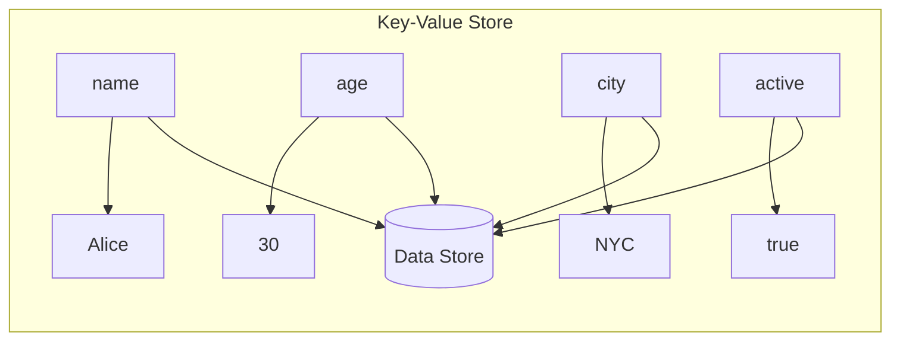
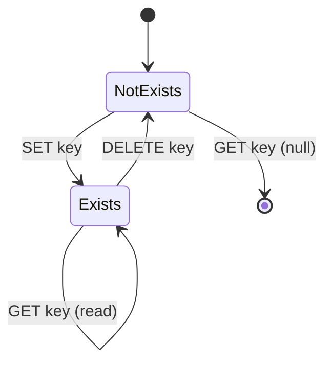
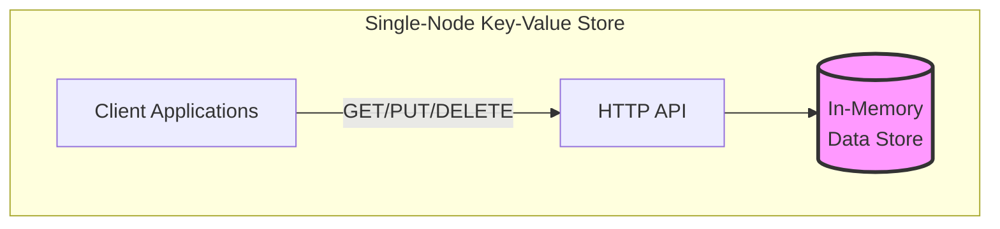

# Store System Basics

> **Session 3, Part 3** - 35 minutes (coding demo + hands-on)

## Learning Objectives

- [ ] Understand the key-value store data model
- [ ] Build a single-node key-value store in TypeScript
- [ ] Build the same store in Python
- [ ] Deploy and test the store using Docker Compose
- [ ] Perform basic read/write operations via HTTP

## What is a Key-Value Store?

A **key-value store** is the simplest type of database:



**Key Characteristics:**
- Simple data model: key → value
- Fast lookups by key
- No complex queries
- Schema-less

## Basic Operations

| Operation | Description | Example |
|-----------|-------------|---------|
| **SET** | Store a value for a key | `SET user:1 Alice` |
| **GET** | Retrieve a value by key | `GET user:1` → "Alice" |
| **DELETE** | Remove a key | `DELETE user:1` |



## Implementation

We'll build a simple HTTP-based key-value store with REST API endpoints.

### API Design

```
GET    /key/{key}      - Get value by key
PUT    /key/{key}      - Set value for key
DELETE /key/{key}      - Delete key
GET    /keys           - List all keys
```

---

## TypeScript Implementation

### Project Structure
```
store-basics-ts/
├── package.json
├── tsconfig.json
├── Dockerfile
└── src/
    └── store.ts       # Complete store implementation
```

### Complete TypeScript Code

**store-basics-ts/src/store.ts**
```typescript
import http from 'http';

/**
 * Simple in-memory key-value store
 */
class KeyValueStore {
  private data: Map<string, any> = new Map();

  /**
   * Set a key-value pair
   */
  set(key: string, value: any): void {
    this.data.set(key, value);
    console.log(`[Store] SET ${key} = ${JSON.stringify(value)}`);
  }

  /**
   * Get a value by key
   */
  get(key: string): any {
    const value = this.data.get(key);
    console.log(`[Store] GET ${key} => ${value !== undefined ? JSON.stringify(value) : 'null'}`);
    return value;
  }

  /**
   * Delete a key
   */
  delete(key: string): boolean {
    const existed = this.data.delete(key);
    console.log(`[Store] DELETE ${key} => ${existed ? 'success' : 'not found'}`);
    return existed;
  }

  /**
   * Get all keys
   */
  keys(): string[] {
    return Array.from(this.data.keys());
  }

  /**
   * Get store statistics
   */
  stats() {
    return {
      totalKeys: this.data.size,
      keys: this.keys()
    };
  }
}

// Create the store instance
const store = new KeyValueStore();

/**
 * HTTP Server with key-value API
 */
const server = http.createServer((req, res) => {
  // Enable CORS
  res.setHeader('Access-Control-Allow-Origin', '*');
  res.setHeader('Access-Control-Allow-Methods', 'GET, PUT, DELETE, OPTIONS');
  res.setHeader('Access-Control-Allow-Headers', 'Content-Type');

  if (req.method === 'OPTIONS') {
    res.writeHead(200);
    res.end();
    return;
  }

  // Parse URL
  const url = new URL(req.url || '', `http://${req.headers.host}`);

  // Route: GET /keys - List all keys
  if (req.method === 'GET' && url.pathname === '/keys') {
    res.writeHead(200, { 'Content-Type': 'application/json' });
    res.end(JSON.stringify(store.stats()));
    return;
  }

  // Route: GET /key/{key} - Get value
  if (req.method === 'GET' && url.pathname.startsWith('/key/')) {
    const key = url.pathname.slice(5); // Remove '/key/'
    const value = store.get(key);

    if (value !== undefined) {
      res.writeHead(200, { 'Content-Type': 'application/json' });
      res.end(JSON.stringify({ key, value }));
    } else {
      res.writeHead(404, { 'Content-Type': 'application/json' });
      res.end(JSON.stringify({ error: 'Key not found', key }));
    }
    return;
  }

  // Route: PUT /key/{key} - Set value
  if (req.method === 'PUT' && url.pathname.startsWith('/key/')) {
    const key = url.pathname.slice(5); // Remove '/key/'

    let body = '';
    req.on('data', chunk => body += chunk);
    req.on('end', () => {
      try {
        const value = JSON.parse(body);
        store.set(key, value);

        res.writeHead(200, { 'Content-Type': 'application/json' });
        res.end(JSON.stringify({ success: true, key, value }));
      } catch (error) {
        res.writeHead(400, { 'Content-Type': 'application/json' });
        res.end(JSON.stringify({ error: 'Invalid JSON' }));
      }
    });
    return;
  }

  // Route: DELETE /key/{key} - Delete key
  if (req.method === 'DELETE' && url.pathname.startsWith('/key/')) {
    const key = url.pathname.slice(5); // Remove '/key/'
    const existed = store.delete(key);

    if (existed) {
      res.writeHead(200, { 'Content-Type': 'application/json' });
      res.end(JSON.stringify({ success: true, key }));
    } else {
      res.writeHead(404, { 'Content-Type': 'application/json' });
      res.end(JSON.stringify({ error: 'Key not found', key }));
    }
    return;
  }

  // 404 - Not found
  res.writeHead(404, { 'Content-Type': 'application/json' });
  res.end(JSON.stringify({ error: 'Not found' }));
});

const PORT = process.env.PORT || 4000;
server.listen(PORT, () => {
  console.log(`Key-Value Store listening on port ${PORT}`);
  console.log(`\nAvailable endpoints:`);
  console.log(`  GET    /key/{key}    - Get value by key`);
  console.log(`  PUT    /key/{key}    - Set value for key`);
  console.log(`  DELETE /key/{key}    - Delete key`);
  console.log(`  GET    /keys         - List all keys`);
});
```

**store-basics-ts/package.json**
```json
{
  "name": "store-basics-ts",
  "version": "1.0.0",
  "description": "Simple key-value store in TypeScript",
  "main": "dist/store.js",
  "scripts": {
    "build": "tsc",
    "start": "node dist/store.js",
    "dev": "ts-node src/store.ts"
  },
  "dependencies": {},
  "devDependencies": {
    "@types/node": "^20.0.0",
    "typescript": "^5.0.0",
    "ts-node": "^10.9.0"
  }
}
```

**store-basics-ts/tsconfig.json**
```json
{
  "compilerOptions": {
    "target": "ES2020",
    "module": "commonjs",
    "outDir": "./dist",
    "rootDir": "./src",
    "strict": true,
    "esModuleInterop": true
  },
  "include": ["src/**/*"]
}
```

**store-basics-ts/Dockerfile**
```dockerfile
FROM node:18-alpine

WORKDIR /app

COPY package*.json ./
RUN npm install

COPY . .
RUN npm run build

EXPOSE 4000

CMD ["npm", "start"]
```

---

## Python Implementation

### Project Structure
```
store-basics-py/
├── requirements.txt
├── Dockerfile
└── src/
    └── store.py       # Complete store implementation
```

### Complete Python Code

**store-basics-py/src/store.py**
```python
from http.server import HTTPServer, BaseHTTPRequestHandler
import json
from typing import Any, Dict
from urllib.parse import urlparse

class KeyValueStore:
    """Simple in-memory key-value store."""

    def __init__(self):
        self.data: Dict[str, Any] = {}

    def set(self, key: str, value: Any) -> None:
        """Store a key-value pair."""
        self.data[key] = value
        print(f"[Store] SET {key} = {json.dumps(value)}")

    def get(self, key: str) -> Any:
        """Get value by key."""
        value = self.data.get(key)
        print(f"[Store] GET {key} => {json.dumps(value) if value is not None else 'null'}")
        return value

    def delete(self, key: str) -> bool:
        """Delete a key."""
        existed = key in self.data
        if existed:
            del self.data[key]
        print(f"[Store] DELETE {key} => {'success' if existed else 'not found'}")
        return existed

    def keys(self) -> list:
        """Get all keys."""
        return list(self.data.keys())

    def stats(self) -> dict:
        """Get store statistics."""
        return {
            'totalKeys': len(self.data),
            'keys': self.keys()
        }


# Create the store instance
store = KeyValueStore()


class StoreHandler(BaseHTTPRequestHandler):
    """HTTP request handler for key-value store."""

    def send_json_response(self, status: int, data: dict):
        """Send a JSON response."""
        self.send_response(status)
        self.send_header('Content-Type', 'application/json')
        self.send_header('Access-Control-Allow-Origin', '*')
        self.end_headers()
        self.wfile.write(json.dumps(data).encode())

    def do_OPTIONS(self):
        """Handle CORS preflight requests."""
        self.send_response(200)
        self.send_header('Access-Control-Allow-Origin', '*')
        self.send_header('Access-Control-Allow-Methods', 'GET, PUT, DELETE, OPTIONS')
        self.send_header('Access-Control-Allow-Headers', 'Content-Type')
        self.end_headers()

    def do_GET(self):
        """Handle GET requests."""
        parsed = urlparse(self.path)

        # GET /keys - List all keys
        if parsed.path == '/keys':
            self.send_json_response(200, store.stats())
            return

        # GET /key/{key} - Get value
        if parsed.path.startswith('/key/'):
            key = parsed.path[5:]  # Remove '/key/'
            value = store.get(key)

            if value is not None:
                self.send_json_response(200, {'key': key, 'value': value})
            else:
                self.send_json_response(404, {'error': 'Key not found', 'key': key})
            return

        # 404
        self.send_json_response(404, {'error': 'Not found'})

    def do_PUT(self):
        """Handle PUT requests (set value)."""
        parsed = urlparse(self.path)

        # PUT /key/{key} - Set value
        if parsed.path.startswith('/key/'):
            key = parsed.path[5:]  # Remove '/key/'

            content_length = int(self.headers.get('Content-Length', 0))
            body = self.rfile.read(content_length).decode('utf-8')

            try:
                value = json.loads(body)
                store.set(key, value)
                self.send_json_response(200, {'success': True, 'key': key, 'value': value})
            except json.JSONDecodeError:
                self.send_json_response(400, {'error': 'Invalid JSON'})
            return

        # 404
        self.send_json_response(404, {'error': 'Not found'})

    def do_DELETE(self):
        """Handle DELETE requests."""
        parsed = urlparse(self.path)

        # DELETE /key/{key} - Delete key
        if parsed.path.startswith('/key/'):
            key = parsed.path[5:]  # Remove '/key/'
            existed = store.delete(key)

            if existed:
                self.send_json_response(200, {'success': True, 'key': key})
            else:
                self.send_json_response(404, {'error': 'Key not found', 'key': key})
            return

        # 404
        self.send_json_response(404, {'error': 'Not found'})

    def log_message(self, format, *args):
        """Suppress default logging."""
        pass


def run_server(port: int = 4000):
    """Start the HTTP server."""
    server_address = ('', port)
    httpd = HTTPServer(server_address, StoreHandler)
    print(f"Key-Value Store listening on port {port}")
    print(f"\nAvailable endpoints:")
    print(f"  GET    /key/{{key}}    - Get value by key")
    print(f"  PUT    /key/{{key}}    - Set value for key")
    print(f"  DELETE /key/{{key}}    - Delete key")
    print(f"  GET    /keys         - List all keys")
    httpd.serve_forever()


if __name__ == '__main__':
    import os
    port = int(os.environ.get('PORT', 4000))
    run_server(port)
```

**store-basics-py/requirements.txt**
```
# No external dependencies required - uses standard library only
```

**store-basics-py/Dockerfile**
```dockerfile
FROM python:3.11-alpine

WORKDIR /app

COPY requirements.txt ./
RUN pip install --no-cache-dir -r requirements.txt

COPY . .

EXPOSE 4000

CMD ["python", "src/store.py"]
```

---

## Docker Compose Setup

### TypeScript Version

**examples/02-store/ts/docker-compose.yml**
```yaml
version: '3.8'

services:
  store:
    build: .
    ports:
      - "4000:4000"
    environment:
      - PORT=4000
    volumes:
      - ./src:/app/src
```

### Python Version

**examples/02-store/py/docker-compose.yml**
```yaml
version: '3.8'

services:
  store:
    build: .
    ports:
      - "4000:4000"
    environment:
      - PORT=4000
    volumes:
      - ./src:/app/src
```

---

## Running the Example

### Step 1: Start the Store

**TypeScript:**
```bash
cd examples/02-store/ts
docker-compose up --build
```

**Python:**
```bash
cd examples/02-store/py
docker-compose up --build
```

You should see:
```
store    | Key-Value Store listening on port 4000
store    |
store    | Available endpoints:
store    |   GET    /key/{key}    - Get value by key
store    |   PUT    /key/{key}    - Set value for key
store    |   DELETE /key/{key}    - Delete key
store    |   GET    /keys         - List all keys
```

### Step 2: Store Some Values

```bash
# Store a string
curl -X PUT http://localhost:4000/key/name \
  -H "Content-Type: application/json" \
  -d '"Alice"'

# Store a number
curl -X PUT http://localhost:4000/key/age \
  -H "Content-Type: application/json" \
  -d '30'

# Store an object
curl -X PUT http://localhost:4000/key/user:1 \
  -H "Content-Type: application/json" \
  -d '{"name": "Alice", "age": 30, "city": "NYC"}'

# Store a list
curl -X PUT http://localhost:4000/key/tags \
  -H "Content-Type: application/json" \
  -d '["distributed", "systems", "course"]'
```

### Step 3: Retrieve Values

```bash
# Get a string
curl http://localhost:4000/key/name
# Response: {"key":"name","value":"Alice"}

# Get a number
curl http://localhost:4000/key/age
# Response: {"key":"age","value":30}

# Get an object
curl http://localhost:4000/key/user:1
# Response: {"key":"user:1","value":{"name":"Alice","age":30,"city":"NYC"}}

# Get a list
curl http://localhost:4000/key/tags
# Response: {"key":"tags","value":["distributed","systems","course"]}

# Try to get non-existent key
curl http://localhost:4000/key/nonexistent
# Response: {"error":"Key not found","key":"nonexistent"}
```

### Step 4: List All Keys

```bash
curl http://localhost:4000/keys
# Response: {"totalKeys":4,"keys":["name","age","user:1","tags"]}
```

### Step 5: Delete a Key

```bash
# Delete a key
curl -X DELETE http://localhost:4000/key/age
# Response: {"success":true,"key":"age"}

# Verify it's gone
curl http://localhost:4000/key/age
# Response: {"error":"Key not found","key":"age"}

# Check remaining keys
curl http://localhost:4000/keys
# Response: {"totalKeys":3,"keys":["name","user:1","tags"]}
```

## System Architecture



## Exercises

### Exercise 1: Add TTL (Time-To-Live) Support

Modify the store to automatically expire keys after a specified time:

1. Add an optional `ttl` parameter to the SET operation
2. Track when each key should expire
3. Return null for expired keys
4. Implement a cleanup mechanism

**Hint:** Store metadata alongside values, or use a separate expiration map.

### Exercise 2: Add Key Patterns

Add wildcard support for key lookups:

1. Implement `GET /keys?pattern=user:*` to list matching keys
2. Support simple `*` wildcard matching
3. Test with patterns like `user:*`, `*:admin`, etc.

### Exercise 3: Add Data Persistence

Currently data is lost when the server restarts. Add persistence:

1. Save data to a JSON file on every write
2. Load data from file on startup
3. Handle concurrent writes safely

## Summary

### Key Takeaways

1. **Key-value stores** are simple but powerful data storage systems
2. **Basic operations**: SET, GET, DELETE
3. **HTTP API** provides a simple interface for remote access
4. **Single-node stores** are CA (Consistent + Available) from CAP perspective
5. **Next steps**: Add replication for fault tolerance (Session 4)

### Check Your Understanding

- [ ] What are the four basic operations we implemented?
- [ ] How does our store handle requests for non-existent keys?
- [ ] What happens to the data when the Docker container stops?
- [ ] Why is this single-node store "CA" in CAP terms?

## 🧠 Chapter Quiz

Test your mastery of these concepts! These questions will challenge your understanding and reveal any gaps in your knowledge.

{{#quiz ../../quizzes/data-store-basics.toml}}

## What's Next

Our simple store works, but what happens when the node fails? Let's add replication: [Replication](../data-store/04-replication.md) (Session 4)
