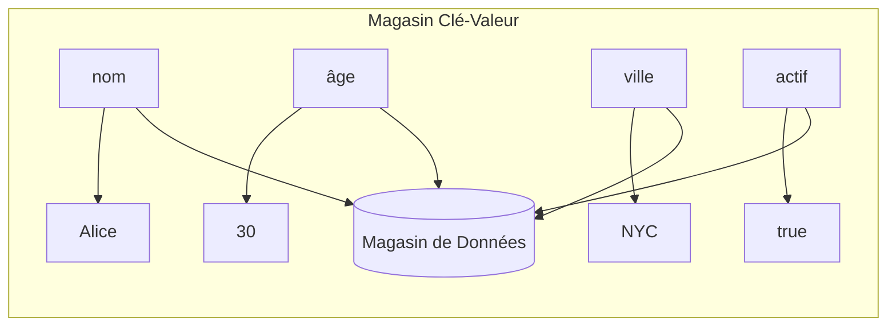
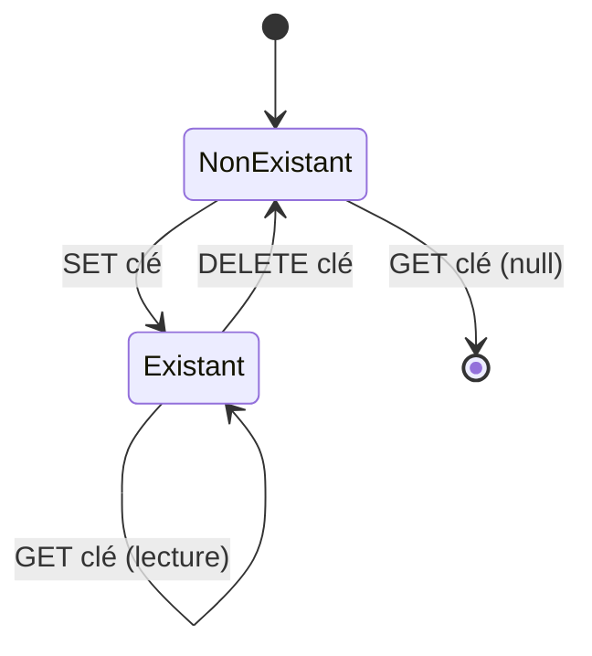
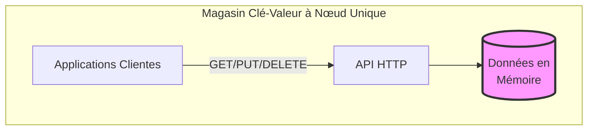

# Bases du Système de Magasin

> **Session 3, Partie 3** - 35 minutes (démo de codage + pratique)

## Objectifs d'Apprentissage

- [ ] Comprendre le modèle de données clé-valeur
- [ ] Construire un magasin clé-valeur à nœud unique en TypeScript
- [ ] Construire le même magasin en Python
- [ ] Déployer et tester le magasin en utilisant Docker Compose
- [ ] Effectuer des opérations de lecture/écriture de base via HTTP

## Qu'est-ce qu'un Magasin Clé-Valeur ?

Un **magasin clé-valeur** est le type le plus simple de base de données :



**Caractéristiques Clés :**
- Modèle de données simple : clé → valeur
- Recherches rapides par clé
- Pas de requêtes complexes
- Sans schéma

## Opérations de Base

| Opération | Description | Exemple |
|-----------|-------------|---------|
| **SET** | Stocker une valeur pour une clé | `SET user:1 Alice` |
| **GET** | Récupérer une valeur par clé | `GET user:1` → "Alice" |
| **DELETE** | Supprimer une clé | `DELETE user:1` |



## Implémentation

Nous allons construire un simple magasin clé-valeur basé sur HTTP avec des points de terminaison API REST.

### Conception de l'API

```
GET    /key/{clé}      - Obtenir la valeur par clé
PUT    /key/{clé}      - Définir la valeur pour la clé
DELETE /key/{clé}      - Supprimer la clé
GET    /keys           - Lister toutes les clés
```

---

## Implémentation TypeScript

### Structure du Projet

```
store-basics-ts/
├── package.json
├── tsconfig.json
├── Dockerfile
└── src/
    └── store.ts       # Implémentation complète du magasin
```

### Code TypeScript Complet

**store-basics-ts/src/store.ts**
```typescript
import http from 'http';

/**
 * Magasin clé-valeur simple en mémoire
 */
class KeyValueStore {
  private data: Map<string, any> = new Map();

  /**
   * Définir une paire clé-valeur
   */
  set(key: string, value: any): void {
    this.data.set(key, value);
    console.log(`[Store] SET ${key} = ${JSON.stringify(value)}`);
  }

  /**
   * Obtenir une valeur par clé
   */
  get(key: string): any {
    const value = this.data.get(key);
    console.log(`[Store] GET ${key} => ${value !== undefined ? JSON.stringify(value) : 'null'}`);
    return value;
  }

  /**
   * Supprimer une clé
   */
  delete(key: string): boolean {
    const existed = this.data.delete(key);
    console.log(`[Store] DELETE ${key} => ${existed ? 'succès' : 'non trouvé'}`);
    return existed;
  }

  /**
   * Obtenir toutes les clés
   */
  keys(): string[] {
    return Array.from(this.data.keys());
  }

  /**
   * Obtenir les statistiques du magasin
   */
  stats() {
    return {
      totalKeys: this.data.size,
      keys: this.keys()
    };
  }
}

// Créer l'instance du magasin
const store = new KeyValueStore();

/**
 * Serveur HTTP avec API clé-valeur
 */
const server = http.createServer((req, res) => {
  // Activer CORS
  res.setHeader('Access-Control-Allow-Origin', '*');
  res.setHeader('Access-Control-Allow-Methods', 'GET, PUT, DELETE, OPTIONS');
  res.setHeader('Access-Control-Allow-Headers', 'Content-Type');

  if (req.method === 'OPTIONS') {
    res.writeHead(200);
    res.end();
    return;
  }

  // Analyser l'URL
  const url = new URL(req.url || '', `http://${req.headers.host}`);

  // Route : GET /keys - Lister toutes les clés
  if (req.method === 'GET' && url.pathname === '/keys') {
    res.writeHead(200, { 'Content-Type': 'application/json' });
    res.end(JSON.stringify(store.stats()));
    return;
  }

  // Route : GET /key/{clé} - Obtenir la valeur
  if (req.method === 'GET' && url.pathname.startsWith('/key/')) {
    const key = url.pathname.slice(5); // Retirer '/key/'
    const value = store.get(key);

    if (value !== undefined) {
      res.writeHead(200, { 'Content-Type': 'application/json' });
      res.end(JSON.stringify({ key, value }));
    } else {
      res.writeHead(404, { 'Content-Type': 'application/json' });
      res.end(JSON.stringify({ error: 'Key not found', key }));
    }
    return;
  }

  // Route : PUT /key/{clé} - Définir la valeur
  if (req.method === 'PUT' && url.pathname.startsWith('/key/')) {
    const key = url.pathname.slice(5); // Retirer '/key/'

    let body = '';
    req.on('data', chunk => body += chunk);
    req.on('end', () => {
      try {
        const value = JSON.parse(body);
        store.set(key, value);

        res.writeHead(200, { 'Content-Type': 'application/json' });
        res.end(JSON.stringify({ success: true, key, value }));
      } catch (error) {
        res.writeHead(400, { 'Content-Type': 'application/json' });
        res.end(JSON.stringify({ error: 'Invalid JSON' }));
      }
    });
    return;
  }

  // Route : DELETE /key/{clé} - Supprimer la clé
  if (req.method === 'DELETE' && url.pathname.startsWith('/key/')) {
    const key = url.pathname.slice(5); // Retirer '/key/'
    const existed = store.delete(key);

    if (existed) {
      res.writeHead(200, { 'Content-Type': 'application/json' });
      res.end(JSON.stringify({ success: true, key }));
    } else {
      res.writeHead(404, { 'Content-Type': 'application/json' });
      res.end(JSON.stringify({ error: 'Key not found', key }));
    }
    return;
  }

  // 404 - Non trouvé
  res.writeHead(404, { 'Content-Type': 'application/json' });
  res.end(JSON.stringify({ error: 'Not found' }));
});

const PORT = process.env.PORT || 4000;
server.listen(PORT, () => {
  console.log(`Key-Value Store listening on port ${PORT}`);
  console.log(`\nAvailable endpoints:`);
  console.log(`  GET    /key/{key}    - Get value by key`);
  console.log(`  PUT    /key/{key}    - Set value for key`);
  console.log(`  DELETE /key/{key}    - Delete key`);
  console.log(`  GET    /keys         - List all keys`);
});
```

**store-basics-ts/package.json**
```json
{
  "name": "store-basics-ts",
  "version": "1.0.0",
  "description": "Simple key-value store in TypeScript",
  "main": "dist/store.js",
  "scripts": {
    "build": "tsc",
    "start": "node dist/store.js",
    "dev": "ts-node src/store.ts"
  },
  "dependencies": {},
  "devDependencies": {
    "@types/node": "^20.0.0",
    "typescript": "^5.0.0",
    "ts-node": "^10.9.0"
  }
}
```

**store-basics-ts/tsconfig.json**
```json
{
  "compilerOptions": {
    "target": "ES2020",
    "module": "commonjs",
    "outDir": "./dist",
    "rootDir": "./src",
    "strict": true,
    "esModuleInterop": true
  },
  "include": ["src/**/*"]
}
```

**store-basics-ts/Dockerfile**
```dockerfile
FROM node:18-alpine

WORKDIR /app

COPY package*.json ./
RUN npm install

COPY . .
RUN npm run build

EXPOSE 4000

CMD ["npm", "start"]
```

---

## Implémentation Python

### Structure du Projet

```
store-basics-py/
├── requirements.txt
├── Dockerfile
└── src/
    └── store.py       # Implémentation complète du magasin
```

### Code Python Complet

**store-basics-py/src/store.py**
```python
from http.server import HTTPServer, BaseHTTPRequestHandler
import json
from typing import Any, Dict
from urllib.parse import urlparse

class KeyValueStore:
    """Magasin clé-valeur simple en mémoire."""

    def __init__(self):
        self.data: Dict[str, Any] = {}

    def set(self, key: str, value: Any) -> None:
        """Stocker une paire clé-valeur."""
        self.data[key] = value
        print(f"[Store] SET {key} = {json.dumps(value)}")

    def get(self, key: str) -> Any:
        """Obtenir la valeur par clé."""
        value = self.data.get(key)
        print(f"[Store] GET {key} => {json.dumps(value) if value is not None else 'null'}")
        return value

    def delete(self, key: str) -> bool:
        """Supprimer une clé."""
        existed = key in self.data
        if existed:
            del self.data[key]
        print(f"[Store] DELETE {key} => {'success' if existed else 'not found'}")
        return existed

    def keys(self) -> list:
        """Obtenir toutes les clés."""
        return list(self.data.keys())

    def stats(self) -> dict:
        """Obtenir les statistiques du magasin."""
        return {
            'totalKeys': len(self.data),
            'keys': self.keys()
        }


# Créer l'instance du magasin
store = KeyValueStore()


class StoreHandler(BaseHTTPRequestHandler):
    """Gestionnaire de requêtes HTTP pour le magasin clé-valeur."""

    def send_json_response(self, status: int, data: dict):
        """Envoyer une réponse JSON."""
        self.send_response(status)
        self.send_header('Content-Type', 'application/json')
        self.send_header('Access-Control-Allow-Origin', '*')
        self.end_headers()
        self.wfile.write(json.dumps(data).encode())

    def do_OPTIONS(self):
        """Gérer les requêtes préalables CORS."""
        self.send_response(200)
        self.send_header('Access-Control-Allow-Origin', '*')
        self.send_header('Access-Control-Allow-Methods', 'GET, PUT, DELETE, OPTIONS')
        self.send_header('Access-Control-Allow-Headers', 'Content-Type')
        self.end_headers()

    def do_GET(self):
        """Gérer les requêtes GET."""
        parsed = urlparse(self.path)

        # GET /keys - Lister toutes les clés
        if parsed.path == '/keys':
            self.send_json_response(200, store.stats())
            return

        # GET /key/{clé} - Obtenir la valeur
        if parsed.path.startswith('/key/'):
            key = parsed.path[5:]  # Retirer '/key/'
            value = store.get(key)

            if value is not None:
                self.send_json_response(200, {'key': key, 'value': value})
            else:
                self.send_json_response(404, {'error': 'Key not found', 'key': key})
            return

        # 404
        self.send_json_response(404, {'error': 'Not found'})

    def do_PUT(self):
        """Gérer les requêtes PUT (définir valeur)."""
        parsed = urlparse(self.path)

        # PUT /key/{clé} - Définir la valeur
        if parsed.path.startswith('/key/'):
            key = parsed.path[5:]  # Retirer '/key/'

            content_length = int(self.headers.get('Content-Length', 0))
            body = self.rfile.read(content_length).decode('utf-8')

            try:
                value = json.loads(body)
                store.set(key, value)
                self.send_json_response(200, {'success': True, 'key': key, 'value': value})
            except json.JSONDecodeError:
                self.send_json_response(400, {'error': 'Invalid JSON'})
            return

        # 404
        self.send_json_response(404, {'error': 'Not found'})

    def do_DELETE(self):
        """Gérer les requêtes DELETE."""
        parsed = urlparse(self.path)

        # DELETE /key/{clé} - Supprimer la clé
        if parsed.path.startswith('/key/'):
            key = parsed.path[5:]  # Retirer '/key/'
            existed = store.delete(key)

            if existed:
                self.send_json_response(200, {'success': True, 'key': key})
            else:
                self.send_json_response(404, {'error': 'Key not found', 'key': key})
            return

        # 404
        self.send_json_response(404, {'error': 'Not found'})

    def log_message(self, format, *args):
        """Supprimer la journalisation par défaut."""
        pass


def run_server(port: int = 4000):
    """Démarrer le serveur HTTP."""
    server_address = ('', port)
    httpd = HTTPServer(server_address, StoreHandler)
    print(f"Key-Value Store listening on port {port}")
    print(f"\nAvailable endpoints:")
    print(f"  GET    /key/{{key}}    - Get value by key")
    print(f"  PUT    /key/{{key}}    - Set value for key")
    print(f"  DELETE /key/{{key}}    - Delete key")
    print(f"  GET    /keys         - List all keys")
    httpd.serve_forever()


if __name__ == '__main__':
    import os
    port = int(os.environ.get('PORT', 4000))
    run_server(port)
```

**store-basics-py/requirements.txt**
```
# Aucune dépendance externe requise - utilise uniquement la bibliothèque standard
```

**store-basics-py/Dockerfile**
```dockerfile
FROM python:3.11-alpine

WORKDIR /app

COPY requirements.txt ./
RUN pip install --no-cache-dir -r requirements.txt

COPY . .

EXPOSE 4000

CMD ["python", "src/store.py"]
```

---

## Configuration Docker Compose

### Version TypeScript

**examples/02-store/ts/docker-compose.yml**
```yaml
version: '3.8'

services:
  store:
    build: .
    ports:
      - "4000:4000"
    environment:
      - PORT=4000
    volumes:
      - ./src:/app/src
```

### Version Python

**examples/02-store/py/docker-compose.yml**
```yaml
version: '3.8'

services:
  store:
    build: .
    ports:
      - "4000:4000"
    environment:
      - PORT=4000
    volumes:
      - ./src:/app/src
```

---

## Exécution de l'Exemple

### Étape 1 : Démarrer le Magasin

**TypeScript :**
```bash
cd examples/02-store/ts
docker-compose up --build
```

**Python :**
```bash
cd examples/02-store/py
docker-compose up --build
```

Vous devriez voir :
```
store    | Key-Value Store listening on port 4000
store    |
store    | Available endpoints:
store    |   GET    /key/{key}    - Get value by key
store    |   PUT    /key/{key}    - Set value for key
store    |   DELETE /key/{key}    - Delete key
store    |   GET    /keys         - List all keys
```

### Étape 2 : Stocker Quelques Valeurs

```bash
# Stocker une chaîne
curl -X PUT http://localhost:4000/key/name \
  -H "Content-Type: application/json" \
  -d '"Alice"'

# Stocker un nombre
curl -X PUT http://localhost:4000/key/age \
  -H "Content-Type: application/json" \
  -d '30'

# Stocker un objet
curl -X PUT http://localhost:4000/key/user:1 \
  -H "Content-Type: application/json" \
  -d '{"name": "Alice", "age": 30, "city": "NYC"}'

# Stocker une liste
curl -X PUT http://localhost:4000/key/tags \
  -H "Content-Type: application/json" \
  -d '["distributed", "systems", "course"]'
```

### Étape 3 : Récupérer les Valeurs

```bash
# Obtenir une chaîne
curl http://localhost:4000/key/name
# Response: {"key":"name","value":"Alice"}

# Obtenir un nombre
curl http://localhost:4000/key/age
# Response: {"key":"age","value":30}

# Obtenir un objet
curl http://localhost:4000/key/user:1
# Response: {"key":"user:1","value":{"name":"Alice","age":30,"city":"NYC"}}

# Obtenir une liste
curl http://localhost:4000/key/tags
# Response: {"key":"tags","value":["distributed","systems","course"]}

# Essayer d'obtenir une clé inexistante
curl http://localhost:4000/key/nonexistent
# Response: {"error":"Key not found","key":"nonexistent"}
```

### Étape 4 : Lister Toutes les Clés

```bash
curl http://localhost:4000/keys
# Response: {"totalKeys":4,"keys":["name","age","user:1","tags"]}
```

### Étape 5 : Supprimer une Clé

```bash
# Supprimer une clé
curl -X DELETE http://localhost:4000/key/age
# Response: {"success":true,"key":"age"}

# Vérifier qu'elle a disparu
curl http://localhost:4000/key/age
# Response: {"error":"Key not found","key":"age"}

# Vérifier les clés restantes
curl http://localhost:4000/keys
# Response: {"totalKeys":3,"keys":["name","user:1","tags"]}
```

## Architecture du Système



## Exercices

### Exercice 1 : Ajouter le Support TTL (Time-To-Live)

Modifier le magasin pour expirer automatiquement les clés après un temps spécifié :

1. Ajouter un paramètre `ttl` optionnel à l'opération SET
2. Suivre quand chaque clé devrait expirer
3. Retourner null pour les clés expirées
4. Implémenter un mécanisme de nettoyage

**Indice :** Stocker les métadonnées alongside les valeurs, ou utiliser une carte d'expiration séparée.

### Exercice 2 : Ajouter des Motifs de Clés

Ajouter le support des caractères génériques pour les recherches de clés :

1. Implémenter `GET /keys?pattern=user:*` pour lister les clés correspondantes
2. Supporter les correspondances avec caractère générique `*` simple
3. Tester avec des motifs comme `user:*`, `*:admin`, etc.

### Exercice 3 : Ajouter la Persistance des Données

Actuellement les données sont perdues lorsque le serveur redémarre. Ajouter la persistance :

1. Sauvegarder les données dans un fichier JSON à chaque écriture
2. Charger les données depuis le fichier au démarrage
3. Gérer les écritures simultanées en toute sécurité

## Résumé

### Points Clés à Retenir

1. **Les magasins clé-valeur** sont des systèmes de stockage de données simples mais puissants
2. **Opérations de base :** SET, GET, DELETE
3. **L'API HTTP** fournit une interface simple pour l'accès à distance
4. **Les magasins à nœud unique** sont CA (Cohérent + Disponible) selon la perspective CAP
5. **Prochaines étapes :** Ajouter la réplication pour la tolérance aux pannes (Session 4)

### Vérifiez Votre Compréhension

- [ ] Quelles sont les quatre opérations de base que nous avons implémentées ?
- [ ] Comment notre magasin gère-t-il les requêtes pour les clés inexistantes ?
- [ ] Qu'arrive-t-il aux données lorsque le conteneur Docker s'arrête ?
- [ ] Pourquoi ce magasin à nœud unique est-il "CA" selon les termes CAP ?

## 🧠 Quiz du Chapitre

Testez votre maîtrise de ces concepts ! Ces questions mettront au défi votre compréhension et révéleront toute lacune dans vos connaissances.

{{#quiz ../../quizzes/data-store-basics.toml}}

## Et Ensuite

Notre simple magasin fonctionne, mais qu'arrive-t-il lorsqu'un nœud échoue ? Ajoutons la réplication : [Réplication](../data-store/04-replication.md) (Session 4)
