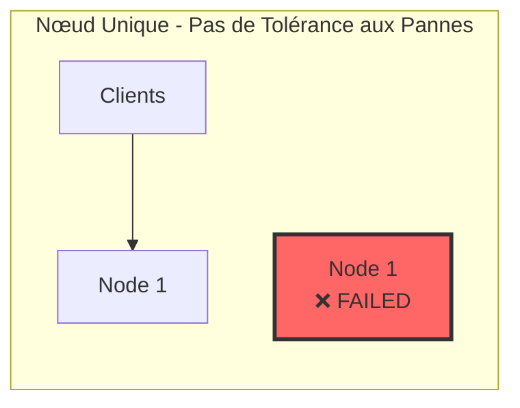
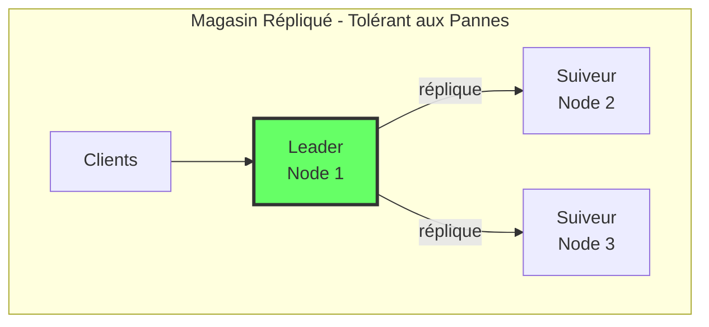
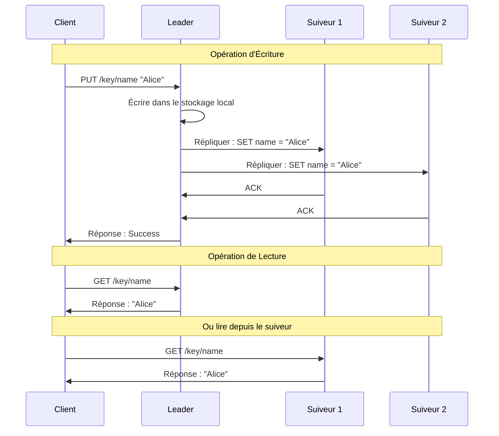
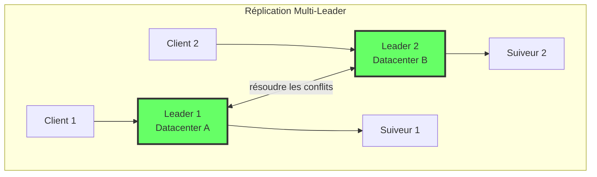
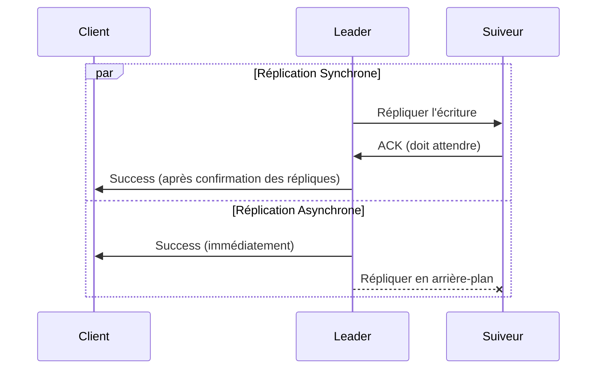
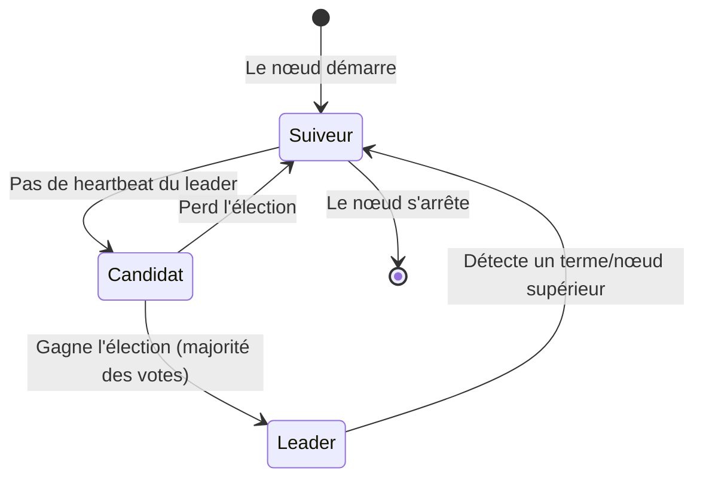
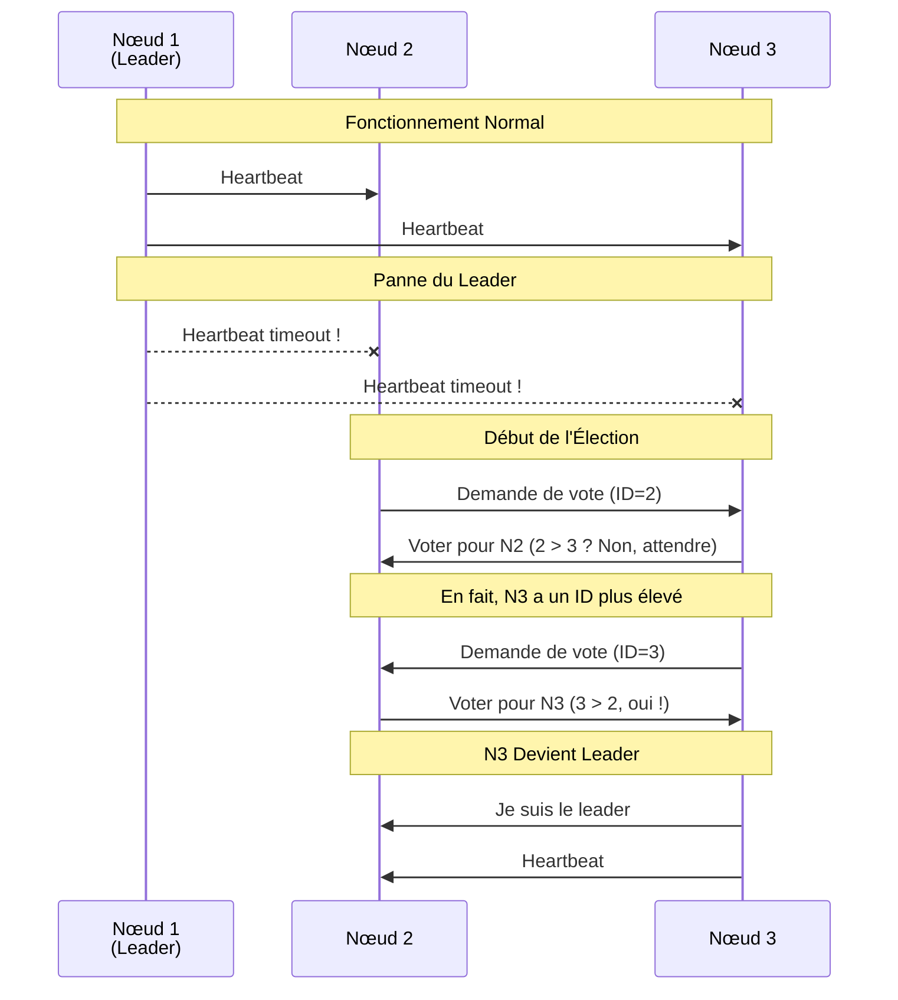
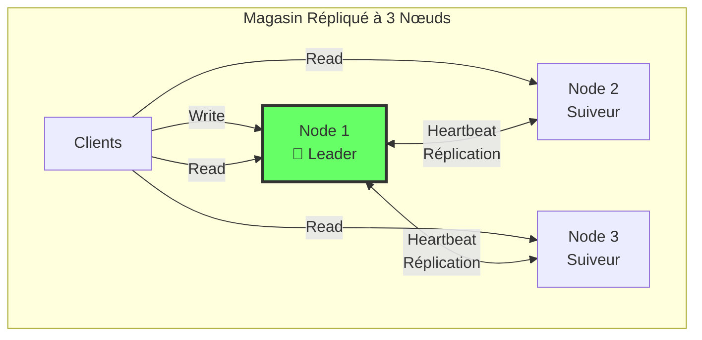

# Replication et Election de Leader

> **Session 4** - Session complète

## Objectifs d'Apprentissage

- [ ] Comprendre pourquoi nous répliquons les données
- [ ] Apprendre la réplication à leader unique vs multi-leader
- [ ] Implémenter la réplication basée sur un leader
- [ ] Construire un mécanisme simple d'élection de leader
- [ ] Déployer un magasin répliqué à 3 nœuds

## Pourquoi Répliquer les Données ?

Dans notre magasin à nœud unique de la Session 3, que se passe-t-il lorsque le nœud tombe en panne ?

**Réponse :** Toutes les données sont perdues et le système devient indisponible.



**La réplication résout ce problème en gardant des copies des données sur plusieurs nœuds :**



**Avantages de la Réplication :**
- **Tolérance aux pannes** : Si un nœud tombe en panne, les autres ont les données
- **Mise à l'échelle des lectures** : Les clients peuvent lire depuis n'importe quel réplica
- **Faible latence** : Placer les répliques plus près des utilisateurs
- **Haute disponibilité** : Le système continue pendant les pannes de nœuds

## Stratégies de Réplication

### Réplication à Leader Unique

Également appelée : primaire-réplique, maître-esclave, actif-passif



**Caractéristiques :**
- Le **Leader** gère toutes les écritures
- Les **Suiveurs** se répliquent depuis le leader
- Les **Lectures** peuvent aller vers le leader ou les suiveurs
- **Modèle de cohérence** simple

### Réplication Multi-Leader

Également appelée : multi-maître, actif-actif



**Caractéristiques :**
- Plusieurs nœuds acceptent les écritures
- Résolution de conflits plus complexe
- Mieux pour les configurations géo-distribuées
- **Nous ne l'implémenterons pas** (sujet avancé)

### Réplication Synchrone vs Asynchrone



| Stratégie | Avantages | Inconvénients |
|----------|-----------|---------------|
| **Synchrone** | Cohérence forte, aucune perte de données | Écritures plus lentes, bloquant |
| **Asynchrone** | Écritures rapides, non-bloquant | Perte de données en cas de panne du leader, lectures périmées |

**Pour ce cours, nous utiliserons la réplication asynchrone** pour simplifier.

## Élection de Leader

Lorsque le leader tombe en panne, les suiveurs doivent élire un nouveau leader :



### L'Algorithme du Bully

Un algorithme simple d'élection de leader :

1. **Détecter la panne du leader** : Pas de heartbeat pendant la période de timeout
2. **Démarrer l'élection** : Le nœud avec l'ID le plus élevé devient candidat leader
3. **Voter** : Les nœuds avec des numéros inférieurs votent pour le candidat
4. **Devenir leader** : Le candidat devient leader si la majorité est d'accord



**Pour simplifier, nous utiliserons une approche plus simple :**
- Le nœud avec l'ID le plus bas devient leader
- Si le leader tombe en panne, le prochain plus bas devient leader
- Pas de vote, juste une sélection basée sur l'ordre

---

## Implémentation

### Implémentation TypeScript

**Structure du Projet :**
```
replicated-store-ts/
├── package.json
├── tsconfig.json
├── Dockerfile
├── docker-compose.yml
└── src/
    └── node.ts       # Nœud répliqué avec élection de leader
```

**replicated-store-ts/src/node.ts**
```typescript
import http from 'http';

/**
 * Configuration du nœud
 */
const config = {
  nodeId: process.env.NODE_ID || 'node-1',
  port: parseInt(process.env.PORT || '4000'),
  peers: (process.env.PEERS || '').split(',').filter(Boolean),
  heartbeatInterval: 2000,  // ms
  electionTimeout: 6000,     // ms
};

type NodeRole = 'leader' | 'follower' | 'candidate';

/**
 * Nœud de Magasin Répliqué
 */
class StoreNode {
  public nodeId: string;
  public role: NodeRole;
  public term: number;
  public data: Map<string, any>;
  public peers: string[];

  private leaderId: string | null;
  private lastHeartbeat: number;
  private heartbeatTimer?: NodeJS.Timeout;
  private electionTimer?: NodeJS.Timeout;

  constructor(nodeId: string, peers: string[]) {
    this.nodeId = nodeId;
    this.role = 'follower';
    this.term = 0;
    this.data = new Map();
    this.peers = peers;
    this.leaderId = null;
    this.lastHeartbeat = Date.now();

    this.startElectionTimer();
    this.startHeartbeat();
  }

  /**
   * Démarrer le timer de timeout d'élection
   */
  private startElectionTimer() {
    this.electionTimer = setTimeout(() => {
      const timeSinceHeartbeat = Date.now() - this.lastHeartbeat;
      if (timeSinceHeartbeat > config.electionTimeout && this.role !== 'leader') {
        console.log(`[${this.nodeId}] Election timeout ! Démarrage de l'élection...`);
        this.startElection();
      }
      this.startElectionTimer();
    }, config.electionTimeout);
  }

  /**
   * Démarrer l'élection de leader (simplifié : l'ID le plus bas gagne)
   */
  private startElection() {
    this.term++;
    this.role = 'candidate';

    // Stratégie simple : le nœud avec l'ID le plus bas devient leader
    const allNodes = [this.nodeId, ...this.peers].sort();
    const lowestNode = allNodes[0];

    if (this.nodeId === lowestNode) {
      this.becomeLeader();
    } else {
      this.role = 'follower';
      this.leaderId = lowestNode;
      console.log(`[${this.nodeId}] En attente de ${lowestNode} pour devenir leader`);
    }
  }

  /**
   * Devenir le leader
   */
  private becomeLeader() {
    this.role = 'leader';
    this.leaderId = this.nodeId;
    console.log(`[${this.nodeId}] 👑 Devenu LEADER pour le terme ${this.term}`);

    // Répliquer immédiatement aux suiveurs
    this.replicateToFollowers();
  }

  /**
   * Démarrer le heartbeat vers les suiveurs
   */
  private startHeartbeat() {
    this.heartbeatTimer = setInterval(() => {
      if (this.role === 'leader') {
        this.sendHeartbeat();
      }
    }, config.heartbeatInterval);
  }

  /**
   * Envoyer le heartbeat à tous les suiveurs
   */
  private sendHeartbeat() {
    const heartbeat = {
      type: 'heartbeat',
      leaderId: this.nodeId,
      term: this.term,
      timestamp: Date.now(),
    };

    this.peers.forEach(peerUrl => {
      this.sendToPeer(peerUrl, '/internal/heartbeat', heartbeat)
        .catch(err => console.log(`[${this.nodeId}] Échec de l'envoi du heartbeat à ${peerUrl}:`, err.message));
    });
  }

  /**
   * Répliquer les données à tous les suiveurs
   */
  private replicateToFollowers() {
    // Convertir Map en objet pour la réplication
    const dataObj = Object.fromEntries(this.data);

    this.peers.forEach(peerUrl => {
      this.sendToPeer(peerUrl, '/internal/replicate', {
        type: 'replicate',
        leaderId: this.nodeId,
        term: this.term,
        data: dataObj,
      }).catch(err => console.log(`[${this.nodeId}] Réplication échouée vers ${peerUrl}:`, err.message));
    });
  }

  /**
   * Gérer le heartbeat du leader
   */
  handleHeartbeat(heartbeat: any) {
    if (heartbeat.term >= this.term) {
      this.term = heartbeat.term;
      this.lastHeartbeat = Date.now();
      this.leaderId = heartbeat.leaderId;
      this.role = 'follower';

      if (this.role !== 'follower') {
        console.log(`[${this.nodeId}] Rétrogradation en suiveur, terme ${this.term}`);
      }
    }
  }

  /**
   * Gérer la réplication du leader
   */
  handleReplication(message: any) {
    if (message.term >= this.term) {
      this.term = message.term;
      this.leaderId = message.leaderId;
      this.role = 'follower';
      this.lastHeartbeat = Date.now();

      // Fusionner les données répliquées
      Object.entries(message.data).forEach(([key, value]) => {
        this.data.set(key, value);
      });

      console.log(`[${this.nodeId}] ${Object.keys(message.data).length} clés répliquées depuis le leader`);
    }
  }

  /**
   * Envoyer des données à un nœud pair
   */
  private async sendToPeer(peerUrl: string, path: string, data: any): Promise<void> {
    return new Promise((resolve, reject) => {
      const url = new URL(path, peerUrl);
      const options = {
        method: 'POST',
        headers: { 'Content-Type': 'application/json' },
      };

      const req = http.request(url, options, (res) => {
        if (res.statusCode === 200) {
          resolve();
        } else {
          reject(new Error(`Status ${res.statusCode}`));
        }
      });

      req.on('error', reject);
      req.write(JSON.stringify(data));
      req.end();
    });
  }

  /**
   * Définir une paire clé-valeur (seulement sur le leader)
   */
  set(key: string, value: any): boolean {
    if (this.role !== 'leader') {
      return false;
    }

    this.data.set(key, value);
    console.log(`[${this.nodeId}] SET ${key} = ${JSON.stringify(value)}`);

    // Répliquer aux suiveurs
    this.replicateToFollowers();

    return true;
  }

  /**
   * Obtenir une valeur par clé
   */
  get(key: string): any {
    const value = this.data.get(key);
    console.log(`[${this.nodeId}] GET ${key} => ${value !== undefined ? JSON.stringify(value) : 'null'}`);
    return value;
  }

  /**
   * Supprimer une clé
   */
  delete(key: string): boolean {
    if (this.role !== 'leader') {
      return false;
    }

    const existed = this.data.delete(key);
    console.log(`[${this.nodeId}] DELETE ${key} => ${existed ? 'success' : 'not found'}`);

    // Répliquer aux suiveurs
    this.replicateToFollowers();

    return existed;
  }

  /**
   * Obtenir le statut du nœud
   */
  getStatus() {
    return {
      nodeId: this.nodeId,
      role: this.role,
      term: this.term,
      leaderId: this.leaderId,
      totalKeys: this.data.size,
      keys: Array.from(this.data.keys()),
    };
  }
}

// Créer le nœud
const node = new StoreNode(config.nodeId, config.peers);

/**
 * Serveur HTTP
 */
const server = http.createServer((req, res) => {
  res.setHeader('Content-Type', 'application/json');
  res.setHeader('Access-Control-Allow-Origin', '*');
  res.setHeader('Access-Control-Allow-Methods', 'GET, POST, PUT, DELETE, OPTIONS');
  res.setHeader('Access-Control-Allow-Headers', 'Content-Type');

  if (req.method === 'OPTIONS') {
    res.writeHead(200);
    res.end();
    return;
  }

  const url = new URL(req.url || '', `http://${req.headers.host}`);

  // Route : POST /internal/heartbeat - Heartbeat du leader
  if (req.method === 'POST' && url.pathname === '/internal/heartbeat') {
    let body = '';
    req.on('data', chunk => body += chunk);
    req.on('end', () => {
      try {
        const heartbeat = JSON.parse(body);
        node.handleHeartbeat(heartbeat);
        res.writeHead(200);
        res.end(JSON.stringify({ success: true }));
      } catch (error) {
        res.writeHead(400);
        res.end(JSON.stringify({ error: 'Invalid request' }));
      }
    });
    return;
  }

  // Route : POST /internal/replicate - Réplication du leader
  if (req.method === 'POST' && url.pathname === '/internal/replicate') {
    let body = '';
    req.on('data', chunk => body += chunk);
    req.on('end', () => {
      try {
        const message = JSON.parse(body);
        node.handleReplication(message);
        res.writeHead(200);
        res.end(JSON.stringify({ success: true }));
      } catch (error) {
        res.writeHead(400);
        res.end(JSON.stringify({ error: 'Invalid request' }));
      }
    });
    return;
  }

  // Route : GET /status - Statut du nœud
  if (req.method === 'GET' && url.pathname === '/status') {
    res.writeHead(200);
    res.end(JSON.stringify(node.getStatus()));
    return;
  }

  // Route : GET /key/{key} - Obtenir une valeur
  if (req.method === 'GET' && url.pathname.startsWith('/key/')) {
    const key = url.pathname.slice(5);
    const value = node.get(key);

    if (value !== undefined) {
      res.writeHead(200);
      res.end(JSON.stringify({ key, value, nodeRole: node.role }));
    } else {
      res.writeHead(404);
      res.end(JSON.stringify({ error: 'Key not found', key }));
    }
    return;
  }

  // Route : PUT /key/{key} - Définir une valeur (leader uniquement)
  if (req.method === 'PUT' && url.pathname.startsWith('/key/')) {
    const key = url.pathname.slice(5);

    if (node.role !== 'leader') {
      res.writeHead(503);
      res.end(JSON.stringify({
        error: 'Not the leader',
        currentRole: node.role,
        leaderId: node.leaderId || 'Unknown',
      }));
      return;
    }

    let body = '';
    req.on('data', chunk => body += chunk);
    req.on('end', () => {
      try {
        const value = JSON.parse(body);
        node.set(key, value);
        res.writeHead(200);
        res.end(JSON.stringify({ success: true, key, value, leaderId: node.nodeId }));
      } catch (error) {
        res.writeHead(400);
        res.end(JSON.stringify({ error: 'Invalid JSON' }));
      }
    });
    return;
  }

  // Route : DELETE /key/{key} - Supprimer une clé (leader uniquement)
  if (req.method === 'DELETE' && url.pathname.startsWith('/key/')) {
    const key = url.pathname.slice(5);

    if (node.role !== 'leader') {
      res.writeHead(503);
      res.end(JSON.stringify({
        error: 'Not the leader',
        currentRole: node.role,
        leaderId: node.leaderId || 'Unknown',
      }));
      return;
    }

    const existed = node.delete(key);
    if (existed) {
      res.writeHead(200);
      res.end(JSON.stringify({ success: true, key, leaderId: node.nodeId }));
    } else {
      res.writeHead(404);
      res.end(JSON.stringify({ error: 'Key not found', key }));
    }
    return;
  }

  // 404
  res.writeHead(404);
  res.end(JSON.stringify({ error: 'Not found' }));
});

server.listen(config.port, () => {
  console.log(`[${config.nodeId}] Store Node écoutant sur le port ${config.port}`);
  console.log(`[${config.nodeId}] Pairs : ${config.peers.join(', ') || 'none'}`);
  console.log(`[${config.nodeId}] Points de terminaison disponibles :`);
  console.log(`  GET  /status          - Statut et rôle du nœud`);
  console.log(`  GET  /key/{key}       - Obtenir une valeur`);
  console.log(`  PUT  /key/{key}       - Définir une valeur (leader uniquement)`);
  console.log(`  DEL  /key/{key}       - Supprimer une clé (leader uniquement)`);
});
```

**replicated-store-ts/package.json**
```json
{
  "name": "replicated-store-ts",
  "version": "1.0.0",
  "description": "Replicated key-value store with leader election in TypeScript",
  "main": "dist/node.js",
  "scripts": {
    "build": "tsc",
    "start": "node dist/node.js",
    "dev": "ts-node src/node.ts"
  },
  "dependencies": {},
  "devDependencies": {
    "@types/node": "^20.0.0",
    "typescript": "^5.0.0",
    "ts-node": "^10.9.0"
  }
}
```

**replicated-store-ts/tsconfig.json**
```json
{
  "compilerOptions": {
    "target": "ES2020",
    "module": "commonjs",
    "outDir": "./dist",
    "rootDir": "./src",
    "strict": true,
    "esModuleInterop": true
  },
  "include": ["src/**/*"]
}
```

**replicated-store-ts/Dockerfile**
```dockerfile
FROM node:18-alpine

WORKDIR /app

COPY package*.json ./
RUN npm install

COPY . .
RUN npm run build

EXPOSE 4000

CMD ["npm", "start"]
```

---

## Implémentation Python

**replicated-store-py/src/node.py**
```python
import os
import json
import time
import threading
from http.server import HTTPServer, BaseHTTPRequestHandler
from typing import Any, Dict, List, Optional
from urllib.parse import urlparse, parse_qs
from urllib.request import Request, urlopen
from urllib.error import URLError

class StoreNode:
    """Nœud de magasin répliqué avec élection de leader."""

    def __init__(self, node_id: str, peers: List[str]):
        self.node_id = node_id
        self.role: str = 'follower'  # leader, follower, candidate
        self.term = 0
        self.data: Dict[str, Any] = {}
        self.peers = peers
        self.leader_id: Optional[str] = None
        self.last_heartbeat = time.time()

        # Configuration
        self.heartbeat_interval = 2.0  # secondes
        self.election_timeout = 6.0     # secondes

        # Démarrer le timer d'élection
        self.start_election_timer()

        # Démarrer le thread de heartbeat
        self.start_heartbeat_thread()

    def start_election_timer(self):
        """Démarrer le timer de timeout d'élection."""
        def election_timer():
            while True:
                time.sleep(1)
                time_since = time.time() - self.last_heartbeat
                if time_since > self.election_timeout and self.role != 'leader':
                    print(f"[{self.node_id}] Election timeout ! Démarrage de l'élection...")
                    self.start_election()

        thread = threading.Thread(target=election_timer, daemon=True)
        thread.start()

    def start_election(self):
        """Démarrer l'élection de leader (le plus simple : l'ID le plus bas gagne)."""
        self.term += 1
        self.role = 'candidate'

        # Stratégie simple : le nœud avec l'ID le plus bas devient leader
        all_nodes = sorted([self.node_id] + self.peers)
        lowest_node = all_nodes[0]

        if self.node_id == lowest_node:
            self.become_leader()
        else:
            self.role = 'follower'
            self.leader_id = lowest_node
            print(f"[{self.node_id}] En attente de {lowest_node} pour devenir leader")

    def become_leader(self):
        """Devenir le leader."""
        self.role = 'leader'
        self.leader_id = self.node_id
        print(f"[{self.node_id}] 👑 Devenu LEADER pour le terme {self.term}")

        # Répliquer immédiatement aux suiveurs
        self.replicate_to_followers()

    def start_heartbeat_thread(self):
        """Démarrer le heartbeat vers les suiveurs."""
        def heartbeat_loop():
            while True:
                time.sleep(self.heartbeat_interval)
                if self.role == 'leader':
                    self.send_heartbeat()

        thread = threading.Thread(target=heartbeat_loop, daemon=True)
        thread.start()

    def send_heartbeat(self):
        """Envoyer le heartbeat à tous les suiveurs."""
        heartbeat = {
            'type': 'heartbeat',
            'leader_id': self.node_id,
            'term': self.term,
            'timestamp': int(time.time() * 1000),
        }

        for peer in self.peers:
            try:
                self.send_to_peer(peer, '/internal/heartbeat', heartbeat)
            except Exception as e:
                print(f"[{self.node_id}] Échec de l'envoi du heartbeat à {peer} : {e}")

    def replicate_to_followers(self):
        """Répliquer les données à tous les suiveurs."""
        message = {
            'type': 'replicate',
            'leader_id': self.node_id,
            'term': self.term,
            'data': self.data,
        }

        for peer in self.peers:
            try:
                self.send_to_peer(peer, '/internal/replicate', message)
            except Exception as e:
                print(f"[{self.node_id}] Réplication échouée vers {peer} : {e}")

    def handle_heartbeat(self, heartbeat: dict):
        """Gérer le heartbeat du leader."""
        if heartbeat['term'] >= self.term:
            self.term = heartbeat['term']
            self.last_heartbeat = time.time()
            self.leader_id = heartbeat['leader_id']

            if self.role != 'follower':
                print(f"[{self.node_id}] Rétrogradation en suiveur, terme {self.term}")
            self.role = 'follower'

    def handle_replication(self, message: dict):
        """Gérer la réplication du leader."""
        if message['term'] >= self.term:
            self.term = message['term']
            self.leader_id = message['leader_id']
            self.role = 'follower'
            self.last_heartbeat = time.time()

            # Fusionner les données répliquées
            self.data.update(message['data'])
            print(f"[{self.node_id}] {len(message['data'])} clés répliquées depuis le leader")

    def send_to_peer(self, peer_url: str, path: str, data: dict) -> None:
        """Envoyer des données à un nœud pair."""
        url = f"{peer_url}{path}"
        body = json.dumps(data).encode('utf-8')

        req = Request(url, data=body, headers={'Content-Type': 'application/json'}, method='POST')
        with urlopen(req, timeout=1) as response:
            if response.status != 200:
                raise Exception(f"Status {response.status}")

    def set(self, key: str, value: Any) -> bool:
        """Définir une paire clé-valeur (seulement sur le leader)."""
        if self.role != 'leader':
            return False

        self.data[key] = value
        print(f"[{self.node_id}] SET {key} = {json.dumps(value)}")

        # Répliquer aux suiveurs
        self.replicate_to_followers()

        return True

    def get(self, key: str) -> Any:
        """Obtenir une valeur par clé."""
        value = self.data.get(key)
        print(f"[{self.node_id}] GET {key} => {json.dumps(value) if value is not None else 'null'}")
        return value

    def delete(self, key: str) -> bool:
        """Supprimer une clé (seulement sur le leader)."""
        if self.role != 'leader':
            return False

        existed = key in self.data
        if existed:
            del self.data[key]

        print(f"[{self.node_id}] DELETE {key} => {'success' if existed else 'not found'}")

        # Répliquer aux suiveurs
        self.replicate_to_followers()

        return existed

    def get_status(self) -> dict:
        """Obtenir le statut du nœud."""
        return {
            'node_id': self.node_id,
            'role': self.role,
            'term': self.term,
            'leader_id': self.leader_id,
            'total_keys': len(self.data),
            'keys': list(self.data.keys()),
        }


# Créer le nœud
config = {
    'node_id': os.environ.get('NODE_ID', 'node-1'),
    'port': int(os.environ.get('PORT', '4000')),
    'peers': [p for p in os.environ.get('PEERS', '').split(',') if p],
}

node = StoreNode(config['node_id'], config['peers'])


class NodeHandler(BaseHTTPRequestHandler):
    """Gestionnaire de requêtes HTTP pour le nœud de magasin."""

    def send_json_response(self, status: int, data: dict):
        """Envoyer une réponse JSON."""
        self.send_response(status)
        self.send_header('Content-Type', 'application/json')
        self.send_header('Access-Control-Allow-Origin', '*')
        self.end_headers()
        self.wfile.write(json.dumps(data).encode())

    def do_OPTIONS(self):
        """Gérer le pré-vol CORS."""
        self.send_response(200)
        self.send_header('Access-Control-Allow-Origin', '*')
        self.send_header('Access-Control-Allow-Methods', 'GET, POST, PUT, DELETE, OPTIONS')
        self.send_header('Access-Control-Allow-Headers', 'Content-Type')
        self.end_headers()

    def do_POST(self):
        """Gérer les requêtes POST."""
        parsed = urlparse(self.path)

        # POST /internal/heartbeat
        if parsed.path == '/internal/heartbeat':
            content_length = int(self.headers.get('Content-Length', 0))
            body = self.rfile.read(content_length).decode('utf-8')

            try:
                heartbeat = json.loads(body)
                node.handle_heartbeat(heartbeat)
                self.send_json_response(200, {'success': True})
            except (json.JSONDecodeError, KeyError):
                self.send_json_response(400, {'error': 'Invalid request'})
            return

        # POST /internal/replicate
        if parsed.path == '/internal/replicate':
            content_length = int(self.headers.get('Content-Length', 0))
            body = self.rfile.read(content_length).decode('utf-8')

            try:
                message = json.loads(body)
                node.handle_replication(message)
                self.send_json_response(200, {'success': True})
            except (json.JSONDecodeError, KeyError):
                self.send_json_response(400, {'error': 'Invalid request'})
            return

        self.send_json_response(404, {'error': 'Not found'})

    def do_GET(self):
        """Gérer les requêtes GET."""
        parsed = urlparse(self.path)

        # GET /status
        if parsed.path == '/status':
            self.send_json_response(200, node.get_status())
            return

        # GET /key/{key}
        if parsed.path.startswith('/key/'):
            key = parsed.path[5:]  # Retirer '/key/'
            value = node.get(key)

            if value is not None:
                self.send_json_response(200, {'key': key, 'value': value, 'node_role': node.role})
            else:
                self.send_json_response(404, {'error': 'Key not found', 'key': key})
            return

        self.send_json_response(404, {'error': 'Not found'})

    def do_PUT(self):
        """Gérer les requêtes POST (définir une valeur)."""
        parsed = urlparse(self.path)

        # PUT /key/{key}
        if parsed.path.startswith('/key/'):
            key = parsed.path[5:]

            if node.role != 'leader':
                self.send_json_response(503, {
                    'error': 'Not the leader',
                    'current_role': node.role,
                    'leader_id': node.leader_id or 'Unknown',
                })
                return

            content_length = int(self.headers.get('Content-Length', 0))
            body = self.rfile.read(content_length).decode('utf-8')

            try:
                value = json.loads(body)
                node.set(key, value)
                self.send_json_response(200, {'success': True, 'key': key, 'value': value, 'leader_id': node.node_id})
            except json.JSONDecodeError:
                self.send_json_response(400, {'error': 'Invalid JSON'})
            return

        self.send_json_response(404, {'error': 'Not found'})

    def do_DELETE(self):
        """Gérer les requêtes DELETE."""
        parsed = urlparse(self.path)

        # DELETE /key/{key}
        if parsed.path.startswith('/key/'):
            key = parsed.path[5:]

            if node.role != 'leader':
                self.send_json_response(503, {
                    'error': 'Not the leader',
                    'current_role': node.role,
                    'leader_id': node.leader_id or 'Unknown',
                })
                return

            existed = node.delete(key)
            if existed:
                self.send_json_response(200, {'success': True, 'key': key, 'leader_id': node.node_id})
            else:
                self.send_json_response(404, {'error': 'Key not found', 'key': key})
            return

        self.send_json_response(404, {'error': 'Not found'})

    def log_message(self, format, *args):
        """Supprimer la journalisation par défaut."""
        pass


def run_server(port: int):
    """Démarrer le serveur HTTP."""
    server_address = ('', port)
    httpd = HTTPServer(server_address, NodeHandler)
    print(f"[{config['node_id']}] Store Node écoutant sur le port {port}")
    print(f"[{config['node_id']}] Pairs : {', '.join(config['peers']) or 'none'}")
    print(f"[{config['node_id']}] Points de terminaison disponibles :")
    print(f"  GET  /status          - Statut et rôle du nœud")
    print(f"  GET  /key/{{key}}       - Obtenir une valeur")
    print(f"  PUT  /key/{{key}}       - Définir une valeur (leader uniquement)")
    print(f"  DEL  /key/{{key}}       - Supprimer une clé (leader uniquement)")
    httpd.serve_forever()


if __name__ == '__main__':
    run_server(config['port'])
```

**replicated-store-py/requirements.txt**
```
# Pas de dépendances externes - utilise uniquement la bibliothèque standard
```

**replicated-store-py/Dockerfile**
```dockerfile
FROM python:3.11-alpine

WORKDIR /app

COPY requirements.txt ./
RUN pip install --no-cache-dir -r requirements.txt

COPY . .

EXPOSE 4000

CMD ["python", "src/node.py"]
```

---

## Configuration Docker Compose

### Version TypeScript

**examples/02-store/ts/docker-compose.yml**
```yaml
version: '3.8'

services:
  node1:
    build: .
    container_name: store-ts-node1
    ports:
      - "4001:4000"
    environment:
      - NODE_ID=node-1
      - PORT=4000
      - PEERS=http://node2:4000,http://node3:4000
    networks:
      - store-network

  node2:
    build: .
    container_name: store-ts-node2
    ports:
      - "4002:4000"
    environment:
      - NODE_ID=node-2
      - PORT=4000
      - PEERS=http://node1:4000,http://node3:4000
    networks:
      - store-network

  node3:
    build: .
    container_name: store-ts-node3
    ports:
      - "4003:4000"
    environment:
      - NODE_ID=node-3
      - PORT=4000
      - PEERS=http://node1:4000,http://node2:4000
    networks:
      - store-network

networks:
  store-network:
    driver: bridge
```

### Version Python

**examples/02-store/py/docker-compose.yml**
```yaml
version: '3.8'

services:
  node1:
    build: .
    container_name: store-py-node1
    ports:
      - "4001:4000"
    environment:
      - NODE_ID=node-1
      - PORT=4000
      - PEERS=http://node2:4000,http://node3:4000
    networks:
      - store-network

  node2:
    build: .
    container_name: store-py-node2
    ports:
      - "4002:4000"
    environment:
      - NODE_ID=node-2
      - PORT=4000
      - PEERS=http://node1:4000,http://node3:4000
    networks:
      - store-network

  node3:
    build: .
    container_name: store-py-node3
    ports:
      - "4003:4000"
    environment:
      - NODE_ID=node-3
      - PORT=4000
      - PEERS=http://node1:4000,http://node2:4000
    networks:
      - store-network

networks:
  store-network:
    driver: bridge
```

---

## Exécution de l'Exemple

### Étape 1 : Démarrer le Cluster à 3 Nœuds

**TypeScript :**
```bash
cd distributed-systems-course/examples/02-store/ts
docker-compose up --build
```

**Python :**
```bash
cd distributed-systems-course/examples/02-store/py
docker-compose up --build
```

Vous devriez voir l'élection de leader se produire automatiquement :
```
store-ts-node1 | [node-1] Store Node écoutant sur le port 4000
store-ts-node2 | [node-2] Store Node écoutant sur le port 4000
store-ts-node3 | [node-3] Store Node écoutant sur le port 4000
store-ts-node1 | [node-1] 👑 Devenu LEADER pour le terme 1
store-ts-node2 | [node-2] En attente de node-1 pour devenir leader
store-ts-node3 | [node-3] En attente de node-1 pour devenir leader
```

### Étape 2 : Vérifier le Statut des Nœuds

```bash
# Vérifier tous les nœuds
curl http://localhost:4001/status
curl http://localhost:4002/status
curl http://localhost:4003/status
```

Réponse du node-1 (leader) :
```json
{
  "nodeId": "node-1",
  "role": "leader",
  "term": 1,
  "leaderId": "node-1",
  "totalKeys": 0,
  "keys": []
}
```

Réponse du node-2 (suiveur) :
```json
{
  "nodeId": "node-2",
  "role": "follower",
  "term": 1,
  "leaderId": "node-1",
  "totalKeys": 0,
  "keys": []
}
```

### Étape 3 : Écrire au Leader

```bash
# Écrire au leader (node-1)
curl -X PUT http://localhost:4001/key/name \
  -H "Content-Type: application/json" \
  -d '"Alice"'

curl -X PUT http://localhost:4001/key/age \
  -H "Content-Type: application/json" \
  -d '30'

curl -X PUT http://localhost:4001/key/city \
  -H "Content-Type: application/json" \
  -d '"NYC"'
```

Réponse :
```json
{
  "success": true,
  "key": "name",
  "value": "Alice",
  "leaderId": "node-1"
}
```

### Étape 4 : Lire depuis les Suiveurs

Les données devraient être répliquées à tous les suiveurs :

```bash
curl http://localhost:4002/key/name
curl http://localhost:4003/key/city
```

Réponse :
```json
{
  "key": "name",
  "value": "Alice",
  "nodeRole": "follower"
}
```

### Étape 5 : Essayer d'Écrire à un Suiveur (Devrait Échouer)

```bash
curl -X PUT http://localhost:4002/key/test \
  -H "Content-Type: application/json" \
  -d '"should fail"'
```

Réponse :
```json
{
  "error": "Not the leader",
  "currentRole": "follower",
  "leaderId": "node-1"
}
```

### Étape 6 : Simuler une Panne de Leader

```bash
# Dans un terminal séparé, arrêter le leader
docker-compose stop node1

# Vérifier le statut de node-2 - devrait devenir le nouveau leader
curl http://localhost:4002/status
```

Après quelques secondes :
```
store-ts-node2 | [node-2] Election timeout ! Démarrage de l'élection...
store-ts-node2 | [node-2] 👑 Devenu LEADER pour le terme 2
store-ts-node3 | [node-3] En attente de node-2 pour devenir leader
```

### Étape 7 : Écrire au Nouveau Leader

```bash
# Maintenant node-2 est le leader
curl -X PUT http://localhost:4002/key/newleader \
  -H "Content-Type: application/json" \
  -d '"node-2"'
```

### Étape 8 : Redémarrer l'Ancien Leader

```bash
# Redémarrer node-1
docker-compose start node1

# Vérifier le statut - devrait devenir suiveur
curl http://localhost:4001/status
```

Réponse :
```json
{
  "nodeId": "node-1",
  "role": "follower",
  "term": 2,
  "leaderId": "node-2",
  ...
}
```

## Architecture du Système



## Exercices

### Exercice 1 : Tester la Tolérance aux Pannes

1. Démarrer le cluster et écrire quelques données
2. Arrêter différents nœuds un par un
3. Vérifier que le système continue de fonctionner
4. Que se passe-t-il lorsque vous arrêtez 2 nœuds sur 3 ?

### Exercice 2 : Observer le Délai de Réplication

1. Ajouter un petit délai (par ex. 100ms) à la réplication
2. Écrire des données au leader
3. Lire immédiatement depuis un suiveur
4. Que voyez-vous ? Cela démontre la **cohérence événementielle**.

### Exercice 3 : Améliorer l'Élection de Leader

L'élection actuelle est très simple. Essayez de l'améliorer :

1. Ajouter des timeouts d'élection aléatoires (comme Raft)
2. Implémenter un vrai vote (pas seulement le plus petit ID)
3. Ajouter un pré-vote pour éviter de perturber le leader actuel

## Résumé

### Points Clés à Retenir

1. La **Réplication** copie les données sur plusieurs nœuds pour la tolérance aux pannes
2. La **Réplication à leader unique** est simple mais toutes les écritures passent par le leader
3. **L'élection de leader** assure qu'un nouveau leader est choisi quand le leader actuel tombe en panne
4. La **Réplication asynchrone** est rapide mais peut perdre des données en cas de panne du leader
5. La **Cohérence lecture-après-écriture** n'est PAS garantie lors de la lecture depuis les suiveurs

### Compromis

| Approche | Avantages | Inconvénients |
|----------|-----------|---------------|
| Leader unique | Simple, cohérence forte | Le leader est un goulot d'étranglement, point de défaillance unique |
| Multi-leader | Pas de goulot d'étranglement, écritures n'importe où | Résolution de conflits complexe |
| Réplication synchrone | Aucune perte de données | Écritures lentes, bloquant |
| Réplication asynchrone | Écritures rapides | Perte de données possible, lectures périmées |

### Vérifiez Votre Compréhension

- [ ] Pourquoi répliquons-nous les données ?
- [ ] Quelle est la différence entre leader et suiveur ?
- [ ] Que se passe-t-il lorsqu'un client essaie d'écrire à un suiveur ?
- [ ] Comment fonctionne l'élection de leader dans notre implémentation ?
- [ ] Quel est le compromis entre la réplication synchrone et asynchrone ?

## 🧠 Quiz du Chapitre

Testez votre maîtrise de ces concepts ! Ces questions mettront au défi votre compréhension et révéleront toute lacune dans vos connaissances.

{{#quiz ../../quizzes/data-store-replication.toml}}

## Suite

Nous avons une réplication fonctionnelle, mais notre modèle de cohérence est basique. Explorons les niveaux de cohérence : [Modèles de Cohérence](07-consistency.md) (Session 5)
