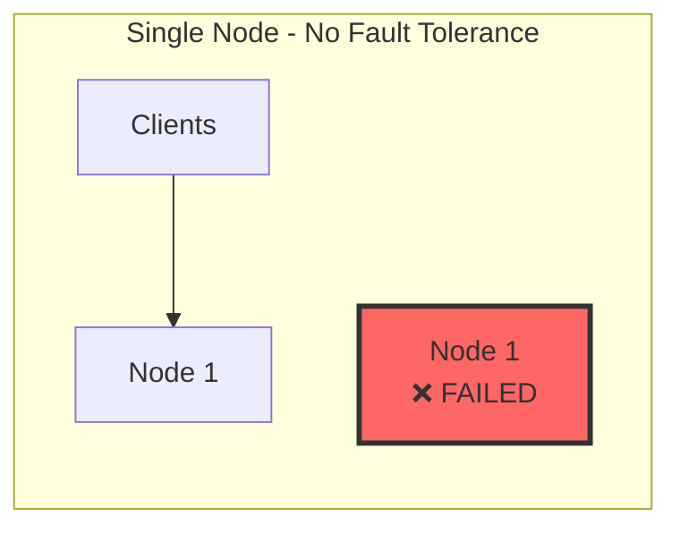
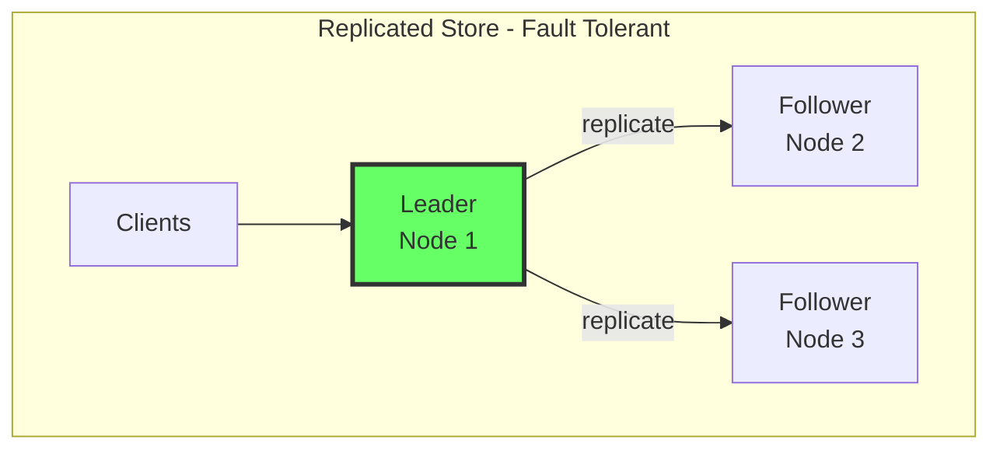
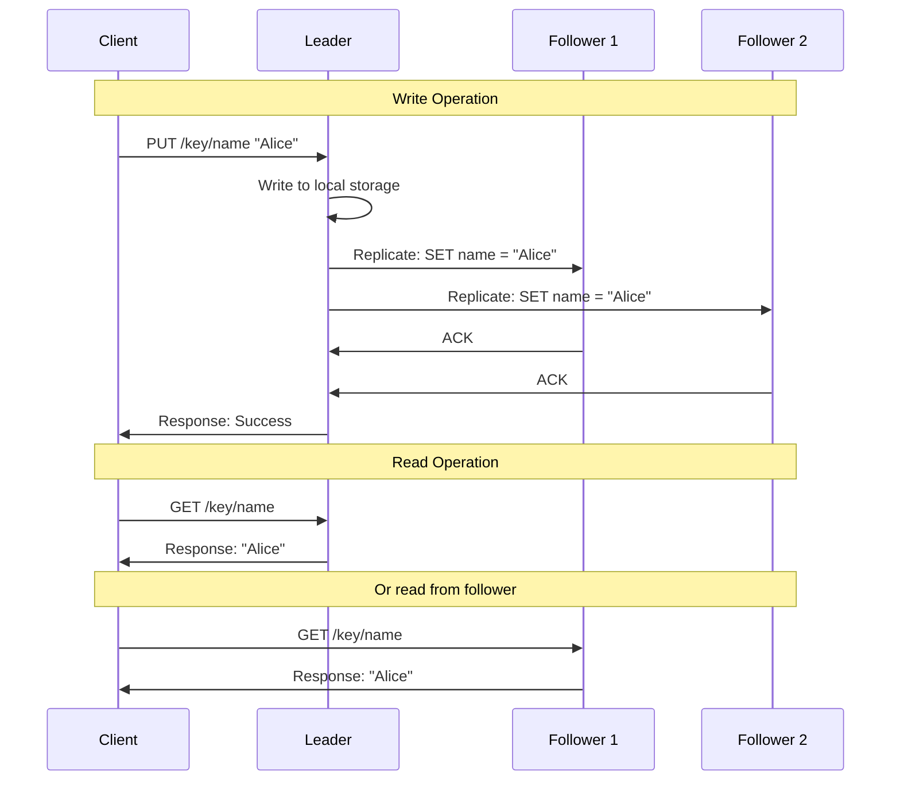
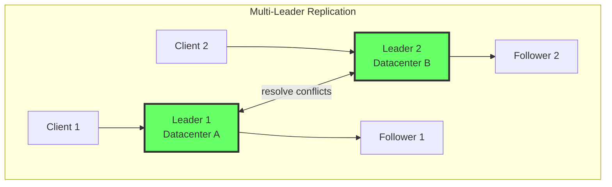
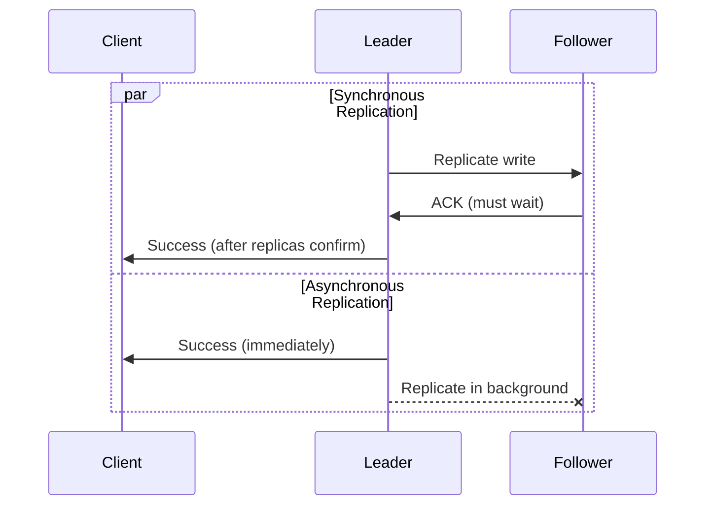
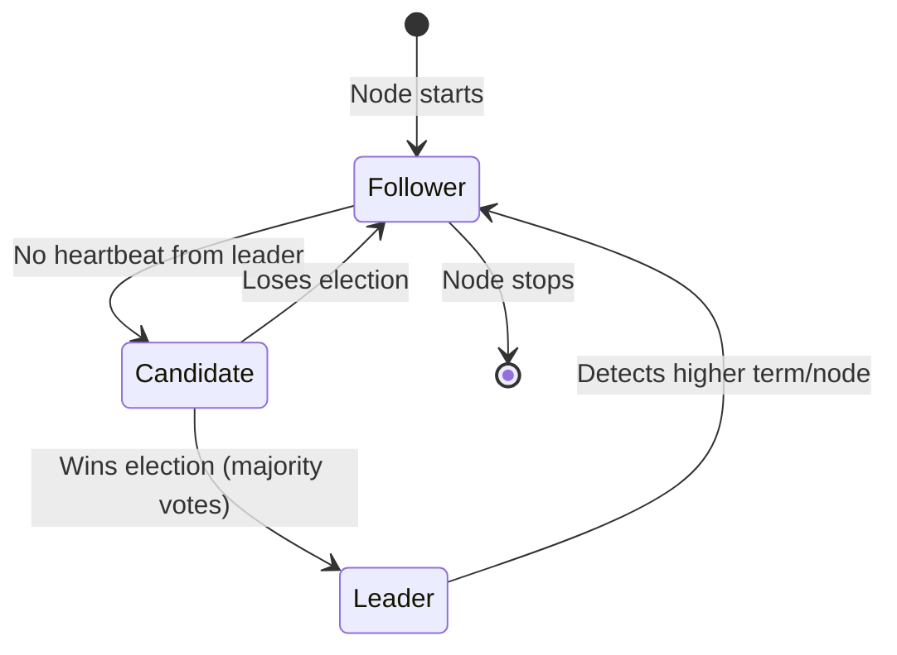
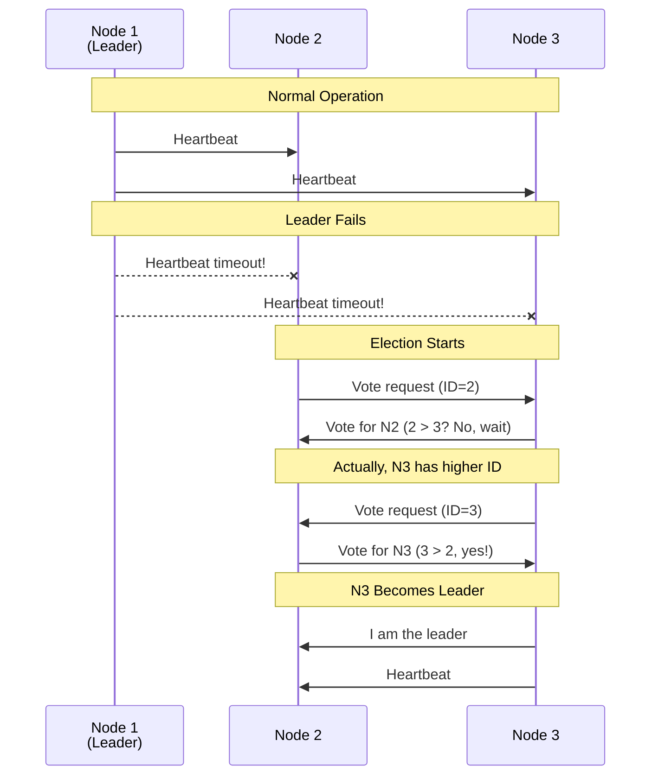
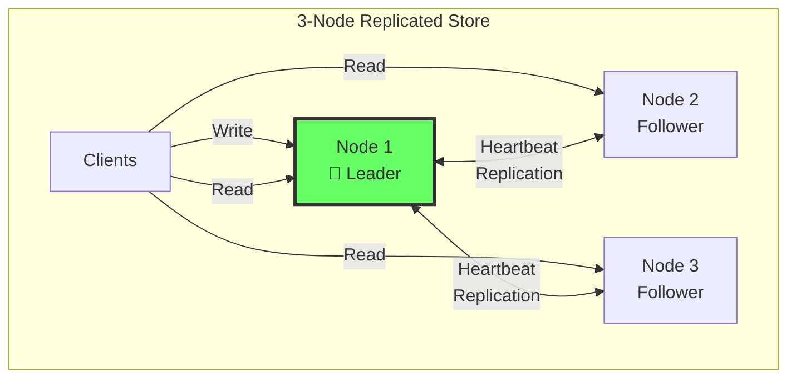

# Replication and Leader Election

> **Session 4** - Full session

## Learning Objectives

- [ ] Understand why we replicate data
- [ ] Learn single-leader vs multi-leader replication
- [ ] Implement leader-based replication
- [ ] Build a simple leader election mechanism
- [ ] Deploy a 3-node replicated store

## Why Replicate Data?

In our single-node store from Session 3, what happens when the node fails?

**Answer:** All data is lost and the system becomes unavailable.



**Replication solves this by keeping copies of data on multiple nodes:**



**Benefits of Replication:**
- **Fault tolerance**: If one node fails, others have the data
- **Read scaling**: Clients can read from any replica
- **Low latency**: Place replicas closer to users
- **High availability**: System continues during node failures

## Replication Strategies

### Single-Leader Replication

Also called: primary-replica, master-slave, active-passive



**Characteristics:**
- **Leader** handles all writes
- **Followers** replicate from leader
- **Reads** can go to leader or followers
- **Simple** consistency model

### Multi-Leader Replication

Also called: multi-master, active-active



**Characteristics:**
- Multiple nodes accept writes
- More complex conflict resolution
- Better for geo-distributed setups
- **We won't implement this** (advanced topic)

### Synchronous vs Asynchronous Replication



| Strategy | Pros | Cons |
|----------|------|------|
| **Synchronous** | Strong consistency, no data loss | Slower writes, blocking |
| **Asynchronous** | Fast writes, non-blocking | Data loss on leader failure, stale reads |

**For this course, we'll use asynchronous replication** for simplicity.

## Leader Election

When the leader fails, followers must elect a new leader:



### The Bully Algorithm

A simple leader election algorithm:

1. **Detect leader failure**: No heartbeat for timeout period
2. **Start election**: Node with highest ID becomes leader candidate
3. **Vote**: Lower-numbered nodes vote for the candidate
4. **Become leader**: Candidate becomes leader if majority agrees



**For simplicity, we'll use a simpler approach:**
- Lowest node ID becomes leader
- If leader fails, next lowest becomes leader
- No voting, just order-based selection

---

## Implementation

### TypeScript Implementation

**Project Structure:**
```
replicated-store-ts/
├── package.json
├── tsconfig.json
├── Dockerfile
├── docker-compose.yml
└── src/
    └── node.ts       # Replicated node with leader election
```

**replicated-store-ts/src/node.ts**
```typescript
import http from 'http';

/**
 * Node configuration
 */
const config = {
  nodeId: process.env.NODE_ID || 'node-1',
  port: parseInt(process.env.PORT || '4000'),
  peers: (process.env.PEERS || '').split(',').filter(Boolean),
  heartbeatInterval: 2000,  // ms
  electionTimeout: 6000,     // ms
};

type NodeRole = 'leader' | 'follower' | 'candidate';

/**
 * Replicated Store Node
 */
class StoreNode {
  public nodeId: string;
  public role: NodeRole;
  public term: number;
  public data: Map<string, any>;
  public peers: string[];

  private leaderId: string | null;
  private lastHeartbeat: number;
  private heartbeatTimer?: NodeJS.Timeout;
  private electionTimer?: NodeJS.Timeout;

  constructor(nodeId: string, peers: string[]) {
    this.nodeId = nodeId;
    this.role = 'follower';
    this.term = 0;
    this.data = new Map();
    this.peers = peers;
    this.leaderId = null;
    this.lastHeartbeat = Date.now();

    this.startElectionTimer();
    this.startHeartbeat();
  }

  /**
   * Start election timeout timer
   */
  private startElectionTimer() {
    this.electionTimer = setTimeout(() => {
      const timeSinceHeartbeat = Date.now() - this.lastHeartbeat;
      if (timeSinceHeartbeat > config.electionTimeout && this.role !== 'leader') {
        console.log(`[${this.nodeId}] Election timeout! Starting election...`);
        this.startElection();
      }
      this.startElectionTimer();
    }, config.electionTimeout);
  }

  /**
   * Start leader election (simplified: lowest ID wins)
   */
  private startElection() {
    this.term++;
    this.role = 'candidate';

    // Simple strategy: lowest node ID becomes leader
    const allNodes = [this.nodeId, ...this.peers].sort();
    const lowestNode = allNodes[0];

    if (this.nodeId === lowestNode) {
      this.becomeLeader();
    } else {
      this.role = 'follower';
      this.leaderId = lowestNode;
      console.log(`[${this.nodeId}] Waiting for ${lowestNode} to become leader`);
    }
  }

  /**
   * Become the leader
   */
  private becomeLeader() {
    this.role = 'leader';
    this.leaderId = this.nodeId;
    console.log(`[${this.nodeId}] 👑 Became LEADER for term ${this.term}`);

    // Immediately replicate to followers
    this.replicateToFollowers();
  }

  /**
   * Start heartbeat to followers
   */
  private startHeartbeat() {
    this.heartbeatTimer = setInterval(() => {
      if (this.role === 'leader') {
        this.sendHeartbeat();
      }
    }, config.heartbeatInterval);
  }

  /**
   * Send heartbeat to all followers
   */
  private sendHeartbeat() {
    const heartbeat = {
      type: 'heartbeat',
      leaderId: this.nodeId,
      term: this.term,
      timestamp: Date.now(),
    };

    this.peers.forEach(peerUrl => {
      this.sendToPeer(peerUrl, '/internal/heartbeat', heartbeat)
        .catch(err => console.log(`[${this.nodeId}] Failed to send heartbeat to ${peerUrl}:`, err.message));
    });
  }

  /**
   * Replicate data to all followers
   */
  private replicateToFollowers() {
    // Convert Map to object for replication
    const dataObj = Object.fromEntries(this.data);

    this.peers.forEach(peerUrl => {
      this.sendToPeer(peerUrl, '/internal/replicate', {
        type: 'replicate',
        leaderId: this.nodeId,
        term: this.term,
        data: dataObj,
      }).catch(err => console.log(`[${this.nodeId}] Replication failed to ${peerUrl}:`, err.message));
    });
  }

  /**
   * Handle heartbeat from leader
   */
  handleHeartbeat(heartbeat: any) {
    if (heartbeat.term >= this.term) {
      this.term = heartbeat.term;
      this.lastHeartbeat = Date.now();
      this.leaderId = heartbeat.leaderId;
      this.role = 'follower';

      if (this.role !== 'follower') {
        console.log(`[${this.nodeId}] Stepping down to follower, term ${this.term}`);
      }
    }
  }

  /**
   * Handle replication from leader
   */
  handleReplication(message: any) {
    if (message.term >= this.term) {
      this.term = message.term;
      this.leaderId = message.leaderId;
      this.role = 'follower';
      this.lastHeartbeat = Date.now();

      // Merge replicated data
      Object.entries(message.data).forEach(([key, value]) => {
        this.data.set(key, value);
      });

      console.log(`[${this.nodeId}] Replicated ${Object.keys(message.data).length} keys from leader`);
    }
  }

  /**
   * Send data to peer node
   */
  private async sendToPeer(peerUrl: string, path: string, data: any): Promise<void> {
    return new Promise((resolve, reject) => {
      const url = new URL(path, peerUrl);
      const options = {
        method: 'POST',
        headers: { 'Content-Type': 'application/json' },
      };

      const req = http.request(url, options, (res) => {
        if (res.statusCode === 200) {
          resolve();
        } else {
          reject(new Error(`Status ${res.statusCode}`));
        }
      });

      req.on('error', reject);
      req.write(JSON.stringify(data));
      req.end();
    });
  }

  /**
   * Set a key-value pair (only on leader)
   */
  set(key: string, value: any): boolean {
    if (this.role !== 'leader') {
      return false;
    }

    this.data.set(key, value);
    console.log(`[${this.nodeId}] SET ${key} = ${JSON.stringify(value)}`);

    // Replicate to followers
    this.replicateToFollowers();

    return true;
  }

  /**
   * Get a value by key
   */
  get(key: string): any {
    const value = this.data.get(key);
    console.log(`[${this.nodeId}] GET ${key} => ${value !== undefined ? JSON.stringify(value) : 'null'}`);
    return value;
  }

  /**
   * Delete a key
   */
  delete(key: string): boolean {
    if (this.role !== 'leader') {
      return false;
    }

    const existed = this.data.delete(key);
    console.log(`[${this.nodeId}] DELETE ${key} => ${existed ? 'success' : 'not found'}`);

    // Replicate to followers
    this.replicateToFollowers();

    return existed;
  }

  /**
   * Get node status
   */
  getStatus() {
    return {
      nodeId: this.nodeId,
      role: this.role,
      term: this.term,
      leaderId: this.leaderId,
      totalKeys: this.data.size,
      keys: Array.from(this.data.keys()),
    };
  }
}

// Create the node
const node = new StoreNode(config.nodeId, config.peers);

/**
 * HTTP Server
 */
const server = http.createServer((req, res) => {
  res.setHeader('Content-Type', 'application/json');
  res.setHeader('Access-Control-Allow-Origin', '*');
  res.setHeader('Access-Control-Allow-Methods', 'GET, POST, PUT, DELETE, OPTIONS');
  res.setHeader('Access-Control-Allow-Headers', 'Content-Type');

  if (req.method === 'OPTIONS') {
    res.writeHead(200);
    res.end();
    return;
  }

  const url = new URL(req.url || '', `http://${req.headers.host}`);

  // Route: POST /internal/heartbeat - Leader heartbeat
  if (req.method === 'POST' && url.pathname === '/internal/heartbeat') {
    let body = '';
    req.on('data', chunk => body += chunk);
    req.on('end', () => {
      try {
        const heartbeat = JSON.parse(body);
        node.handleHeartbeat(heartbeat);
        res.writeHead(200);
        res.end(JSON.stringify({ success: true }));
      } catch (error) {
        res.writeHead(400);
        res.end(JSON.stringify({ error: 'Invalid request' }));
      }
    });
    return;
  }

  // Route: POST /internal/replicate - Replication from leader
  if (req.method === 'POST' && url.pathname === '/internal/replicate') {
    let body = '';
    req.on('data', chunk => body += chunk);
    req.on('end', () => {
      try {
        const message = JSON.parse(body);
        node.handleReplication(message);
        res.writeHead(200);
        res.end(JSON.stringify({ success: true }));
      } catch (error) {
        res.writeHead(400);
        res.end(JSON.stringify({ error: 'Invalid request' }));
      }
    });
    return;
  }

  // Route: GET /status - Node status
  if (req.method === 'GET' && url.pathname === '/status') {
    res.writeHead(200);
    res.end(JSON.stringify(node.getStatus()));
    return;
  }

  // Route: GET /key/{key} - Get value
  if (req.method === 'GET' && url.pathname.startsWith('/key/')) {
    const key = url.pathname.slice(5);
    const value = node.get(key);

    if (value !== undefined) {
      res.writeHead(200);
      res.end(JSON.stringify({ key, value, nodeRole: node.role }));
    } else {
      res.writeHead(404);
      res.end(JSON.stringify({ error: 'Key not found', key }));
    }
    return;
  }

  // Route: PUT /key/{key} - Set value (leader only)
  if (req.method === 'PUT' && url.pathname.startsWith('/key/')) {
    const key = url.pathname.slice(5);

    if (node.role !== 'leader') {
      res.writeHead(503);
      res.end(JSON.stringify({
        error: 'Not the leader',
        currentRole: node.role,
        leaderId: node.leaderId || 'Unknown',
      }));
      return;
    }

    let body = '';
    req.on('data', chunk => body += chunk);
    req.on('end', () => {
      try {
        const value = JSON.parse(body);
        node.set(key, value);
        res.writeHead(200);
        res.end(JSON.stringify({ success: true, key, value, leaderId: node.nodeId }));
      } catch (error) {
        res.writeHead(400);
        res.end(JSON.stringify({ error: 'Invalid JSON' }));
      }
    });
    return;
  }

  // Route: DELETE /key/{key} - Delete key (leader only)
  if (req.method === 'DELETE' && url.pathname.startsWith('/key/')) {
    const key = url.pathname.slice(5);

    if (node.role !== 'leader') {
      res.writeHead(503);
      res.end(JSON.stringify({
        error: 'Not the leader',
        currentRole: node.role,
        leaderId: node.leaderId || 'Unknown',
      }));
      return;
    }

    const existed = node.delete(key);
    if (existed) {
      res.writeHead(200);
      res.end(JSON.stringify({ success: true, key, leaderId: node.nodeId }));
    } else {
      res.writeHead(404);
      res.end(JSON.stringify({ error: 'Key not found', key }));
    }
    return;
  }

  // 404
  res.writeHead(404);
  res.end(JSON.stringify({ error: 'Not found' }));
});

server.listen(config.port, () => {
  console.log(`[${config.nodeId}] Store Node listening on port ${config.port}`);
  console.log(`[${config.nodeId}] Peers: ${config.peers.join(', ') || 'none'}`);
  console.log(`[${config.nodeId}] Available endpoints:`);
  console.log(`  GET  /status          - Node status and role`);
  console.log(`  GET  /key/{key}       - Get value`);
  console.log(`  PUT  /key/{key}       - Set value (leader only)`);
  console.log(`  DEL  /key/{key}       - Delete key (leader only)`);
});
```

**replicated-store-ts/package.json**
```json
{
  "name": "replicated-store-ts",
  "version": "1.0.0",
  "description": "Replicated key-value store with leader election in TypeScript",
  "main": "dist/node.js",
  "scripts": {
    "build": "tsc",
    "start": "node dist/node.js",
    "dev": "ts-node src/node.ts"
  },
  "dependencies": {},
  "devDependencies": {
    "@types/node": "^20.0.0",
    "typescript": "^5.0.0",
    "ts-node": "^10.9.0"
  }
}
```

**replicated-store-ts/tsconfig.json**
```json
{
  "compilerOptions": {
    "target": "ES2020",
    "module": "commonjs",
    "outDir": "./dist",
    "rootDir": "./src",
    "strict": true,
    "esModuleInterop": true
  },
  "include": ["src/**/*"]
}
```

**replicated-store-ts/Dockerfile**
```dockerfile
FROM node:18-alpine

WORKDIR /app

COPY package*.json ./
RUN npm install

COPY . .
RUN npm run build

EXPOSE 4000

CMD ["npm", "start"]
```

---

## Python Implementation

**replicated-store-py/src/node.py**
```python
import os
import json
import time
import threading
from http.server import HTTPServer, BaseHTTPRequestHandler
from typing import Any, Dict, List, Optional
from urllib.parse import urlparse, parse_qs
from urllib.request import Request, urlopen
from urllib.error import URLError

class StoreNode:
    """Replicated store node with leader election."""

    def __init__(self, node_id: str, peers: List[str]):
        self.node_id = node_id
        self.role: str = 'follower'  # leader, follower, candidate
        self.term = 0
        self.data: Dict[str, Any] = {}
        self.peers = peers
        self.leader_id: Optional[str] = None
        self.last_heartbeat = time.time()

        # Configuration
        self.heartbeat_interval = 2.0  # seconds
        self.election_timeout = 6.0     # seconds

        # Start election timer
        self.start_election_timer()

        # Start heartbeat thread
        self.start_heartbeat_thread()

    def start_election_timer(self):
        """Start election timeout timer."""
        def election_timer():
            while True:
                time.sleep(1)
                time_since = time.time() - self.last_heartbeat
                if time_since > self.election_timeout and self.role != 'leader':
                    print(f"[{self.node_id}] Election timeout! Starting election...")
                    self.start_election()

        thread = threading.Thread(target=election_timer, daemon=True)
        thread.start()

    def start_election(self):
        """Start leader election (simplest: lowest ID wins)."""
        self.term += 1
        self.role = 'candidate'

        # Simple strategy: lowest node ID becomes leader
        all_nodes = sorted([self.node_id] + self.peers)
        lowest_node = all_nodes[0]

        if self.node_id == lowest_node:
            self.become_leader()
        else:
            self.role = 'follower'
            self.leader_id = lowest_node
            print(f"[{self.node_id}] Waiting for {lowest_node} to become leader")

    def become_leader(self):
        """Become the leader."""
        self.role = 'leader'
        self.leader_id = self.node_id
        print(f"[{self.node_id}] 👑 Became LEADER for term {self.term}")

        # Immediately replicate to followers
        self.replicate_to_followers()

    def start_heartbeat_thread(self):
        """Start heartbeat to followers."""
        def heartbeat_loop():
            while True:
                time.sleep(self.heartbeat_interval)
                if self.role == 'leader':
                    self.send_heartbeat()

        thread = threading.Thread(target=heartbeat_loop, daemon=True)
        thread.start()

    def send_heartbeat(self):
        """Send heartbeat to all followers."""
        heartbeat = {
            'type': 'heartbeat',
            'leader_id': self.node_id,
            'term': self.term,
            'timestamp': int(time.time() * 1000),
        }

        for peer in self.peers:
            try:
                self.send_to_peer(peer, '/internal/heartbeat', heartbeat)
            except Exception as e:
                print(f"[{self.node_id}] Failed to send heartbeat to {peer}: {e}")

    def replicate_to_followers(self):
        """Replicate data to all followers."""
        message = {
            'type': 'replicate',
            'leader_id': self.node_id,
            'term': self.term,
            'data': self.data,
        }

        for peer in self.peers:
            try:
                self.send_to_peer(peer, '/internal/replicate', message)
            except Exception as e:
                print(f"[{self.node_id}] Replication failed to {peer}: {e}")

    def handle_heartbeat(self, heartbeat: dict):
        """Handle heartbeat from leader."""
        if heartbeat['term'] >= self.term:
            self.term = heartbeat['term']
            self.last_heartbeat = time.time()
            self.leader_id = heartbeat['leader_id']

            if self.role != 'follower':
                print(f"[{self.node_id}] Stepping down to follower, term {self.term}")
            self.role = 'follower'

    def handle_replication(self, message: dict):
        """Handle replication from leader."""
        if message['term'] >= self.term:
            self.term = message['term']
            self.leader_id = message['leader_id']
            self.role = 'follower'
            self.last_heartbeat = time.time()

            # Merge replicated data
            self.data.update(message['data'])
            print(f"[{self.node_id}] Replicated {len(message['data'])} keys from leader")

    def send_to_peer(self, peer_url: str, path: str, data: dict) -> None:
        """Send data to peer node."""
        url = f"{peer_url}{path}"
        body = json.dumps(data).encode('utf-8')

        req = Request(url, data=body, headers={'Content-Type': 'application/json'}, method='POST')
        with urlopen(req, timeout=1) as response:
            if response.status != 200:
                raise Exception(f"Status {response.status}")

    def set(self, key: str, value: Any) -> bool:
        """Set a key-value pair (only on leader)."""
        if self.role != 'leader':
            return False

        self.data[key] = value
        print(f"[{self.node_id}] SET {key} = {json.dumps(value)}")

        # Replicate to followers
        self.replicate_to_followers()

        return True

    def get(self, key: str) -> Any:
        """Get a value by key."""
        value = self.data.get(key)
        print(f"[{self.node_id}] GET {key} => {json.dumps(value) if value is not None else 'null'}")
        return value

    def delete(self, key: str) -> bool:
        """Delete a key (only on leader)."""
        if self.role != 'leader':
            return False

        existed = key in self.data
        if existed:
            del self.data[key]

        print(f"[{self.node_id}] DELETE {key} => {'success' if existed else 'not found'}")

        # Replicate to followers
        self.replicate_to_followers()

        return existed

    def get_status(self) -> dict:
        """Get node status."""
        return {
            'node_id': self.node_id,
            'role': self.role,
            'term': self.term,
            'leader_id': self.leader_id,
            'total_keys': len(self.data),
            'keys': list(self.data.keys()),
        }


# Create the node
config = {
    'node_id': os.environ.get('NODE_ID', 'node-1'),
    'port': int(os.environ.get('PORT', '4000')),
    'peers': [p for p in os.environ.get('PEERS', '').split(',') if p],
}

node = StoreNode(config['node_id'], config['peers'])


class NodeHandler(BaseHTTPRequestHandler):
    """HTTP request handler for store node."""

    def send_json_response(self, status: int, data: dict):
        """Send a JSON response."""
        self.send_response(status)
        self.send_header('Content-Type', 'application/json')
        self.send_header('Access-Control-Allow-Origin', '*')
        self.end_headers()
        self.wfile.write(json.dumps(data).encode())

    def do_OPTIONS(self):
        """Handle CORS preflight."""
        self.send_response(200)
        self.send_header('Access-Control-Allow-Origin', '*')
        self.send_header('Access-Control-Allow-Methods', 'GET, POST, PUT, DELETE, OPTIONS')
        self.send_header('Access-Control-Allow-Headers', 'Content-Type')
        self.end_headers()

    def do_POST(self):
        """Handle POST requests."""
        parsed = urlparse(self.path)

        # POST /internal/heartbeat
        if parsed.path == '/internal/heartbeat':
            content_length = int(self.headers.get('Content-Length', 0))
            body = self.rfile.read(content_length).decode('utf-8')

            try:
                heartbeat = json.loads(body)
                node.handle_heartbeat(heartbeat)
                self.send_json_response(200, {'success': True})
            except (json.JSONDecodeError, KeyError):
                self.send_json_response(400, {'error': 'Invalid request'})
            return

        # POST /internal/replicate
        if parsed.path == '/internal/replicate':
            content_length = int(self.headers.get('Content-Length', 0))
            body = self.rfile.read(content_length).decode('utf-8')

            try:
                message = json.loads(body)
                node.handle_replication(message)
                self.send_json_response(200, {'success': True})
            except (json.JSONDecodeError, KeyError):
                self.send_json_response(400, {'error': 'Invalid request'})
            return

        self.send_json_response(404, {'error': 'Not found'})

    def do_GET(self):
        """Handle GET requests."""
        parsed = urlparse(self.path)

        # GET /status
        if parsed.path == '/status':
            self.send_json_response(200, node.get_status())
            return

        # GET /key/{key}
        if parsed.path.startswith('/key/'):
            key = parsed.path[5:]  # Remove '/key/'
            value = node.get(key)

            if value is not None:
                self.send_json_response(200, {'key': key, 'value': value, 'node_role': node.role})
            else:
                self.send_json_response(404, {'error': 'Key not found', 'key': key})
            return

        self.send_json_response(404, {'error': 'Not found'})

    def do_PUT(self):
        """Handle PUT requests (set value)."""
        parsed = urlparse(self.path)

        # PUT /key/{key}
        if parsed.path.startswith('/key/'):
            key = parsed.path[5:]

            if node.role != 'leader':
                self.send_json_response(503, {
                    'error': 'Not the leader',
                    'current_role': node.role,
                    'leader_id': node.leader_id or 'Unknown',
                })
                return

            content_length = int(self.headers.get('Content-Length', 0))
            body = self.rfile.read(content_length).decode('utf-8')

            try:
                value = json.loads(body)
                node.set(key, value)
                self.send_json_response(200, {'success': True, 'key': key, 'value': value, 'leader_id': node.node_id})
            except json.JSONDecodeError:
                self.send_json_response(400, {'error': 'Invalid JSON'})
            return

        self.send_json_response(404, {'error': 'Not found'})

    def do_DELETE(self):
        """Handle DELETE requests."""
        parsed = urlparse(self.path)

        # DELETE /key/{key}
        if parsed.path.startswith('/key/'):
            key = parsed.path[5:]

            if node.role != 'leader':
                self.send_json_response(503, {
                    'error': 'Not the leader',
                    'current_role': node.role,
                    'leader_id': node.leader_id or 'Unknown',
                })
                return

            existed = node.delete(key)
            if existed:
                self.send_json_response(200, {'success': True, 'key': key, 'leader_id': node.node_id})
            else:
                self.send_json_response(404, {'error': 'Key not found', 'key': key})
            return

        self.send_json_response(404, {'error': 'Not found'})

    def log_message(self, format, *args):
        """Suppress default logging."""
        pass


def run_server(port: int):
    """Start the HTTP server."""
    server_address = ('', port)
    httpd = HTTPServer(server_address, NodeHandler)
    print(f"[{config['node_id']}] Store Node listening on port {port}")
    print(f"[{config['node_id']}] Peers: {', '.join(config['peers']) or 'none'}")
    print(f"[{config['node_id']}] Available endpoints:")
    print(f"  GET  /status          - Node status and role")
    print(f"  GET  /key/{{key}}       - Get value")
    print(f"  PUT  /key/{{key}}       - Set value (leader only)")
    print(f"  DEL  /key/{{key}}       - Delete key (leader only)")
    httpd.serve_forever()


if __name__ == '__main__':
    run_server(config['port'])
```

**replicated-store-py/requirements.txt**
```
# No external dependencies - uses standard library only
```

**replicated-store-py/Dockerfile**
```dockerfile
FROM python:3.11-alpine

WORKDIR /app

COPY requirements.txt ./
RUN pip install --no-cache-dir -r requirements.txt

COPY . .

EXPOSE 4000

CMD ["python", "src/node.py"]
```

---

## Docker Compose Setup

### TypeScript Version

**examples/02-store/ts/docker-compose.yml**
```yaml
version: '3.8'

services:
  node1:
    build: .
    container_name: store-ts-node1
    ports:
      - "4001:4000"
    environment:
      - NODE_ID=node-1
      - PORT=4000
      - PEERS=http://node2:4000,http://node3:4000
    networks:
      - store-network

  node2:
    build: .
    container_name: store-ts-node2
    ports:
      - "4002:4000"
    environment:
      - NODE_ID=node-2
      - PORT=4000
      - PEERS=http://node1:4000,http://node3:4000
    networks:
      - store-network

  node3:
    build: .
    container_name: store-ts-node3
    ports:
      - "4003:4000"
    environment:
      - NODE_ID=node-3
      - PORT=4000
      - PEERS=http://node1:4000,http://node2:4000
    networks:
      - store-network

networks:
  store-network:
    driver: bridge
```

### Python Version

**examples/02-store/py/docker-compose.yml**
```yaml
version: '3.8'

services:
  node1:
    build: .
    container_name: store-py-node1
    ports:
      - "4001:4000"
    environment:
      - NODE_ID=node-1
      - PORT=4000
      - PEERS=http://node2:4000,http://node3:4000
    networks:
      - store-network

  node2:
    build: .
    container_name: store-py-node2
    ports:
      - "4002:4000"
    environment:
      - NODE_ID=node-2
      - PORT=4000
      - PEERS=http://node1:4000,http://node3:4000
    networks:
      - store-network

  node3:
    build: .
    container_name: store-py-node3
    ports:
      - "4003:4000"
    environment:
      - NODE_ID=node-3
      - PORT=4000
      - PEERS=http://node1:4000,http://node2:4000
    networks:
      - store-network

networks:
  store-network:
    driver: bridge
```

---

## Running the Example

### Step 1: Start the 3-Node Cluster

**TypeScript:**
```bash
cd distributed-systems-course/examples/02-store/ts
docker-compose up --build
```

**Python:**
```bash
cd distributed-systems-course/examples/02-store/py
docker-compose up --build
```

You should see leader election happen automatically:
```
store-ts-node1 | [node-1] Store Node listening on port 4000
store-ts-node2 | [node-2] Store Node listening on port 4000
store-ts-node3 | [node-3] Store Node listening on port 4000
store-ts-node1 | [node-1] 👑 Became LEADER for term 1
store-ts-node2 | [node-2] Waiting for node-1 to become leader
store-ts-node3 | [node-3] Waiting for node-1 to become leader
```

### Step 2: Check Node Status

```bash
# Check all nodes
curl http://localhost:4001/status
curl http://localhost:4002/status
curl http://localhost:4003/status
```

Response from node-1 (leader):
```json
{
  "nodeId": "node-1",
  "role": "leader",
  "term": 1,
  "leaderId": "node-1",
  "totalKeys": 0,
  "keys": []
}
```

Response from node-2 (follower):
```json
{
  "nodeId": "node-2",
  "role": "follower",
  "term": 1,
  "leaderId": "node-1",
  "totalKeys": 0,
  "keys": []
}
```

### Step 3: Write to Leader

```bash
# Write to leader (node-1)
curl -X PUT http://localhost:4001/key/name \
  -H "Content-Type: application/json" \
  -d '"Alice"'

curl -X PUT http://localhost:4001/key/age \
  -H "Content-Type: application/json" \
  -d '30'

curl -X PUT http://localhost:4001/key/city \
  -H "Content-Type: application/json" \
  -d '"NYC"'
```

Response:
```json
{
  "success": true,
  "key": "name",
  "value": "Alice",
  "leaderId": "node-1"
}
```

### Step 4: Read from Followers

Data should be replicated to all followers:

```bash
curl http://localhost:4002/key/name
curl http://localhost:4003/key/city
```

Response:
```json
{
  "key": "name",
  "value": "Alice",
  "nodeRole": "follower"
}
```

### Step 5: Try Writing to Follower (Should Fail)

```bash
curl -X PUT http://localhost:4002/key/test \
  -H "Content-Type: application/json" \
  -d '"should fail"'
```

Response:
```json
{
  "error": "Not the leader",
  "currentRole": "follower",
  "leaderId": "node-1"
}
```

### Step 6: Simulate Leader Failure

```bash
# In a separate terminal, stop the leader
docker-compose stop node1

# Check node-2 status - should become new leader
curl http://localhost:4002/status
```

After a few seconds:
```
store-ts-node2 | [node-2] Election timeout! Starting election...
store-ts-node2 | [node-2] 👑 Became LEADER for term 2
store-ts-node3 | [node-3] Waiting for node-2 to become leader
```

### Step 7: Write to New Leader

```bash
# Now node-2 is the leader
curl -X PUT http://localhost:4002/key/newleader \
  -H "Content-Type: application/json" \
  -d '"node-2"'
```

### Step 8: Restart Old Leader

```bash
# Restart node-1
docker-compose start node1

# Check status - should become follower
curl http://localhost:4001/status
```

Response:
```json
{
  "nodeId": "node-1",
  "role": "follower",
  "term": 2,
  "leaderId": "node-2",
  ...
}
```

## System Architecture



## Exercises

### Exercise 1: Test Fault Tolerance

1. Start the cluster and write some data
2. Stop different nodes one at a time
3. Verify the system continues operating
4. What happens when you stop 2 out of 3 nodes?

### Exercise 2: Observe Replication Lag

1. Add a small delay (e.g., 100ms) to replication
2. Write data to leader
3. Immediately read from follower
4. What do you see? This demonstrates **eventual consistency**.

### Exercise 3: Improve Leader Election

The current election is very simple. Try improving it:

1. Add random election timeouts (like Raft)
2. Implement actual voting (not just lowest ID)
3. Add pre-vote to prevent disrupting current leader

## Summary

### Key Takeaways

1. **Replication** copies data across multiple nodes for fault tolerance
2. **Single-leader replication** is simple but all writes go through leader
3. **Leader election** ensures a new leader is chosen when current leader fails
4. **Asynchronous replication** is fast but can lose data on leader failure
5. **Read-your-writes consistency** is NOT guaranteed when reading from followers

### Trade-offs

| Approach | Pros | Cons |
|----------|------|------|
| Single-leader | Simple, strong consistency | Leader is bottleneck, single point of failure |
| Multi-leader | No bottleneck, writes anywhere | Complex conflict resolution |
| Sync replication | No data loss | Slow writes, blocking |
| Async replication | Fast writes | Data loss possible, stale reads |

### Check Your Understanding

- [ ] Why do we replicate data?
- [ ] What's the difference between leader and follower?
- [ ] What happens when a client tries to write to a follower?
- [ ] How does leader election work in our implementation?
- [ ] What's the trade-off between sync and async replication?

## 🧠 Chapter Quiz

Test your mastery of these concepts! These questions will challenge your understanding and reveal any gaps in your knowledge.

{{#quiz ../../quizzes/data-store-replication.toml}}

## What's Next

We have replication working, but our consistency model is basic. Let's explore consistency levels: [Consistency Models](07-consistency.md) (Session 5)
