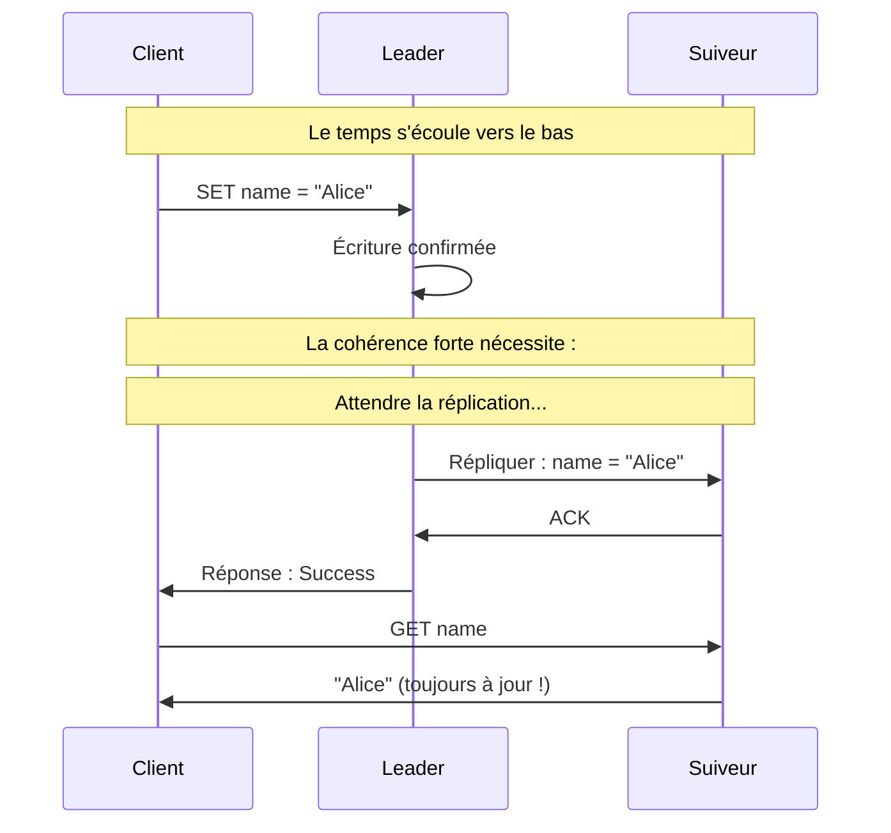
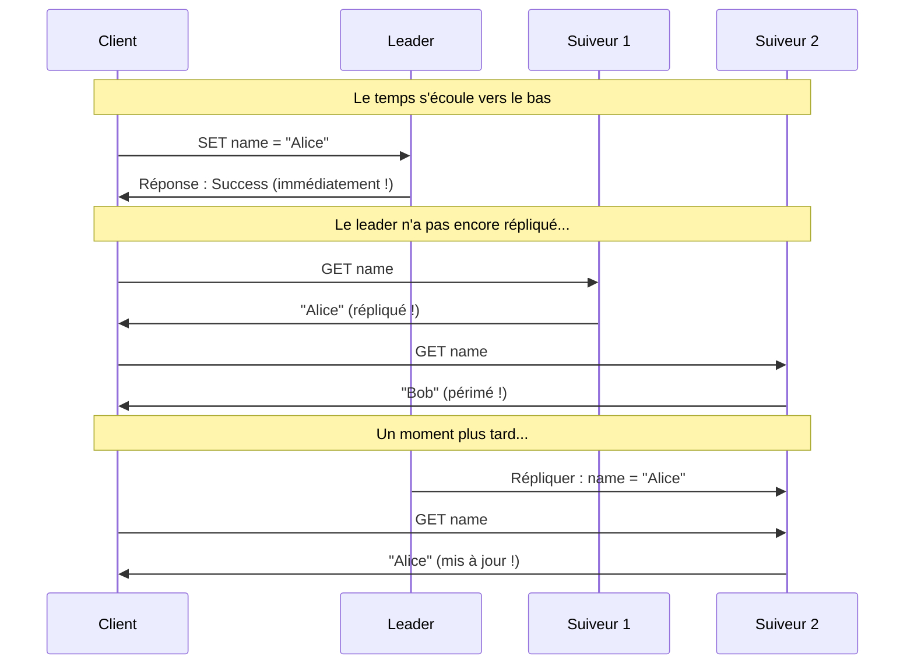
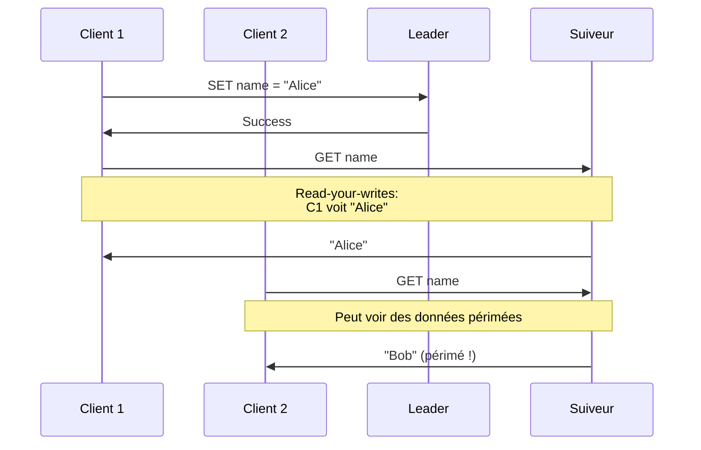
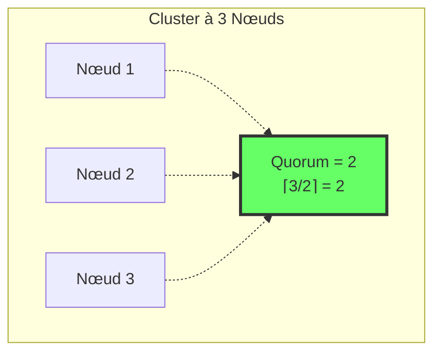
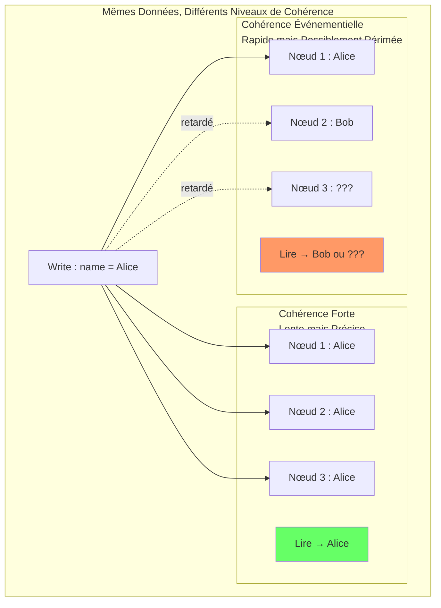

# Modèles de Cohérence

> **Session 5** - Session complète

## Objectifs d'Apprentissage

- [ ] Comprendre les différents modèles de cohérence dans les systèmes distribués
- [ ] Apprendre les compromis entre la cohérence forte et la cohérence événementielle
- [ ] Implémenter des niveaux de cohérence configurables dans un magasin répliqué
- [ ] Expérimenter les effets des niveaux de cohérence à travers des exercices pratiques

## Qu'est-ce que la Cohérence ?

Dans un magasin répliqué, la **cohérence** définit les garanties que vous avez sur les données que vous lisez. Lorsque les données sont copiées sur plusieurs nœuds, vous ne verrez pas toujours l'écriture la plus récente immédiatement.

```mermaid
graph TB
    subgraph "Une Écriture se Produit"
        C[Client]
        L[Leader]
        L -->|Write "name = Alice"| L
    end

    subgraph "Mais Que Lisez-Vous ?"
        F1[Suiveur 1<br/>name = Alice]
        F2[Suiveur 2<br/>name = ???]
        F3[Suiveur 3<br/>name = ???]

        C -->|Read| F1
        C -->|Read| F2
        C -->|Read| F3
    end
```

**La question :** Si vous lisez depuis un suiveur, verrez-vous "Alice" ou l'ancienne valeur ?

La réponse dépend de votre **modèle de cohérence**.

## Spectre de Cohérence

Les modèles de cohérence existent sur un spectre du plus fort au plus faible :


### Cohérence Forte

**Définition :** Chaque lecture reçoit l'écriture la plus récente ou une erreur.



**Caractéristiques :**
- Les lecteurs voient toujours les données les plus récentes
- Aucune lecture périmée possible
- Performances plus lentes (doit attendre la réplication)
- Modèle mental simple

**Quand l'utiliser :** Transactions financières, gestion des stocks, opérations critiques

### Cohérence Événementielle

**Définition :** Si aucune nouvelle mise à jour n'est faite, éventuellement tous les accès retourneront la dernière valeur mise à jour.



**Caractéristiques :**
- Les lectures sont rapides (pas d'attente de réplication)
- Vous pouvez voir des données périmées
- Éventuellement, tous les nœuds convergent
- Modèle mental plus complexe

**Quand l'utiliser :** Flux de médias sociaux, recommandations de produits, analyses

### Cohérence Read-Your-Writes

Un terrain d'entente : vous voyez toujours vos propres écritures, mais ne voyez pas forcément les écritures des autres immédiatement.



## Le Théorème CAP Réexaminé

Vous avez appris CAP dans la Session 4. Relions-le à la cohérence :

| Combinaison | Modèle de Cohérence | Systèmes Exemple |
|-------------|---------------------|------------------|
| **CP** | Cohérence forte | ZooKeeper, etcd, MongoDB (avec w:majority) |
| **AP** | Cohérence événementielle | Cassandra, DynamoDB, CouchDB |
| **CA** (impossible à grande échelle) | Cohérence forte | Bases de données à nœud unique (SGBDR) |

## Cohérence Basée sur Quorum

Un moyen pratique de contrôler la cohérence est d'utiliser des **quorums**. Un quorum est une majorité de nœuds.



### Quorum d'Écriture (W)

Nombre de nœuds qui doivent acquitter une écriture :

```
W > N/2  → Cohérence forte (majorité)
W = 1    → Rapide mais cohérence faible
W = N    → La plus forte mais la plus lente
```

### Quorum de Lecture (R)

Nombre de nœuds à interroger et comparer pour une lecture :

```
R + W > N  → Cohérence forte garantie
R + W ≤ N  → Cohérence événementielle
```

### Niveaux de Cohérence

| R + W | Cohérence | Performance | Cas d'Usage |
|-------|-------------|-------------|---------------|
| **N + 1 > N** (impossible) | La plus forte | Lente | Données critiques |
| **R + W > N** | Forte | Moyenne | Banque, stocks |
| **R + W ≤ N** | Événementielle | Rapide | Médias sociaux, cache |

---

## Implémentation

Nous allons étendre notre magasin répliqué de la Session 4 pour supporter des niveaux de cohérence configurables.

### Implémentation TypeScript

**Structure du Projet :**
```
consistent-store-ts/
├── package.json
├── tsconfig.json
├── Dockerfile
├── docker-compose.yml
└── src/
    └── node.ts       # Nœud avec cohérence configurable
```

**consistent-store-ts/src/node.ts**
```typescript
import http from 'http';

/**
 * Configuration du nœud
 */
const config = {
  nodeId: process.env.NODE_ID || 'node-1',
  port: parseInt(process.env.PORT || '4000'),
  peers: (process.env.PEERS || '').split(',').filter(Boolean),
  heartbeatInterval: 2000,
  electionTimeout: 6000,

  // Paramètres de cohérence
  writeQuorum: parseInt(process.env.WRITE_QUORUM || '2'),  // W
  readQuorum: parseInt(process.env.READ_QUORUM || '1'),    // R
};

type NodeRole = 'leader' | 'follower' | 'candidate';
type ConsistencyLevel = 'strong' | 'eventual' | 'read_your_writes';

/**
 * Nœud de Magasin Répliqué avec Cohérence Configurable
 */
class StoreNode {
  public nodeId: string;
  public role: NodeRole;
  public term: number;
  public data: Map<string, any>;
  public peers: string[];

  private leaderId: string | null;
  private lastHeartbeat: number;
  private heartbeatTimer?: NodeJS.Timeout;
  private electionTimer?: NodeJS.Timeout;
  private pendingWrites: Map<string, any[]>;  // Pour read-your-writes

  constructor(nodeId: string, peers: string[]) {
    this.nodeId = nodeId;
    this.role = 'follower';
    this.term = 0;
    this.data = new Map();
    this.peers = peers;
    this.leaderId = null;
    this.lastHeartbeat = Date.now();
    this.pendingWrites = new Map();

    this.startElectionTimer();
    this.startHeartbeat();
  }

  /**
   * Démarrer le timer de timeout d'élection
   */
  private startElectionTimer() {
    this.electionTimer = setTimeout(() => {
      const timeSinceHeartbeat = Date.now() - this.lastHeartbeat;
      if (timeSinceHeartbeat > config.electionTimeout && this.role !== 'leader') {
        console.log(`[${this.nodeId}] Election timeout ! Démarrage de l'élection...`);
        this.startElection();
      }
      this.startElectionTimer();
    }, config.electionTimeout);
  }

  /**
   * Démarrer l'élection de leader
   */
  private startElection() {
    this.term++;
    this.role = 'candidate';

    const allNodes = [this.nodeId, ...this.peers].sort();
    const lowestNode = allNodes[0];

    if (this.nodeId === lowestNode) {
      this.becomeLeader();
    } else {
      this.role = 'follower';
      this.leaderId = lowestNode;
      console.log(`[${this.nodeId}] En attente de ${lowestNode} pour devenir leader`);
    }
  }

  /**
   * Devenir leader
   */
  private becomeLeader() {
    this.role = 'leader';
    this.leaderId = this.nodeId;
    console.log(`[${this.nodeId}] 👑 Devenu LEADER pour le terme ${this.term}`);
    this.replicateToFollowers();
  }

  /**
   * Démarrer le heartbeat vers les suiveurs
   */
  private startHeartbeat() {
    this.heartbeatTimer = setInterval(() => {
      if (this.role === 'leader') {
        this.sendHeartbeat();
      }
    }, config.heartbeatInterval);
  }

  /**
   * Envoyer le heartbeat à tous les suiveurs
   */
  private sendHeartbeat() {
    const heartbeat = {
      type: 'heartbeat',
      leaderId: this.nodeId,
      term: this.term,
      timestamp: Date.now(),
    };

    this.peers.forEach(peerUrl => {
      this.sendToPeer(peerUrl, '/internal/heartbeat', heartbeat)
        .catch(err => console.log(`[${this.nodeId}] Échec du heartbeat vers ${peerUrl}`));
    });
  }

  /**
   * Répliquer les données aux suiveurs avec accusé de réception du quorum
   */
  private async replicateToFollowers(): Promise<boolean> {
    const dataObj = Object.fromEntries(this.data);

    // Envoyer à tous les suiveurs en parallèle
    const promises = this.peers.map(peerUrl =>
      this.sendToPeer(peerUrl, '/internal/replicate', {
        type: 'replicate',
        leaderId: this.nodeId,
        term: this.term,
        data: dataObj,
      }).catch(err => {
        console.log(`[${this.nodeId}] Réplication échouée vers ${peerUrl}`);
        return false;
      })
    );

    // Attendre que tous se terminent
    const results = await Promise.all(promises);

    // Compter les succès (ce nœud compte comme 1)
    const successes = results.filter(r => r !== false).length + 1;

    // Vérifier si nous avons atteint le quorum d'écriture
    const achievedQuorum = successes >= config.writeQuorum;
    console.log(`[${this.nodeId}] Réplication : ${successes}/${this.peers.length + 1} nœuds (W=${config.writeQuorum})`);

    return achievedQuorum;
  }

  /**
   * Gérer le heartbeat du leader
   */
  handleHeartbeat(heartbeat: any) {
    if (heartbeat.term >= this.term) {
      this.term = heartbeat.term;
      this.lastHeartbeat = Date.now();
      this.leaderId = heartbeat.leaderId;
      if (this.role !== 'follower') {
        this.role = 'follower';
      }
    }
  }

  /**
   * Gérer la réplication du leader
   */
  handleReplication(message: any) {
    if (message.term >= this.term) {
      this.term = message.term;
      this.leaderId = message.leaderId;
      this.role = 'follower';
      this.lastHeartbeat = Date.now();

      Object.entries(message.data).forEach(([key, value]) => {
        this.data.set(key, value);
      });
    }
  }

  /**
   * Envoyer des données à un nœud pair
   */
  private async sendToPeer(peerUrl: string, path: string, data: any): Promise<void> {
    return new Promise((resolve, reject) => {
      const url = new URL(path, peerUrl);
      const options = {
        method: 'POST',
        headers: { 'Content-Type': 'application/json' },
      };

      const req = http.request(url, options, (res) => {
        if (res.statusCode === 200) {
          resolve();
        } else {
          reject(new Error(`Status ${res.statusCode}`));
        }
      });

      req.on('error', reject);
      req.write(JSON.stringify(data));
      req.end();
    });
  }

  /**
   * Définir une paire clé-valeur avec accusé de réception du quorum
   */
  async set(key: string, value: any): Promise<{ success: boolean; achievedQuorum: boolean }> {
    if (this.role !== 'leader') {
      return { success: false, achievedQuorum: false };
    }

    this.data.set(key, value);
    console.log(`[${this.nodeId}] SET ${key} = ${JSON.stringify(value)}`);

    // Répliquer aux suiveurs
    const achievedQuorum = await this.replicateToFollowers();

    return { success: true, achievedQuorum };
  }

  /**
   * Obtenir une valeur avec cohérence configurable
   */
  async get(key: string, consistency: ConsistencyLevel = 'eventual'): Promise<any> {
    const localValue = this.data.get(key);

    // Pour la cohérence événementielle, retourner la valeur locale immédiatement
    if (consistency === 'eventual') {
      console.log(`[${this.nodeId}] GET ${key} => ${JSON.stringify(localValue)} (événementielle)`);
      return localValue;
    }

    // Pour la cohérence forte, interroger un quorum de nœuds
    if (consistency === 'strong') {
      const values = await this.getFromQuorum(key);
      console.log(`[${this.nodeId}] GET ${key} => ${JSON.stringify(values.latest)} (forte depuis ${values.responses} nœuds)`);
      return values.latest;
    }

    // Pour read-your-writes, vérifier les écritures en attente
    if (consistency === 'read_your_writes') {
      const pending = this.pendingWrites.get(key);
      const valueToReturn = pending && pending.length > 0 ? pending[pending.length - 1] : localValue;
      console.log(`[${this.nodeId}] GET ${key} => ${JSON.stringify(valueToReturn)} (read-your-writes)`);
      return valueToReturn;
    }

    return localValue;
  }

  /**
   * Interroger un quorum de nœuds et retourner la valeur la plus récente
   */
  private async getFromQuorum(key: string): Promise<{ latest: any; responses: number }> {
    // Interroger tous les pairs
    const promises = this.peers.map(peerUrl =>
      this.queryPeer(peerUrl, '/internal/get', { key })
        .then(result => ({ success: true, value: result.value, version: result.version || 0 }))
        .catch(err => {
          console.log(`[${this.nodeId}] Query échouée vers ${peerUrl}`);
          return { success: false, value: null, version: 0 };
        })
    );

    const results = await Promise.all(promises);

    // Ajouter la valeur locale
    results.push({
      success: true,
      value: this.data.get(key),
      version: this.data.has(key) ? 1 : 0,
    });

    // Compter les réponses réussies
    const successful = results.filter(r => r.success);

    // Retourner si nous avons le quorum de lecture
    if (successful.length >= config.readQuorum) {
      // Retourner la valeur la plus récente (version simple : première non-nulle)
      const latest = successful.find(r => r.value !== undefined)?.value;
      return { latest, responses: successful.length };
    }

    // Retour à la valeur locale
    return { latest: this.data.get(key), responses: successful.length };
  }

  /**
   * Interroger un pair pour une clé
   */
  private async queryPeer(peerUrl: string, path: string, data: any): Promise<any> {
    return new Promise((resolve, reject) => {
      const url = new URL(path, peerUrl);
      const options = {
        method: 'POST',
        headers: { 'Content-Type': 'application/json' },
      };

      const req = http.request(url, options, (res) => {
        let body = '';
        res.on('data', chunk => body += chunk);
        res.on('end', () => {
          if (res.statusCode === 200) {
            resolve(JSON.parse(body));
          } else {
            reject(new Error(`Status ${res.statusCode}`));
          }
        });
      });

      req.on('error', reject);
      req.write(JSON.stringify(data));
      req.end();
    });
  }

  /**
   * Supprimer une clé
   */
  async delete(key: string): Promise<{ success: boolean; achievedQuorum: boolean }> {
    if (this.role !== 'leader') {
      return { success: false, achievedQuorum: false };
    }

    const existed = this.data.delete(key);
    console.log(`[${this.nodeId}] DELETE ${key}`);

    await this.replicateToFollowers();

    return { success: existed, achievedQuorum: true };
  }

  /**
   * Obtenir le statut du nœud
   */
  getStatus() {
    return {
      nodeId: this.nodeId,
      role: this.role,
      term: this.term,
      leaderId: this.leaderId,
      totalKeys: this.data.size,
      keys: Array.from(this.data.keys()),
      config: {
        writeQuorum: config.writeQuorum,
        readQuorum: config.readQuorum,
        totalNodes: this.peers.length + 1,
      },
    };
  }
}

// Créer le nœud
const node = new StoreNode(config.nodeId, config.peers);

/**
 * Serveur HTTP
 */
const server = http.createServer((req, res) => {
  res.setHeader('Content-Type', 'application/json');
  res.setHeader('Access-Control-Allow-Origin', '*');
  res.setHeader('Access-Control-Allow-Methods', 'GET, POST, PUT, DELETE, OPTIONS');
  res.setHeader('Access-Control-Allow-Headers', 'Content-Type');

  if (req.method === 'OPTIONS') {
    res.writeHead(200);
    res.end();
    return;
  }

  const url = new URL(req.url || '', `http://${req.headers.host}`);

  // Route : POST /internal/heartbeat
  if (req.method === 'POST' && url.pathname === '/internal/heartbeat') {
    let body = '';
    req.on('data', chunk => body += chunk);
    req.on('end', () => {
      try {
        const heartbeat = JSON.parse(body);
        node.handleHeartbeat(heartbeat);
        res.writeHead(200);
        res.end(JSON.stringify({ success: true }));
      } catch (error) {
        res.writeHead(400);
        res.end(JSON.stringify({ error: 'Invalid request' }));
      }
    });
    return;
  }

  // Route : POST /internal/replicate
  if (req.method === 'POST' && url.pathname === '/internal/replicate') {
    let body = '';
    req.on('data', chunk => body += chunk);
    req.on('end', () => {
      try {
        const message = JSON.parse(body);
        node.handleReplication(message);
        res.writeHead(200);
        res.end(JSON.stringify({ success: true }));
      } catch (error) {
        res.writeHead(400);
        res.end(JSON.stringify({ error: 'Invalid request' }));
      }
    });
    return;
  }

  // Route : POST /internal/get - Requête interne pour les lectures de quorum
  if (req.method === 'POST' && url.pathname === '/internal/get') {
    let body = '';
    req.on('data', chunk => body += chunk);
    req.on('end', () => {
      try {
        const { key } = JSON.parse(body);
        const value = node.data.get(key);
        res.writeHead(200);
        res.end(JSON.stringify({ value, version: value !== undefined ? 1 : 0 }));
      } catch (error) {
        res.writeHead(400);
        res.end(JSON.stringify({ error: 'Invalid request' }));
      }
    });
    return;
  }

  // Route : GET /status
  if (req.method === 'GET' && url.pathname === '/status') {
    res.writeHead(200);
    res.end(JSON.stringify(node.getStatus()));
    return;
  }

  // Route : GET /key/{key}?consistency=strong|eventual|read_your_writes
  if (req.method === 'GET' && url.pathname.startsWith('/key/')) {
    const key = url.pathname.slice(5);
    const consistency = (url.searchParams.get('consistency') || 'eventual') as ConsistencyLevel;

    node.get(key, consistency).then(value => {
      if (value !== undefined) {
        res.writeHead(200);
        res.end(JSON.stringify({ key, value, nodeRole: node.role, consistency }));
      } else {
        res.writeHead(404);
        res.end(JSON.stringify({ error: 'Key not found', key }));
      }
    });
    return;
  }

  // Route : PUT /key/{key}
  if (req.method === 'PUT' && url.pathname.startsWith('/key/')) {
    const key = url.pathname.slice(5);

    if (node.role !== 'leader') {
      res.writeHead(503);
      res.end(JSON.stringify({
        error: 'Not the leader',
        currentRole: node.role,
        leaderId: node.leaderId || 'Unknown',
      }));
      return;
    }

    let body = '';
    req.on('data', chunk => body += chunk);
    req.on('end', () => {
      try {
        const value = JSON.parse(body);
        node.set(key, value).then(result => {
          res.writeHead(200);
          res.end(JSON.stringify({
            success: result.success,
            key,
            value,
            leaderId: node.nodeId,
            achievedQuorum: result.achievedQuorum,
            writeQuorum: config.writeQuorum,
          }));
        });
      } catch (error) {
        res.writeHead(400);
        res.end(JSON.stringify({ error: 'Invalid JSON' }));
      }
    });
    return;
  }

  // Route : DELETE /key/{key}
  if (req.method === 'DELETE' && url.pathname.startsWith('/key/')) {
    const key = url.pathname.slice(5);

    if (node.role !== 'leader') {
      res.writeHead(503);
      res.end(JSON.stringify({
        error: 'Not the leader',
        currentRole: node.role,
        leaderId: node.leaderId || 'Unknown',
      }));
      return;
    }

    node.delete(key).then(result => {
      if (result.success) {
        res.writeHead(200);
        res.end(JSON.stringify({ success: true, key, leaderId: node.nodeId }));
      } else {
        res.writeHead(404);
        res.end(JSON.stringify({ error: 'Key not found', key }));
      }
    });
    return;
  }

  // 404
  res.writeHead(404);
  res.end(JSON.stringify({ error: 'Not found' }));
});

server.listen(config.port, () => {
  console.log(`[${config.nodeId}] Consistent Store écoutant sur le port ${config.port}`);
  console.log(`[${config.nodeId}] Quorum d'Écriture (W) : ${config.writeQuorum}, Quorum de Lecture (R) : ${config.readQuorum}`);
  console.log(`[${config.nodeId}] Pairs : ${config.peers.join(', ') || 'none'}`);
  console.log(`[${config.nodeId}] Points de terminaison disponibles :`);
  console.log(`  GET  /status                         - Statut du nœud`);
  console.log(`  GET  /key/{key}?consistency=level   - Obtenir avec niveau de cohérence`);
  console.log(`  PUT  /key/{key}                      - Définir une valeur (leader uniquement)`);
  console.log(`  DEL  /key/{key}                      - Supprimer une clé (leader uniquement)`);
});
```

**consistent-store-ts/package.json**
```json
{
  "name": "consistent-store-ts",
  "version": "1.0.0",
  "description": "Replicated key-value store with configurable consistency",
  "main": "dist/node.js",
  "scripts": {
    "build": "tsc",
    "start": "node dist/node.js",
    "dev": "ts-node src/node.ts"
  },
  "dependencies": {},
  "devDependencies": {
    "@types/node": "^20.0.0",
    "typescript": "^5.0.0",
    "ts-node": "^10.9.0"
  }
}
```

**consistent-store-ts/tsconfig.json**
```json
{
  "compilerOptions": {
    "target": "ES2020",
    "module": "commonjs",
    "outDir": "./dist",
    "rootDir": "./src",
    "strict": true,
    "esModuleInterop": true
  },
  "include": ["src/**/*"]
}
```

**consistent-store-ts/Dockerfile**
```dockerfile
FROM node:18-alpine

WORKDIR /app

COPY package*.json ./
RUN npm install

COPY . .
RUN npm run build

EXPOSE 4000

CMD ["npm", "start"]
```

---

## Implémentation Python

**consistent-store-py/src/node.py**
```python
import os
import json
import time
import threading
import asyncio
from http.server import HTTPServer, BaseHTTPRequestHandler
from typing import Any, Dict, List, Optional, Literal
from urllib.parse import urlparse, parse_qs
from urllib.request import Request, urlopen
from urllib.error import URLError

ConsistencyLevel = Literal['strong', 'eventual', 'read_your_writes']

class StoreNode:
    """Nœud de magasin répliqué avec cohérence configurable."""

    def __init__(self, node_id: str, peers: List[str]):
        self.node_id = node_id
        self.role: str = 'follower'
        self.term = 0
        self.data: Dict[str, Any] = {}
        self.peers = peers
        self.leader_id: Optional[str] = None
        self.last_heartbeat = time.time()
        self.pending_writes: Dict[str, List[Any]] = {}

        # Configuration
        self.heartbeat_interval = 2.0
        self.election_timeout = 6.0
        self.write_quorum = int(os.environ.get('WRITE_QUORUM', '2'))
        self.read_quorum = int(os.environ.get('READ_QUORUM', '1'))

        # Démarrer les timers
        self.start_election_timer()
        self.start_heartbeat_thread()

    def start_election_timer(self):
        """Démarrer le timer de timeout d'élection."""
        def election_timer():
            while True:
                time.sleep(1)
                time_since = time.time() - self.last_heartbeat
                if time_since > self.election_timeout and self.role != 'leader':
                    print(f"[{self.node_id}] Election timeout ! Démarrage de l'élection...")
                    self.start_election()

        thread = threading.Thread(target=election_timer, daemon=True)
        thread.start()

    def start_election(self):
        """Démarrer l'élection de leader."""
        self.term += 1
        self.role = 'candidate'

        all_nodes = sorted([self.node_id] + self.peers)
        lowest_node = all_nodes[0]

        if self.node_id == lowest_node:
            self.become_leader()
        else:
            self.role = 'follower'
            self.leader_id = lowest_node
            print(f"[{self.node_id}] En attente de {lowest_node} pour devenir leader")

    def become_leader(self):
        """Devenir leader."""
        self.role = 'leader'
        self.leader_id = self.node_id
        print(f"[{self.node_id}] 👑 Devenu LEADER pour le terme {self.term}")
        self.replicate_to_followers()

    def start_heartbeat_thread(self):
        """Démarrer le heartbeat vers les suiveurs."""
        def heartbeat_loop():
            while True:
                time.sleep(self.heartbeat_interval)
                if self.role == 'leader':
                    self.send_heartbeat()

        thread = threading.Thread(target=heartbeat_loop, daemon=True)
        thread.start()

    def send_heartbeat(self):
        """Envoyer le heartbeat à tous les suiveurs."""
        heartbeat = {
            'type': 'heartbeat',
            'leader_id': self.node_id,
            'term': self.term,
            'timestamp': int(time.time() * 1000),
        }

        for peer in self.peers:
            try:
                self.send_to_peer(peer, '/internal/heartbeat', heartbeat)
            except Exception as e:
                print(f"[{self.node_id}] Échec du heartbeat vers {peer} : {e}")

    def replicate_to_followers(self) -> bool:
        """Répliquer les données aux suiveurs et vérifier le quorum."""
        message = {
            'type': 'replicate',
            'leader_id': self.node_id,
            'term': self.term,
            'data': self.data,
        }

        successes = 1  # Ce nœud compte

        for peer in self.peers:
            try:
                self.send_to_peer(peer, '/internal/replicate', message)
                successes += 1
            except Exception as e:
                print(f"[{self.node_id}] Réplication échouée vers {peer} : {e}")

        achieved_quorum = successes >= self.write_quorum
        print(f"[{self.node_id}] Réplication : {successes}/{len(self.peers) + 1} nœuds (W={self.write_quorum})")

        return achieved_quorum

    def handle_heartbeat(self, heartbeat: dict):
        """Gérer le heartbeat du leader."""
        if heartbeat['term'] >= self.term:
            self.term = heartbeat['term']
            self.last_heartbeat = time.time()
            self.leader_id = heartbeat['leader_id']
            if self.role != 'follower':
                self.role = 'follower'

    def handle_replication(self, message: dict):
        """Gérer la réplication du leader."""
        if message['term'] >= self.term:
            self.term = message['term']
            self.leader_id = message['leader_id']
            self.role = 'follower'
            self.last_heartbeat = time.time()
            self.data.update(message['data'])

    def send_to_peer(self, peer_url: str, path: str, data: dict) -> None:
        """Envoyer des données à un nœud pair."""
        url = f"{peer_url}{path}"
        body = json.dumps(data).encode('utf-8')

        req = Request(url, data=body, headers={'Content-Type': 'application/json'}, method='POST')
        with urlopen(req, timeout=1) as response:
            if response.status != 200:
                raise Exception(f"Status {response.status}")

    def set(self, key: str, value: Any) -> Dict[str, Any]:
        """Définir une paire clé-valeur avec accusé de réception du quorum."""
        if self.role != 'leader':
            return {'success': False, 'achieved_quorum': False}

        self.data[key] = value
        print(f"[{self.node_id}] SET {key} = {json.dumps(value)}")

        achieved_quorum = self.replicate_to_followers()

        return {'success': True, 'achieved_quorum': achieved_quorum}

    def get(self, key: str, consistency: ConsistencyLevel = 'eventual') -> Any:
        """Obtenir une valeur avec cohérence configurable."""
        local_value = self.data.get(key)

        if consistency == 'eventual':
            print(f"[{self.node_id}] GET {key} => {json.dumps(local_value)} (événementielle)")
            return local_value

        if consistency == 'strong':
            latest, responses = self.get_from_quorum(key)
            print(f"[{self.node_id}] GET {key} => {json.dumps(latest)} (forte depuis {responses} nœuds)")
            return latest

        if consistency == 'read_your_writes':
            pending = self.pending_writes.get(key, [])
            value_to_return = pending[-1] if pending else local_value
            print(f"[{self.node_id}] GET {key} => {json.dumps(value_to_return)} (read-your-writes)")
            return value_to_return

        return local_value

    def get_from_quorum(self, key: str) -> tuple:
        """Interroger un quorum de nœuds et retourner la valeur la plus récente."""
        results = []

        # Interroger tous les pairs
        for peer in self.peers:
            try:
                result = self.query_peer(peer, '/internal/get', {'key': key})
                results.append({
                    'success': True,
                    'value': result.get('value'),
                    'version': result.get('version', 0),
                })
            except Exception as e:
                print(f"[{self.node_id}] Query échouée vers {peer} : {e}")
                results.append({'success': False, 'value': None, 'version': 0})

        # Ajouter la valeur locale
        results.append({
            'success': True,
            'value': self.data.get(key),
            'version': 1 if key in self.data else 0,
        })

        # Filtrer les réponses réussies
        successful = [r for r in results if r['success']]

        if len(successful) >= self.read_quorum:
            # Retourner la première valeur non-nulle
            for r in successful:
                if r['value'] is not None:
                    return r['value'], len(successful)

        return self.data.get(key), len(successful)

    def query_peer(self, peer_url: str, path: str, data: dict) -> dict:
        """Interroger un pair pour une clé."""
        url = f"{peer_url}{path}"
        body = json.dumps(data).encode('utf-8')

        req = Request(url, data=body, headers={'Content-Type': 'application/json'}, method='POST')
        with urlopen(req, timeout=1) as response:
            if response.status == 200:
                return json.loads(response.read().decode('utf-8'))
            raise Exception(f"Status {response.status}")

    def delete(self, key: str) -> Dict[str, Any]:
        """Supprimer une clé."""
        if self.role != 'leader':
            return {'success': False, 'achieved_quorum': False}

        existed = key in self.data
        if existed:
            del self.data[key]

        print(f"[{self.node_id}] DELETE {key}")
        self.replicate_to_followers()

        return {'success': existed, 'achieved_quorum': True}

    def get_status(self) -> dict:
        """Obtenir le statut du nœud."""
        return {
            'node_id': self.node_id,
            'role': self.role,
            'term': self.term,
            'leader_id': self.leader_id,
            'total_keys': len(self.data),
            'keys': list(self.data.keys()),
            'config': {
                'write_quorum': self.write_quorum,
                'read_quorum': self.read_quorum,
                'total_nodes': len(self.peers) + 1,
            },
        }


# Créer le nœud
config = {
    'node_id': os.environ.get('NODE_ID', 'node-1'),
    'port': int(os.environ.get('PORT', '4000')),
    'peers': [p for p in os.environ.get('PEERS', '').split(',') if p],
}

node = StoreNode(config['node_id'], config['peers'])


class NodeHandler(BaseHTTPRequestHandler):
    """Gestionnaire de requêtes HTTP pour le nœud de magasin."""

    def send_json_response(self, status: int, data: dict):
        """Envoyer une réponse JSON."""
        self.send_response(status)
        self.send_header('Content-Type', 'application/json')
        self.send_header('Access-Control-Allow-Origin', '*')
        self.end_headers()
        self.wfile.write(json.dumps(data).encode())

    def do_OPTIONS(self):
        """Gérer le pré-vol CORS."""
        self.send_response(200)
        self.send_header('Access-Control-Allow-Origin', '*')
        self.send_header('Access-Control-Allow-Methods', 'GET, POST, PUT, DELETE, OPTIONS')
        self.send_header('Access-Control-Allow-Headers', 'Content-Type')
        self.end_headers()

    def do_POST(self):
        """Gérer les requêtes POST."""
        parsed = urlparse(self.path)

        if parsed.path == '/internal/heartbeat':
            content_length = int(self.headers.get('Content-Length', 0))
            body = self.rfile.read(content_length).decode('utf-8')
            try:
                heartbeat = json.loads(body)
                node.handle_heartbeat(heartbeat)
                self.send_json_response(200, {'success': True})
            except (json.JSONDecodeError, KeyError):
                self.send_json_response(400, {'error': 'Invalid request'})
            return

        if parsed.path == '/internal/replicate':
            content_length = int(self.headers.get('Content-Length', 0))
            body = self.rfile.read(content_length).decode('utf-8')
            try:
                message = json.loads(body)
                node.handle_replication(message)
                self.send_json_response(200, {'success': True})
            except (json.JSONDecodeError, KeyError):
                self.send_json_response(400, {'error': 'Invalid request'})
            return

        if parsed.path == '/internal/get':
            content_length = int(self.headers.get('Content-Length', 0))
            body = self.rfile.read(content_length).decode('utf-8')
            try:
                data = json.loads(body)
                key = data.get('key')
                value = node.data.get(key)
                self.send_json_response(200, {'value': value, 'version': 1 if value is not None else 0})
            except (json.JSONDecodeError, KeyError):
                self.send_json_response(400, {'error': 'Invalid request'})
            return

        self.send_json_response(404, {'error': 'Not found'})

    def do_GET(self):
        """Gérer les requêtes GET."""
        parsed = urlparse(self.path)

        if parsed.path == '/status':
            self.send_json_response(200, node.get_status())
            return

        if parsed.path.startswith('/key/'):
            key = parsed.path[5:]
            consistency = parsed.query.split('=')[-1] if '=' in parsed.query else 'eventual'

            if consistency not in ['strong', 'eventual', 'read_your_writes']:
                consistency = 'eventual'

            value = node.get(key, consistency)
            if value is not None:
                self.send_json_response(200, {
                    'key': key,
                    'value': value,
                    'node_role': node.role,
                    'consistency': consistency,
                })
            else:
                self.send_json_response(404, {'error': 'Key not found', 'key': key})
            return

        self.send_json_response(404, {'error': 'Not found'})

    def do_PUT(self):
        """Gérer les requêtes PUT."""
        parsed = urlparse(self.path)

        if parsed.path.startswith('/key/'):
            key = parsed.path[5:]

            if node.role != 'leader':
                self.send_json_response(503, {
                    'error': 'Not the leader',
                    'current_role': node.role,
                    'leader_id': node.leader_id or 'Unknown',
                })
                return

            content_length = int(self.headers.get('Content-Length', 0))
            body = self.rfile.read(content_length).decode('utf-8')

            try:
                value = json.loads(body)
                result = node.set(key, value)
                self.send_json_response(200, {
                    'success': result['success'],
                    'key': key,
                    'value': value,
                    'leader_id': node.node_id,
                    'achieved_quorum': result['achieved_quorum'],
                    'write_quorum': node.write_quorum,
                })
            except json.JSONDecodeError:
                self.send_json_response(400, {'error': 'Invalid JSON'})
            return

        self.send_json_response(404, {'error': 'Not found'})

    def do_DELETE(self):
        """Gérer les requêtes DELETE."""
        parsed = urlparse(self.path)

        if parsed.path.startswith('/key/'):
            key = parsed.path[5:]

            if node.role != 'leader':
                self.send_json_response(503, {
                    'error': 'Not the leader',
                    'current_role': node.role,
                    'leader_id': node.leader_id or 'Unknown',
                })
                return

            result = node.delete(key)
            if result['success']:
                self.send_json_response(200, {'success': True, 'key': key, 'leader_id': node.node_id})
            else:
                self.send_json_response(404, {'error': 'Key not found', 'key': key})
            return

        self.send_json_response(404, {'error': 'Not found'})

    def log_message(self, format, *args):
        """Supprimer la journalisation par défaut."""
        pass


def run_server(port: int):
    """Démarrer le serveur HTTP."""
    server_address = ('', port)
    httpd = HTTPServer(server_address, NodeHandler)
    print(f"[{config['node_id']}] Consistent Store écoutant sur le port {port}")
    print(f"[{config['node_id']}] Quorum d'Écriture (W) : {node.write_quorum}, Quorum de Lecture (R) : {node.read_quorum}")
    print(f"[{config['node_id']}] Pairs : {', '.join(config['peers']) or 'none'}")
    print(f"[{config['node_id']}] Points de terminaison disponibles :")
    print(f"  GET  /status                         - Statut du nœud")
    print(f"  GET  /key/{{key}}?consistency=level   - Obtenir avec niveau de cohérence")
    print(f"  PUT  /key/{{key}}                      - Définir une valeur (leader uniquement)")
    print(f"  DEL  /key/{{key}}                      - Supprimer une clé (leader uniquement)")
    httpd.serve_forever()


if __name__ == '__main__':
    run_server(config['port'])
```

**consistent-store-py/requirements.txt**
```
# Pas de dépendances externes - utilise uniquement la bibliothèque standard
```

**consistent-store-py/Dockerfile**
```dockerfile
FROM python:3.11-alpine

WORKDIR /app

COPY requirements.txt ./
RUN pip install --no-cache-dir -r requirements.txt

COPY . .

EXPOSE 4000

CMD ["python", "src/node.py"]
```

---

## Configuration Docker Compose

### Version TypeScript

**examples/03-consistent-store/ts/docker-compose.yml**
```yaml
version: '3.8'

services:
  node1:
    build: .
    container_name: consistent-ts-node1
    ports:
      - "4001:4000"
    environment:
      - NODE_ID=node-1
      - PORT=4000
      - PEERS=http://node2:4000,http://node3:4000
      - WRITE_QUORUM=2
      - READ_QUORUM=1
    networks:
      - consistent-network

  node2:
    build: .
    container_name: consistent-ts-node2
    ports:
      - "4002:4000"
    environment:
      - NODE_ID=node-2
      - PORT=4000
      - PEERS=http://node1:4000,http://node3:4000
      - WRITE_QUORUM=2
      - READ_QUORUM=1
    networks:
      - consistent-network

  node3:
    build: .
    container_name: consistent-ts-node3
    ports:
      - "4003:4000"
    environment:
      - NODE_ID=node-3
      - PORT=4000
      - PEERS=http://node1:4000,http://node2:4000
      - WRITE_QUORUM=2
      - READ_QUORUM=1
    networks:
      - consistent-network

networks:
  consistent-network:
    driver: bridge
```

### Version Python

**examples/03-consistent-store/py/docker-compose.yml**
```yaml
version: '3.8'

services:
  node1:
    build: .
    container_name: consistent-py-node1
    ports:
      - "4001:4000"
    environment:
      - NODE_ID=node-1
      - PORT=4000
      - PEERS=http://node2:4000,http://node3:4000
      - WRITE_QUORUM=2
      - READ_QUORUM=1
    networks:
      - consistent-network

  node2:
    build: .
    container_name: consistent-py-node2
    ports:
      - "4002:4000"
    environment:
      - NODE_ID=node-2
      - PORT=4000
      - PEERS=http://node1:4000,http://node3:4000
      - WRITE_QUORUM=2
      - READ_QUORUM=1
    networks:
      - consistent-network

  node3:
    build: .
    container_name: consistent-py-node3
    ports:
      - "4003:4000"
    environment:
      - NODE_ID=node-3
      - PORT=4000
      - PEERS=http://node1:4000,http://node2:4000
      - WRITE_QUORUM=2
      - READ_QUORUM=1
    networks:
      - consistent-network

networks:
  consistent-network:
    driver: bridge
```

---

## Exécution de l'Exemple

### Étape 1 : Démarrer le Cluster

**TypeScript :**
```bash
cd distributed-systems-course/examples/03-consistent-store/ts
docker-compose up --build
```

**Python :**
```bash
cd distributed-systems-course/examples/03-consistent-store/py
docker-compose up --build
```

Vous devriez voir :
```
consistent-ts-node1 | [node-1] 👑 Devenu LEADER pour le terme 1
consistent-ts-node1 | [node-1] Quorum d'Écriture (W) : 2, Quorum de Lecture (R) : 1
consistent-ts-node2 | [node-2] En attente de node-1 pour devenir leader
consistent-ts-node3 | [node-3] En attente de node-1 pour devenir leader
```

### Étape 2 : Tester la Cohérence Événementielle (Défaut)

```bash
# Écrire au leader
curl -X PUT http://localhost:4001/key/name \
  -H "Content-Type: application/json" \
  -d '"Alice"'

# Lire immédiatement depuis le suiveur (cohérence événementielle)
curl http://localhost:4002/key/name
```

Vous pourriez voir :
- **Immédiatement après l'écriture :** `null` (le suiveur n'a pas encore reçu la réplication)
- **Un moment plus tard :** `"Alice"` (le suiveur a récupéré)

### Étape 3 : Tester la Cohérence Forte

```bash
# Lire avec cohérence forte (attend le quorum)
curl "http://localhost:4002/key/name?consistency=strong"
```

Cela interroge plusieurs nœuds et retourne la valeur confirmée la plus récente.

### Étape 4 : Observer le Comportement du Quorum

Vérifiez le statut pour voir vos paramètres de quorum :

```bash
curl http://localhost:4001/status
```

Réponse :
```json
{
  "nodeId": "node-1",
  "role": "leader",
  "config": {
    "writeQuorum": 2,
    "readQuorum": 1,
    "totalNodes": 3
  }
}
```

### Étape 5 : Tester Différents Paramètres de Quorum

Arrêtez docker-compose et modifiez les variables d'environnement :

**Essayer W=3 (Le plus fort) :**
```yaml
environment:
  - WRITE_QUORUM=3
  - READ_QUORUM=1
```

**Essayer W=1 (Le plus faible) :**
```yaml
environment:
  - WRITE_QUORUM=1
  - READ_QUORUM=1
```

Observez comment le système se comporte différemment avec chaque paramètre.

## Comparaison de Cohérence



## Exercices

### Exercice 1 : Expérimenter la Cohérence Événementielle

1. Démarrer le cluster
2. Écrire une valeur au leader
3. **Immédiatement** lire depuis un suiveur (dans les 100ms)
4. Que voyez-vous ? Est-ce la nouvelle valeur ou l'ancienne ?

### Exercice 2 : Comparer les Niveaux de Cohérence

Écrivez un script qui :
1. Définit une clé à une nouvelle valeur
2. Lit immédiatement avec `consistency=eventual`
3. Lit immédiatement avec `consistency=strong`
4. Compare les résultats

### Exercice 3 : Ajuster le Quorum pour Différents Cas d'Usage

Pour chaque scénario, quels paramètres de quorum choisiriez-vous ?

| Scénario | W (Écriture) | R (Lecture) | R + W | Cohérence | Pourquoi ? |
|----------|----------------|---------------|---------|-------------|------------|
| Transfert de solde bancaire | ? | ? | ? | ? | |
| J'aime sur les médias sociaux | ? | ? | ? | ? | |
| Panier d'achat | ? | ? | ? | ? | |
| Vue du profil utilisateur | ? | ? | ? | ? | |

### Exercice 4 : Implémenter la Réparation de Lecture

Lorsqu'une lecture périmée est détectée, mettre à jour le nœud périmé avec la valeur la plus récente. Indice : Dans la lecture forte, si vous trouvez une valeur plus récente sur un nœud, envoyez-la aux nœuds avec des valeurs plus anciennes.

## Résumé

### Points Clés à Retenir

1. **La cohérence est un spectre** de la forte à l'événementielle
2. **Cohérence forte** = toujours voir les données les plus récentes, mais plus lent
3. **Cohérence événementielle** = lectures rapides, mais peut voir des données périmées
4. **Configuration du quorum** (W + R) contrôle le niveau de cohérence :
   - `R + W > N` → Cohérence forte
   - `R + W ≤ N` → Cohérence événementielle
5. **Compromis :** Vous ne pouvez pas avoir à la fois la cohérence forte ET la haute disponibilité (théorème CAP)

### Arbre de Décision de Cohérence

```
Besoin de lire les données les plus récentes immédiatement ?
├─ Oui → Utiliser la cohérence forte (R + W > N)
│  └─ Accepter des performances plus lentes
└─ Non → Utiliser la cohérence événementielle (R + W ≤ N)
   └─ Obtenir des lectures plus rapides, accepter un certain péremé
```

### Exemples du Monde Réel

| Système | Cohérence par Défaut | Configurable ? |
|--------|------------------------|----------------|
| **DynamoDB** | Cohérence événementielle | Oui (paramètre ConsistentRead) |
| **Cassandra** | Cohérence événementielle | Oui (niveau CONSISTENCY) |
| **MongoDB** | Forte (w:majority) | Oui (writeConcern, readConcern) |
| **CouchDB** | Cohérence événementielle | Oui (paramètres r, w) |
| **etcd** | Forte | Non (toujours forte) |

### Vérifiez Votre Compréhension

- [ ] Quelle est la différence entre la cohérence forte et événementielle ?
- [ ] Comment la configuration du quorum (R, W) affecte-t-elle la cohérence ?
- [ ] Quand choisiriez-vous la cohérence événementielle plutôt que forte ?
- [ ] Que garantit `R + W > N` ?
- [ ] Pourquoi ne pouvons-nous pas avoir à la fois la cohérence forte et la haute disponibilité pendant les partitions ?

## 🧠 Quiz du Chapitre

Testez votre maîtrise de ces concepts ! Ces questions mettront au défi votre compréhension et révéleront toute lacune dans vos connaissances.

{{#quiz ../../quizzes/data-store-consistency.toml}}

## Suite

Nous avons construit un magasin répliqué avec cohérence configurable. Ajoutons maintenant la communication en temps réel : [WebSockets](../real-time/08-websockets.md) (Session 6)
