# Consistency Models

> **Session 5** - Full session

## Learning Objectives

- [ ] Understand different consistency models in distributed systems
- [ ] Learn the trade-offs between strong and eventual consistency
- [ ] Implement configurable consistency levels in a replicated store
- [ ] Experience the effects of consistency levels through hands-on exercises

## What is Consistency?

In a replicated store, **consistency** defines what guarantees you have about the data you read. When data is copied across multiple nodes, you might not always see the latest write immediately.

```mermaid
graph TB
    subgraph "Write Happens"
        C[Client]
        L[Leader]
        L -->|Write "name = Alice"| L
    end

    subgraph "But What Do You Read?"
        F1[Follower 1<br/>name = Alice]
        F2[Follower 2<br/>name = ???]
        F3[Follower 3<br/>name = ???]

        C -->|Read| F1
        C -->|Read| F2
        C -->|Read| F3
    end
```

**The question:** If you read from a follower, will you see "Alice" or the old value?

The answer depends on your **consistency model**.

## Consistency Spectrum

Consistency models exist on a spectrum from strongest to weakest:


### Strong Consistency

**Definition:** Every read receives the most recent write or an error.


**Characteristics:**
- Readers always see the latest data
- No stale reads possible
- Slower performance (must wait for replication)
- Simple mental model

**When to use:** Financial transactions, inventory management, critical operations

### Eventual Consistency

**Definition:** If no new updates are made, eventually all accesses will return the last updated value.


**Characteristics:**
- Reads are fast (no waiting for replication)
- You might see stale data
- Eventually, all nodes converge
- More complex mental model

**When to use:** Social media feeds, product recommendations, analytics

### Read-Your-Writes Consistency

A middle ground: you always see your own writes, but might not see others' writes immediately.


## The CAP Theorem Revisited

You learned about CAP in Session 4. Let's connect it to consistency:

| Combination | Consistency Model | Example Systems |
|-------------|-------------------|-----------------|
| **CP** | Strong consistency | ZooKeeper, etcd, MongoDB (with w:majority) |
| **AP** | Eventual consistency | Cassandra, DynamoDB, CouchDB |
| **CA** (impossible at scale) | Strong consistency | Single-node databases (RDBMS) |

## Quorum-Based Consistency

A practical way to control consistency is using **quorums**. A quorum is a majority of nodes.

```mermaid
graph TB
    subgraph "3-Node Cluster"
        N1[Node 1]
        N2[Node 2]
        N3[Node 3]

        Q[Quorum = 2<br/>⌈3/2⌉ = 2]
    end

    N1 -.-> Q
    N2 -.-> Q
    N3 -.-> Q

    style Q fill:#6f6,stroke:#333,stroke-width:3px
```



### Write Quorum (W)

Number of nodes that must acknowledge a write:

```
W > N/2  → Strong consistency (majority)
W = 1    → Fast but weak consistency
W = N    → Strongest but slowest
```

### Read Quorum (R)

Number of nodes to query and compare for a read:

```
R + W > N  → Strong consistency guaranteed
R + W ≤ N  → Eventual consistency
```

### Consistency Levels

| R + W | Consistency | Performance | Use Case |
|-------|-------------|-------------|----------|
| **N + 1 > N** (impossible) | Strongest | Slow | Critical data |
| **R + W > N** | Strong | Medium | Banking, inventory |
| **R + W ≤ N** | Eventual | Fast | Social media, cache |

---

## Implementation

We'll extend our replicated store from Session 4 to support configurable consistency levels.

### TypeScript Implementation

**Project Structure:**
```
consistent-store-ts/
├── package.json
├── tsconfig.json
├── Dockerfile
├── docker-compose.yml
└── src/
    └── node.ts       # Node with configurable consistency
```

**consistent-store-ts/src/node.ts**
```typescript
import http from 'http';

/**
 * Node configuration
 */
const config = {
  nodeId: process.env.NODE_ID || 'node-1',
  port: parseInt(process.env.PORT || '4000'),
  peers: (process.env.PEERS || '').split(',').filter(Boolean),
  heartbeatInterval: 2000,
  electionTimeout: 6000,

  // Consistency settings
  writeQuorum: parseInt(process.env.WRITE_QUORUM || '2'),  // W
  readQuorum: parseInt(process.env.READ_QUORUM || '1'),    // R
};

type NodeRole = 'leader' | 'follower' | 'candidate';
type ConsistencyLevel = 'strong' | 'eventual' | 'read_your_writes';

/**
 * Replicated Store Node with Configurable Consistency
 */
class StoreNode {
  public nodeId: string;
  public role: NodeRole;
  public term: number;
  public data: Map<string, any>;
  public peers: string[];

  private leaderId: string | null;
  private lastHeartbeat: number;
  private heartbeatTimer?: NodeJS.Timeout;
  private electionTimer?: NodeJS.Timeout;
  private pendingWrites: Map<string, any[]>;  // For read-your-writes

  constructor(nodeId: string, peers: string[]) {
    this.nodeId = nodeId;
    this.role = 'follower';
    this.term = 0;
    this.data = new Map();
    this.peers = peers;
    this.leaderId = null;
    this.lastHeartbeat = Date.now();
    this.pendingWrites = new Map();

    this.startElectionTimer();
    this.startHeartbeat();
  }

  /**
   * Start election timeout timer
   */
  private startElectionTimer() {
    this.electionTimer = setTimeout(() => {
      const timeSinceHeartbeat = Date.now() - this.lastHeartbeat;
      if (timeSinceHeartbeat > config.electionTimeout && this.role !== 'leader') {
        console.log(`[${this.nodeId}] Election timeout! Starting election...`);
        this.startElection();
      }
      this.startElectionTimer();
    }, config.electionTimeout);
  }

  /**
   * Start leader election
   */
  private startElection() {
    this.term++;
    this.role = 'candidate';

    const allNodes = [this.nodeId, ...this.peers].sort();
    const lowestNode = allNodes[0];

    if (this.nodeId === lowestNode) {
      this.becomeLeader();
    } else {
      this.role = 'follower';
      this.leaderId = lowestNode;
      console.log(`[${this.nodeId}] Waiting for ${lowestNode} to become leader`);
    }
  }

  /**
   * Become the leader
   */
  private becomeLeader() {
    this.role = 'leader';
    this.leaderId = this.nodeId;
    console.log(`[${this.nodeId}] 👑 Became LEADER for term ${this.term}`);
    this.replicateToFollowers();
  }

  /**
   * Start heartbeat to followers
   */
  private startHeartbeat() {
    this.heartbeatTimer = setInterval(() => {
      if (this.role === 'leader') {
        this.sendHeartbeat();
      }
    }, config.heartbeatInterval);
  }

  /**
   * Send heartbeat to all followers
   */
  private sendHeartbeat() {
    const heartbeat = {
      type: 'heartbeat',
      leaderId: this.nodeId,
      term: this.term,
      timestamp: Date.now(),
    };

    this.peers.forEach(peerUrl => {
      this.sendToPeer(peerUrl, '/internal/heartbeat', heartbeat)
        .catch(err => console.log(`[${this.nodeId}] Failed heartbeat to ${peerUrl}`));
    });
  }

  /**
   * Replicate data to followers with quorum acknowledgment
   */
  private async replicateToFollowers(): Promise<boolean> {
    const dataObj = Object.fromEntries(this.data);

    // Send to all followers in parallel
    const promises = this.peers.map(peerUrl =>
      this.sendToPeer(peerUrl, '/internal/replicate', {
        type: 'replicate',
        leaderId: this.nodeId,
        term: this.term,
        data: dataObj,
      }).catch(err => {
        console.log(`[${this.nodeId}] Replication failed to ${peerUrl}`);
        return false;
      })
    );

    // Wait for all to complete
    const results = await Promise.all(promises);

    // Count successes (this node counts as 1)
    const successes = results.filter(r => r !== false).length + 1;

    // Check if we achieved write quorum
    const achievedQuorum = successes >= config.writeQuorum;
    console.log(`[${this.nodeId}] Replication: ${successes}/${this.peers.length + 1} nodes (W=${config.writeQuorum})`);

    return achievedQuorum;
  }

  /**
   * Handle heartbeat from leader
   */
  handleHeartbeat(heartbeat: any) {
    if (heartbeat.term >= this.term) {
      this.term = heartbeat.term;
      this.lastHeartbeat = Date.now();
      this.leaderId = heartbeat.leaderId;
      if (this.role !== 'follower') {
        this.role = 'follower';
      }
    }
  }

  /**
   * Handle replication from leader
   */
  handleReplication(message: any) {
    if (message.term >= this.term) {
      this.term = message.term;
      this.leaderId = message.leaderId;
      this.role = 'follower';
      this.lastHeartbeat = Date.now();

      Object.entries(message.data).forEach(([key, value]) => {
        this.data.set(key, value);
      });
    }
  }

  /**
   * Send data to peer node
   */
  private async sendToPeer(peerUrl: string, path: string, data: any): Promise<void> {
    return new Promise((resolve, reject) => {
      const url = new URL(path, peerUrl);
      const options = {
        method: 'POST',
        headers: { 'Content-Type': 'application/json' },
      };

      const req = http.request(url, options, (res) => {
        if (res.statusCode === 200) {
          resolve();
        } else {
          reject(new Error(`Status ${res.statusCode}`));
        }
      });

      req.on('error', reject);
      req.write(JSON.stringify(data));
      req.end();
    });
  }

  /**
   * Set a key-value pair with quorum acknowledgment
   */
  async set(key: string, value: any): Promise<{ success: boolean; achievedQuorum: boolean }> {
    if (this.role !== 'leader') {
      return { success: false, achievedQuorum: false };
    }

    this.data.set(key, value);
    console.log(`[${this.nodeId}] SET ${key} = ${JSON.stringify(value)}`);

    // Replicate to followers
    const achievedQuorum = await this.replicateToFollowers();

    return { success: true, achievedQuorum };
  }

  /**
   * Get a value with configurable consistency
   */
  async get(key: string, consistency: ConsistencyLevel = 'eventual'): Promise<any> {
    const localValue = this.data.get(key);

    // For eventual consistency, return local value immediately
    if (consistency === 'eventual') {
      console.log(`[${this.nodeId}] GET ${key} => ${JSON.stringify(localValue)} (eventual)`);
      return localValue;
    }

    // For strong consistency, query quorum of nodes
    if (consistency === 'strong') {
      const values = await this.getFromQuorum(key);
      console.log(`[${this.nodeId}] GET ${key} => ${JSON.stringify(values.latest)} (strong from ${values.responses} nodes)`);
      return values.latest;
    }

    // For read-your-writes, check pending writes
    if (consistency === 'read_your_writes') {
      const pending = this.pendingWrites.get(key);
      const valueToReturn = pending && pending.length > 0 ? pending[pending.length - 1] : localValue;
      console.log(`[${this.nodeId}] GET ${key} => ${JSON.stringify(valueToReturn)} (read-your-writes)`);
      return valueToReturn;
    }

    return localValue;
  }

  /**
   * Query quorum of nodes and return most recent value
   */
  private async getFromQuorum(key: string): Promise<{ latest: any; responses: number }> {
    // Query all peers
    const promises = this.peers.map(peerUrl =>
      this.queryPeer(peerUrl, '/internal/get', { key })
        .then(result => ({ success: true, value: result.value, version: result.version || 0 }))
        .catch(err => {
          console.log(`[${this.nodeId}] Query failed to ${peerUrl}`);
          return { success: false, value: null, version: 0 };
        })
    );

    const results = await Promise.all(promises);

    // Add local value
    results.push({
      success: true,
      value: this.data.get(key),
      version: this.data.has(key) ? 1 : 0,
    });

    // Count successful responses
    const successful = results.filter(r => r.success);

    // Return if we have read quorum
    if (successful.length >= config.readQuorum) {
      // Return most recent value (simple version: first non-null)
      const latest = successful.find(r => r.value !== undefined)?.value;
      return { latest, responses: successful.length };
    }

    // Fallback to local value
    return { latest: this.data.get(key), responses: successful.length };
  }

  /**
   * Query a peer for a key
   */
  private async queryPeer(peerUrl: string, path: string, data: any): Promise<any> {
    return new Promise((resolve, reject) => {
      const url = new URL(path, peerUrl);
      const options = {
        method: 'POST',
        headers: { 'Content-Type': 'application/json' },
      };

      const req = http.request(url, options, (res) => {
        let body = '';
        res.on('data', chunk => body += chunk);
        res.on('end', () => {
          if (res.statusCode === 200) {
            resolve(JSON.parse(body));
          } else {
            reject(new Error(`Status ${res.statusCode}`));
          }
        });
      });

      req.on('error', reject);
      req.write(JSON.stringify(data));
      req.end();
    });
  }

  /**
   * Delete a key
   */
  async delete(key: string): Promise<{ success: boolean; achievedQuorum: boolean }> {
    if (this.role !== 'leader') {
      return { success: false, achievedQuorum: false };
    }

    const existed = this.data.delete(key);
    console.log(`[${this.nodeId}] DELETE ${key}`);

    await this.replicateToFollowers();

    return { success: existed, achievedQuorum: true };
  }

  /**
   * Get node status
   */
  getStatus() {
    return {
      nodeId: this.nodeId,
      role: this.role,
      term: this.term,
      leaderId: this.leaderId,
      totalKeys: this.data.size,
      keys: Array.from(this.data.keys()),
      config: {
        writeQuorum: config.writeQuorum,
        readQuorum: config.readQuorum,
        totalNodes: this.peers.length + 1,
      },
    };
  }
}

// Create the node
const node = new StoreNode(config.nodeId, config.peers);

/**
 * HTTP Server
 */
const server = http.createServer((req, res) => {
  res.setHeader('Content-Type', 'application/json');
  res.setHeader('Access-Control-Allow-Origin', '*');
  res.setHeader('Access-Control-Allow-Methods', 'GET, POST, PUT, DELETE, OPTIONS');
  res.setHeader('Access-Control-Allow-Headers', 'Content-Type');

  if (req.method === 'OPTIONS') {
    res.writeHead(200);
    res.end();
    return;
  }

  const url = new URL(req.url || '', `http://${req.headers.host}`);

  // Route: POST /internal/heartbeat
  if (req.method === 'POST' && url.pathname === '/internal/heartbeat') {
    let body = '';
    req.on('data', chunk => body += chunk);
    req.on('end', () => {
      try {
        const heartbeat = JSON.parse(body);
        node.handleHeartbeat(heartbeat);
        res.writeHead(200);
        res.end(JSON.stringify({ success: true }));
      } catch (error) {
        res.writeHead(400);
        res.end(JSON.stringify({ error: 'Invalid request' }));
      }
    });
    return;
  }

  // Route: POST /internal/replicate
  if (req.method === 'POST' && url.pathname === '/internal/replicate') {
    let body = '';
    req.on('data', chunk => body += chunk);
    req.on('end', () => {
      try {
        const message = JSON.parse(body);
        node.handleReplication(message);
        res.writeHead(200);
        res.end(JSON.stringify({ success: true }));
      } catch (error) {
        res.writeHead(400);
        res.end(JSON.stringify({ error: 'Invalid request' }));
      }
    });
    return;
  }

  // Route: POST /internal/get - Internal query for quorum reads
  if (req.method === 'POST' && url.pathname === '/internal/get') {
    let body = '';
    req.on('data', chunk => body += chunk);
    req.on('end', () => {
      try {
        const { key } = JSON.parse(body);
        const value = node.data.get(key);
        res.writeHead(200);
        res.end(JSON.stringify({ value, version: value !== undefined ? 1 : 0 }));
      } catch (error) {
        res.writeHead(400);
        res.end(JSON.stringify({ error: 'Invalid request' }));
      }
    });
    return;
  }

  // Route: GET /status
  if (req.method === 'GET' && url.pathname === '/status') {
    res.writeHead(200);
    res.end(JSON.stringify(node.getStatus()));
    return;
  }

  // Route: GET /key/{key}?consistency=strong|eventual|read_your_writes
  if (req.method === 'GET' && url.pathname.startsWith('/key/')) {
    const key = url.pathname.slice(5);
    const consistency = (url.searchParams.get('consistency') || 'eventual') as ConsistencyLevel;

    node.get(key, consistency).then(value => {
      if (value !== undefined) {
        res.writeHead(200);
        res.end(JSON.stringify({ key, value, nodeRole: node.role, consistency }));
      } else {
        res.writeHead(404);
        res.end(JSON.stringify({ error: 'Key not found', key }));
      }
    });
    return;
  }

  // Route: PUT /key/{key}
  if (req.method === 'PUT' && url.pathname.startsWith('/key/')) {
    const key = url.pathname.slice(5);

    if (node.role !== 'leader') {
      res.writeHead(503);
      res.end(JSON.stringify({
        error: 'Not the leader',
        currentRole: node.role,
        leaderId: node.leaderId || 'Unknown',
      }));
      return;
    }

    let body = '';
    req.on('data', chunk => body += chunk);
    req.on('end', () => {
      try {
        const value = JSON.parse(body);
        node.set(key, value).then(result => {
          res.writeHead(200);
          res.end(JSON.stringify({
            success: result.success,
            key,
            value,
            leaderId: node.nodeId,
            achievedQuorum: result.achievedQuorum,
            writeQuorum: config.writeQuorum,
          }));
        });
      } catch (error) {
        res.writeHead(400);
        res.end(JSON.stringify({ error: 'Invalid JSON' }));
      }
    });
    return;
  }

  // Route: DELETE /key/{key}
  if (req.method === 'DELETE' && url.pathname.startsWith('/key/')) {
    const key = url.pathname.slice(5);

    if (node.role !== 'leader') {
      res.writeHead(503);
      res.end(JSON.stringify({
        error: 'Not the leader',
        currentRole: node.role,
        leaderId: node.leaderId || 'Unknown',
      }));
      return;
    }

    node.delete(key).then(result => {
      if (result.success) {
        res.writeHead(200);
        res.end(JSON.stringify({ success: true, key, leaderId: node.nodeId }));
      } else {
        res.writeHead(404);
        res.end(JSON.stringify({ error: 'Key not found', key }));
      }
    });
    return;
  }

  // 404
  res.writeHead(404);
  res.end(JSON.stringify({ error: 'Not found' }));
});

server.listen(config.port, () => {
  console.log(`[${config.nodeId}] Consistent Store listening on port ${config.port}`);
  console.log(`[${config.nodeId}] Write Quorum (W): ${config.writeQuorum}, Read Quorum (R): ${config.readQuorum}`);
  console.log(`[${config.nodeId}] Peers: ${config.peers.join(', ') || 'none'}`);
  console.log(`[${config.nodeId}] Available endpoints:`);
  console.log(`  GET  /status                         - Node status`);
  console.log(`  GET  /key/{key}?consistency=level   - Get with consistency level`);
  console.log(`  PUT  /key/{key}                      - Set value (leader only)`);
  console.log(`  DEL  /key/{key}                      - Delete key (leader only)`);
});
```

**consistent-store-ts/package.json**
```json
{
  "name": "consistent-store-ts",
  "version": "1.0.0",
  "description": "Replicated key-value store with configurable consistency",
  "main": "dist/node.js",
  "scripts": {
    "build": "tsc",
    "start": "node dist/node.js",
    "dev": "ts-node src/node.ts"
  },
  "dependencies": {},
  "devDependencies": {
    "@types/node": "^20.0.0",
    "typescript": "^5.0.0",
    "ts-node": "^10.9.0"
  }
}
```

**consistent-store-ts/tsconfig.json**
```json
{
  "compilerOptions": {
    "target": "ES2020",
    "module": "commonjs",
    "outDir": "./dist",
    "rootDir": "./src",
    "strict": true,
    "esModuleInterop": true
  },
  "include": ["src/**/*"]
}
```

**consistent-store-ts/Dockerfile**
```dockerfile
FROM node:18-alpine

WORKDIR /app

COPY package*.json ./
RUN npm install

COPY . .
RUN npm run build

EXPOSE 4000

CMD ["npm", "start"]
```

---

## Python Implementation

**consistent-store-py/src/node.py**
```python
import os
import json
import time
import threading
import asyncio
from http.server import HTTPServer, BaseHTTPRequestHandler
from typing import Any, Dict, List, Optional, Literal
from urllib.parse import urlparse, parse_qs
from urllib.request import Request, urlopen
from urllib.error import URLError

ConsistencyLevel = Literal['strong', 'eventual', 'read_your_writes']

class StoreNode:
    """Replicated store node with configurable consistency."""

    def __init__(self, node_id: str, peers: List[str]):
        self.node_id = node_id
        self.role: str = 'follower'
        self.term = 0
        self.data: Dict[str, Any] = {}
        self.peers = peers
        self.leader_id: Optional[str] = None
        self.last_heartbeat = time.time()
        self.pending_writes: Dict[str, List[Any]] = {}

        # Configuration
        self.heartbeat_interval = 2.0
        self.election_timeout = 6.0
        self.write_quorum = int(os.environ.get('WRITE_QUORUM', '2'))
        self.read_quorum = int(os.environ.get('READ_QUORUM', '1'))

        # Start timers
        self.start_election_timer()
        self.start_heartbeat_thread()

    def start_election_timer(self):
        """Start election timeout timer."""
        def election_timer():
            while True:
                time.sleep(1)
                time_since = time.time() - self.last_heartbeat
                if time_since > self.election_timeout and self.role != 'leader':
                    print(f"[{self.node_id}] Election timeout! Starting election...")
                    self.start_election()

        thread = threading.Thread(target=election_timer, daemon=True)
        thread.start()

    def start_election(self):
        """Start leader election."""
        self.term += 1
        self.role = 'candidate'

        all_nodes = sorted([self.node_id] + self.peers)
        lowest_node = all_nodes[0]

        if self.node_id == lowest_node:
            self.become_leader()
        else:
            self.role = 'follower'
            self.leader_id = lowest_node
            print(f"[{self.node_id}] Waiting for {lowest_node} to become leader")

    def become_leader(self):
        """Become the leader."""
        self.role = 'leader'
        self.leader_id = self.node_id
        print(f"[{self.node_id}] 👑 Became LEADER for term {self.term}")
        self.replicate_to_followers()

    def start_heartbeat_thread(self):
        """Start heartbeat to followers."""
        def heartbeat_loop():
            while True:
                time.sleep(self.heartbeat_interval)
                if self.role == 'leader':
                    self.send_heartbeat()

        thread = threading.Thread(target=heartbeat_loop, daemon=True)
        thread.start()

    def send_heartbeat(self):
        """Send heartbeat to all followers."""
        heartbeat = {
            'type': 'heartbeat',
            'leader_id': self.node_id,
            'term': self.term,
            'timestamp': int(time.time() * 1000),
        }

        for peer in self.peers:
            try:
                self.send_to_peer(peer, '/internal/heartbeat', heartbeat)
            except Exception as e:
                print(f"[{self.node_id}] Failed heartbeat to {peer}: {e}")

    def replicate_to_followers(self) -> bool:
        """Replicate data to followers and check quorum."""
        message = {
            'type': 'replicate',
            'leader_id': self.node_id,
            'term': self.term,
            'data': self.data,
        }

        successes = 1  # This node counts

        for peer in self.peers:
            try:
                self.send_to_peer(peer, '/internal/replicate', message)
                successes += 1
            except Exception as e:
                print(f"[{self.node_id}] Replication failed to {peer}: {e}")

        achieved_quorum = successes >= self.write_quorum
        print(f"[{self.node_id}] Replication: {successes}/{len(self.peers) + 1} nodes (W={self.write_quorum})")

        return achieved_quorum

    def handle_heartbeat(self, heartbeat: dict):
        """Handle heartbeat from leader."""
        if heartbeat['term'] >= self.term:
            self.term = heartbeat['term']
            self.last_heartbeat = time.time()
            self.leader_id = heartbeat['leader_id']
            if self.role != 'follower':
                self.role = 'follower'

    def handle_replication(self, message: dict):
        """Handle replication from leader."""
        if message['term'] >= self.term:
            self.term = message['term']
            self.leader_id = message['leader_id']
            self.role = 'follower'
            self.last_heartbeat = time.time()
            self.data.update(message['data'])

    def send_to_peer(self, peer_url: str, path: str, data: dict) -> None:
        """Send data to peer node."""
        url = f"{peer_url}{path}"
        body = json.dumps(data).encode('utf-8')

        req = Request(url, data=body, headers={'Content-Type': 'application/json'}, method='POST')
        with urlopen(req, timeout=1) as response:
            if response.status != 200:
                raise Exception(f"Status {response.status}")

    def set(self, key: str, value: Any) -> Dict[str, Any]:
        """Set a key-value pair with quorum acknowledgment."""
        if self.role != 'leader':
            return {'success': False, 'achieved_quorum': False}

        self.data[key] = value
        print(f"[{self.node_id}] SET {key} = {json.dumps(value)}")

        achieved_quorum = self.replicate_to_followers()

        return {'success': True, 'achieved_quorum': achieved_quorum}

    def get(self, key: str, consistency: ConsistencyLevel = 'eventual') -> Any:
        """Get a value with configurable consistency."""
        local_value = self.data.get(key)

        if consistency == 'eventual':
            print(f"[{self.node_id}] GET {key} => {json.dumps(local_value)} (eventual)")
            return local_value

        if consistency == 'strong':
            latest, responses = self.get_from_quorum(key)
            print(f"[{self.node_id}] GET {key} => {json.dumps(latest)} (strong from {responses} nodes)")
            return latest

        if consistency == 'read_your_writes':
            pending = self.pending_writes.get(key, [])
            value_to_return = pending[-1] if pending else local_value
            print(f"[{self.node_id}] GET {key} => {json.dumps(value_to_return)} (read-your-writes)")
            return value_to_return

        return local_value

    def get_from_quorum(self, key: str) -> tuple:
        """Query quorum of nodes and return most recent value."""
        results = []

        # Query all peers
        for peer in self.peers:
            try:
                result = self.query_peer(peer, '/internal/get', {'key': key})
                results.append({
                    'success': True,
                    'value': result.get('value'),
                    'version': result.get('version', 0),
                })
            except Exception as e:
                print(f"[{self.node_id}] Query failed to {peer}: {e}")
                results.append({'success': False, 'value': None, 'version': 0})

        # Add local value
        results.append({
            'success': True,
            'value': self.data.get(key),
            'version': 1 if key in self.data else 0,
        })

        # Filter successful responses
        successful = [r for r in results if r['success']]

        if len(successful) >= self.read_quorum:
            # Return first non-null value
            for r in successful:
                if r['value'] is not None:
                    return r['value'], len(successful)

        return self.data.get(key), len(successful)

    def query_peer(self, peer_url: str, path: str, data: dict) -> dict:
        """Query a peer for a key."""
        url = f"{peer_url}{path}"
        body = json.dumps(data).encode('utf-8')

        req = Request(url, data=body, headers={'Content-Type': 'application/json'}, method='POST')
        with urlopen(req, timeout=1) as response:
            if response.status == 200:
                return json.loads(response.read().decode('utf-8'))
            raise Exception(f"Status {response.status}")

    def delete(self, key: str) -> Dict[str, Any]:
        """Delete a key."""
        if self.role != 'leader':
            return {'success': False, 'achieved_quorum': False}

        existed = key in self.data
        if existed:
            del self.data[key]

        print(f"[{self.node_id}] DELETE {key}")
        self.replicate_to_followers()

        return {'success': existed, 'achieved_quorum': True}

    def get_status(self) -> dict:
        """Get node status."""
        return {
            'node_id': self.node_id,
            'role': self.role,
            'term': self.term,
            'leader_id': self.leader_id,
            'total_keys': len(self.data),
            'keys': list(self.data.keys()),
            'config': {
                'write_quorum': self.write_quorum,
                'read_quorum': self.read_quorum,
                'total_nodes': len(self.peers) + 1,
            },
        }


# Create the node
config = {
    'node_id': os.environ.get('NODE_ID', 'node-1'),
    'port': int(os.environ.get('PORT', '4000')),
    'peers': [p for p in os.environ.get('PEERS', '').split(',') if p],
}

node = StoreNode(config['node_id'], config['peers'])


class NodeHandler(BaseHTTPRequestHandler):
    """HTTP request handler for store node."""

    def send_json_response(self, status: int, data: dict):
        """Send a JSON response."""
        self.send_response(status)
        self.send_header('Content-Type', 'application/json')
        self.send_header('Access-Control-Allow-Origin', '*')
        self.end_headers()
        self.wfile.write(json.dumps(data).encode())

    def do_OPTIONS(self):
        """Handle CORS preflight."""
        self.send_response(200)
        self.send_header('Access-Control-Allow-Origin', '*')
        self.send_header('Access-Control-Allow-Methods', 'GET, POST, PUT, DELETE, OPTIONS')
        self.send_header('Access-Control-Allow-Headers', 'Content-Type')
        self.end_headers()

    def do_POST(self):
        """Handle POST requests."""
        parsed = urlparse(self.path)

        if parsed.path == '/internal/heartbeat':
            content_length = int(self.headers.get('Content-Length', 0))
            body = self.rfile.read(content_length).decode('utf-8')
            try:
                heartbeat = json.loads(body)
                node.handle_heartbeat(heartbeat)
                self.send_json_response(200, {'success': True})
            except (json.JSONDecodeError, KeyError):
                self.send_json_response(400, {'error': 'Invalid request'})
            return

        if parsed.path == '/internal/replicate':
            content_length = int(self.headers.get('Content-Length', 0))
            body = self.rfile.read(content_length).decode('utf-8')
            try:
                message = json.loads(body)
                node.handle_replication(message)
                self.send_json_response(200, {'success': True})
            except (json.JSONDecodeError, KeyError):
                self.send_json_response(400, {'error': 'Invalid request'})
            return

        if parsed.path == '/internal/get':
            content_length = int(self.headers.get('Content-Length', 0))
            body = self.rfile.read(content_length).decode('utf-8')
            try:
                data = json.loads(body)
                key = data.get('key')
                value = node.data.get(key)
                self.send_json_response(200, {'value': value, 'version': 1 if value is not None else 0})
            except (json.JSONDecodeError, KeyError):
                self.send_json_response(400, {'error': 'Invalid request'})
            return

        self.send_json_response(404, {'error': 'Not found'})

    def do_GET(self):
        """Handle GET requests."""
        parsed = urlparse(self.path)

        if parsed.path == '/status':
            self.send_json_response(200, node.get_status())
            return

        if parsed.path.startswith('/key/'):
            key = parsed.path[5:]
            consistency = parsed.query.split('=')[-1] if '=' in parsed.query else 'eventual'

            if consistency not in ['strong', 'eventual', 'read_your_writes']:
                consistency = 'eventual'

            value = node.get(key, consistency)
            if value is not None:
                self.send_json_response(200, {
                    'key': key,
                    'value': value,
                    'node_role': node.role,
                    'consistency': consistency,
                })
            else:
                self.send_json_response(404, {'error': 'Key not found', 'key': key})
            return

        self.send_json_response(404, {'error': 'Not found'})

    def do_PUT(self):
        """Handle PUT requests."""
        parsed = urlparse(self.path)

        if parsed.path.startswith('/key/'):
            key = parsed.path[5:]

            if node.role != 'leader':
                self.send_json_response(503, {
                    'error': 'Not the leader',
                    'current_role': node.role,
                    'leader_id': node.leader_id or 'Unknown',
                })
                return

            content_length = int(self.headers.get('Content-Length', 0))
            body = self.rfile.read(content_length).decode('utf-8')

            try:
                value = json.loads(body)
                result = node.set(key, value)
                self.send_json_response(200, {
                    'success': result['success'],
                    'key': key,
                    'value': value,
                    'leader_id': node.node_id,
                    'achieved_quorum': result['achieved_quorum'],
                    'write_quorum': node.write_quorum,
                })
            except json.JSONDecodeError:
                self.send_json_response(400, {'error': 'Invalid JSON'})
            return

        self.send_json_response(404, {'error': 'Not found'})

    def do_DELETE(self):
        """Handle DELETE requests."""
        parsed = urlparse(self.path)

        if parsed.path.startswith('/key/'):
            key = parsed.path[5:]

            if node.role != 'leader':
                self.send_json_response(503, {
                    'error': 'Not the leader',
                    'current_role': node.role,
                    'leader_id': node.leader_id or 'Unknown',
                })
                return

            result = node.delete(key)
            if result['success']:
                self.send_json_response(200, {'success': True, 'key': key, 'leader_id': node.node_id})
            else:
                self.send_json_response(404, {'error': 'Key not found', 'key': key})
            return

        self.send_json_response(404, {'error': 'Not found'})

    def log_message(self, format, *args):
        """Suppress default logging."""
        pass


def run_server(port: int):
    """Start the HTTP server."""
    server_address = ('', port)
    httpd = HTTPServer(server_address, NodeHandler)
    print(f"[{config['node_id']}] Consistent Store listening on port {port}")
    print(f"[{config['node_id']}] Write Quorum (W): {node.write_quorum}, Read Quorum (R): {node.read_quorum}")
    print(f"[{config['node_id']}] Peers: {', '.join(config['peers']) or 'none'}")
    print(f"[{config['node_id']}] Available endpoints:")
    print(f"  GET  /status                         - Node status")
    print(f"  GET  /key/{{key}}?consistency=level   - Get with consistency level")
    print(f"  PUT  /key/{{key}}                      - Set value (leader only)")
    print(f"  DEL  /key/{{key}}                      - Delete key (leader only)")
    httpd.serve_forever()


if __name__ == '__main__':
    run_server(config['port'])
```

**consistent-store-py/requirements.txt**
```
# No external dependencies - uses standard library only
```

**consistent-store-py/Dockerfile**
```dockerfile
FROM python:3.11-alpine

WORKDIR /app

COPY requirements.txt ./
RUN pip install --no-cache-dir -r requirements.txt

COPY . .

EXPOSE 4000

CMD ["python", "src/node.py"]
```

---

## Docker Compose Setup

### TypeScript Version

**examples/03-consistent-store/ts/docker-compose.yml**
```yaml
version: '3.8'

services:
  node1:
    build: .
    container_name: consistent-ts-node1
    ports:
      - "4001:4000"
    environment:
      - NODE_ID=node-1
      - PORT=4000
      - PEERS=http://node2:4000,http://node3:4000
      - WRITE_QUORUM=2
      - READ_QUORUM=1
    networks:
      - consistent-network

  node2:
    build: .
    container_name: consistent-ts-node2
    ports:
      - "4002:4000"
    environment:
      - NODE_ID=node-2
      - PORT=4000
      - PEERS=http://node1:4000,http://node3:4000
      - WRITE_QUORUM=2
      - READ_QUORUM=1
    networks:
      - consistent-network

  node3:
    build: .
    container_name: consistent-ts-node3
    ports:
      - "4003:4000"
    environment:
      - NODE_ID=node-3
      - PORT=4000
      - PEERS=http://node1:4000,http://node2:4000
      - WRITE_QUORUM=2
      - READ_QUORUM=1
    networks:
      - consistent-network

networks:
  consistent-network:
    driver: bridge
```

### Python Version

**examples/03-consistent-store/py/docker-compose.yml**
```yaml
version: '3.8'

services:
  node1:
    build: .
    container_name: consistent-py-node1
    ports:
      - "4001:4000"
    environment:
      - NODE_ID=node-1
      - PORT=4000
      - PEERS=http://node2:4000,http://node3:4000
      - WRITE_QUORUM=2
      - READ_QUORUM=1
    networks:
      - consistent-network

  node2:
    build: .
    container_name: consistent-py-node2
    ports:
      - "4002:4000"
    environment:
      - NODE_ID=node-2
      - PORT=4000
      - PEERS=http://node1:4000,http://node3:4000
      - WRITE_QUORUM=2
      - READ_QUORUM=1
    networks:
      - consistent-network

  node3:
    build: .
    container_name: consistent-py-node3
    ports:
      - "4003:4000"
    environment:
      - NODE_ID=node-3
      - PORT=4000
      - PEERS=http://node1:4000,http://node2:4000
      - WRITE_QUORUM=2
      - READ_QUORUM=1
    networks:
      - consistent-network

networks:
  consistent-network:
    driver: bridge
```

---

## Running the Example

### Step 1: Start the Cluster

**TypeScript:**
```bash
cd distributed-systems-course/examples/03-consistent-store/ts
docker-compose up --build
```

**Python:**
```bash
cd distributed-systems-course/examples/03-consistent-store/py
docker-compose up --build
```

You should see:
```
consistent-ts-node1 | [node-1] 👑 Became LEADER for term 1
consistent-ts-node1 | [node-1] Write Quorum (W): 2, Read Quorum (R): 1
consistent-ts-node2 | [node-2] Waiting for node-1 to become leader
consistent-ts-node3 | [node-3] Waiting for node-1 to become leader
```

### Step 2: Test Eventual Consistency (Default)

```bash
# Write to leader
curl -X PUT http://localhost:4001/key/name \
  -H "Content-Type: application/json" \
  -d '"Alice"'

# Immediately read from follower (eventual consistency)
curl http://localhost:4002/key/name
```

You might see:
- **Immediately after write:** `null` (follower hasn't received replication yet)
- **A moment later:** `"Alice"` (follower caught up)

### Step 3: Test Strong Consistency

```bash
# Read with strong consistency (waits for quorum)
curl "http://localhost:4002/key/name?consistency=strong"
```

This queries multiple nodes and returns the latest confirmed value.

### Step 4: Observe Quorum Behavior

Check the status to see your quorum settings:

```bash
curl http://localhost:4001/status
```

Response:
```json
{
  "nodeId": "node-1",
  "role": "leader",
  "config": {
    "writeQuorum": 2,
    "readQuorum": 1,
    "totalNodes": 3
  }
}
```

### Step 5: Test Different Quorum Settings

Stop the docker-compose and modify the environment variables:

**Try W=3 (Strongest):**
```yaml
environment:
  - WRITE_QUORUM=3
  - READ_QUORUM=1
```

**Try W=1 (Weakest):**
```yaml
environment:
  - WRITE_QUORUM=1
  - READ_QUORUM=1
```

Observe how the system behaves differently with each setting.

## Consistency Comparison

```mermaid
graph TB
    subgraph "Same Data, Different Consistency Levels"
        W[Write: name = Alice]

        subgraph "Strong Consistency<br/>Slow but Accurate"
            S1[Node 1: Alice]
            S2[Node 2: Alice]
            S3[Node 3: Alice]
            R1[Read → Alice]
        end

        subgraph "Eventual Consistency<br/>Fast but Maybe Stale"
            E1[Node 1: Alice]
            E2[Node 2: Bob]
            E3[Node 3: ???]
            R2[Read → Bob or ???]
        end
    end

    W --> S1
    W --> S2
    W --> S3
    W --> E1
    W -.->|delayed| E2
    W -.->|delayed| E3

    style R1 fill:#6f6
    style R2 fill:#f96
```



## Exercises

### Exercise 1: Experience Eventual Consistency

1. Start the cluster
2. Write a value to the leader
3. **Immediately** read from a follower (within 100ms)
4. What do you see? Is it the new value or old?

### Exercise 2: Compare Consistency Levels

Write a script that:
1. Sets a key to a new value
2. Immediately reads it with `consistency=eventual`
3. Immediately reads it with `consistency=strong`
4. Compare the results

### Exercise 3: Adjust Quorum for Different Use Cases

For each scenario, what quorum settings would you choose?

| Scenario | W (Write) | R (Read) | R + W | Consistency | Why? |
|----------|-----------|----------|-------|-------------|-------|
| Bank balance transfer | ? | ? | ? | ? | |
| Social media like | ? | ? | ? | ? | |
| Shopping cart | ? | ? | ? | ? | |
| User profile view | ? | ? | ? | ? | |

### Exercise 4: Implement Read Repair

When a stale read is detected, update the stale node with the latest value. Hint: In the strong consistency read, if you find a newer value on one node, send it to nodes with older values.

## Summary

### Key Takeaways

1. **Consistency is a spectrum** from strong to eventual
2. **Strong consistency** = always see latest data, but slower
3. **Eventual consistency** = fast reads, but might see stale data
4. **Quorum configuration** (W + R) controls consistency level:
   - `R + W > N` → Strong consistency
   - `R + W ≤ N` → Eventual consistency
5. **Trade-off:** You can't have both strong consistency AND high availability (CAP theorem)

### Consistency Decision Tree

```
Need to read latest data immediately?
├─ Yes → Use strong consistency (R + W > N)
│  └─ Accept slower performance
└─ No → Use eventual consistency (R + W ≤ N)
   └─ Get faster reads, accept some staleness
```

### Real-World Examples

| System | Default Consistency | Configurable? |
|--------|---------------------|---------------|
| **DynamoDB** | Eventually consistent | Yes (ConsistentRead parameter) |
| **Cassandra** | Eventually consistent | Yes (CONSISTENCY level) |
| **MongoDB** | Strong (w:majority) | Yes (writeConcern, readConcern) |
| **CouchDB** | Eventually consistent | Yes (r, w parameters) |
| **etcd** | Strong | No (always strong) |

### Check Your Understanding

- [ ] What's the difference between strong and eventual consistency?
- [ ] How does quorum configuration (R, W) affect consistency?
- [ ] When would you choose eventual consistency over strong?
- [ ] What does `R + W > N` guarantee?
- [ ] Why can't we have both strong consistency and high availability during partitions?

## 🧠 Chapter Quiz

Test your mastery of these concepts! These questions will challenge your understanding and reveal any gaps in your knowledge.

{{#quiz ../../quizzes/data-store-consistency.toml}}

## What's Next

We've built a replicated store with configurable consistency. Now let's add real-time communication: [WebSockets](../real-time/08-websockets.md) (Session 6)
