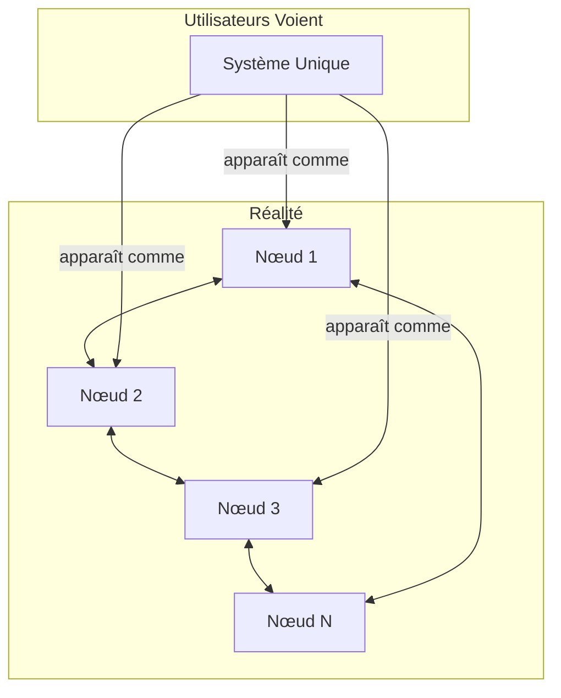
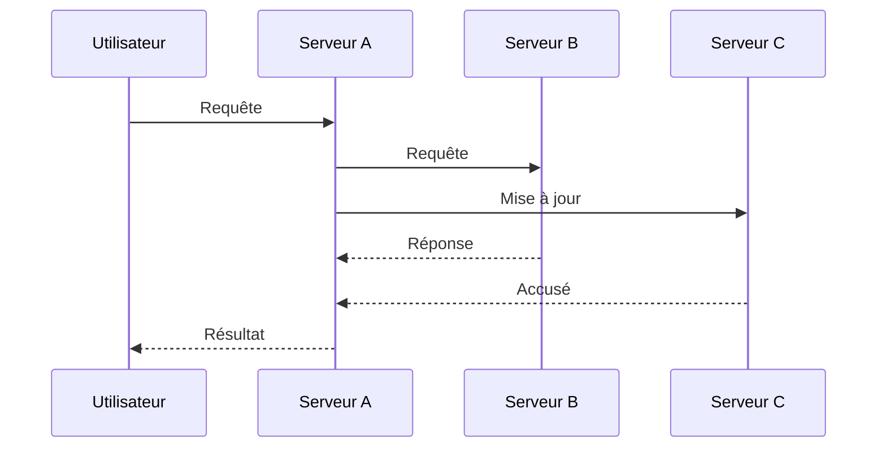
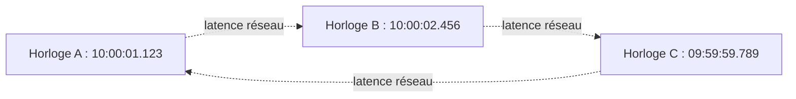
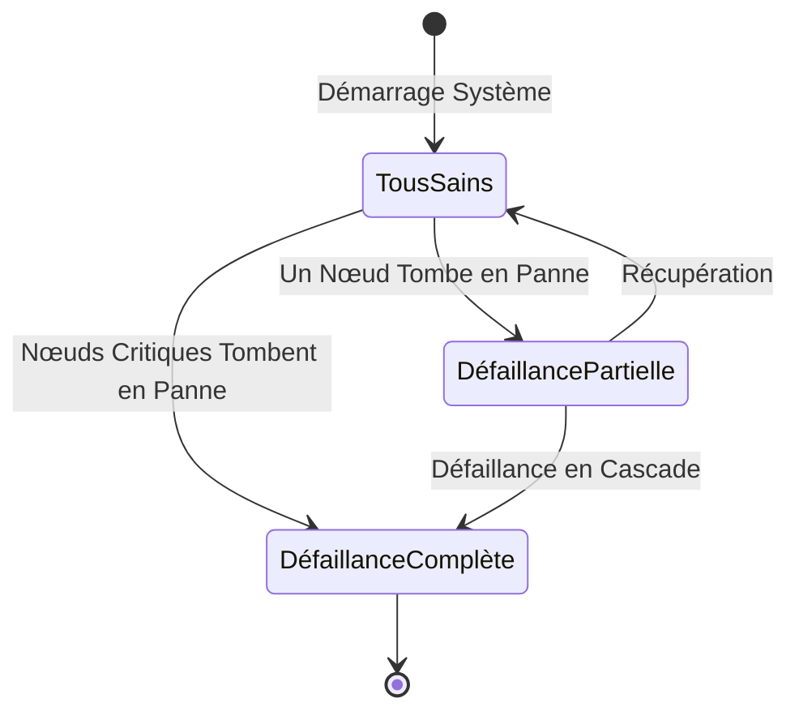
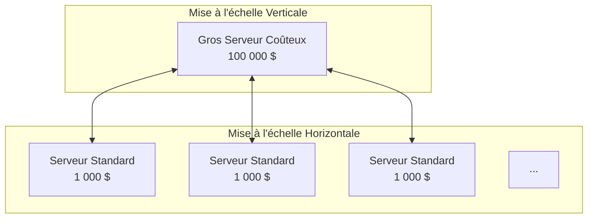
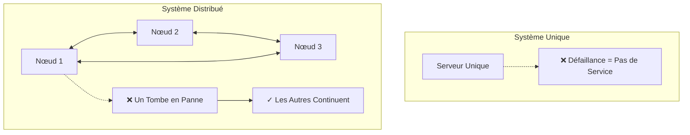
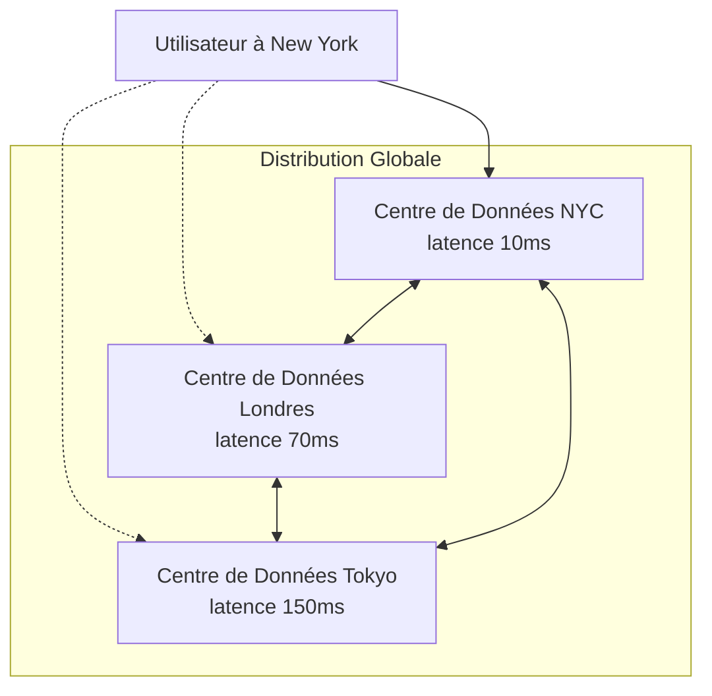
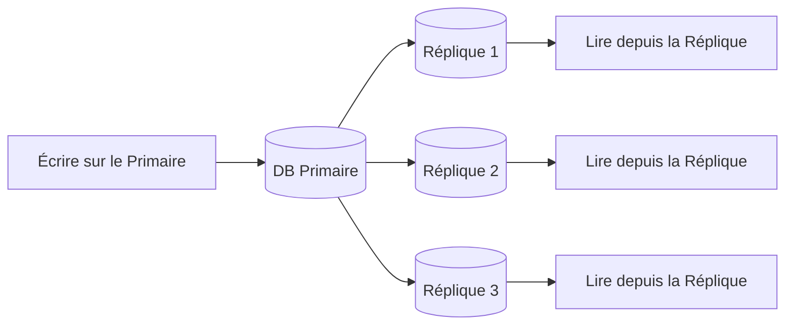
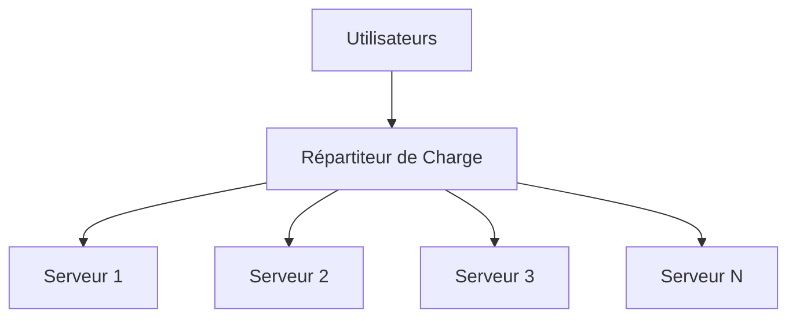

# Qu'est-ce qu'un Système Distribué ?

> **Session 1, Partie 1** - 20 minutes

## Objectifs d'Apprentissage

- [ ] Définir ce qu'est un système distribué
- [ ] Identifier les caractéristiques clés des systèmes distribués
- [ ] Comprendre pourquoi les systèmes distribués sont importants
- [ ] Reconnaître les systèmes distribués dans la vie quotidienne

## Définition

Un **système distribué (distributed system)** est une collection d'ordinateurs indépendants qui apparaît à ses utilisateurs comme un système cohérent unique.

### Idée Clé

La caractéristique déterminante est l'**illusion d'unité** — les utilisateurs interagissent avec ce qui semble être un seul système, tandis qu'en coulisses, plusieurs machines travaillent ensemble.

## Trois Caractéristiques Clés

Selon Leslie Lamport, un système distribué est :

> "Un système dans lequel la défaillance d'un ordinateur dont vous ignoriez même l'existence peut rendre votre propre ordinateur inutilisable."

Cette définition met en évidence trois caractéristiques fondamentales :

### 1. Concurrence (Plusieurs Choses Se Produisent En Même Temps)

Plusieurs composants s'exécutent simultanément, entraînant des interactions complexes.

### 2. Pas d'Horloge Globale

Chaque nœud a sa propre horloge. Il n'y a pas de "maintenant" unique dans le système.

**Implication :** Vous ne pouvez pas compter sur les horodatages pour ordonner les événements entre les nœuds. Vous avez besoin d'horloges logiques (nous en reparlerons dans les prochaines sessions !).

### 3. Défaillance Indépendante

Les composants peuvent tomber en panne indépendamment. Lorsqu'une partie tombe en panne, le reste peut continuer — ou peut devenir inutilisable.

## Pourquoi des Systèmes Distribués ?

### Extensibilité

**Mise à l'échelle Verticale (Scale Up) :**
- Ajouter plus de ressources à une seule machine
- Finit par atteindre les limites matérielles/coût

**Mise à l'échelle Horizontale (Scale Out) :**
- Ajouter plus de machines au système
- Potentiel d'extensibilité pratiquement illimité

### Fiabilité et Disponibilité

Un point unique de défaillance est inacceptable pour les services critiques :

### Latence (Distribution Géographique)

Placer les données plus près des utilisateurs améliore l'expérience :

## Exemples de Systèmes Distribués

### Exemples Quotidiens

| Système | Description | Avantage |
|--------|-------------|---------|
| **Recherche Web** | Serveurs de requêtes, serveurs d'index, serveurs de cache | Réponses rapides, toujours disponibles |
| **Vidéo en Streaming** | Réseaux de diffusion de contenu (CDNs) | Faible latence, haute qualité |
| **Achats en Ligne** | Catalogue de produits, panier, paiement, inventaire | Gère les pics de trafic |
| **Réseaux Sociaux** | Publications, commentaires, j'aime, notifications | Mises à jour en temps réel |

### Exemples Techniques

**Réplication de Base de Données :**

**Répartition de Charge :**

## Compromis

Les systèmes distribués introduisent de la complexité :

| Défi | Description |
|-----------|-------------|
| **Problèmes Réseau** | Non fiable, latence variable, partitions |
| **Concurrence** | Conditions de course, interblocages, coordination |
| **Défaillances Partielles** | Certains composants fonctionnent, d'autres non |
| **Cohérence** | Garder les données synchronisées entre les nœuds |

**Le Dilemme Fondamental :**
> "Les avantages de la distribution valent-ils la complexité ajoutée ?"

Pour la plupart des applications modernes, la réponse est **oui** — c'est pourquoi nous apprenons ceci !

## Résumé

### Points Clés à Retenir

1. **Systèmes distribués** = plusieurs ordinateurs agissant comme un seul
2. **Trois caractéristiques :** concurrence, pas d'horloge globale, défaillance indépendante
3. **Avantages :** extensibilité, fiabilité, latence réduite
4. **Coûts :** complexité, problèmes réseau, défis de cohérence

### Vérifiez Votre Compréhension

- [ ] Pouvez-vous expliquer pourquoi il n'y a pas d'horloge globale dans un système distribué ?
- [ ] Donnez un exemple de système distribué que vous utilisez quotidiennement
- [ ] Pourquoi la défaillance indépendante rend-elle les systèmes distribués plus difficiles à construire ?

## 🧠 Quiz du Chapitre

Testez votre maîtrise de ces concepts ! Ces questions mettront au défi votre compréhension et révéleront les lacunes dans vos connaissances.

{{#quiz ../../quizzes/fundamentals-what-is-ds.toml}}

## Suite

Maintenant que nous comprenons ce que sont les systèmes distribués, explorons comment ils communiquent : [Passage de Messages](./02-message-passing.md)
