# What is a Distributed System?

> **Session 1, Part 1** - 20 minutes

## Learning Objectives

- [ ] Define what a distributed system is
- [ ] Identify key characteristics of distributed systems
- [ ] Understand why distributed systems matter
- [ ] Recognize distributed systems in everyday life

## Definition

A **distributed system** is a collection of independent computers that appears to its users as a single coherent system.

### Key Insight

The defining characteristic is the **illusion of unity**—users interact with what seems like one system, while behind the scenes, multiple machines work together.

## Three Key Characteristics

According to Leslie Lamport, a distributed system is:

> "One in which the failure of a computer you didn't even know existed can render your own computer unusable."

This definition highlights three fundamental characteristics:

### 1. Concurrency (Multiple Things Happen At Once)

Multiple components execute simultaneously, leading to complex interactions.

### 2. No Global Clock

Each node has its own clock. There's no single "now" across the system.

**Implication:** You can't rely on timestamps to order events across nodes. You need logical clocks (more on this in later sessions!).

### 3. Independent Failure

Components can fail independently. When one part fails, the rest may continue—or may become unusable.

## Why Distributed Systems?

### Scalability

**Vertical Scaling (Scale Up):**
- Add more resources to a single machine
- Eventually hits hardware/cost limits

**Horizontal Scaling (Scale Out):**
- Add more machines to the system
- Virtually unlimited scaling potential

### Reliability & Availability

A single point of failure is unacceptable for critical services:

```mermaid
graph TB
    subgraph "Single System"
        S[Single Server]
        S -.-> X[❌ Failure = No Service]
    end

    subgraph "Distributed System"
        N1[Node 1]
        N2[Node 2]
        N3[Node 3]

        N1 <--> N2
        N2 <--> N3
        N3 <--> N1

        N1 -.-> X2[❌ One Fails]
        X2 --> OK[✓ Others Continue]
    end
```

### Latency (Geographic Distribution)

Placing data closer to users improves experience:

## Examples of Distributed Systems

### Everyday Examples

| System | Description | Benefit |
|--------|-------------|---------|
| **Web Search** | Query servers, index servers, cache servers | Fast responses, always available |
| **Streaming Video** | Content delivery networks (CDNs) | Low latency, high quality |
| **Online Shopping** | Product catalog, cart, payment, inventory | Handles traffic spikes |
| **Social Media** | Posts, comments, likes, notifications | Real-time updates |

### Technical Examples

**Database Replication:**

**Load Balancing:**

## Trade-offs

Distributed systems introduce complexity:

| Challenge | Description |
|-----------|-------------|
| **Network Issues** | Unreliable, variable latency, partitions |
| **Concurrency** | Race conditions, deadlocks, coordination |
| **Partial Failures** | Some components work, others don't |
| **Consistency** | Keeping data in sync across nodes |

**The Fundamental Dilemma:**
> "Is the benefits of distribution worth the added complexity?"

For most modern applications, the answer is **yes**—which is why we're learning this!

## Summary

### Key Takeaways

1. **Distributed systems** = multiple computers acting as one
2. **Three characteristics:** concurrency, no global clock, independent failure
3. **Benefits:** scalability, reliability, lower latency
4. **Costs:** complexity, network issues, consistency challenges

### Check Your Understanding

- [ ] Can you explain why there's no global clock in a distributed system?
- [ ] Give an example of a distributed system you use daily
- [ ] Why does independent failure make distributed systems harder to build?

## 🧠 Chapter Quiz

Test your mastery of these concepts! These questions will challenge your understanding and reveal any gaps in your knowledge.

{{#quiz ../../quizzes/fundamentals-what-is-ds.toml}}

## What's Next

Now that we understand what distributed systems are, let's explore how they communicate: [Message Passing](./02-message-passing.md)
