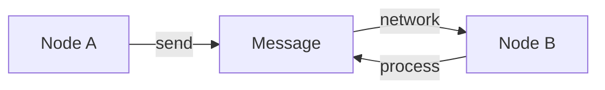
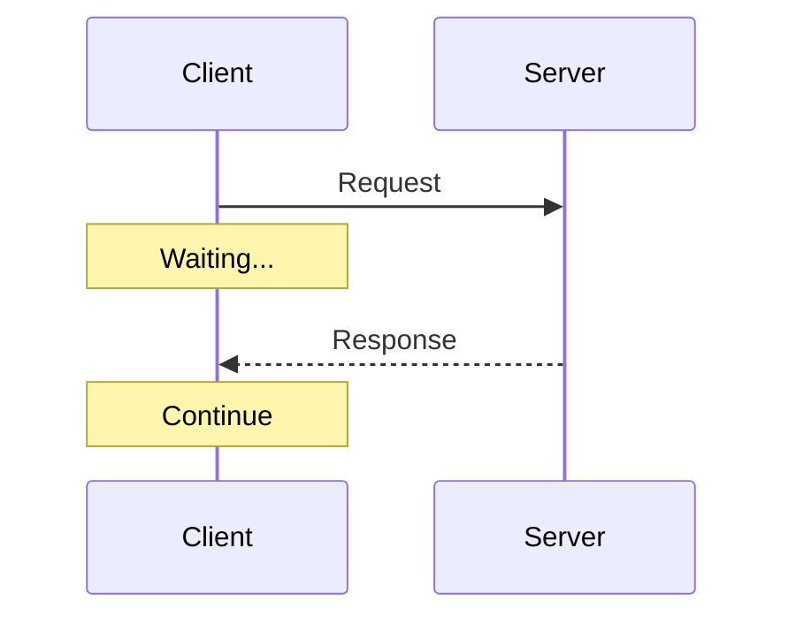
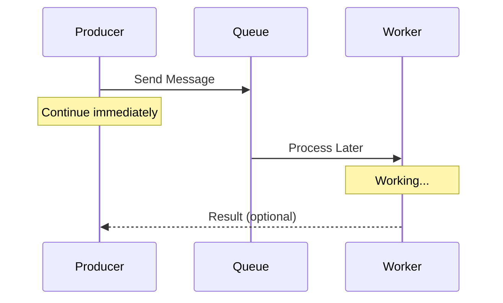
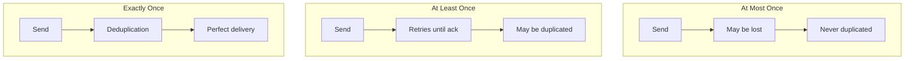
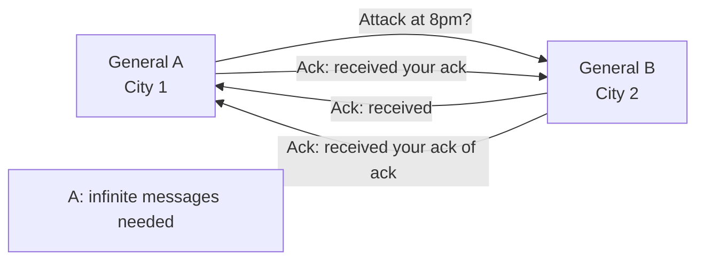
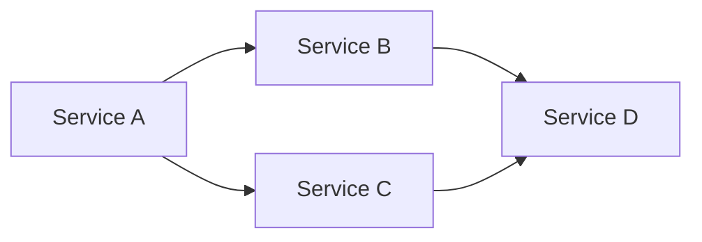
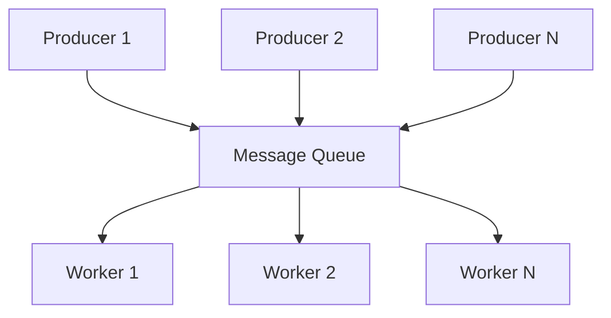

# Message Passing

> **Session 1, Part 2** - 25 minutes

## Learning Objectives

- [ ] Understand message passing as a fundamental pattern in distributed systems
- [ ] Distinguish between synchronous and asynchronous messaging
- [ ] Learn different message delivery guarantees
- [ ] Implement basic message passing in TypeScript and Python

## What is Message Passing?

In distributed systems, **message passing** is how nodes communicate. Instead of shared memory or direct function calls, components send messages to each other over the network.



### Key Insight

> "In distributed systems, communication is not a function call—it's a request sent over an unreliable network."

This simple fact has profound implications for everything we build.

## Synchronous vs Asynchronous

### Synchronous Messaging (Request-Response)

The sender waits for a response before continuing.



**Characteristics:**
- Simple to understand and implement
- Caller is blocked during the call
- Easier error handling (immediate feedback)
- Can lead to poor performance and cascading failures

### Asynchronous Messaging (Fire-and-Forget)

The sender continues without waiting for a response.



**Characteristics:**
- Non-blocking, better throughput
- More complex error handling
- Requires correlation IDs to track requests
- Enables loose coupling between components

## Message Delivery Guarantees

### Three Delivery Semantics



### Comparison

| Guarantee | Description | Cost | Use Case |
|-----------|-------------|------|----------|
| **At Most Once** | Message may be lost, never duplicated | Lowest | Logging, metrics, non-critical data |
| **At Least Once** | Message guaranteed to arrive, may duplicate | Medium | Notifications, job queues |
| **Exactly Once** | Perfect delivery, no duplicates | Highest | Financial transactions, payments |

### The Two Generals Problem

A classic proof that **perfect** communication is impossible in unreliable networks:



**Implication:** You can never be 100% certain a message was received without infinite acknowledgments.

In practice, we accept uncertainty and design systems that tolerate it.

## Architecture Patterns

### Direct Communication



- Simple, straightforward
- Tight coupling
- Difficult to scale independently

### Message Queue (Indirect Communication)



- Loose coupling
- Easy to scale
- Buffers requests during traffic spikes
- Enables retry and error handling

## Implementation Examples

### TypeScript: HTTP (Synchronous)

```typescript
// server.ts
import http from 'http';

const server = http.createServer((req, res) => {
  if (req.method === 'POST' && req.url === '/message') {
    let body = '';
    req.on('data', chunk => body += chunk);
    req.on('end', () => {
      const message = JSON.parse(body);
      console.log('Received:', message);

      // Send response back (synchronous)
      res.writeHead(200);
      res.end(JSON.stringify({ status: 'processed', id: message.id }));
    });
  }
});

server.listen(3000, () => console.log('Server on :3000'));

// client.ts
import http from 'http';

function sendMessage(data: any): Promise<any> {
  return new Promise((resolve, reject) => {
    const postData = JSON.stringify(data);

    const options = {
      hostname: 'localhost',
      port: 3000,
      method: 'POST',
      path: '/message',
      headers: { 'Content-Type': 'application/json' }
    };

    const req = http.request(options, (res) => {
      let body = '';
      res.on('data', chunk => body += chunk);
      res.on('end', () => resolve(JSON.parse(body)));
    });

    req.on('error', reject);
    req.write(postData);
    req.end();
  });
}

// Usage: waits for response
sendMessage({ id: '1', content: 'Hello' })
  .then(response => console.log('Got:', response));
```

### Python: HTTP (Synchronous)

```python
# server.py
from http.server import HTTPServer, BaseHTTPRequestHandler
import json

class MessageHandler(BaseHTTPRequestHandler):
    def do_POST(self):
        if self.path == '/message':
            content_length = int(self.headers['Content-Length'])
            post_data = self.rfile.read(content_length)
            message = json.loads(post_data.decode())

            print(f"Received: {message}")

            # Send response back (synchronous)
            response = json.dumps({'status': 'processed', 'id': message['id']})
            self.send_response(200)
            self.send_header('Content-Type', 'application/json')
            self.end_headers()
            self.wfile.write(response.encode())

server = HTTPServer(('localhost', 3000), MessageHandler)
print("Server on :3000")
server.serve_forever()

# client.py
import requests
import json

def send_message(data):
    # Synchronous: waits for response
    response = requests.post(
        'http://localhost:3000/message',
        json=data
    )
    return response.json()

# Usage
result = send_message({'id': '1', 'content': 'Hello'})
print(f"Got: {result}")
```

### TypeScript: Simple Queue (Asynchronous)

```typescript
// queue.ts
interface Message {
  id: string;
  data: any;
  timestamp: number;
}

class MessageQueue {
  private messages: Message[] = [];
  private handlers: Map<string, (msg: Message) => void> = new Map();

  publish(topic: string, data: any): string {
    const message: Message = {
      id: `${Date.now()}-${Math.random()}`,
      data,
      timestamp: Date.now()
    };

    this.messages.push(message);
    console.log(`Published to ${topic}:`, message.id);

    // Fire and forget - don't wait for processing
    setImmediate(() => this.process(topic, message));

    return message.id;
  }

  subscribe(topic: string, handler: (msg: Message) => void) {
    this.handlers.set(topic, handler);
  }

  private process(topic: string, message: Message) {
    const handler = this.handlers.get(topic);
    if (handler) {
      // Handle asynchronously - caller doesn't wait
      handler(message);
    }
  }
}

// Usage
const queue = new MessageQueue();

queue.subscribe('tasks', (msg) => {
  console.log(`Processing task ${msg.id}:`, msg.data);
  // Simulate async work
  setTimeout(() => console.log(`Task ${msg.id} complete`), 1000);
});

// Publish returns immediately - doesn't wait for processing
const taskId = queue.publish('tasks', { type: 'email', to: 'user@example.com' });
console.log(`Task ${taskId} queued (not yet processed)`);
```

### Python: Simple Queue (Asynchronous)

```python
# queue.py
import time
import threading
from dataclasses import dataclass
from typing import Callable, Dict, Any
import uuid

@dataclass
class Message:
    id: str
    data: Any
    timestamp: float

class MessageQueue:
    def __init__(self):
        self.messages = []
        self.handlers: Dict[str, Callable[[Message], None]] = {}
        self.lock = threading.Lock()

    def publish(self, topic: str, data: Any) -> str:
        message = Message(
            id=f"{int(time.time()*1000)}-{uuid.uuid4().hex[:8]}",
            data=data,
            timestamp=time.time()
        )

        with self.lock:
            self.messages.append(message)

        print(f"Published to {topic}: {message.id}")

        # Fire and forget - don't wait for processing
        threading.Thread(
            target=self._process,
            args=(topic, message),
            daemon=True
        ).start()

        return message.id

    def subscribe(self, topic: str, handler: Callable[[Message], None]):
        self.handlers[topic] = handler

    def _process(self, topic: str, message: Message):
        handler = self.handlers.get(topic)
        if handler:
            # Handle asynchronously - caller doesn't wait
            handler(message)

# Usage
queue = MessageQueue()

def handle_task(msg: Message):
    print(f"Processing task {msg.id}: {msg.data}")
    # Simulate async work
    time.sleep(1)
    print(f"Task {msg.id} complete")

queue.subscribe('tasks', handle_task)

# Publish returns immediately - doesn't wait for processing
task_id = queue.publish('tasks', {'type': 'email', 'to': 'user@example.com'})
print(f"Task {task_id} queued (not yet processed)")

# Keep main thread alive to see processing
time.sleep(2)
```

## Common Message Patterns

### Request-Response
```typescript
// Call and wait for answer
const answer = await ask(question);
```

### Fire-and-Forget
```typescript
// Send and continue
notify(user);
```

### Publish-Subscribe
```typescript
// Many receivers, one sender
broker.publish('events', data);
```

### Request-Reply (Correlation)
```typescript
// Send request, get reply later
const replyTo = createReplyQueue();
broker.send(request, { replyTo });
// ... later
const reply = await replyTo.receive();
```

## Error Handling

Message passing over networks is unreliable. Common issues:

| Error | Cause | Handling Strategy |
|-------|-------|-------------------|
| **Timeout** | No response, network slow | Retry with backoff |
| **Connection Refused** | Service down | Circuit breaker, queue for later |
| **Message Lost** | Network failure | Acknowledgments, retries |
| **Duplicate** | Retry after slow ack | Idempotent operations |

### Retry Pattern

```typescript
async function sendMessageWithRetry(
  message: any,
  maxRetries = 3
): Promise<any> {
  for (let attempt = 1; attempt <= maxRetries; attempt++) {
    try {
      return await sendMessage(message);
    } catch (error) {
      if (attempt === maxRetries) throw error;

      // Exponential backoff: 100ms, 200ms, 400ms
      const delay = 100 * Math.pow(2, attempt - 1);
      await new Promise(r => setTimeout(r, delay));
      console.log(`Retry ${attempt}/${maxRetries}`);
    }
  }
}
```

## Summary

### Key Takeaways

1. **Message passing** is how distributed systems communicate
2. **Synchronous** = wait for response; **Asynchronous** = fire and forget
3. **Delivery guarantees**: at-most-once, at-least-once, exactly-once
4. **Network is unreliable** - design for failures and retries
5. **Choose the right pattern** for your use case

### Check Your Understanding

- [ ] When would you use synchronous vs asynchronous messaging?
- [ ] What's the difference between at-least-once and exactly-once?
- [ ] Why is perfect communication impossible in distributed systems?

## 🧠 Chapter Quiz

Test your mastery of these concepts! These questions will challenge your understanding and reveal any gaps in your knowledge.

{{#quiz ../../quizzes/fundamentals-message-passing.toml}}

## What's Next

Now let's apply message passing to build our first distributed system: [Queue System Implementation](./03-queue-system.md)
