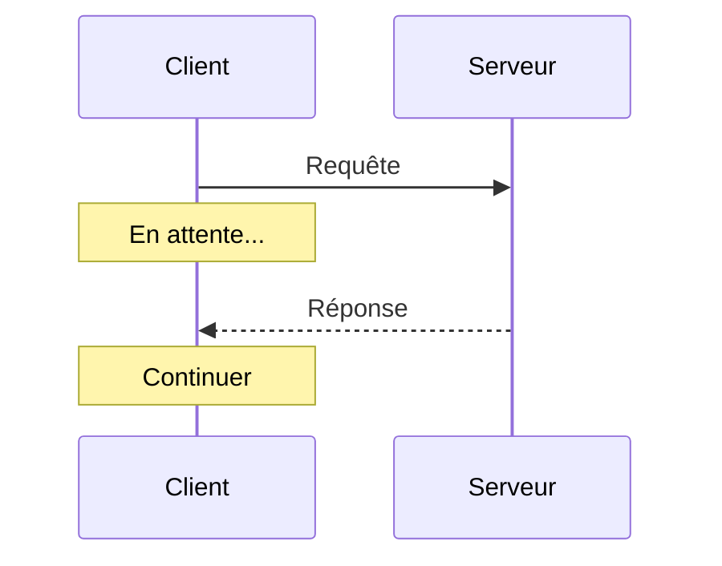
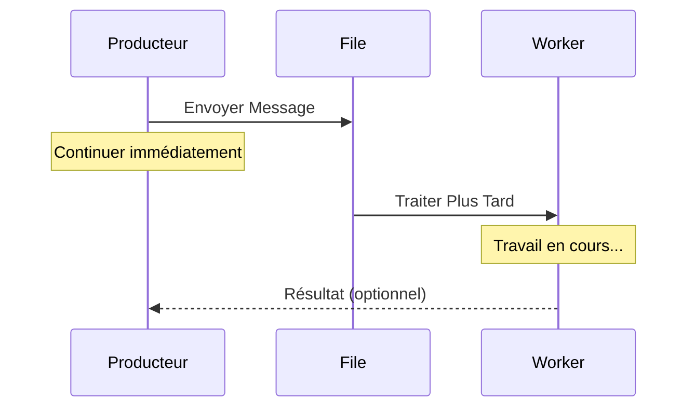
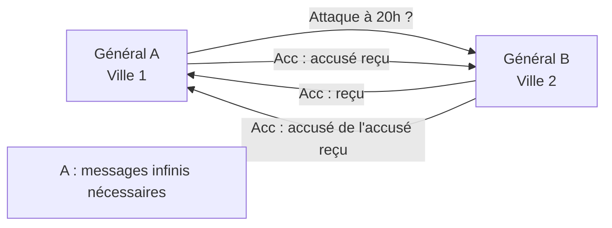
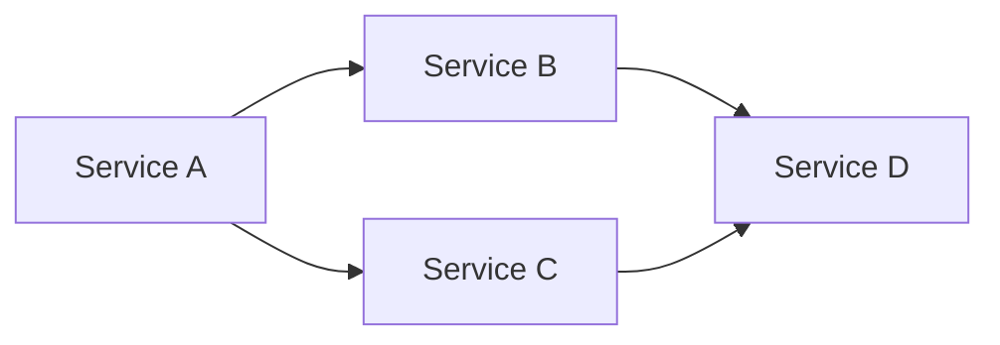
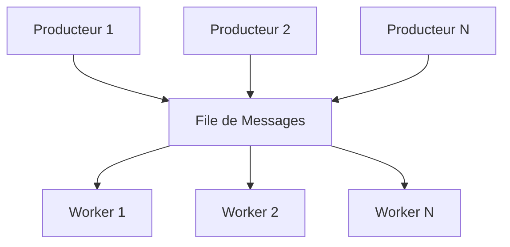

# Passage de Messages

> **Session 1, Partie 2** - 25 minutes

## Objectifs d'Apprentissage

- [ ] Comprendre le passage de messages comme modèle fondamental dans les systèmes distribués
- [ ] Distinguer entre la messagerie synchrone et asynchrone
- [ ] Apprendre les différentes garanties de livraison de messages
- [ ] Implémenter le passage de messages de base en TypeScript et Python

## Qu'est-ce que le Passage de Messages ?

Dans les systèmes distribués, le **passage de messages (message passing)** est la façon dont les nœuds communiquent. Au lieu de la mémoire partagée ou des appels de fonction directs, les composants s'envoient des messages sur le réseau.


### Idée Clé

> "Dans les systèmes distribués, la communication n'est pas un appel de fonction — c'est une requête envoyée sur un réseau non fiable."

Ce simple fait a des implications profondes sur tout ce que nous construisons.

## Synchrone vs Asynchrone

### Messagerie Synchrone (Requête-Réponse)

L'expéditeur attend une réponse avant de continuer.



**Caractéristiques :**
- Simple à comprendre et à implémenter
- L'appelant est bloqué pendant l'appel
- Gestion des erreurs plus facile (retour immédiat)
- Peut entraîner de mauvaises performances et des défaillances en cascade

### Messagerie Asynchrone (Fire-and-Forget)

L'expéditeur continue sans attendre de réponse.



**Caractéristiques :**
- Non bloquant, meilleur débit
- Gestion des erreurs plus complexe
- Nécessite des ID de corrélation pour suivre les requêtes
- Permet un couplage souple entre les composants

## Garanties de Livraison des Messages

### Trois Sémantiques de Livraison


### Comparaison

| Garantie | Description | Coût | Cas d'Usage |
|-----------|-------------|------|----------|
| **Au Plus Une Fois** | Le message peut être perdu, jamais dupliqué | Le plus bas | Journaux, métriques, données non critiques |
| **Au Moins Une Fois** | Le message garanti d'arriver, peut être dupliqué | Moyen | Notifications, files de tâches |
| **Exactement Une Fois** | Livraison parfaite, pas de doublons | Le plus élevé | Transactions financières, paiements |

### Le Problème des Deux Généraux

Une preuve classique que la communication **parfaite** est impossible dans les réseaux non fiables :



**Implication :** Vous ne pouvez jamais être certain à 100 % qu'un message a été reçu sans accusés infinis.

En pratique, nous acceptons l'incertitude et concevons des systèmes qui la tolèrent.

## Modèles d'Architecture

### Communication Directe



- Simple, direct
- Couplage fort
- Difficile à faire évoluer indépendamment

### File de Messages (Communication Indirecte)



- Couplage souple
- Facile à faire évoluer
- Met en tampon les requêtes pendant les pics de trafic
- Permet les nouvelles tentatives et la gestion des erreurs

## Exemples d'Implémentation

### TypeScript : HTTP (Synchrone)

```typescript
// server.ts
import http from 'http';

const server = http.createServer((req, res) => {
  if (req.method === 'POST' && req.url === '/message') {
    let body = '';
    req.on('data', chunk => body += chunk);
    req.on('end', () => {
      const message = JSON.parse(body);
      console.log('Received:', message);

      // Renvoyer la réponse (synchrone)
      res.writeHead(200);
      res.end(JSON.stringify({ status: 'processed', id: message.id }));
    });
  }
});

server.listen(3000, () => console.log('Server on :3000'));

// client.ts
import http from 'http';

function sendMessage(data: any): Promise<any> {
  return new Promise((resolve, reject) => {
    const postData = JSON.stringify(data);

    const options = {
      hostname: 'localhost',
      port: 3000,
      method: 'POST',
      path: '/message',
      headers: { 'Content-Type': 'application/json' }
    };

    const req = http.request(options, (res) => {
      let body = '';
      res.on('data', chunk => body += chunk);
      res.on('end', () => resolve(JSON.parse(body)));
    });

    req.on('error', reject);
    req.write(postData);
    req.end();
  });
}

// Usage : attend la réponse
sendMessage({ id: '1', content: 'Hello' })
  .then(response => console.log('Got:', response));
```

### Python : HTTP (Synchrone)

```python
# server.py
from http.server import HTTPServer, BaseHTTPRequestHandler
import json

class MessageHandler(BaseHTTPRequestHandler):
    def do_POST(self):
        if self.path == '/message':
            content_length = int(self.headers['Content-Length'])
            post_data = self.rfile.read(content_length)
            message = json.loads(post_data.decode())

            print(f"Received: {message}")

            # Renvoyer la réponse (synchrone)
            response = json.dumps({'status': 'processed', 'id': message['id']})
            self.send_response(200)
            self.send_header('Content-Type', 'application/json')
            self.end_headers()
            self.wfile.write(response.encode())

server = HTTPServer(('localhost', 3000), MessageHandler)
print("Server on :3000")
server.serve_forever()

# client.py
import requests
import json

def send_message(data):
    # Synchrone : attend la réponse
    response = requests.post(
        'http://localhost:3000/message',
        json=data
    )
    return response.json()

# Usage
result = send_message({'id': '1', 'content': 'Hello'})
print(f"Got: {result}")
```

### TypeScript : File Simple (Asynchrone)

```typescript
// queue.ts
interface Message {
  id: string;
  data: any;
  timestamp: number;
}

class MessageQueue {
  private messages: Message[] = [];
  private handlers: Map<string, (msg: Message) => void> = new Map();

  publish(topic: string, data: any): string {
    const message: Message = {
      id: `${Date.now()}-${Math.random()}`,
      data,
      timestamp: Date.now()
    };

    this.messages.push(message);
    console.log(`Published to ${topic}:`, message.id);

    // Fire and forget - ne pas attendre le traitement
    setImmediate(() => this.process(topic, message));

    return message.id;
  }

  subscribe(topic: string, handler: (msg: Message) => void) {
    this.handlers.set(topic, handler);
  }

  private process(topic: string, message: Message) {
    const handler = this.handlers.get(topic);
    if (handler) {
      // Traiter de manière asynchrone - l'appelant n'attend pas
      handler(message);
    }
  }
}

// Usage
const queue = new MessageQueue();

queue.subscribe('tasks', (msg) => {
  console.log(`Processing task ${msg.id}:`, msg.data);
  // Simuler un travail asynchrone
  setTimeout(() => console.log(`Task ${msg.id} complete`), 1000);
});

// Publish retourne immédiatement - n'attend pas le traitement
const taskId = queue.publish('tasks', { type: 'email', to: 'user@example.com' });
console.log(`Task ${taskId} queued (not yet processed)`);
```

### Python : File Simple (Asynchrone)

```python
# queue.py
import time
import threading
from dataclasses import dataclass
from typing import Callable, Dict, Any
import uuid

@dataclass
class Message:
    id: str
    data: Any
    timestamp: float

class MessageQueue:
    def __init__(self):
        self.messages = []
        self.handlers: Dict[str, Callable[[Message], None]] = {}
        self.lock = threading.Lock()

    def publish(self, topic: str, data: Any) -> str:
        message = Message(
            id=f"{int(time.time()*1000)}-{uuid.uuid4().hex[:8]}",
            data=data,
            timestamp=time.time()
        )

        with self.lock:
            self.messages.append(message)

        print(f"Published to {topic}: {message.id}")

        # Fire and forget - ne pas attendre le traitement
        threading.Thread(
            target=self._process,
            args=(topic, message),
            daemon=True
        ).start()

        return message.id

    def subscribe(self, topic: str, handler: Callable[[Message], None]):
        self.handlers[topic] = handler

    def _process(self, topic: str, message: Message):
        handler = self.handlers.get(topic)
        if handler:
            # Traiter de manière asynchrone - l'appelant n'attend pas
            handler(message)

# Usage
queue = MessageQueue()

def handle_task(msg: Message):
    print(f"Processing task {msg.id}: {msg.data}")
    # Simuler un travail asynchrone
    time.sleep(1)
    print(f"Task {msg.id} complete")

queue.subscribe('tasks', handle_task)

# Publish retourne immédiatement - n'attend pas le traitement
task_id = queue.publish('tasks', {'type': 'email', 'to': 'user@example.com'})
print(f"Task {task_id} queued (not yet processed)")

# Garder le thread principal en vie pour voir le traitement
time.sleep(2)
```

## Modèles de Messages Courants

### Requête-Réponse
```typescript
// Appeler et attendre la réponse
const answer = await ask(question);
```

### Fire-and-Forget
```typescript
// Envoyer et continuer
notify(user);
```

### Publier-S'Abonner
```typescript
// Plusieurs récepteurs, un expéditeur
broker.publish('events', data);
```

### Requête-Réponse (avec Corrélation)
```typescript
// Envoyer la requête, obtenir la réponse plus tard
const replyTo = createReplyQueue();
broker.send(request, { replyTo });
// ... plus tard
const reply = await replyTo.receive();
```

## Gestion des Erreurs

Le passage de messages sur les réseaux n'est pas fiable. Problèmes courants :

| Erreur | Cause | Stratégie de Gestion |
|-------|-------|-------------------|
| **Délai d'attente** | Pas de réponse, réseau lent | Réessayer avec attente progressive |
| **Connexion Refusée** | Service indisponible | Disjoncteur, mettre en file pour plus tard |
| **Message Perdu** | Défaillance du réseau | Accusés de réception, nouvelles tentatives |
| **Duplication** | Nouvelle tentative après accusé lent | Opérations idempotentes |

### Modèle de Nouvelle Tentative

```typescript
async function sendMessageWithRetry(
  message: any,
  maxRetries = 3
): Promise<any> {
  for (let attempt = 1; attempt <= maxRetries; attempt++) {
    try {
      return await sendMessage(message);
    } catch (error) {
      if (attempt === maxRetries) throw error;

      // Attente exponentielle : 100ms, 200ms, 400ms
      const delay = 100 * Math.pow(2, attempt - 1);
      await new Promise(r => setTimeout(r, delay));
      console.log(`Retry ${attempt}/${maxRetries}`);
    }
  }
}
```

## Résumé

### Points Clés à Retenir

1. **Passage de messages** = comment les systèmes distribués communiquent
2. **Synchrone** = attendre la réponse ; **Asynchrone** = fire and forget
3. **Garanties de livraison** : au-plus-une-fois, au-moins-une-fois, exactement-une-fois
4. **Le réseau n'est pas fiable** - concevez pour les défaillances et les nouvelles tentatives
5. **Choisissez le bon modèle** pour votre cas d'usage

### Vérifiez Votre Compréhension

- [ ] Quand utiliseriez-vous la messagerie synchrone vs asynchrone ?
- [ ] Quelle est la différence entre au-moins-une-fois et exactement-une-fois ?
- [ ] Pourquoi la communication parfaite est-elle impossible dans les systèmes distribués ?

## 🧠 Quiz du Chapitre

Testez votre maîtrise de ces concepts ! Ces questions mettront au défi votre compréhension et révéleront les lacunes dans vos connaissances.

{{#quiz ../../quizzes/fundamentals-message-passing.toml}}

## Suite

Appliquons maintenant le passage de messages pour construire notre premier système distribué : [Implémentation du Système de File](./03-queue-system.md)
