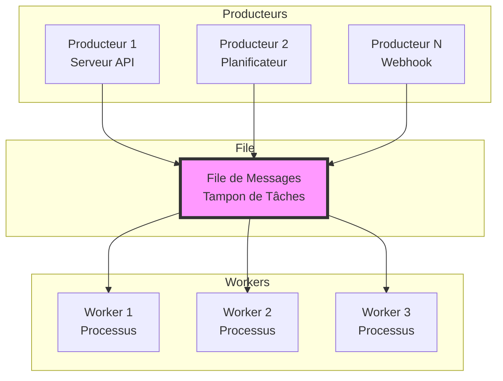
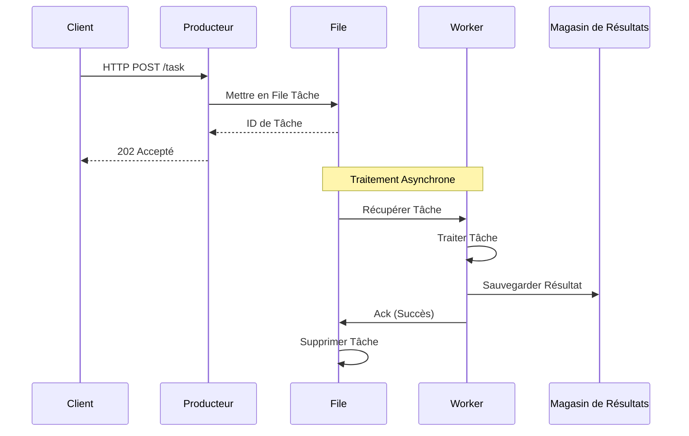
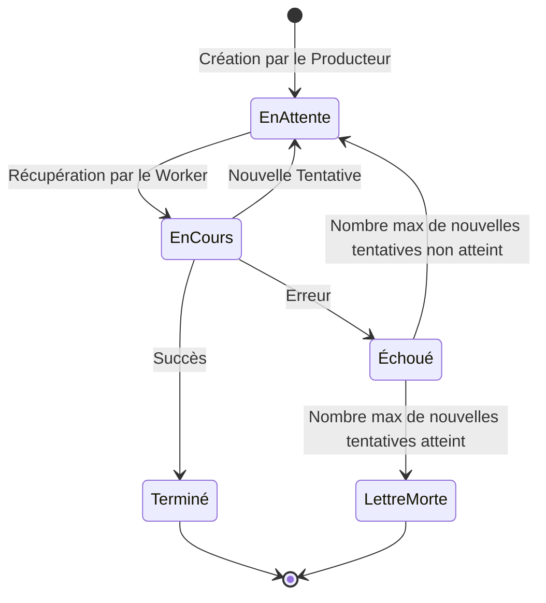

# Implémentation du Système de File

> **Session 2** - Session complète (90 minutes)

## Objectifs d'Apprentissage

- [ ] Comprendre le modèle producteur-consommateur
- [ ] Construire un système de file fonctionnel avec des workers concurrents
- [ ] Implémenter la tolérance aux pannes avec une logique de nouvelle tentative
- [ ] Déployer et tester le système avec Docker Compose

## Le Modèle Producteur-Consommateur

Le **modèle producteur-consommateur (producer-consumer pattern)** est un modèle fondamental des systèmes distribués où :
- **Les Producteurs** créent et envoient des tâches à une file
- **La File** met en tampon les tâches entre les producteurs et les consommateurs
- **Les Workers (consommateurs)** traitent les tâches de la file



### Avantages Clés

| Avantage | Explication |
|---------|-------------|
| **Découplage** | Les producteurs n'ont pas besoin de connaître les workers |
| **Mise en Tampon** | La file gère les pics de trafic |
| **Extensibilité** | Ajoutez/supprimez des workers indépendamment |
| **Fiabilité** | Les tâches persistent si les workers tombent en panne |
| **Nouvelle Tentative** | Les tâches échouées peuvent être remises en file |

## Architecture du Système

### Vue Complète du Système



### Cycle de Vie d'une Tâche



## Implémentation

### Modèles de Données

**Définition de Tâche :**
```typescript
interface Task {
  id: string;
  type: string;           // 'email', 'image', 'report', etc.
  payload: any;
  status: 'pending' | 'processing' | 'completed' | 'failed';
  createdAt: number;
  retries: number;
  maxRetries: number;
  result?: any;
  error?: string;
}
```

```python
from dataclasses import dataclass, field
from typing import Any, Optional

@dataclass
class Task:
    id: str
    type: str  # 'email', 'image', 'report', etc.
    payload: Any
    status: str = 'pending'  # pending, processing, completed, failed
    created_at: float = field(default_factory=time.time)
    retries: int = 0
    max_retries: int = 3
    result: Optional[Any] = None
    error: Optional[str] = None
```

---

## Implémentation TypeScript

### Structure du Projet
```
queue-system-ts/
├── package.json
├── docker-compose.yml
├── src/
│   ├── queue.ts          # Implémentation de la file
│   ├── producer.ts       # API du producteur
│   ├── worker.ts         # Implémentation du worker
│   └── types.ts          # Définitions de types
└── Dockerfile
```

### Code TypeScript Complet

**queue-system-ts/src/types.ts**
```typescript
export interface Task {
  id: string;
  type: string;
  payload: any;
  status: 'pending' | 'processing' | 'completed' | 'failed';
  createdAt: number;
  retries: number;
  maxRetries: number;
  result?: any;
  error?: string;
}

export interface QueueMessage {
  task: Task;
  timestamp: number;
}
```

**queue-system-ts/src/queue.ts**
```typescript
import { Task, QueueMessage } from './types';

export class Queue {
  private pending: Task[] = [];
  private processing: Map<string, Task> = new Map();
  private completed: Task[] = [];
  private failed: Task[] = [];

  // Mettre en file une nouvelle tâche
  enqueue(type: string, payload: any): string {
    const task: Task = {
      id: this.generateId(),
      type,
      payload,
      status: 'pending',
      createdAt: Date.now(),
      retries: 0,
      maxRetries: 3
    };

    this.pending.push(task);
    console.log(`[Queue] Enqueued task ${task.id} (${type})`);
    return task.id;
  }

  // Obtenir la prochaine tâche en attente (pour les workers)
  dequeue(): Task | null {
    if (this.pending.length === 0) return null;

    const task = this.pending.shift()!;
    task.status = 'processing';
    this.processing.set(task.id, task);

    console.log(`[Queue] Dequeued task ${task.id}`);
    return task;
  }

  // Marquer la tâche comme terminée
  complete(taskId: string, result?: any): void {
    const task = this.processing.get(taskId);
    if (!task) return;

    task.status = 'completed';
    task.result = result;
    this.processing.delete(taskId);
    this.completed.push(task);

    console.log(`[Queue] Completed task ${taskId}`);
  }

  // Marquer la tâche comme échouée (réessayer si possible)
  fail(taskId: string, error: string): void {
    const task = this.processing.get(taskId);
    if (!task) return;

    task.retries++;
    task.error = error;

    if (task.retries >= task.maxRetries) {
      task.status = 'failed';
      this.processing.delete(taskId);
      this.failed.push(task);
      console.log(`[Queue] Task ${taskId} failed permanently after ${task.retries} retries`);
    } else {
      task.status = 'pending';
      this.processing.delete(taskId);
      this.pending.push(task);
      console.log(`[Queue] Task ${taskId} failed, retrying (${task.retries}/${task.maxRetries})`);
    }
  }

  // Obtenir les statistiques de la file
  getStats() {
    return {
      pending: this.pending.length,
      processing: this.processing.size,
      completed: this.completed.length,
      failed: this.failed.length
    };
  }

  private generateId(): string {
    return `task-${Date.now()}-${Math.random().toString(36).substr(2, 9)}`;
  }
}
```

**queue-system-ts/src/producer.ts**
```typescript
import http from 'http';
import { Queue } from './queue';

const queue = new Queue();

const server = http.createServer((req, res) => {
  if (req.method === 'POST' && req.url === '/task') {
    let body = '';
    req.on('data', chunk => body += chunk);
    req.on('end', () => {
      try {
        const { type, payload } = JSON.parse(body);

        if (!type || !payload) {
          res.writeHead(400);
          res.end(JSON.stringify({ error: 'type and payload required' }));
          return;
        }

        const taskId = queue.enqueue(type, payload);

        res.writeHead(202); // Accepted
        res.end(JSON.stringify({
          taskId,
          message: 'Task enqueued',
          stats: queue.getStats()
        }));
      } catch (error) {
        res.writeHead(400);
        res.end(JSON.stringify({ error: 'Invalid JSON' }));
      }
    });
  } else if (req.method === 'GET' && req.url === '/stats') {
    res.writeHead(200);
    res.end(JSON.stringify(queue.getStats()));
  } else {
    res.writeHead(404);
    res.end(JSON.stringify({ error: 'Not found' }));
  }
});

const PORT = process.env.PORT || 3000;
server.listen(PORT, () => {
  console.log(`Producer API listening on port ${PORT}`);
});

export { queue };
```

**queue-system-ts/src/worker.ts**
```typescript
import http from 'http';
import { Queue, Task } from './types';

// Simuler le traitement de tâches
async function processTask(task: Task): Promise<any> {
  console.log(`[Worker] Processing task ${task.id} (${task.type})`);

  // Simuler le travail
  await new Promise(resolve => setTimeout(resolve, 1000 + Math.random() * 2000));

  // Simuler des échocs occasionnels (20% de chance)
  if (Math.random() < 0.2) {
    throw new Error('Random processing error');
  }

  // Traiter en fonction du type de tâche
  switch (task.type) {
    case 'email':
      return { sent: true, to: task.payload.to };
    case 'image':
      return { processed: true, url: task.payload.url };
    case 'report':
      return { generated: true, format: 'pdf' };
    default:
      return { result: 'processed' };
  }
}

class Worker {
  private id: string;
  private queueUrl: string;
  private running: boolean = false;

  constructor(id: string, queueUrl: string) {
    this.id = id;
    this.queueUrl = queueUrl;
  }

  async start(): Promise<void> {
    this.running = true;
    console.log(`[Worker ${this.id}] Started`);

    while (this.running) {
      try {
        await this.processNextTask();
      } catch (error) {
        console.error(`[Worker ${this.id}] Error:`, error);
        await this.sleep(1000); // Attendre avant de réessayer
      }
    }
  }

  private async processNextTask(): Promise<void> {
    // Récupérer la tâche de la file
    const task = await this.fetchTask();
    if (!task) {
      await this.sleep(1000); // Pas de tâche, attendre
      return;
    }

    try {
      // Traiter la tâche
      const result = await processTask(task);

      // Marquer comme terminée
      await this.completeTask(task.id, result);
    } catch (error: any) {
      // Marquer comme échouée
      await this.failTask(task.id, error.message);
    }
  }

  private async fetchTask(): Promise<Task | null> {
    return new Promise((resolve, reject) => {
      http.get(`${this.queueUrl}/dequeue`, (res) => {
        let body = '';
        res.on('data', chunk => body += chunk);
        res.on('end', () => {
          if (res.statusCode === 204) {
            resolve(null); // Aucune tâche disponible
          } else if (res.statusCode === 200) {
            resolve(JSON.parse(body));
          } else {
            reject(new Error(`Unexpected status: ${res.statusCode}`));
          }
        });
      }).on('error', reject);
    });
  }

  private async completeTask(taskId: string, result: any): Promise<void> {
    return new Promise((resolve, reject) => {
      const data = JSON.stringify({ result });
      http.request({
        hostname: 'localhost',
        port: 3000,
        path: `/complete/${taskId}`,
        method: 'POST',
        headers: { 'Content-Type': 'application/json', 'Content-Length': data.length }
      }, (res) => {
        if (res.statusCode === 200) {
          resolve();
        } else {
          reject(new Error(`Failed to complete task: ${res.statusCode}`));
        }
      }).on('error', reject).end(data);
    });
  }

  private async failTask(taskId: string, error: string): Promise<void> {
    return new Promise((resolve, reject) => {
      const data = JSON.stringify({ error });
      http.request({
        hostname: 'localhost',
        port: 3000,
        path: `/fail/${taskId}`,
        method: 'POST',
        headers: { 'Content-Type': 'application/json', 'Content-Length': data.length }
      }, (res) => {
        if (res.statusCode === 200) {
          resolve();
        } else {
          reject(new Error(`Failed to fail task: ${res.statusCode}`));
        }
      }).on('error', reject).end(data);
    });
  }

  private sleep(ms: number): Promise<void> {
    return new Promise(resolve => setTimeout(resolve, ms));
  }

  stop(): void {
    this.running = false;
  }
}

// Démarrer le worker
const workerId = process.env.WORKER_ID || 'worker-1';
const worker = new Worker(workerId, 'http://localhost:3000');
worker.start();
```

---

## Implémentation Python

### Structure du Projet
```
queue-system-py/
├── requirements.txt
├── docker-compose.yml
├── src/
│   ├── queue.py          # Implémentation de la file
│   ├── producer.py       # API du producteur
│   └── worker.py         # Implémentation du worker
└── Dockerfile
```

### Code Python Complet

**queue-system-py/src/queue.py**
```python
import time
import uuid
from dataclasses import dataclass, field
from typing import Any, Optional, List, Dict
from enum import Enum

class TaskStatus(Enum):
    PENDING = 'pending'
    PROCESSING = 'processing'
    COMPLETED = 'completed'
    FAILED = 'failed'

@dataclass
class Task:
    id: str
    type: str
    payload: Any
    status: str = TaskStatus.PENDING.value
    created_at: float = field(default_factory=time.time)
    retries: int = 0
    max_retries: int = 3
    result: Optional[Any] = None
    error: Optional[str] = None

class Queue:
    def __init__(self):
        self.pending: List[Task] = []
        self.processing: Dict[str, Task] = {}
        self.completed: List[Task] = []
        self.failed: List[Task] = []

    def enqueue(self, task_type: str, payload: Any) -> str:
        """Mettre en file une nouvelle tâche."""
        task = Task(
            id=f"task-{int(time.time()*1000)}-{uuid.uuid4().hex[:8]}",
            type=task_type,
            payload=payload
        )
        self.pending.append(task)
        print(f"[Queue] Enqueued task {task.id} ({task_type})")
        return task.id

    def dequeue(self) -> Optional[Task]:
        """Obtenir la prochaine tâche en attente."""
        if not self.pending:
            return None

        task = self.pending.pop(0)
        task.status = TaskStatus.PROCESSING.value
        self.processing[task.id] = task
        print(f"[Queue] Dequeued task {task.id}")
        return task

    def complete(self, task_id: str, result: Any = None) -> None:
        """Marquer la tâche comme terminée."""
        task = self.processing.pop(task_id, None)
        if not task:
            return

        task.status = TaskStatus.COMPLETED.value
        task.result = result
        self.completed.append(task)
        print(f"[Queue] Completed task {task_id}")

    def fail(self, task_id: str, error: str) -> None:
        """Marquer la tâche comme échouée (réessayer si possible)."""
        task = self.processing.pop(task_id, None)
        if not task:
            return

        task.retries += 1
        task.error = error

        if task.retries >= task.max_retries:
            task.status = TaskStatus.FAILED.value
            self.failed.append(task)
            print(f"[Queue] Task {task_id} failed permanently after {task.retries} retries")
        else:
            task.status = TaskStatus.PENDING.value
            self.pending.append(task)
            print(f"[Queue] Task {task_id} failed, retrying ({task.retries}/{task.max_retries})")

    def get_stats(self) -> Dict[str, int]:
        """Obtenir les statistiques de la file."""
        return {
            'pending': len(self.pending),
            'processing': len(self.processing),
            'completed': len(self.completed),
            'failed': len(self.failed)
        }
```

**queue-system-py/src/producer.py**
```python
from http.server import HTTPServer, BaseHTTPRequestHandler
import json
from queue import Queue

queue = Queue()

class ProducerHandler(BaseHTTPRequestHandler):
    def do_POST(self):
        if self.path == '/task':
            content_length = int(self.headers['Content-Length'])
            post_data = self.rfile.read(content_length)

            try:
                data = json.loads(post_data.decode())
                task_type = data.get('type')
                payload = data.get('payload')

                if not task_type or not payload:
                    self.send_error(400, 'type and payload required')
                    return

                task_id = queue.enqueue(task_type, payload)

                response = json.dumps({
                    'taskId': task_id,
                    'message': 'Task enqueued',
                    'stats': queue.get_stats()
                })

                self.send_response(202)  # Accepted
                self.send_header('Content-Type', 'application/json')
                self.end_headers()
                self.wfile.write(response.encode())

            except json.JSONDecodeError:
                self.send_error(400, 'Invalid JSON')

    def do_GET(self):
        if self.path == '/stats':
            response = json.dumps(queue.get_stats())
            self.send_response(200)
            self.send_header('Content-Type', 'application/json')
            self.end_headers()
            self.wfile.write(response.encode())

    def log_message(self, format, *args):
        pass  # Supprimer la journalisation par défaut

if __name__ == '__main__':
    import os
    port = int(os.environ.get('PORT', 3000))
    server = HTTPServer(('0.0.0.0', port), ProducerHandler)
    print(f"Producer API listening on port {port}")
    server.serve_forever()
```

**queue-system-py/src/worker.py**
```python
import os
import time
import random
import requests
from typing import Optional, Dict, Any
from queue import Task

# Simuler le traitement de tâches
def process_task(task: Task) -> Any:
    print(f"[Worker] Processing task {task.id} ({task.type})")

    # Simuler le travail
    time.sleep(1 + random.random() * 2)

    # Simuler des échecs occasionnels (20% de chance)
    if random.random() < 0.2:
        raise Exception('Random processing error')

    # Traiter en fonction du type de tâche
    if task.type == 'email':
        return {'sent': True, 'to': task.payload.get('to')}
    elif task.type == 'image':
        return {'processed': True, 'url': task.payload.get('url')}
    elif task.type == 'report':
        return {'generated': True, 'format': 'pdf'}
    else:
        return {'result': 'processed'}

class Worker:
    def __init__(self, worker_id: str, queue_url: str):
        self.id = worker_id
        self.queue_url = queue_url
        self.running = False

    def start(self):
        """Démarrer la boucle du worker."""
        self.running = True
        print(f"[Worker {self.id}] Started")

        while self.running:
            try:
                self.process_next_task()
            except Exception as e:
                print(f"[Worker {self.id}] Error: {e}")
                time.sleep(1)

    def process_next_task(self):
        """Récupérer et traiter la prochaine tâche."""
        task = self.fetch_task()
        if not task:
            time.sleep(1)  # Pas de tâche, attendre
            return

        try:
            result = process_task(task)
            self.complete_task(task['id'], result)
        except Exception as e:
            self.fail_task(task['id'], str(e))

    def fetch_task(self) -> Optional[Dict]:
        """Récupérer la prochaine tâche de la file."""
        try:
            response = requests.get(f"{self.queue_url}/dequeue", timeout=5)
            if response.status_code == 204:
                return None  # Aucune tâche
            return response.json()
        except requests.RequestException:
            return None

    def complete_task(self, task_id: str, result: Any):
        """Marquer la tâche comme terminée."""
        requests.post(
            f"{self.queue_url}/complete/{task_id}",
            json={'result': result},
            timeout=5
        )

    def fail_task(self, task_id: str, error: str):
        """Marquer la tâche comme échouée."""
        requests.post(
            f"{self.queue_url}/fail/{task_id}",
            json={'error': error},
            timeout=5
        )

    def stop(self):
        """Arrêter le worker."""
        self.running = False

if __name__ == '__main__':
    worker_id = os.environ.get('WORKER_ID', 'worker-1')
    queue_url = os.environ.get('QUEUE_URL', 'http://localhost:3000')
    worker = Worker(worker_id, queue_url)
    worker.start()
```

---

## Configuration Docker Compose

### Version TypeScript (docker-compose.yml)
```yaml
version: '3.8'

services:
  producer:
    build: ./src
    ports:
      - "3000:3000"
    environment:
      - PORT=3000
    volumes:
      - ./src:/app/src
    command: npm run start:producer

  worker-1:
    build: ./src
    environment:
      - WORKER_ID=worker-1
    depends_on:
      - producer
    volumes:
      - ./src:/app/src
    command: npm run start:worker

  worker-2:
    build: ./src
    environment:
      - WORKER_ID=worker-2
    depends_on:
      - producer
    volumes:
      - ./src:/app/src
    command: npm run start:worker

  worker-3:
    build: ./src
    environment:
      - WORKER_ID=worker-3
    depends_on:
      - producer
    volumes:
      - ./src:/app/src
    command: npm run start:worker
```

### Dockerfile TypeScript
```dockerfile
FROM node:18-alpine

WORKDIR /app

COPY package*.json ./
RUN npm install

COPY . .

CMD ["npm", "run", "start:producer"]
```

### Version Python (docker-compose.yml)
```yaml
version: '3.8'

services:
  producer:
    build: ./src
    ports:
      - "3000:3000"
    environment:
      - PORT=3000
    volumes:
      - ./src:/app/src
    command: python src/producer.py

  worker-1:
    build: ./src
    environment:
      - WORKER_ID=worker-1
      - QUEUE_URL=http://producer:3000
    depends_on:
      - producer
    volumes:
      - ./src:/app/src
    command: python src/worker.py

  worker-2:
    build: ./src
    environment:
      - WORKER_ID=worker-2
      - QUEUE_URL=http://producer:3000
    depends_on:
      - producer
    volumes:
      - ./src:/app/src
    command: python src/worker.py

  worker-3:
    build: ./src
    environment:
      - WORKER_ID=worker-3
      - QUEUE_URL=http://producer:3000
    depends_on:
      - producer
    volumes:
      - ./src:/app/src
    command: python src/worker.py
```

### Dockerfile Python
```dockerfile
FROM python:3.11-alpine

WORKDIR /app

COPY requirements.txt ./
RUN pip install --no-cache-dir -r requirements.txt

COPY . .

CMD ["python", "src/producer.py"]
```

---

## Exécution de l'Exemple

### Étape 1 : Démarrer le Système

```bash
cd examples/01-queue
docker-compose up --build
```

Vous devriez voir une sortie comme :
```
producer      | Producer API listening on port 3000
worker-1      | [Worker worker-1] Started
worker-2      | [Worker worker-2] Started
worker-3      | [Worker worker-3] Started
```

### Étape 2 : Soumettre des Tâches

Ouvrez un nouveau terminal et soumettez quelques tâches :

```bash
# Soumettre une tâche email
curl -X POST http://localhost:3000/task \
  -H "Content-Type: application/json" \
  -d '{"type": "email", "payload": {"to": "user@example.com", "subject": "Hello"}}'

# Soumettre une tâche de traitement d'image
curl -X POST http://localhost:3000/task \
  -H "Content-Type: application/json" \
  -d '{"type": "image", "payload": {"url": "https://example.com/image.jpg"}}'

# Soumettre plusieurs tâches
for i in {1..10}; do
  curl -X POST http://localhost:3000/task \
    -H "Content-Type: application/json" \
    -d "{\"type\": \"report\", \"payload\": {\"id\": $i}}"
done
```

### Étape 3 : Observer le Traitement

Dans les journaux Docker, vous verrez :
```
worker-2      | [Queue] Dequeued task task-1234567890-abc123
worker-2      | [Worker] Processing task task-1234567890-abc123 (report)
worker-2      | [Queue] Completed task task-1234567890-abc123
```

### Étape 4 : Vérifier les Statistiques

```bash
curl http://localhost:3000/stats
```

Réponse :
```json
{
  "pending": 5,
  "processing": 3,
  "completed": 12,
  "failed": 0
}
```

### Étape 5 : Tester la Tolérance aux Pannes

Arrêtez un worker :
```bash
docker-compose stop worker-1
```

Les tâches continuent d'être traitées par les workers restants. La file gère automatiquement la redistribution de la charge.

## Exercices

### Exercice 1 : Ajouter le Support des Priorités

Modifiez la file pour prendre en charge les tâches de priorité haute/normale/basse :
1. Ajoutez un champ `priority` au modèle de Tâche
2. Modifiez `enqueue()` pour trier les tâches en attente par priorité
3. Testez avec des tâches de priorité mixte

### Exercice 2 : Implémenter une File des Lettres Mortes

Créez une file séparée pour les tâches définitivement échouées :
1. Ajoutez une file `dead_letter` pour stocker les tâches échouées
2. Ajoutez un point de terminaison API pour inspecter/réessayer les tâches de lettres mortes
3. Journalisez les tâches échouées dans un fichier pour inspection manuelle

### Exercice 3 : Ajouter la Planification de Tâches

Implémentez l'exécution différée des tâches :
1. Ajoutez un horodatage `executeAt` aux tâches
2. Modifiez les workers pour ignorer les tâches planifiées dans le futur
3. Utilisez une minuterie/planificateur pour déplacer les tâches planifiées vers la file en attente

## Résumé

### Points Clés à Retenir

1. **Modèle producteur-consommateur** découple la création de tâches du traitement
2. **Les files mettent en tampon les tâches** et gèrent les pics de trafic
3. **Les workers évoluent indépendamment** des producteurs
4. **La logique de nouvelle tentative** fournit une tolérance aux pannes
5. **Docker Compose** permet un déploiement local facile

### Vérifiez Votre Compréhension

- [ ] Comment la file gère-t-elle les défaillances de workers ?
- [ ] Que se passe-t-il lorsqu'une tâche échoue et que le nombre max de nouvelles tentatives est atteint ?
- [ ] Pourquoi la file est-elle utile pour gérer les pics de trafic ?
- [ ] Comment ajouteriez-vous un nouveau type de worker (par exemple, un worker qui traite uniquement les emails) ?

## 🧠 Quiz du Chapitre

Testez votre maîtrise de ces concepts ! Ces questions mettront au défi votre compréhension et révéleront les lacunes dans vos connaissances.

{{#quiz ../../quizzes/fundamentals-queue-system.toml}}

## Suite

Maintenant que nous avons construit un système de file, explorons comment partitionner les données sur plusieurs nœuds : [Partitionnement des Données](../data-store/01-partitioning.md)
