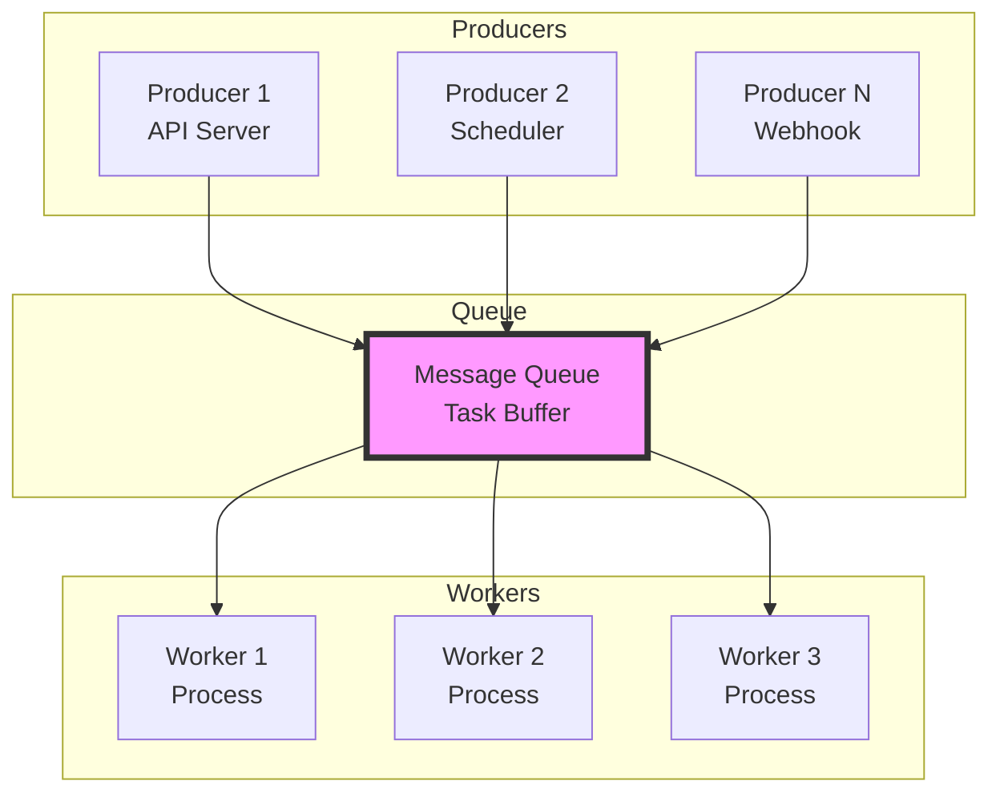
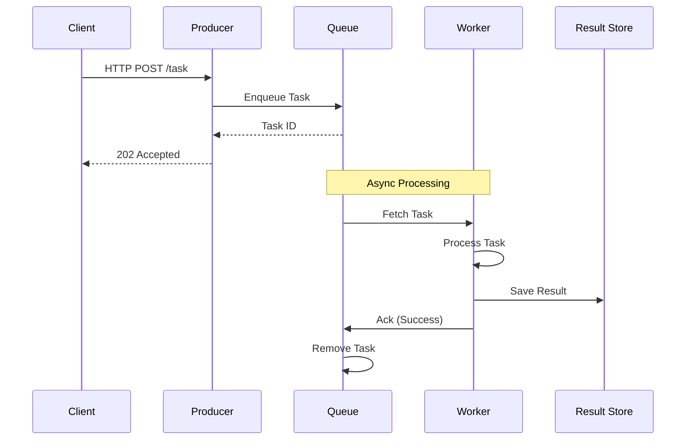
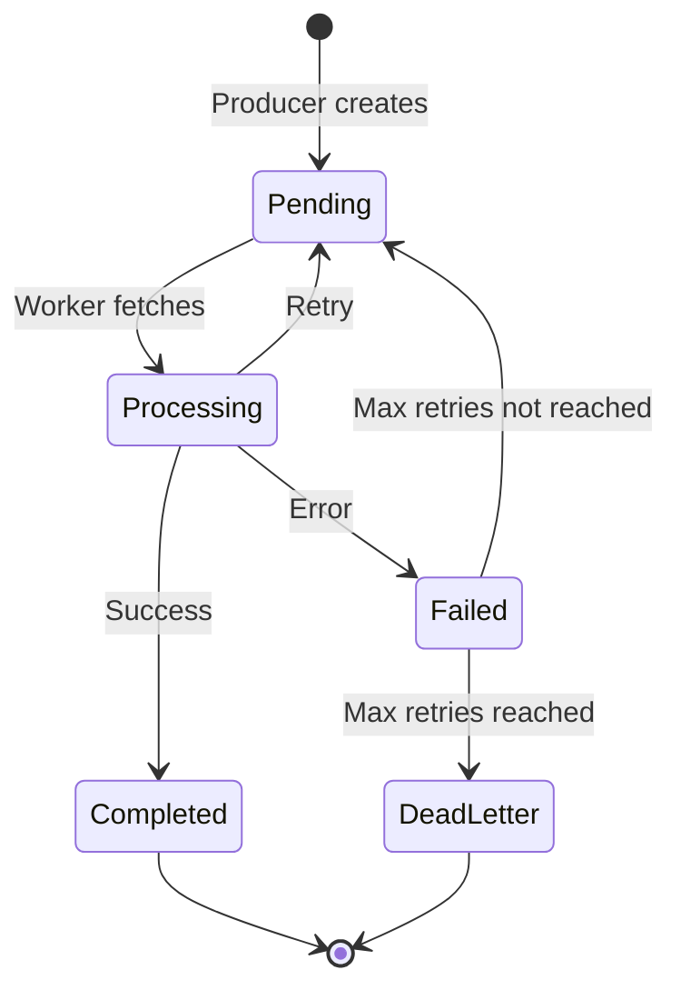

# Queue System Implementation

> **Session 2** - Full session (90 minutes)

## Learning Objectives

- [ ] Understand the producer-consumer pattern
- [ ] Build a working queue system with concurrent workers
- [ ] Implement fault tolerance with retry logic
- [ ] Deploy and test the system using Docker Compose

## The Producer-Consumer Pattern

The **producer-consumer pattern** is a fundamental distributed systems pattern where:
- **Producers** create and send tasks to a queue
- **Queue** buffers tasks between producers and consumers
- **Workers (consumers)** process tasks from the queue



### Key Benefits

| Benefit | Explanation |
|---------|-------------|
| **Decoupling** | Producers don't need to know about workers |
| **Buffering** | Queue handles traffic spikes |
| **Scalability** | Add/remove workers independently |
| **Reliability** | Tasks persist if workers fail |
| **Retry** | Failed tasks can be requeued |

## System Architecture

### Full System View



### Task Lifecycle



## Implementation

### Data Models

**Task Definition:**
```typescript
interface Task {
  id: string;
  type: string;           // 'email', 'image', 'report', etc.
  payload: any;
  status: 'pending' | 'processing' | 'completed' | 'failed';
  createdAt: number;
  retries: number;
  maxRetries: number;
  result?: any;
  error?: string;
}
```

```python
from dataclasses import dataclass, field
from typing import Any, Optional

@dataclass
class Task:
    id: str
    type: str  # 'email', 'image', 'report', etc.
    payload: Any
    status: str = 'pending'  # pending, processing, completed, failed
    created_at: float = field(default_factory=time.time)
    retries: int = 0
    max_retries: int = 3
    result: Optional[Any] = None
    error: Optional[str] = None
```

---

## TypeScript Implementation

### Project Structure
```
queue-system-ts/
├── package.json
├── docker-compose.yml
├── src/
│   ├── queue.ts          # Queue implementation
│   ├── producer.ts       # Producer API
│   ├── worker.ts         # Worker implementation
│   └── types.ts          # Type definitions
└── Dockerfile
```

### Complete TypeScript Code

**queue-system-ts/src/types.ts**
```typescript
export interface Task {
  id: string;
  type: string;
  payload: any;
  status: 'pending' | 'processing' | 'completed' | 'failed';
  createdAt: number;
  retries: number;
  maxRetries: number;
  result?: any;
  error?: string;
}

export interface QueueMessage {
  task: Task;
  timestamp: number;
}
```

**queue-system-ts/src/queue.ts**
```typescript
import { Task, QueueMessage } from './types';

export class Queue {
  private pending: Task[] = [];
  private processing: Map<string, Task> = new Map();
  private completed: Task[] = [];
  private failed: Task[] = [];

  // Enqueue a new task
  enqueue(type: string, payload: any): string {
    const task: Task = {
      id: this.generateId(),
      type,
      payload,
      status: 'pending',
      createdAt: Date.now(),
      retries: 0,
      maxRetries: 3
    };

    this.pending.push(task);
    console.log(`[Queue] Enqueued task ${task.id} (${type})`);
    return task.id;
  }

  // Get next pending task (for workers)
  dequeue(): Task | null {
    if (this.pending.length === 0) return null;

    const task = this.pending.shift()!;
    task.status = 'processing';
    this.processing.set(task.id, task);

    console.log(`[Queue] Dequeued task ${task.id}`);
    return task;
  }

  // Mark task as completed
  complete(taskId: string, result?: any): void {
    const task = this.processing.get(taskId);
    if (!task) return;

    task.status = 'completed';
    task.result = result;
    this.processing.delete(taskId);
    this.completed.push(task);

    console.log(`[Queue] Completed task ${taskId}`);
  }

  // Mark task as failed (will retry if possible)
  fail(taskId: string, error: string): void {
    const task = this.processing.get(taskId);
    if (!task) return;

    task.retries++;
    task.error = error;

    if (task.retries >= task.maxRetries) {
      task.status = 'failed';
      this.processing.delete(taskId);
      this.failed.push(task);
      console.log(`[Queue] Task ${taskId} failed permanently after ${task.retries} retries`);
    } else {
      task.status = 'pending';
      this.processing.delete(taskId);
      this.pending.push(task);
      console.log(`[Queue] Task ${taskId} failed, retrying (${task.retries}/${task.maxRetries})`);
    }
  }

  // Get queue statistics
  getStats() {
    return {
      pending: this.pending.length,
      processing: this.processing.size,
      completed: this.completed.length,
      failed: this.failed.length
    };
  }

  private generateId(): string {
    return `task-${Date.now()}-${Math.random().toString(36).substr(2, 9)}`;
  }
}
```

**queue-system-ts/src/producer.ts**
```typescript
import http from 'http';
import { Queue } from './queue';

const queue = new Queue();

const server = http.createServer((req, res) => {
  if (req.method === 'POST' && req.url === '/task') {
    let body = '';
    req.on('data', chunk => body += chunk);
    req.on('end', () => {
      try {
        const { type, payload } = JSON.parse(body);

        if (!type || !payload) {
          res.writeHead(400);
          res.end(JSON.stringify({ error: 'type and payload required' }));
          return;
        }

        const taskId = queue.enqueue(type, payload);

        res.writeHead(202); // Accepted
        res.end(JSON.stringify({
          taskId,
          message: 'Task enqueued',
          stats: queue.getStats()
        }));
      } catch (error) {
        res.writeHead(400);
        res.end(JSON.stringify({ error: 'Invalid JSON' }));
      }
    });
  } else if (req.method === 'GET' && req.url === '/stats') {
    res.writeHead(200);
    res.end(JSON.stringify(queue.getStats()));
  } else {
    res.writeHead(404);
    res.end(JSON.stringify({ error: 'Not found' }));
  }
});

const PORT = process.env.PORT || 3000;
server.listen(PORT, () => {
  console.log(`Producer API listening on port ${PORT}`);
});

export { queue };
```

**queue-system-ts/src/worker.ts**
```typescript
import http from 'http';
import { Queue, Task } from './types';

// Simulate task processing
async function processTask(task: Task): Promise<any> {
  console.log(`[Worker] Processing task ${task.id} (${task.type})`);

  // Simulate work
  await new Promise(resolve => setTimeout(resolve, 1000 + Math.random() * 2000));

  // Simulate occasional failures (20% chance)
  if (Math.random() < 0.2) {
    throw new Error('Random processing error');
  }

  // Process based on task type
  switch (task.type) {
    case 'email':
      return { sent: true, to: task.payload.to };
    case 'image':
      return { processed: true, url: task.payload.url };
    case 'report':
      return { generated: true, format: 'pdf' };
    default:
      return { result: 'processed' };
  }
}

class Worker {
  private id: string;
  private queueUrl: string;
  private running: boolean = false;

  constructor(id: string, queueUrl: string) {
    this.id = id;
    this.queueUrl = queueUrl;
  }

  async start(): Promise<void> {
    this.running = true;
    console.log(`[Worker ${this.id}] Started`);

    while (this.running) {
      try {
        await this.processNextTask();
      } catch (error) {
        console.error(`[Worker ${this.id}] Error:`, error);
        await this.sleep(1000); // Wait before retrying
      }
    }
  }

  private async processNextTask(): Promise<void> {
    // Fetch task from queue
    const task = await this.fetchTask();
    if (!task) {
      await this.sleep(1000); // No task, wait
      return;
    }

    try {
      // Process the task
      const result = await processTask(task);

      // Mark as complete
      await this.completeTask(task.id, result);
    } catch (error: any) {
      // Mark as failed
      await this.failTask(task.id, error.message);
    }
  }

  private async fetchTask(): Promise<Task | null> {
    return new Promise((resolve, reject) => {
      http.get(`${this.queueUrl}/dequeue`, (res) => {
        let body = '';
        res.on('data', chunk => body += chunk);
        res.on('end', () => {
          if (res.statusCode === 204) {
            resolve(null); // No tasks available
          } else if (res.statusCode === 200) {
            resolve(JSON.parse(body));
          } else {
            reject(new Error(`Unexpected status: ${res.statusCode}`));
          }
        });
      }).on('error', reject);
    });
  }

  private async completeTask(taskId: string, result: any): Promise<void> {
    return new Promise((resolve, reject) => {
      const data = JSON.stringify({ result });
      http.request({
        hostname: 'localhost',
        port: 3000,
        path: `/complete/${taskId}`,
        method: 'POST',
        headers: { 'Content-Type': 'application/json', 'Content-Length': data.length }
      }, (res) => {
        if (res.statusCode === 200) {
          resolve();
        } else {
          reject(new Error(`Failed to complete task: ${res.statusCode}`));
        }
      }).on('error', reject).end(data);
    });
  }

  private async failTask(taskId: string, error: string): Promise<void> {
    return new Promise((resolve, reject) => {
      const data = JSON.stringify({ error });
      http.request({
        hostname: 'localhost',
        port: 3000,
        path: `/fail/${taskId}`,
        method: 'POST',
        headers: { 'Content-Type': 'application/json', 'Content-Length': data.length }
      }, (res) => {
        if (res.statusCode === 200) {
          resolve();
        } else {
          reject(new Error(`Failed to fail task: ${res.statusCode}`));
        }
      }).on('error', reject).end(data);
    });
  }

  private sleep(ms: number): Promise<void> {
    return new Promise(resolve => setTimeout(resolve, ms));
  }

  stop(): void {
    this.running = false;
  }
}

// Start worker
const workerId = process.env.WORKER_ID || 'worker-1';
const worker = new Worker(workerId, 'http://localhost:3000');
worker.start();
```

---

## Python Implementation

### Project Structure
```
queue-system-py/
├── requirements.txt
├── docker-compose.yml
├── src/
│   ├── queue.py          # Queue implementation
│   ├── producer.py       # Producer API
│   └── worker.py         # Worker implementation
└── Dockerfile
```

### Complete Python Code

**queue-system-py/src/queue.py**
```python
import time
import uuid
from dataclasses import dataclass, field
from typing import Any, Optional, List, Dict
from enum import Enum

class TaskStatus(Enum):
    PENDING = 'pending'
    PROCESSING = 'processing'
    COMPLETED = 'completed'
    FAILED = 'failed'

@dataclass
class Task:
    id: str
    type: str
    payload: Any
    status: str = TaskStatus.PENDING.value
    created_at: float = field(default_factory=time.time)
    retries: int = 0
    max_retries: int = 3
    result: Optional[Any] = None
    error: Optional[str] = None

class Queue:
    def __init__(self):
        self.pending: List[Task] = []
        self.processing: Dict[str, Task] = {}
        self.completed: List[Task] = []
        self.failed: List[Task] = []

    def enqueue(self, task_type: str, payload: Any) -> str:
        """Enqueue a new task."""
        task = Task(
            id=f"task-{int(time.time()*1000)}-{uuid.uuid4().hex[:8]}",
            type=task_type,
            payload=payload
        )
        self.pending.append(task)
        print(f"[Queue] Enqueued task {task.id} ({task_type})")
        return task.id

    def dequeue(self) -> Optional[Task]:
        """Get next pending task."""
        if not self.pending:
            return None

        task = self.pending.pop(0)
        task.status = TaskStatus.PROCESSING.value
        self.processing[task.id] = task
        print(f"[Queue] Dequeued task {task.id}")
        return task

    def complete(self, task_id: str, result: Any = None) -> None:
        """Mark task as completed."""
        task = self.processing.pop(task_id, None)
        if not task:
            return

        task.status = TaskStatus.COMPLETED.value
        task.result = result
        self.completed.append(task)
        print(f"[Queue] Completed task {task_id}")

    def fail(self, task_id: str, error: str) -> None:
        """Mark task as failed (will retry if possible)."""
        task = self.processing.pop(task_id, None)
        if not task:
            return

        task.retries += 1
        task.error = error

        if task.retries >= task.max_retries:
            task.status = TaskStatus.FAILED.value
            self.failed.append(task)
            print(f"[Queue] Task {task_id} failed permanently after {task.retries} retries")
        else:
            task.status = TaskStatus.PENDING.value
            self.pending.append(task)
            print(f"[Queue] Task {task_id} failed, retrying ({task.retries}/{task.max_retries})")

    def get_stats(self) -> Dict[str, int]:
        """Get queue statistics."""
        return {
            'pending': len(self.pending),
            'processing': len(self.processing),
            'completed': len(self.completed),
            'failed': len(self.failed)
        }
```

**queue-system-py/src/producer.py**
```python
from http.server import HTTPServer, BaseHTTPRequestHandler
import json
from queue import Queue

queue = Queue()

class ProducerHandler(BaseHTTPRequestHandler):
    def do_POST(self):
        if self.path == '/task':
            content_length = int(self.headers['Content-Length'])
            post_data = self.rfile.read(content_length)

            try:
                data = json.loads(post_data.decode())
                task_type = data.get('type')
                payload = data.get('payload')

                if not task_type or not payload:
                    self.send_error(400, 'type and payload required')
                    return

                task_id = queue.enqueue(task_type, payload)

                response = json.dumps({
                    'taskId': task_id,
                    'message': 'Task enqueued',
                    'stats': queue.get_stats()
                })

                self.send_response(202)  # Accepted
                self.send_header('Content-Type', 'application/json')
                self.end_headers()
                self.wfile.write(response.encode())

            except json.JSONDecodeError:
                self.send_error(400, 'Invalid JSON')

    def do_GET(self):
        if self.path == '/stats':
            response = json.dumps(queue.get_stats())
            self.send_response(200)
            self.send_header('Content-Type', 'application/json')
            self.end_headers()
            self.wfile.write(response.encode())

    def log_message(self, format, *args):
        pass  # Suppress default logging

if __name__ == '__main__':
    import os
    port = int(os.environ.get('PORT', 3000))
    server = HTTPServer(('0.0.0.0', port), ProducerHandler)
    print(f"Producer API listening on port {port}")
    server.serve_forever()
```

**queue-system-py/src/worker.py**
```python
import os
import time
import random
import requests
from typing import Optional, Dict, Any
from queue import Task

# Simulate task processing
def process_task(task: Task) -> Any:
    print(f"[Worker] Processing task {task.id} ({task.type})")

    # Simulate work
    time.sleep(1 + random.random() * 2)

    # Simulate occasional failures (20% chance)
    if random.random() < 0.2:
        raise Exception('Random processing error')

    # Process based on task type
    if task.type == 'email':
        return {'sent': True, 'to': task.payload.get('to')}
    elif task.type == 'image':
        return {'processed': True, 'url': task.payload.get('url')}
    elif task.type == 'report':
        return {'generated': True, 'format': 'pdf'}
    else:
        return {'result': 'processed'}

class Worker:
    def __init__(self, worker_id: str, queue_url: str):
        self.id = worker_id
        self.queue_url = queue_url
        self.running = False

    def start(self):
        """Start the worker loop."""
        self.running = True
        print(f"[Worker {self.id}] Started")

        while self.running:
            try:
                self.process_next_task()
            except Exception as e:
                print(f"[Worker {self.id}] Error: {e}")
                time.sleep(1)

    def process_next_task(self):
        """Fetch and process the next task."""
        task = self.fetch_task()
        if not task:
            time.sleep(1)  # No task, wait
            return

        try:
            result = process_task(task)
            self.complete_task(task['id'], result)
        except Exception as e:
            self.fail_task(task['id'], str(e))

    def fetch_task(self) -> Optional[Dict]:
        """Fetch next task from queue."""
        try:
            response = requests.get(f"{self.queue_url}/dequeue", timeout=5)
            if response.status_code == 204:
                return None  # No tasks
            return response.json()
        except requests.RequestException:
            return None

    def complete_task(self, task_id: str, result: Any):
        """Mark task as complete."""
        requests.post(
            f"{self.queue_url}/complete/{task_id}",
            json={'result': result},
            timeout=5
        )

    def fail_task(self, task_id: str, error: str):
        """Mark task as failed."""
        requests.post(
            f"{self.queue_url}/fail/{task_id}",
            json={'error': error},
            timeout=5
        )

    def stop(self):
        """Stop the worker."""
        self.running = False

if __name__ == '__main__':
    worker_id = os.environ.get('WORKER_ID', 'worker-1')
    queue_url = os.environ.get('QUEUE_URL', 'http://localhost:3000')
    worker = Worker(worker_id, queue_url)
    worker.start()
```

---

## Docker Compose Setup

### TypeScript Version (docker-compose.yml)
```yaml
version: '3.8'

services:
  producer:
    build: ./src
    ports:
      - "3000:3000"
    environment:
      - PORT=3000
    volumes:
      - ./src:/app/src
    command: npm run start:producer

  worker-1:
    build: ./src
    environment:
      - WORKER_ID=worker-1
    depends_on:
      - producer
    volumes:
      - ./src:/app/src
    command: npm run start:worker

  worker-2:
    build: ./src
    environment:
      - WORKER_ID=worker-2
    depends_on:
      - producer
    volumes:
      - ./src:/app/src
    command: npm run start:worker

  worker-3:
    build: ./src
    environment:
      - WORKER_ID=worker-3
    depends_on:
      - producer
    volumes:
      - ./src:/app/src
    command: npm run start:worker
```

### TypeScript Dockerfile
```dockerfile
FROM node:18-alpine

WORKDIR /app

COPY package*.json ./
RUN npm install

COPY . .

CMD ["npm", "run", "start:producer"]
```

### Python Version (docker-compose.yml)
```yaml
version: '3.8'

services:
  producer:
    build: ./src
    ports:
      - "3000:3000"
    environment:
      - PORT=3000
    volumes:
      - ./src:/app/src
    command: python src/producer.py

  worker-1:
    build: ./src
    environment:
      - WORKER_ID=worker-1
      - QUEUE_URL=http://producer:3000
    depends_on:
      - producer
    volumes:
      - ./src:/app/src
    command: python src/worker.py

  worker-2:
    build: ./src
    environment:
      - WORKER_ID=worker-2
      - QUEUE_URL=http://producer:3000
    depends_on:
      - producer
    volumes:
      - ./src:/app/src
    command: python src/worker.py

  worker-3:
    build: ./src
    environment:
      - WORKER_ID=worker-3
      - QUEUE_URL=http://producer:3000
    depends_on:
      - producer
    volumes:
      - ./src:/app/src
    command: python src/worker.py
```

### Python Dockerfile
```dockerfile
FROM python:3.11-alpine

WORKDIR /app

COPY requirements.txt ./
RUN pip install --no-cache-dir -r requirements.txt

COPY . .

CMD ["python", "src/producer.py"]
```

---

## Running the Example

### Step 1: Start the System

```bash
cd examples/01-queue
docker-compose up --build
```

You should see output like:
```
producer      | Producer API listening on port 3000
worker-1      | [Worker worker-1] Started
worker-2      | [Worker worker-2] Started
worker-3      | [Worker worker-3] Started
```

### Step 2: Submit Tasks

Open a new terminal and submit some tasks:

```bash
# Submit an email task
curl -X POST http://localhost:3000/task \
  -H "Content-Type: application/json" \
  -d '{"type": "email", "payload": {"to": "user@example.com", "subject": "Hello"}}'

# Submit an image processing task
curl -X POST http://localhost:3000/task \
  -H "Content-Type: application/json" \
  -d '{"type": "image", "payload": {"url": "https://example.com/image.jpg"}}'

# Submit multiple tasks
for i in {1..10}; do
  curl -X POST http://localhost:3000/task \
    -H "Content-Type: application/json" \
    -d "{\"type\": \"report\", \"payload\": {\"id\": $i}}"
done
```

### Step 3: Watch Processing

In the Docker logs, you'll see:
```
worker-2      | [Queue] Dequeued task task-1234567890-abc123
worker-2      | [Worker] Processing task task-1234567890-abc123 (report)
worker-2      | [Queue] Completed task task-1234567890-abc123
```

### Step 4: Check Statistics

```bash
curl http://localhost:3000/stats
```

Response:
```json
{
  "pending": 5,
  "processing": 3,
  "completed": 12,
  "failed": 0
}
```

### Step 5: Test Fault Tolerance

Stop one worker:
```bash
docker-compose stop worker-1
```

Tasks continue processing with the remaining workers. The queue automatically handles the load redistribution.

## Exercises

### Exercise 1: Add Priority Support

Modify the queue to support high/normal/low priority tasks:
1. Add a `priority` field to the Task model
2. Modify `enqueue()` to sort pending tasks by priority
3. Test with mixed priority tasks

### Exercise 2: Implement Dead Letter Queue

Create a separate queue for permanently failed tasks:
1. Add a `dead_letter` queue to store failed tasks
2. Add an API endpoint to inspect/retry dead letter tasks
3. Log failed tasks to a file for manual inspection

### Exercise 3: Add Task Scheduling

Implement delayed task execution:
1. Add an `executeAt` timestamp to tasks
2. Modify workers to skip tasks scheduled for the future
3. Use a timer/scheduler to move scheduled tasks to pending queue

## Summary

### Key Takeaways

1. **Producer-consumer pattern** decouples task creation from processing
2. **Queues buffer tasks** and handle traffic spikes
3. **Workers scale independently** of producers
4. **Retry logic** provides fault tolerance
5. **Docker Compose** enables easy local deployment

### Check Your Understanding

- [ ] How does the queue handle worker failures?
- [ ] What happens when a task fails and max retries is reached?
- [ ] Why is the queue useful for handling traffic spikes?
- [ ] How would you add a new worker type (e.g., a worker that only processes emails)?

## 🧠 Chapter Quiz

Test your mastery of these concepts! These questions will challenge your understanding and reveal any gaps in your knowledge.

{{#quiz ../../quizzes/fundamentals-queue-system.toml}}

## What's Next

Now that we've built a queue system, let's explore how to partition data across multiple nodes: [Data Partitioning](../data-store/01-partitioning.md)
