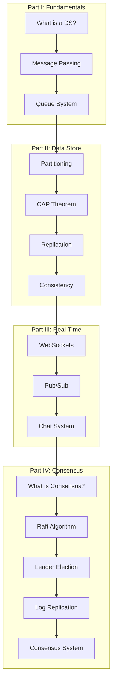
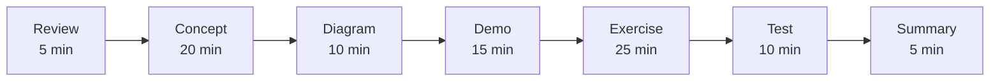

# Distributed Systems Course

Welcome to the Distributed Systems Course! This course will take you from foundational concepts to building a working consensus-based system.

## Why Learn Distributed Systems?

Distributed systems are everywhere. Every time you use a modern web service, you're interacting with a distributed system:

- **Social media platforms** handling billions of users
- **E-commerce sites** processing millions of transactions
- **Streaming services** delivering content globally
- **Cloud databases** storing and replicating data across continents

Understanding distributed systems is essential for building scalable, reliable applications.

## Course Overview

This course teaches distributed systems concepts through hands-on implementation. Over 10 sessions, you will build four progressively complex distributed applications:

| Application | Sessions | Concepts |
|-------------|----------|----------|
| Queue/Work System | 1-2 | Producer-consumer, message passing, fault tolerance |
| Store with Replication | 3-5 | Partitioning, CAP theorem, leader election, consistency |
| Chat System | 6-7 | WebSockets, pub/sub, message ordering |
| Consensus System | 8-10 | Raft algorithm, log replication, state machine |

## What You'll Learn

By the end of this course, you will be able to:

1. **Explain** distributed systems concepts including CAP theorem, consistency models, and consensus
2. **Build** a working message queue system with producer-consumer pattern
3. **Implement** a replicated key-value store with leader election
4. **Create** a real-time chat system with pub/sub messaging
5. **Develop** a consensus-based system using the Raft algorithm
6. **Deploy** all systems using Docker Compose on your local machine

## Target Audience

This course is designed for developers who:

- Have **basic programming experience** (functions, classes, basic OOP)
- Are **new to distributed systems**
- Want to understand **how modern distributed applications work**
- Prefer **learning by doing** over pure theory

## Prerequisites

- **Programming:** Comfortable with either TypeScript or Python
- **Command Line:** Basic familiarity with terminal commands
- **Docker:** We'll cover Docker setup in the [Docker Setup](./reference/docker-setup.md) section

No prior distributed systems experience is required!

## Course Progression



## Course Format

Each 1.5-hour session follows this structure:



### Session Components

- **Concept Explanation:** Clear, beginner-friendly explanations of core concepts
- **Visual Diagrams:** Mermaid diagrams showing architecture and data flow
- **Live Demo:** Step-by-step code walkthrough
- **Hands-on Exercise:** Practical exercises to reinforce learning
- **Run & Test:** Verify your implementation works correctly

## Code Examples

Every concept includes implementations in **both TypeScript and Python**:

```typescript
// TypeScript example
interface Message {
  id: string;
  content: string;
}
```

```python
# Python example
@dataclass
class Message:
    id: str
    content: str
```

Choose the language you're most comfortable with, or learn both!

## Before You Begin

### 1. Set Up Your Environment

Follow the [Docker Setup Guide](./reference/docker-setup.md) to install:

- Docker and Docker Compose
- Your preferred programming language (TypeScript or Python)

### 2. Verify Your Installation

```bash
docker --version
docker-compose --version
```

### 3. Choose Your Language

Decide whether you'll work with **TypeScript** or **Python** throughout the course. Both languages have complete examples for every concept.

## Learning Tips

- **Don't rush:** Each concept builds on the previous ones
- **Run the code:** Follow along with the examples in your terminal
- **Experiment:** Modify the code and see what happens
- **Ask questions:** Use the troubleshooting guide when stuck
- **Build in public:** Share your progress and learn from others

## What You'll Build

By the end of this course, you'll have four working distributed systems:

1. **Queue System** - A fault-tolerant task processing system
2. **Replicated Store** - A key-value store with leader election
3. **Chat System** - A real-time messaging system with presence
4. **Consensus System** - A Raft-based distributed database

All systems run locally using Docker Compose—no cloud infrastructure required!

## Let's Get Started!

Ready to dive in? Continue to [Chapter 1: What is a Distributed System?](./fundamentals/01-what-is-ds.md)
