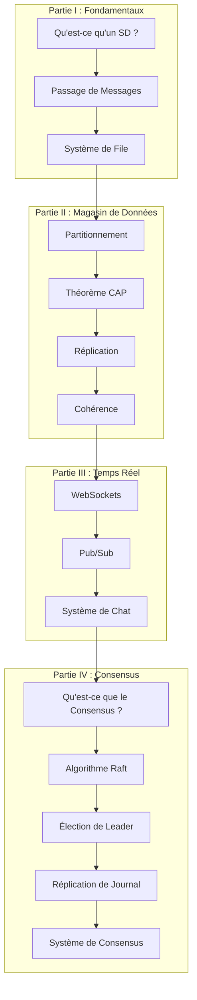
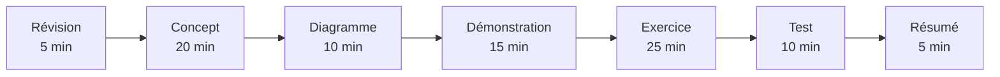

# Cours de Systèmes Distribués

Bienvenue dans le Cours de Systèmes Distribués ! Ce cours vous guidera des concepts fondamentaux jusqu'à la construction d'un système fonctionnel basé sur le consensus.

## Pourquoi Apprendre les Systèmes Distribués ?

Les systèmes distribués sont partout. Chaque fois que vous utilisez un service web moderne, vous interagissez avec un système distribué :

- **Plateformes de médias sociaux** gérant des milliards d'utilisateurs
- **Sites de commerce électronique** traitant des millions de transactions
- **Services de streaming** diffusant du contenu à l'échelle mondiale
- **Bases de données cloud** stockant et répliquant des données à travers les continents

Comprendre les systèmes distribués est essentiel pour construire des applications évolutives et fiables.

## Aperçu du Cours

Ce cours enseigne les concepts des systèmes distribués à travers une mise en œuvre pratique. Sur 10 sessions, vous construirez quatre applications distribuées de complexité croissante :

| Application | Sessions | Concepts |
|-------------|----------|----------|
| Système File/Travail | 1-2 | Producteur-consommateur, passage de messages, tolérance aux pannes |
| Magasin avec Réplication | 3-5 | Partitionnement, théorème CAP, élection de leader, cohérence |
| Système de Chat | 6-7 | WebSockets, pub/sub, ordonnancement des messages |
| Système de Consensus | 8-10 | Algorithme Raft, réplication de journal, machine à états |

## Ce que Vous Apprendrez

À la fin de ce cours, vous serez capable de :

1. **Expliquer** les concepts des systèmes distribués y compris le théorème CAP, les modèles de cohérence et le consensus
2. **Construire** un système de file d'attente fonctionnel avec le modèle producteur-consommateur
3. **Implémenter** un magasin clé-valeur répliqué avec élection de leader
4. **Créer** un système de chat en temps réel avec messagerie pub/sub
5. **Développer** un système basé sur le consensus en utilisant l'algorithme Raft
6. **Déployer** tous les systèmes en utilisant Docker Compose sur votre machine locale

## Public Cible

Ce cours est conçu pour les développeurs qui :

- Ont une **expérience de base en programmation** (fonctions, classes, POO de base)
- Sont **novices en systèmes distribués**
- Veulent comprendre **comment fonctionnent les applications distribuées modernes**
- Préfèrent **apprendre en pratiquant** plutôt que la théorie pure

## Prérequis

- **Programmation :** À l'aise avec TypeScript ou Python
- **Ligne de Commande :** Familiarité de base avec les commandes du terminal
- **Docker :** Nous couvrirons la configuration Docker dans la section [Configuration Docker](./reference/docker-setup.md)

Aucune expérience préalable en systèmes distribués n'est requise !

## Progression du Cours



## Format du Cours

Chaque session de 1,5 heure suit cette structure :



### Composants de Session

- **Explication de Concept :** Des explications claires et adaptées aux débutants des concepts fondamentaux
- **Diagrammes Visuels :** Des diagrammes Mermaid montrant l'architecture et le flux des données
- **Démonstration en Direct :** Procédure pas à pas du code
- **Exercice Pratique :** Exercices pratiques pour renforcer l'apprentissage
- **Exécution et Test :** Vérifiez que votre implémentation fonctionne correctement

## Exemples de Code

Chaque concept inclut des implémentations en **TypeScript et Python** :

```typescript
// Exemple TypeScript
interface Message {
  id: string;
  content: string;
}
```

```python
# Exemple Python
@dataclass
class Message:
    id: str
    content: str
```

Choisissez le langage avec lequel vous êtes le plus à l'aise, ou apprenez les deux !

## Avant de Commencer

### 1. Configurez Votre Environnement

Suivez le [Guide de Configuration Docker](./reference/docker-setup.md) pour installer :

- Docker et Docker Compose
- Votre langage de programmation préféré (TypeScript ou Python)

### 2. Vérifiez Votre Installation

```bash
docker --version
docker-compose --version
```

### 3. Choisissez Votre Langage

Décidez si vous travaillerez avec **TypeScript** ou **Python** tout au long du cours. Les deux langages ont des exemples complets pour chaque concept.

## Conseils d'Apprentissage

- **Ne vous précipitez pas :** Chaque concept s'appuie sur les précédents
- **Exécutez le code :** Suivez les exemples dans votre terminal
- **Expérimentez :** Modifiez le code et observez ce qui se passe
- **Posez des questions :** Utilisez le guide de dépannage quand vous êtes bloqué
- **Construisez en public :** Partagez votre progression et apprenez des autres

## Ce que Vous Construirez

À la fin de ce cours, vous aurez quatre systèmes distribués fonctionnels :

1. **Système de File** - Un système de traitement des tâches tolérant aux pannes
2. **Magasin Répliqué** - Un magasin clé-valeur avec élection de leader
3. **Système de Chat** - Un système de messagerie en temps réel avec présence
4. **Système de Consensus** - Une base de données distribuée basée sur Raft

Tous les systèmes fonctionnent localement en utilisant Docker Compose — aucune infrastructure cloud n'est requise !

## Commençons !

Prêt à plonger ? Continuez vers [Chapitre 1 : Qu'est-ce qu'un Système Distribué ?](./fundamentals/01-what-is-ds.md)
