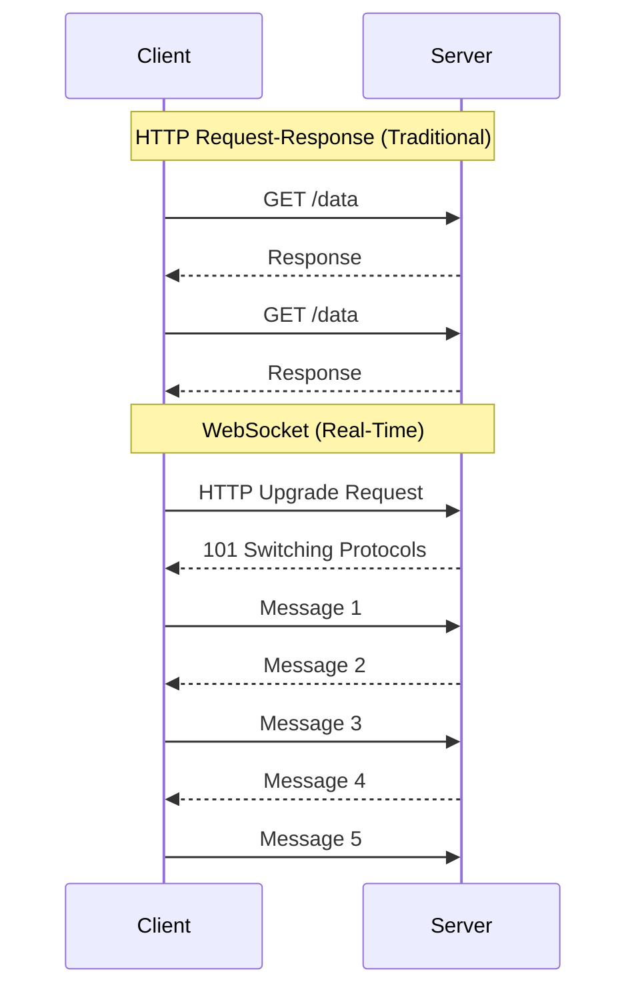
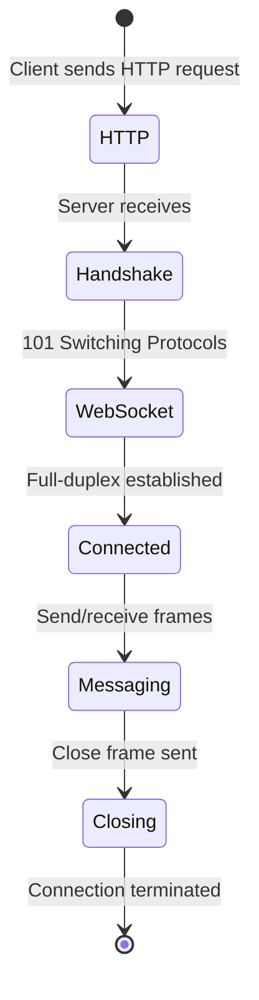
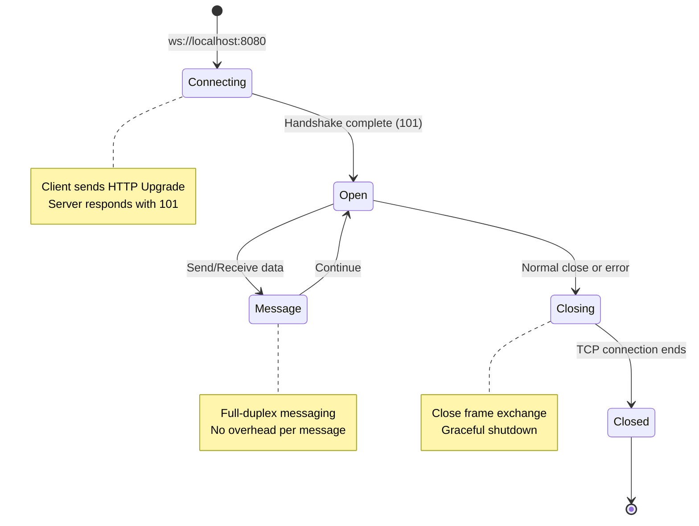

# WebSockets

> **Session 6, Part 1** - 20 minutes

## Learning Objectives

- [ ] Understand the WebSocket protocol and its advantages over HTTP
- [ ] Learn the WebSocket connection lifecycle
- [ ] Implement WebSocket servers and clients in TypeScript and Python
- [ ] Handle connection management and error scenarios

## Introduction

In previous sessions, we built systems using HTTP—a **request-response** protocol. The client asks, the server answers. But what if we need **real-time, bidirectional** communication?

Enter **WebSockets**: a protocol that enables full-duplex communication over a single TCP connection.



## WebSocket vs HTTP

| Aspect | HTTP | WebSocket |
|--------|------|-----------|
| **Communication** | Half-duplex (request-response) | Full-duplex (bidirectional) |
| **Connection** | New connection per request | Persistent connection |
| **Latency** | Higher (HTTP overhead) | Lower (frames, not packets) |
| **State** | Stateless | Stateful connection |
| **Server Push** | Requires polling/SSE | Native push support |

### When to Use WebSockets

**Great for:**
- Chat applications
- Real-time collaboration (editing, gaming)
- Live dashboards and monitoring
- Multiplayer games

**Not ideal for:**
- Simple CRUD operations (use REST)
- One-time data fetching
- Stateless resource access

## The WebSocket Protocol

### Connection Handshake

WebSockets start as HTTP, then **upgrade** to the WebSocket protocol:



**HTTP Request (Upgrade):**
```http
GET /chat HTTP/1.1
Host: server.example.com
Upgrade: websocket
Connection: Upgrade
Sec-WebSocket-Key: dGhlIHNhbXBsZSBub25jZQ==
Sec-WebSocket-Version: 13
```

**HTTP Response (Accept):**
```http
HTTP/1.1 101 Switching Protocols
Upgrade: websocket
Connection: Upgrade
Sec-WebSocket-Accept: s3pPLMBiTxaQ9kYGzzhZRbK+xOo=
```

### Frame Structure

WebSocket messages are sent as **frames**, not HTTP packets:

```
+--------+--------+--------+--------+     +--------+
| FIN    | RSV1-3 | Opcode | Mask   | ... | Payload|
| 1 bit  | 3 bits | 4 bits | 1 bit  |     |        |
+--------+--------+--------+--------+     +--------+

Common Opcodes:
- 0x1: Text frame
- 0x2: Binary frame
- 0x8: Close connection
- 0x9: Ping
- 0xA: Pong
```

## WebSocket Lifecycle



## Implementation: TypeScript

We'll use the **`ws`** library—the de facto standard for WebSockets in Node.js.

### Server Implementation

```typescript
// examples/03-chat/ts/ws-server.ts
import { WebSocketServer, WebSocket } from 'ws';

interface ChatMessage {
  type: 'message' | 'join' | 'leave';
  username: string;
  content: string;
  timestamp: number;
}

const wss = new WebSocketServer({ port: 8080 });

const clients = new Map<WebSocket, string>();

console.log('WebSocket server running on ws://localhost:8080');

wss.on('connection', (ws: WebSocket) => {
  console.log('New client connected');

  // Welcome message
  ws.send(JSON.stringify({
    type: 'message',
    username: 'System',
    content: 'Welcome! Please identify yourself.',
    timestamp: Date.now()
  } as ChatMessage));

  // Handle incoming messages
  ws.on('message', (data: Buffer) => {
    try {
      const message: ChatMessage = JSON.parse(data.toString());

      if (message.type === 'join') {
        // Register username
        clients.set(ws, message.username);
        console.log(`${message.username} joined`);

        // Broadcast to all clients
        broadcast({
          type: 'message',
          username: 'System',
          content: `${message.username} has joined the chat`,
          timestamp: Date.now()
        });
      } else if (message.type === 'message') {
        const username = clients.get(ws) || 'Anonymous';
        console.log(`${username}: ${message.content}`);

        // Broadcast the message
        broadcast({
          type: 'message',
          username,
          content: message.content,
          timestamp: Date.now()
        });
      }
    } catch (error) {
      console.error('Invalid message:', error);
    }
  });

  // Handle disconnection
  ws.on('close', () => {
    const username = clients.get(ws);
    if (username) {
      console.log(`${username} disconnected`);
      clients.delete(ws);

      broadcast({
        type: 'message',
        username: 'System',
        content: `${username} has left the chat`,
        timestamp: Date.now()
      });
    }
  });

  // Handle errors
  ws.on('error', (error) => {
    console.error('WebSocket error:', error);
  });
});

function broadcast(message: ChatMessage): void {
  const data = JSON.stringify(message);

  wss.clients.forEach((client) => {
    if (client.readyState === WebSocket.OPEN) {
      client.send(data);
    }
  });
}

// Heartbeat to detect stale connections
const interval = setInterval(() => {
  wss.clients.forEach((ws) => {
    if (ws.isAlive === false) {
      return ws.terminate();
    }

    ws.isAlive = false;
    ws.ping();
  });
}, 30000);

wss.on('close', () => {
  clearInterval(interval);
});
```

### Client Implementation

```typescript
// examples/03-chat/ts/ws-client.ts
import { WebSocket } from 'ws';

interface ChatMessage {
  type: 'message' | 'join' | 'leave';
  username: string;
  content: string;
  timestamp: number;
}

class ChatClient {
  private ws: WebSocket;
  private username: string;
  private reconnectAttempts = 0;
  private readonly maxReconnectAttempts = 5;

  constructor(url: string, username: string) {
    this.username = username;
    this.ws = this.connect(url);
  }

  private connect(url: string): WebSocket {
    const ws = new WebSocket(url);

    ws.on('open', () => {
      console.log('Connected to chat server');
      this.reconnectAttempts = 0;

      // Identify ourselves
      this.send({
        type: 'join',
        username: this.username,
        content: '',
        timestamp: Date.now()
      });
    });

    ws.on('message', (data: Buffer) => {
      const message: ChatMessage = JSON.parse(data.toString());
      this.displayMessage(message);
    });

    ws.on('close', () => {
      console.log('Disconnected from server');

      // Attempt reconnection
      if (this.reconnectAttempts < this.maxReconnectAttempts) {
        this.reconnectAttempts++;
        const delay = Math.min(1000 * Math.pow(2, this.reconnectAttempts), 30000);

        console.log(`Reconnecting in ${delay}ms... (attempt ${this.reconnectAttempts})`);

        setTimeout(() => {
          this.ws = this.connect(url);
        }, delay);
      }
    });

    ws.on('error', (error) => {
      console.error('WebSocket error:', error.message);
    });

    // Respond to pings
    ws.on('ping', () => {
      ws.pong();
    });

    return ws;
  }

  public send(message: ChatMessage): void {
    if (this.ws.readyState === WebSocket.OPEN) {
      this.ws.send(JSON.stringify(message));
    } else {
      console.error('Cannot send message: connection not open');
    }
  }

  public sendMessage(content: string): void {
    this.send({
      type: 'message',
      username: this.username,
      content,
      timestamp: Date.now()
    });
  }

  private displayMessage(message: ChatMessage): void {
    const time = new Date(message.timestamp).toLocaleTimeString();
    console.log(`[${time}] ${message.username}: ${message.content}`);
  }

  public close(): void {
    this.ws.close();
  }
}

// CLI interface
const username = process.argv[2] || `User${Math.floor(Math.random() * 1000)}`;
const client = new ChatClient('ws://localhost:8080', username);

console.log(`You are logged in as: ${username}`);
console.log('Type a message and press Enter to send. Press Ctrl+C to exit.');

// Read from stdin
process.stdin.setEncoding('utf8');
process.stdin.on('data', (chunk: Buffer) => {
  const text = chunk.toString().trim();
  if (text) {
    client.sendMessage(text);
  }
});

// Handle graceful shutdown
process.on('SIGINT', () => {
  console.log('\nShutting down...');
  client.close();
  process.exit(0);
});
```

### Package Configuration

```json
// examples/03-chat/ts/package.json
{
  "name": "chat-websocket-example",
  "version": "1.0.0",
  "type": "module",
  "scripts": {
    "server": "node --loader ts-node/esm ws-server.ts",
    "client": "node --loader ts-node/esm ws-client.ts"
  },
  "dependencies": {
    "ws": "^8.18.0"
  },
  "devDependencies": {
    "@types/ws": "^8.5.12",
    "ts-node": "^10.9.2",
    "typescript": "^5.6.3"
  }
}
```

## Implementation: Python

We'll use the **`websockets`** library—a fully compliant WebSocket implementation.

### Server Implementation

```python
# examples/03-chat/py/ws_server.py
import asyncio
import json
import logging
from datetime import datetime
from typing import Set
import websockets
from websockets.server import WebSocketServerProtocol

logging.basicConfig(level=logging.INFO)
logger = logging.getLogger(__name__)

# Track connected clients
clients: Set[WebSocketServerProtocol] = set()
usernames: dict[WebSocketServerProtocol, str] = {}


async def broadcast(message: dict) -> None:
    """Send a message to all connected clients."""
    if clients:
        await asyncio.gather(
            *[client.send(json.dumps(message)) for client in clients if client.open],
            return_exceptions=True
        )


async def handle_client(websocket: WebSocketServerProtocol) -> None:
    """Handle a client connection."""
    clients.add(websocket)
    logger.info(f"New client connected. Total clients: {len(clients)}")

    try:
        # Send welcome message
        welcome_msg = {
            "type": "message",
            "username": "System",
            "content": "Welcome! Please identify yourself.",
            "timestamp": datetime.now().timestamp()
        }
        await websocket.send(json.dumps(welcome_msg))

        # Handle messages
        async for message in websocket:
            try:
                data = json.loads(message)

                if data.get("type") == "join":
                    # Register username
                    username = data.get("username", "Anonymous")
                    usernames[websocket] = username
                    logger.info(f"{username} joined")

                    # Broadcast join notification
                    await broadcast({
                        "type": "message",
                        "username": "System",
                        "content": f"{username} has joined the chat",
                        "timestamp": datetime.now().timestamp()
                    })

                elif data.get("type") == "message":
                    # Broadcast the message
                    username = usernames.get(websocket, "Anonymous")
                    content = data.get("content", "")
                    logger.info(f"{username}: {content}")

                    await broadcast({
                        "type": "message",
                        "username": username,
                        "content": content,
                        "timestamp": datetime.now().timestamp()
                    })

            except json.JSONDecodeError:
                logger.error("Invalid JSON received")
            except Exception as e:
                logger.error(f"Error handling message: {e}")

    except websockets.exceptions.ConnectionClosed:
        logger.info("Client disconnected unexpectedly")
    finally:
        # Cleanup
        username = usernames.get(websocket)
        if username:
            del usernames[websocket]
            await broadcast({
                "type": "message",
                "username": "System",
                "content": f"{username} has left the chat",
                "timestamp": datetime.now().timestamp()
            })

        clients.discard(websocket)
        logger.info(f"Client removed. Total clients: {len(clients)}")


async def main():
    """Start the WebSocket server."""
    async with websockets.serve(handle_client, "localhost", 8080):
        logger.info("WebSocket server running on ws://localhost:8080")
        await asyncio.Future()  # Run forever


if __name__ == "__main__":
    try:
        asyncio.run(main())
    except KeyboardInterrupt:
        logger.info("Server stopped")
```

### Client Implementation

```python
# examples/03-chat/py/ws_client.py
import asyncio
import json
import sys
from datetime import datetime
import websockets
from websockets.client import WebSocketClientProtocol


class ChatClient:
    def __init__(self, url: str, username: str):
        self.url = url
        self.username = username
        self.websocket: WebSocketClientProtocol | None = None
        self.reconnect_attempts = 0
        self.max_reconnect_attempts = 5

    async def connect(self) -> None:
        """Connect to the WebSocket server."""
        backoff = 1

        while self.reconnect_attempts < self.max_reconnect_attempts:
            try:
                async with websockets.connect(self.url) as ws:
                    self.websocket = ws
                    self.reconnect_attempts = 0
                    print(f"Connected to {self.url}")

                    # Identify ourselves
                    await self.send({
                        "type": "join",
                        "username": self.username,
                        "content": "",
                        "timestamp": datetime.now().timestamp()
                    })

                    # Start receiving messages
                    receive_task = asyncio.create_task(self.receive_messages())

                    # Wait for connection to close
                    await ws.wait_closed()

                    # Cancel receive task
                    receive_task.cancel()
                    try:
                        await receive_task
                    except asyncio.CancelledError:
                        pass

                    print("Disconnected from server")

            except (ConnectionRefusedError, OSError) as e:
                self.reconnect_attempts += 1
                print(f"Connection failed: {e}")
                print(f"Reconnecting in {backoff}s... (attempt {self.reconnect_attempts})")

                await asyncio.sleep(backoff)
                backoff = min(backoff * 2, 30)

        print("Max reconnection attempts reached. Giving up.")

    async def receive_messages(self) -> None:
        """Receive and display messages from the server."""
        if not self.websocket:
            return

        try:
            async for message in self.websocket:
                data = json.loads(message)
                self.display_message(data)
        except asyncio.CancelledError:
            pass
        except Exception as e:
            print(f"Error receiving message: {e}")

    async def send(self, message: dict) -> None:
        """Send a message to the server."""
        if self.websocket and not self.websocket.closed:
            await self.websocket.send(json.dumps(message))
        else:
            print("Cannot send message: connection not open")

    def display_message(self, message: dict) -> None:
        """Display a received message."""
        timestamp = datetime.fromtimestamp(message["timestamp"]).strftime("%H:%M:%S")
        print(f"[{timestamp}] {message['username']}: {message['content']}")


async def stdin_reader(client: ChatClient):
    """Read from stdin and send messages."""
    loop = asyncio.get_event_loop()

    while True:
        line = await loop.run_in_executor(None, sys.stdin.readline)
        text = line.strip()

        if text:
            await client.send({
                "type": "message",
                "username": client.username,
                "content": text,
                "timestamp": datetime.now().timestamp()
            })


async def main():
    """Run the chat client."""
    username = sys.argv[1] if len(sys.argv) > 1 else f"User{asyncio.get_event_loop().time() % 1000:.0f}"
    client = ChatClient("ws://localhost:8080", username)

    print(f"You are logged in as: {username}")
    print("Type a message and press Enter to send. Press Ctrl+C to exit.")

    # Run connection and stdin reader concurrently
    connect_task = asyncio.create_task(client.connect())

    # Give connection time to establish
    await asyncio.sleep(0.5)

    stdin_task = asyncio.create_task(stdin_reader(client))

    try:
        await asyncio.gather(connect_task, stdin_task)
    except KeyboardInterrupt:
        print("\nShutting down...")
    finally:
        connect_task.cancel()
        stdin_task.cancel()


if __name__ == "__main__":
    try:
        asyncio.run(main())
    except KeyboardInterrupt:
        pass
```

### Requirements

```txt
# examples/03-chat/py/requirements.txt
websockets==13.1
```

## Docker Compose Setup

### TypeScript Version

```yaml
# examples/03-chat/ts/docker-compose.yml
version: '3.8'

services:
  server:
    build:
      context: .
      dockerfile: Dockerfile
    ports:
      - "8080:8080"
    environment:
      - NODE_ENV=production
    restart: unless-stopped
```

```dockerfile
# examples/03-chat/ts/Dockerfile
FROM node:20-alpine

WORKDIR /app

COPY package.json package-lock.json ./
RUN npm ci --only=production

COPY . .
RUN npx tsc

EXPOSE 8080

CMD ["node", "dist/ws-server.js"]
```

### Python Version

```yaml
# examples/03-chat/py/docker-compose.yml
version: '3.8'

services:
  server:
    build:
      context: .
      dockerfile: Dockerfile
    ports:
      - "8080:8080"
    restart: unless-stopped
```

```dockerfile
# examples/03-chat/py/Dockerfile
FROM python:3.12-alpine

WORKDIR /app

COPY requirements.txt .
RUN pip install --no-cache-dir -r requirements.txt

COPY . .

EXPOSE 8080

CMD ["python", "ws_server.py"]
```

## Running the Examples

### TypeScript

```bash
# Install dependencies
cd examples/03-chat/ts
npm install

# Start the server
npm run server

# In another terminal, start a client
npm run client Alice

# In another terminal, start another client
npm run client Bob
```

### Python

```bash
# Install dependencies
cd examples/03-chat/py
pip install -r requirements.txt

# Start the server
python ws_server.py

# In another terminal, start a client
python ws_client.py Alice

# In another terminal, start another client
python ws_client.py Bob
```

### With Docker

```bash
# Start the server
docker-compose up -d

# Check logs
docker-compose logs -f

# Connect with a client (run from host)
npm run client Alice  # or python ws_client.py Alice
```

## Connection Management Best Practices

### 1. Heartbeat/Ping-Pong

Detect stale connections before they cause issues:

```typescript
// Server sends ping every 30 seconds
setInterval(() => {
  wss.clients.forEach((ws) => {
    if (ws.isAlive === false) return ws.terminate();
    ws.isAlive = false;
    ws.ping();
  });
}, 30000);

// Client responds automatically
ws.on('ping', () => ws.pong());
```

### 2. Exponential Backoff Reconnection

Don't hammer the server when it's down:

```typescript
function reconnect(attempts: number) {
  const delay = Math.min(1000 * Math.pow(2, attempts), 30000);
  setTimeout(() => connect(), delay);
}
```

### 3. Graceful Shutdown

```typescript
// Send close frame before terminating
ws.close(1000, 'Normal closure');

// Wait for close frame acknowledgement
ws.on('close', () => {
  console.log('Connection closed cleanly');
});
```

### 4. Message Serialization

Always validate incoming messages:

```typescript
function safeParse(data: string): Message | null {
  try {
    const msg = JSON.parse(data);
    if (msg.type && msg.username) {
      return msg;
    }
  } catch {}
  return null;
}
```

## Common Pitfalls

| Pitfall | Symptom | Solution |
|---------|---------|----------|
| Not handling reconnection | Client stops working on network blip | Implement exponential backoff reconnection |
| Ignoring the `close` event | Memory leaks from stale clients | Always clean up on disconnect |
| Blocking the event loop | Messages delayed | Use async/await properly, avoid CPU-heavy work |
- Missing heartbeat | Stale connections remain | Implement ping/pong |
- Not validating messages | Crashes on malformed data | Always try/catch JSON parsing |

## Testing Your WebSocket Implementation

```bash
# Using websocat (like curl for WebSockets)
# Install: cargo install websocat

# Connect and send/receive messages
echo '{"type":"join","username":"TestUser","content":"","timestamp":123456}' | \
  websocat ws://localhost:8080

# Interactive mode
websocat ws://localhost:8080
```

## Summary

WebSockets enable **real-time, bidirectional communication** between clients and servers:

- **Protocol**: HTTP upgrade handshake → persistent TCP connection
- **Communication**: Full-duplex messaging with minimal overhead
- **Lifecycle**: Connecting → Open → Messaging → Closing → Closed
- **Best practices**: Heartbeats, graceful shutdown, reconnection handling

In the next section, we'll build on this foundation to implement **pub/sub messaging** for multi-room chat systems.

## Exercises

### Exercise 1: Add Private Messaging

Extend the chat system to support private messages between users:

```typescript
// Message format for private messages
{
  type: 'private',
  from: 'Alice',
  to: 'Bob',
  content: 'Hey Bob, are you there?',
  timestamp: 1234567890
}
```

**Requirements:**
1. Add a `private` message type
2. Route private messages only to the intended recipient
3. Show "private message" indicator in the UI

### Exercise 2: Typing Indicators

Show when a user is typing:

```typescript
// Typing indicator message
{
  type: 'typing',
  username: 'Alice',
  isTyping: true,
  timestamp: 1234567890
}
```

**Requirements:**
1. Send `typing.start` when user starts typing
2. Send `typing.stop` after 2 seconds of inactivity
3. Display "Alice is typing..." to other users

### Exercise 3: Connection Status

Display real-time connection status to the user:

**Requirements:**
1. Show: Connecting → Connected → Disconnected → Reconnecting
2. Use visual indicators (green dot, red dot, spinner)
3. Display ping/pong latency in milliseconds

### Exercise 4: Message History with Reconnection

When a client reconnects, send them messages they missed:

**Requirements:**
1. Store last 100 messages on the server
2. When client reconnects, send messages since their last timestamp
3. Deduplicate messages the client already has

## 🧠 Chapter Quiz

Test your mastery of these concepts! These questions will challenge your understanding and reveal any gaps in your knowledge.

{{#quiz ../../quizzes/real-time-websockets.toml}}
