# WebSockets

> **Session 6, Partie 1** - 20 minutes

## Objectifs d'apprentissage

- [ ] Comprendre le protocole WebSocket et ses avantages par rapport à HTTP
- [ ] Apprendre le cycle de vie d'une connexion WebSocket
- [ ] Implémenter des serveurs et clients WebSocket en TypeScript et Python
- [ ] Gérer la gestion des connexions et les scénarios d'erreur

## Introduction

Dans les sessions précédentes, nous avons construit des systèmes utilisant HTTP - un protocole **requête-réponse**. Le client demande, le serveur répond. Mais que se passe-t-il si nous avons besoin d'une communication **en temps réel, bidirectionnelle** ?

Voici les **WebSockets** : un protocole qui permet la communication full-duplex sur une seule connexion TCP.

```mermaid
sequenceDiagram
    participant Client
    participant Server

    Note over Client,Server: HTTP Requête-Réponse (Traditionnel)
    Client->>Server: GET /data
    Server-->>Client: Response
    Client->>Server: GET /data
    Server-->>Client: Response

    Note over Client,Server: WebSocket (Temps Réel)
    Client->>Server: HTTP Upgrade Request
    Server-->>Client: 101 Switching Protocols
    Client->>Server: Message 1
    Server-->>Client: Message 2
    Client->>Server: Message 3
    Server-->>Client: Message 4
    Client->>Server: Message 5
```



## WebSocket vs HTTP

| Aspect | HTTP | WebSocket |
|--------|------|-----------|
| **Communication** | Half-duplex (requête-réponse) | Full-duplex (bidirectionnelle) |
| **Connexion** | Nouvelle connexion par requête | Connexion persistante |
| **Latence** | Plus élevée (surcharge HTTP) | Plus faible (trames, non paquets) |
| **État** | Sans état (stateless) | Connexion avec état (stateful) |
| **Push serveur** | Nécessite polling/SSE | Support natif du push |

### Quand utiliser les WebSockets

**Idéal pour :**
- Les applications de chat
- La collaboration en temps réel (édition, jeux)
- Les tableaux de bord et monitoring en direct
- Les jeux multijoueurs

**Pas idéal pour :**
- Les opérations CRUD simples (utiliser REST)
- La récupération de données unique
- L'accès aux ressources sans état

## Le protocole WebSocket

### Poignée de main (Handshake)

Les WebSockets commencent par HTTP, puis effectuent une **mise à niveau** (upgrade) vers le protocole WebSocket :

```mermaid
stateDiagram-v2
    [*] --> HTTP: Client envoie requête HTTP
    HTTP --> Handshake: Serveur reçoit
    Handshake --> WebSocket: 101 Switching Protocols
    WebSocket --> Connected: Full-duplex établi
    Connected --> Messaging: Envoyer/recevoir trames
    Messaging --> Closing: Trame de fermeture envoyée
    Closing --> [*]: Connexion terminée
```



**Requête HTTP (mise à niveau) :**
```http
GET /chat HTTP/1.1
Host: server.example.com
Upgrade: websocket
Connection: Upgrade
Sec-WebSocket-Key: dGhlIHNhbXBsZSBub25jZQ==
Sec-WebSocket-Version: 13
```

**Réponse HTTP (acceptation) :**
```http
HTTP/1.1 101 Switching Protocols
Upgrade: websocket
Connection: Upgrade
Sec-WebSocket-Accept: s3pPLMBiTxaQ9kYGzzhZRbK+xOo=
```

### Structure des trames

Les messages WebSocket sont envoyés sous forme de **trames**, non de paquets HTTP :

```
+--------+--------+--------+--------+     +--------+
| FIN    | RSV1-3 | Opcode | Mask   | ... | Payload|
| 1 bit  | 3 bits | 4 bits | 1 bit  |     |        |
+--------+--------+--------+--------+     +--------+

Opcodes courants :
- 0x1: Trame de texte
- 0x2: Trame binaire
- 0x8: Fermer la connexion
- 0x9: Ping
- 0xA: Pong
```

## Cycle de vie WebSocket


## Implémentation : TypeScript

Nous utiliserons la bibliothèque **`ws`** - le standard de facto pour WebSockets dans Node.js.

### Implémentation du serveur

```typescript
// examples/03-chat/ts/ws-server.ts
import { WebSocketServer, WebSocket } from 'ws';

interface ChatMessage {
  type: 'message' | 'join' | 'leave';
  username: string;
  content: string;
  timestamp: number;
}

const wss = new WebSocketServer({ port: 8080 });

const clients = new Map<WebSocket, string>();

console.log('WebSocket server running on ws://localhost:8080');

wss.on('connection', (ws: WebSocket) => {
  console.log('New client connected');

  // Message de bienvenue
  ws.send(JSON.stringify({
    type: 'message',
    username: 'System',
    content: 'Welcome! Please identify yourself.',
    timestamp: Date.now()
  } as ChatMessage));

  // Gérer les messages entrants
  ws.on('message', (data: Buffer) => {
    try {
      const message: ChatMessage = JSON.parse(data.toString());

      if (message.type === 'join') {
        // Enregistrer le nom d'utilisateur
        clients.set(ws, message.username);
        console.log(`${message.username} joined`);

        // Diffuser à tous les clients
        broadcast({
          type: 'message',
          username: 'System',
          content: `${message.username} has joined the chat`,
          timestamp: Date.now()
        });
      } else if (message.type === 'message') {
        const username = clients.get(ws) || 'Anonymous';
        console.log(`${username}: ${message.content}`);

        // Diffuser le message
        broadcast({
          type: 'message',
          username,
          content: message.content,
          timestamp: Date.now()
        });
      }
    } catch (error) {
      console.error('Invalid message:', error);
    }
  });

  // Gérer la déconnexion
  ws.on('close', () => {
    const username = clients.get(ws);
    if (username) {
      console.log(`${username} disconnected`);
      clients.delete(ws);

      broadcast({
        type: 'message',
        username: 'System',
        content: `${username} has left the chat`,
        timestamp: Date.now()
      });
    }
  });

  // Gérer les erreurs
  ws.on('error', (error) => {
    console.error('WebSocket error:', error);
  });
});

function broadcast(message: ChatMessage): void {
  const data = JSON.stringify(message);

  wss.clients.forEach((client) => {
    if (client.readyState === WebSocket.OPEN) {
      client.send(data);
    }
  });
}

// Heartbeat pour détecter les connexions obsolètes
const interval = setInterval(() => {
  wss.clients.forEach((ws) => {
    if (ws.isAlive === false) {
      return ws.terminate();
    }

    ws.isAlive = false;
    ws.ping();
  });
}, 30000);

wss.on('close', () => {
  clearInterval(interval);
});
```

### Implémentation du client

```typescript
// examples/03-chat/ts/ws-client.ts
import { WebSocket } from 'ws';

interface ChatMessage {
  type: 'message' | 'join' | 'leave';
  username: string;
  content: string;
  timestamp: number;
}

class ChatClient {
  private ws: WebSocket;
  private username: string;
  private reconnectAttempts = 0;
  private readonly maxReconnectAttempts = 5;

  constructor(url: string, username: string) {
    this.username = username;
    this.ws = this.connect(url);
  }

  private connect(url: string): WebSocket {
    const ws = new WebSocket(url);

    ws.on('open', () => {
      console.log('Connected to chat server');
      this.reconnectAttempts = 0;

      // Nous identifier
      this.send({
        type: 'join',
        username: this.username,
        content: '',
        timestamp: Date.now()
      });
    });

    ws.on('message', (data: Buffer) => {
      const message: ChatMessage = JSON.parse(data.toString());
      this.displayMessage(message);
    });

    ws.on('close', () => {
      console.log('Disconnected from server');

      // Tenter la reconnexion
      if (this.reconnectAttempts < this.maxReconnectAttempts) {
        this.reconnectAttempts++;
        const delay = Math.min(1000 * Math.pow(2, this.reconnectAttempts), 30000);

        console.log(`Reconnecting in ${delay}ms... (attempt ${this.reconnectAttempts})`);

        setTimeout(() => {
          this.ws = this.connect(url);
        }, delay);
      }
    });

    ws.on('error', (error) => {
      console.error('WebSocket error:', error.message);
    });

    // Répondre aux pings
    ws.on('ping', () => {
      ws.pong();
    });

    return ws;
  }

  public send(message: ChatMessage): void {
    if (this.ws.readyState === WebSocket.OPEN) {
      this.ws.send(JSON.stringify(message));
    } else {
      console.error('Cannot send message: connection not open');
    }
  }

  public sendMessage(content: string): void {
    this.send({
      type: 'message',
      username: this.username,
      content,
      timestamp: Date.now()
    });
  }

  private displayMessage(message: ChatMessage): void {
    const time = new Date(message.timestamp).toLocaleTimeString();
    console.log(`[${time}] ${message.username}: ${message.content}`);
  }

  public close(): void {
    this.ws.close();
  }
}

// Interface CLI
const username = process.argv[2] || `User${Math.floor(Math.random() * 1000)}`;
const client = new ChatClient('ws://localhost:8080', username);

console.log(`You are logged in as: ${username}`);
console.log('Type a message and press Enter to send. Press Ctrl+C to exit.');

// Lire depuis stdin
process.stdin.setEncoding('utf8');
process.stdin.on('data', (chunk: Buffer) => {
  const text = chunk.toString().trim();
  if (text) {
    client.sendMessage(text);
  }
});

// Gérer l'arrêt gracieux
process.on('SIGINT', () => {
  console.log('\nShutting down...');
  client.close();
  process.exit(0);
});
```

### Configuration du package

```json
// examples/03-chat/ts/package.json
{
  "name": "chat-websocket-example",
  "version": "1.0.0",
  "type": "module",
  "scripts": {
    "server": "node --loader ts-node/esm ws-server.ts",
    "client": "node --loader ts-node/esm ws-client.ts"
  },
  "dependencies": {
    "ws": "^8.18.0"
  },
  "devDependencies": {
    "@types/ws": "^8.5.12",
    "ts-node": "^10.9.2",
    "typescript": "^5.6.3"
  }
}
```

## Implémentation : Python

Nous utiliserons la bibliothèque **`websockets`** - une implémentation WebSocket entièrement conforme.

### Implémentation du serveur

```python
# examples/03-chat/py/ws_server.py
import asyncio
import json
import logging
from datetime import datetime
from typing import Set
import websockets
from websockets.server import WebSocketServerProtocol

logging.basicConfig(level=logging.INFO)
logger = logging.getLogger(__name__)

# Suivre les clients connectés
clients: Set[WebSocketServerProtocol] = set()
usernames: dict[WebSocketServerProtocol, str] = {}


async def broadcast(message: dict) -> None:
    """Envoyer un message à tous les clients connectés."""
    if clients:
        await asyncio.gather(
            *[client.send(json.dumps(message)) for client in clients if client.open],
            return_exceptions=True
        )


async def handle_client(websocket: WebSocketServerProtocol) -> None:
    """Gérer une connexion client."""
    clients.add(websocket)
    logger.info(f"New client connected. Total clients: {len(clients)}")

    try:
        # Envoyer un message de bienvenue
        welcome_msg = {
            "type": "message",
            "username": "System",
            "content": "Welcome! Please identify yourself.",
            "timestamp": datetime.now().timestamp()
        }
        await websocket.send(json.dumps(welcome_msg))

        # Gérer les messages
        async for message in websocket:
            try:
                data = json.loads(message)

                if data.get("type") == "join":
                    # Enregistrer le nom d'utilisateur
                    username = data.get("username", "Anonymous")
                    usernames[websocket] = username
                    logger.info(f"{username} joined")

                    # Diffuser la notification de rejoindre
                    await broadcast({
                        "type": "message",
                        "username": "System",
                        "content": f"{username} has joined the chat",
                        "timestamp": datetime.now().timestamp()
                    })

                elif data.get("type") == "message":
                    # Diffuser le message
                    username = usernames.get(websocket, "Anonymous")
                    content = data.get("content", "")
                    logger.info(f"{username}: {content}")

                    await broadcast({
                        "type": "message",
                        "username": username,
                        "content": content,
                        "timestamp": datetime.now().timestamp()
                    })

            except json.JSONDecodeError:
                logger.error("Invalid JSON received")
            except Exception as e:
                logger.error(f"Error handling message: {e}")

    except websockets.exceptions.ConnectionClosed:
        logger.info("Client disconnected unexpectedly")
    finally:
        # Nettoyage
        username = usernames.get(websocket)
        if username:
            del usernames[websocket]
            await broadcast({
                "type": "message",
                "username": "System",
                "content": f"{username} has left the chat",
                "timestamp": datetime.now().timestamp()
            })

        clients.discard(websocket)
        logger.info(f"Client removed. Total clients: {len(clients)}")


async def main():
    """Démarrer le serveur WebSocket."""
    async with websockets.serve(handle_client, "localhost", 8080):
        logger.info("WebSocket server running on ws://localhost:8080")
        await asyncio.Future()  # Run forever


if __name__ == "__main__":
    try:
        asyncio.run(main())
    except KeyboardInterrupt:
        logger.info("Server stopped")
```

### Implémentation du client

```python
# examples/03-chat/py/ws_client.py
import asyncio
import json
import sys
from datetime import datetime
import websockets
from websockets.client import WebSocketClientProtocol


class ChatClient:
    def __init__(self, url: str, username: str):
        self.url = url
        self.username = username
        self.websocket: WebSocketClientProtocol | None = None
        self.reconnect_attempts = 0
        self.max_reconnect_attempts = 5

    async def connect(self) -> None:
        """Connecter au serveur WebSocket."""
        backoff = 1

        while self.reconnect_attempts < self.max_reconnect_attempts:
            try:
                async with websockets.connect(self.url) as ws:
                    self.websocket = ws
                    self.reconnect_attempts = 0
                    print(f"Connected to {self.url}")

                    # Nous identifier
                    await self.send({
                        "type": "join",
                        "username": self.username,
                        "content": "",
                        "timestamp": datetime.now().timestamp()
                    })

                    # Commencer à recevoir des messages
                    receive_task = asyncio.create_task(self.receive_messages())

                    # Attendre la fermeture de la connexion
                    await ws.wait_closed()

                    # Annuler la tâche de réception
                    receive_task.cancel()
                    try:
                        await receive_task
                    except asyncio.CancelledError:
                        pass

                    print("Disconnected from server")

            except (ConnectionRefusedError, OSError) as e:
                self.reconnect_attempts += 1
                print(f"Connection failed: {e}")
                print(f"Reconnecting in {backoff}s... (attempt {self.reconnect_attempts})")

                await asyncio.sleep(backoff)
                backoff = min(backoff * 2, 30)

        print("Max reconnection attempts reached. Giving up.")

    async def receive_messages(self) -> None:
        """Recevoir et afficher les messages du serveur."""
        if not self.websocket:
            return

        try:
            async for message in self.websocket:
                data = json.loads(message)
                self.display_message(data)
        except asyncio.CancelledError:
            pass
        except Exception as e:
            print(f"Error receiving message: {e}")

    async def send(self, message: dict) -> None:
        """Envoyer un message au serveur."""
        if self.websocket and not self.websocket.closed:
            await self.websocket.send(json.dumps(message))
        else:
            print("Cannot send message: connection not open")

    def display_message(self, message: dict) -> None:
        """Afficher un message reçu."""
        timestamp = datetime.fromtimestamp(message["timestamp"]).strftime("%H:%M:%S")
        print(f"[{timestamp}] {message['username']}: {message['content']}")


async def stdin_reader(client: ChatClient):
    """Lire depuis stdin et envoyer des messages."""
    loop = asyncio.get_event_loop()

    while True:
        line = await loop.run_in_executor(None, sys.stdin.readline)
        text = line.strip()

        if text:
            await client.send({
                "type": "message",
                "username": client.username,
                "content": text,
                "timestamp": datetime.now().timestamp()
            })


async def main():
    """Exécuter le client de chat."""
    username = sys.argv[1] if len(sys.argv) > 1 else f"User{asyncio.get_event_loop().time() % 1000:.0f}"
    client = ChatClient("ws://localhost:8080", username)

    print(f"You are logged in as: {username}")
    print("Type a message and press Enter to send. Press Ctrl+C to exit.")

    # Exécuter la connexion et le lecteur stdin simultanément
    connect_task = asyncio.create_task(client.connect())

    # Donner du temps à la connexion pour s'établir
    await asyncio.sleep(0.5)

    stdin_task = asyncio.create_task(stdin_reader(client))

    try:
        await asyncio.gather(connect_task, stdin_task)
    except KeyboardInterrupt:
        print("\nShutting down...")
    finally:
        connect_task.cancel()
        stdin_task.cancel()


if __name__ == "__main__":
    try:
        asyncio.run(main())
    except KeyboardInterrupt:
        pass
```

### Configuration requise

```txt
# examples/03-chat/py/requirements.txt
websockets==13.1
```

## Configuration Docker Compose

### Version TypeScript

```yaml
# examples/03-chat/ts/docker-compose.yml
version: '3.8'

services:
  server:
    build:
      context: .
      dockerfile: Dockerfile
    ports:
      - "8080:8080"
    environment:
      - NODE_ENV=production
    restart: unless-stopped
```

```dockerfile
# examples/03-chat/ts/Dockerfile
FROM node:20-alpine

WORKDIR /app

COPY package.json package-lock.json ./
RUN npm ci --only=production

COPY . .
RUN npx tsc

EXPOSE 8080

CMD ["node", "dist/ws-server.js"]
```

### Version Python

```yaml
# examples/03-chat/py/docker-compose.yml
version: '3.8'

services:
  server:
    build:
      context: .
      dockerfile: Dockerfile
    ports:
      - "8080:8080"
    restart: unless-stopped
```

```dockerfile
# examples/03-chat/py/Dockerfile
FROM python:3.12-alpine

WORKDIR /app

COPY requirements.txt .
RUN pip install --no-cache-dir -r requirements.txt

COPY . .

EXPOSE 8080

CMD ["python", "ws_server.py"]
```

## Exécution des exemples

### TypeScript

```bash
# Installer les dépendances
cd examples/03-chat/ts
npm install

# Démarrer le serveur
npm run server

# Dans un autre terminal, démarrer un client
npm run client Alice

# Dans un autre terminal, démarrer un autre client
npm run client Bob
```

### Python

```bash
# Installer les dépendances
cd examples/03-chat/py
pip install -r requirements.txt

# Démarrer le serveur
python ws_server.py

# Dans un autre terminal, démarrer un client
python ws_client.py Alice

# Dans un autre terminal, démarrer un autre client
python ws_client.py Bob
```

### Avec Docker

```bash
# Démarrer le serveur
docker-compose up -d

# Vérifier les logs
docker-compose logs -f

# Se connecter avec un client (exécuter depuis l'hôte)
npm run client Alice  # ou python ws_client.py Alice
```

## Bonnes pratiques de gestion des connexions

### 1. Heartbeat/Ping-Pong

Détecter les connexions obsolètes avant qu'elles ne causent des problèmes :

```typescript
// Le serveur envoie un ping toutes les 30 secondes
setInterval(() => {
  wss.clients.forEach((ws) => {
    if (ws.isAlive === false) return ws.terminate();
    ws.isAlive = false;
    ws.ping();
  });
}, 30000);

// Le client répond automatiquement
ws.on('ping', () => ws.pong());
```

### 2. Reconnexion avec backoff exponentiel

Ne pas surcharger le serveur lorsqu'il est en panne :

```typescript
function reconnect(attempts: number) {
  const delay = Math.min(1000 * Math.pow(2, attempts), 30000);
  setTimeout(() => connect(), delay);
}
```

### 3. Arrêt gracieux

```typescript
// Envoyer une trame de fermeture avant de terminer
ws.close(1000, 'Normal closure');

// Attendre l'accusé de réception de la trame de fermeture
ws.on('close', () => {
  console.log('Connection closed cleanly');
});
```

### 4. Sérialisation des messages

Toujours valider les messages entrants :

```typescript
function safeParse(data: string): Message | null {
  try {
    const msg = JSON.parse(data);
    if (msg.type && msg.username) {
      return msg;
    }
  } catch {}
  return null;
}
```

## Pièges courants

| Piège | Symptôme | Solution |
|---------|---------|----------|
| Pas de gestion de la reconnexion | Le client cesse de fonctionner sur une coupure réseau | Implémenter la reconnexion avec backoff exponentiel |
| Ignorer l'événement `close` | Fuites de mémoire des clients obsolètes | Toujours nettoyer à la déconnexion |
| Blocage de la boucle d'événements | Messages retardés | Utiliser async/await correctement, éviter le travail CPU intensif |
- Heartbeat manquant | Les connexions obsolètes restent | Implémenter ping/pong |
- Pas de validation des messages | Plantages sur des données malformées | Toujours essayer/attraper l'analyse JSON |

## Test de votre implémentation WebSocket

```bash
# Utiliser websocat (comme curl pour WebSockets)
# Installation : cargo install websocat

# Connecter et envoyer/recevoir des messages
echo '{"type":"join","username":"TestUser","content":"","timestamp":123456}' | \
  websocat ws://localhost:8080

# Mode interactif
websocat ws://localhost:8080
```

## Résumé

Les WebSockets permettent la **communication en temps réel bidirectionnelle** entre clients et serveurs :

- **Protocole** : Poignée de main HTTP avec mise à niveau → connexion TCP persistante
- **Communication** : Messagerie full-duplex avec une surcharge minimale
- **Cycle de vie** : Connecting → Open → Messaging → Closing → Closed
- **Bonnes pratiques** : Heartbeats, arrêt gracieux, gestion de la reconnexion

Dans la section suivante, nous développerons cette base pour implémenter la **messagerie pub/sub** pour les systèmes de chat multi-salles.

## Exercices

### Exercice 1 : Ajouter la messagerie privée

Étendre le système de chat pour prendre en charge les messages privés entre utilisateurs :

```typescript
// Format de message pour les messages privés
{
  type: 'private',
  from: 'Alice',
  to: 'Bob',
  content: 'Hey Bob, are you there?',
  timestamp: 1234567890
}
```

**Exigences :**
1. Ajouter un type de message `private`
2. Acheminer les messages privés uniquement au destinataire prévu
3. Afficher un indicateur de "message privé" dans l'interface

### Exercice 2 : Indicateurs de frappe

Afficher quand un utilisateur est en train de taper :

```typescript
// Message d'indicateur de frappe
{
  type: 'typing',
  username: 'Alice',
  isTyping: true,
  timestamp: 1234567890
}
```

**Exigences :**
1. Envoyer `typing.start` lorsque l'utilisateur commence à taper
2. Envoyer `typing.stop` après 2 secondes d'inactivité
3. Afficher "Alice est en train de taper..." aux autres utilisateurs

### Exercice 3 : État de connexion

Afficher l'état de connexion en temps réel à l'utilisateur :

**Exigences :**
1. Afficher : Connecting → Connected → Disconnected → Reconnecting
2. Utiliser des indicateurs visuels (point vert, point rouge, spinner)
3. Afficher la latence ping/pong en millisecondes

### Exercice 4 : Historique des messages avec reconnexion

Lorsqu'un client se reconnecte, lui envoyer les messages qu'il a manqués :

**Exigences :**
1. Stocker les 100 derniers messages sur le serveur
2. Lors de la reconnexion du client, envoyer les messages depuis son dernier horodatage
3. Dédupliquer les messages que le client possède déjà

## 🧠 Quiz du chapitre

Testez votre maîtrise de ces concepts ! Ces questions mettront au défi votre compréhension et révéleront les lacunes dans vos connaissances.

{{#quiz ../../quizzes/real-time-websockets.toml}}
