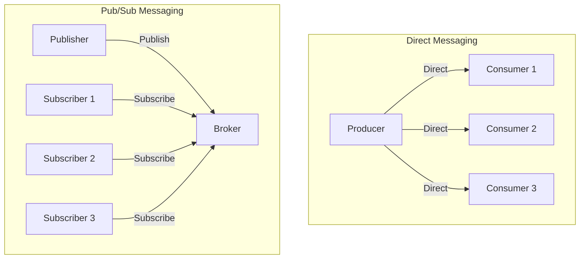
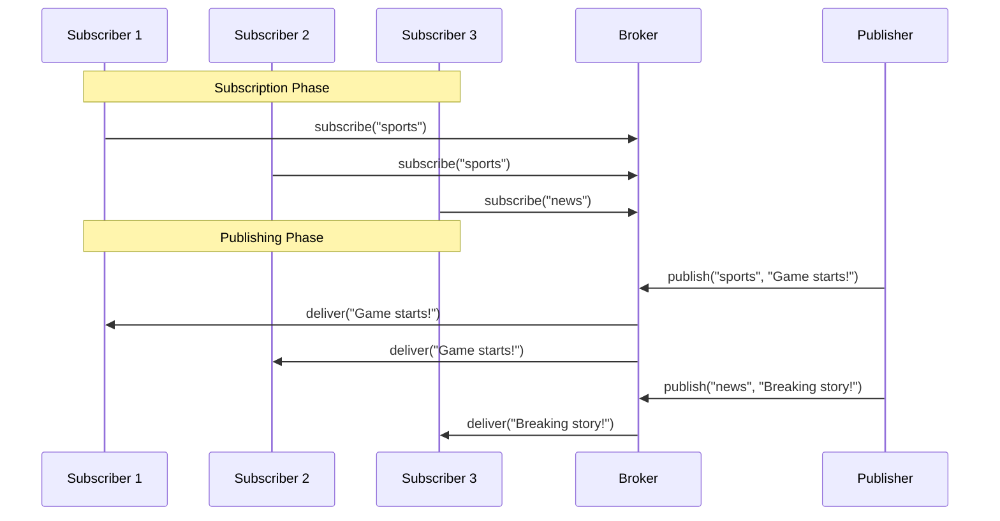
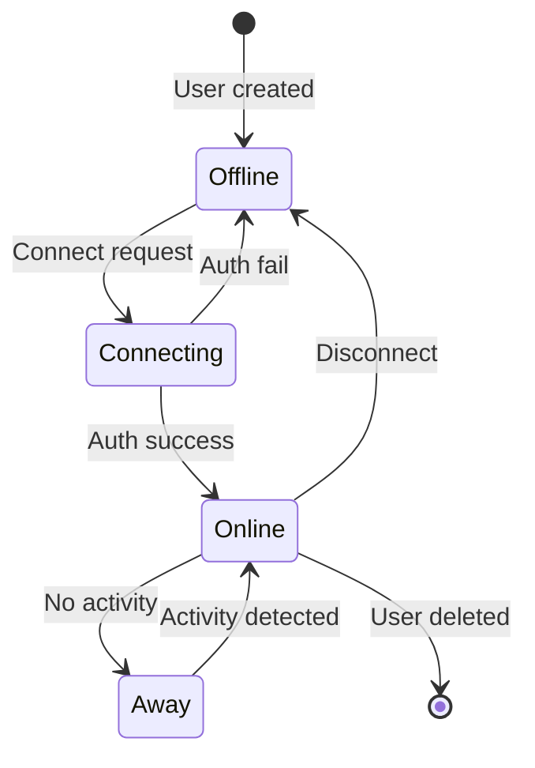
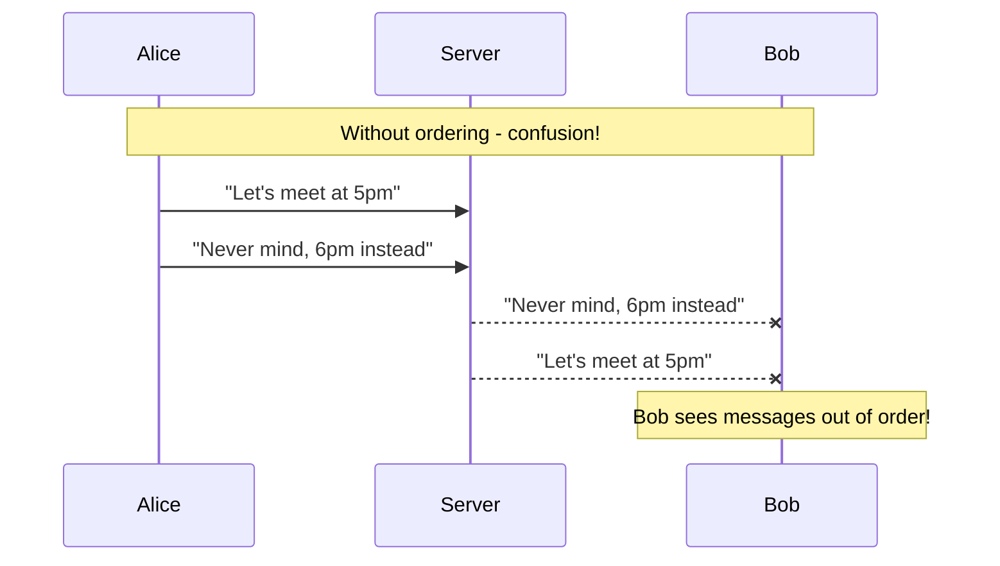
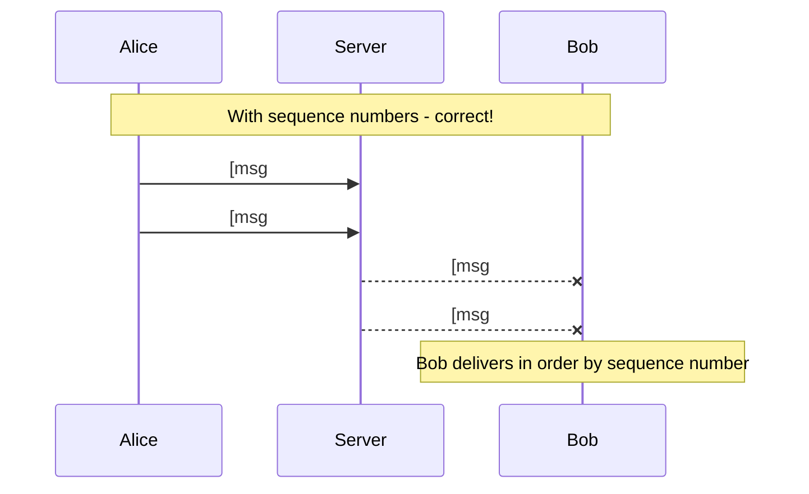

# Pub/Sub Messaging and Message Ordering

> **Session 7, Part 1** - 45 minutes

## Learning Objectives

- [ ] Understand the publish-subscribe messaging pattern
- [ ] Learn about topic-based and content-based routing
- [ ] Implement presence tracking and subscriptions
- [ ] Understand message ordering challenges in distributed systems
- [ ] Implement sequence numbers for causal ordering

## What is Pub/Sub?

The **publish-subscribe pattern** is a messaging pattern where senders (publishers) send messages to an intermediate system, and the system routes messages to interested receivers (subscribers). Publishers and subscribers are **decoupled**—they don't know about each other.

### Key Benefits

1. **Decoupling**: Publishers don't need to know who subscribes
2. **Scalability**: Add subscribers without changing publishers
3. **Flexibility**: Dynamic subscription management
4. **Asynchrony**: Publishers send and continue; subscribers process when ready

### Pub/Sub vs Direct Messaging



| Aspect | Direct Messaging | Pub/Sub |
|--------|-----------------|---------|
| Coupling | Tight (producer knows consumers) | Loose (producer doesn't know consumers) |
| Flexibility | Low (changes affect producer) | High (dynamic subscriptions) |
| Complexity | Simple | Moderate (requires broker) |
| Use Case | Point-to-point, request-response | Broadcast, events, notifications |

## Pub/Sub Patterns

### 1. Topic-Based Routing

Subscribers express interest in **topics** (channels). Messages are routed based on the topic they're published to.



**Use cases**: Chat rooms, notification categories, event streams

### 2. Content-Based Routing

Subscribers specify **filter criteria**. Messages are routed based on their content.

```mermaid
graph LR
    P[Publisher] -->|{"type": "order", "value": >100}| B[Content Router]
    B -->|Matches filter| S1[High-Value Handler]
    B -->|Matches filter| S2[Order Logger]
    B -.->|No match| S3[Low-Value Handler]
```

**Use cases**: Event filtering, complex routing rules, IoT sensor data

### 3. Presence Tracking

In real-time systems, knowing **who is online** (presence) is essential for:

- Showing online/offline status
- Delivering messages only to active users
- Managing connections and reconnections
- Handling user disconnections gracefully



## Message Ordering

### The Ordering Problem

In distributed systems, messages may arrive **out of order** due to:

- Network latency variations
- Multiple servers processing messages
- Message retries and retransmissions
- Concurrent publishers

### Types of Ordering

| Ordering Type | Description | Difficulty |
|--------------|-------------|------------|
| **FIFO** | Messages from same sender arrive in order sent | Easy |
| **Causal** | Causally related messages are ordered | Moderate |
| **Total** | All messages ordered globally | Hard |

### Why Ordering Matters

Consider a chat application:



With proper ordering using **sequence numbers**:



## Implementation: Pub/Sub Chat with Ordering

Let's build a pub/sub chat system with:
- Topic-based routing (chat rooms)
- Presence tracking
- Message ordering with sequence numbers

### TypeScript Implementation

**pubsub-server.ts** - Pub/Sub server with ordering:

```typescript
// src: examples/03-chat/ts/pubsub-server.ts

interface Message {
  id: string;
  room: string;
  sender: string;
  content: string;
  sequence: number;
  timestamp: number;
}

interface Subscriber {
  id: string;
  userId: string;
  rooms: Set<string>;
  ws: WebSocket;
}

class PubSubServer {
  private subscribers: Map<string, Subscriber> = new Map();
  private roomSequences: Map<string, number> = new Map();
  private messageHistory: Map<string, Message[]> = new Map();
  private server: WebSocketServer;

  constructor(port: number = 8080) {
    this.server = new WebSocketServer({ port });
    this.setupHandlers();
    console.log(`Pub/Sub server running on port ${port}`);
  }

  private setupHandlers() {
    this.server.on('connection', (ws: WebSocket) => {
      const subscriberId = this.generateId();

      ws.on('message', (data: string) => {
        try {
          const msg = JSON.parse(data.toString());
          this.handleMessage(subscriberId, msg, ws);
        } catch (err) {
          ws.send(JSON.stringify({ error: 'Invalid message format' }));
        }
      });

      ws.on('close', () => {
        this.handleDisconnect(subscriberId);
      });
    });
  }

  private handleMessage(subscriberId: string, msg: any, ws: WebSocket) {
    switch (msg.type) {
      case 'subscribe':
        this.handleSubscribe(subscriberId, msg.room, msg.userId, ws);
        break;
      case 'unsubscribe':
        this.handleUnsubscribe(subscriberId, msg.room);
        break;
      case 'publish':
        this.handlePublish(msg);
        break;
      case 'get_history':
        this.handleGetHistory(msg.room, ws);
        break;
    }
  }

  private handleSubscribe(
    subscriberId: string,
    room: string,
    userId: string,
    ws: WebSocket
  ) {
    if (!this.subscribers.has(subscriberId)) {
      this.subscribers.set(subscriberId, {
        id: subscriberId,
        userId,
        rooms: new Set(),
        ws,
      });
    }

    const subscriber = this.subscribers.get(subscriberId)!;
    subscriber.rooms.add(room);

    // Initialize room state if needed
    if (!this.roomSequences.has(room)) {
      this.roomSequences.set(room, 0);
      this.messageHistory.set(room, []);
    }

    // Send presence notification
    this.broadcast(room, {
      type: 'presence',
      userId,
      action: 'join',
      timestamp: Date.now(),
    });

    // Send current sequence number
    ws.send(JSON.stringify({
      type: 'subscribed',
      room,
      sequence: this.roomSequences.get(room),
    }));

    console.log(`${userId} subscribed to ${room}`);
  }

  private handleUnsubscribe(subscriberId: string, room: string) {
    const subscriber = this.subscribers.get(subscriberId);
    if (subscriber) {
      subscriber.rooms.delete(room);

      // Send presence notification
      this.broadcast(room, {
        type: 'presence',
        userId: subscriber.userId,
        action: 'leave',
        timestamp: Date.now(),
      });
    }
  }

  private handlePublish(msg: any) {
    const { room, sender, content } = msg;
    const sequence = (this.roomSequences.get(room) || 0) + 1;
    this.roomSequences.set(room, sequence);

    const message: Message = {
      id: this.generateId(),
      room,
      sender,
      content,
      sequence,
      timestamp: Date.now(),
    };

    // Store in history
    const history = this.messageHistory.get(room) || [];
    history.push(message);
    this.messageHistory.set(room, history.slice(-100)); // Keep last 100

    // Broadcast to all subscribers
    this.broadcast(room, {
      type: 'message',
      ...message,
    });
  }

  private handleGetHistory(room: string, ws: WebSocket) {
    const history = this.messageHistory.get(room) || [];
    ws.send(JSON.stringify({
      type: 'history',
      room,
      messages: history,
    }));
  }

  private broadcast(room: string, payload: any) {
    const payloadStr = JSON.stringify(payload);

    for (const [_, subscriber] of this.subscribers) {
      if (subscriber.rooms.has(room) && subscriber.ws.readyState === WebSocket.OPEN) {
        subscriber.ws.send(payloadStr);
      }
    }
  }

  private handleDisconnect(subscriberId: string) {
    const subscriber = this.subscribers.get(subscriberId);
    if (subscriber) {
      // Notify all rooms the user was in
      for (const room of subscriber.rooms) {
        this.broadcast(room, {
          type: 'presence',
          userId: subscriber.userId,
          action: 'leave',
          timestamp: Date.now(),
        });
      }
      this.subscribers.delete(subscriberId);
    }
  }

  private generateId(): string {
    return Math.random().toString(36).substring(2, 15);
  }
}

const PORT = parseInt(process.env.PORT || '8080');
new PubSubServer(PORT);
```

**pubsub-client.ts** - Client with ordering buffer:

```typescript
// src: examples/03-chat/ts/pubsub-client.ts

interface ClientMessage {
  type: string;
  sequence?: number;
  [key: string]: any;
}

class PubSubClient {
  private ws: WebSocket | null = null;
  private userId: string;
  private messageBuffer: Map<string, Map<number, ClientMessage>> = new Map();
  private expectedSequence: Map<string, number> = new Map();
  private reconnectAttempts = 0;
  private maxReconnectAttempts = 5;

  constructor(
    private url: string,
    userId?: string
  ) {
    this.userId = userId || `user-${Math.random().toString(36).substring(7)}`;
  }

  connect() {
    this.ws = new WebSocket(this.url);

    this.ws.on('open', () => {
      console.log(`Connected as ${this.userId}`);
      this.reconnectAttempts = 0;
    });

    this.ws.on('message', (data: string) => {
      const msg: ClientMessage = JSON.parse(data.toString());
      this.handleMessage(msg);
    });

    this.ws.on('close', () => {
      console.log('Disconnected. Attempting to reconnect...');
      this.reconnect();
    });

    this.ws.on('error', (err) => {
      console.error('WebSocket error:', err);
    });
  }

  private handleMessage(msg: ClientMessage) {
    switch (msg.type) {
      case 'subscribed':
        this.expectedSequence.set(msg.room, (msg.sequence || 0) + 1);
        console.log(`Subscribed to ${msg.room} at sequence ${msg.sequence}`);
        break;

      case 'message':
        this.handleOrderedMessage(msg.room, msg);
        break;

      case 'presence':
        console.log(`${msg.userId} ${msg.action}ed`);
        break;

      case 'history':
        console.log(`Received ${msg.messages.length} historical messages`);
        msg.messages.forEach((m: ClientMessage) => this.displayMessage(m));
        break;
    }
  }

  private handleOrderedMessage(room: string, msg: ClientMessage) {
    const seq = msg.sequence!;

    // Initialize buffer if needed
    if (!this.messageBuffer.has(room)) {
      this.messageBuffer.set(room, new Map());
    }
    const buffer = this.messageBuffer.get(room)!;
    const expected = this.expectedSequence.get(room) || 1;

    if (seq === expected) {
      // Expected message - deliver immediately
      this.displayMessage(msg);
      this.expectedSequence.set(room, seq + 1);

      // Check buffer for next messages
      this.deliverBufferedMessages(room);
    } else if (seq > expected) {
      // Future message - buffer it
      buffer.set(seq, msg);
      console.log(`Buffered message ${seq} (expecting ${expected})`);
    }
    // seq < expected: old message, ignore
  }

  private deliverBufferedMessages(room: string) {
    const buffer = this.messageBuffer.get(room);
    if (!buffer) return;

    const expected = this.expectedSequence.get(room) || 1;

    while (buffer.has(expected)) {
      const msg = buffer.get(expected)!;
      this.displayMessage(msg);
      buffer.delete(expected);
      this.expectedSequence.set(room, expected + 1);
    }
  }

  private displayMessage(msg: ClientMessage) {
    console.log(`[${msg.sequence}] ${msg.sender}: ${msg.content}`);
  }

  subscribe(room: string) {
    this.send({ type: 'subscribe', room, userId: this.userId });
  }

  unsubscribe(room: string) {
    this.send({ type: 'unsubscribe', room });
  }

  publish(room: string, content: string) {
    this.send({
      type: 'publish',
      room,
      sender: this.userId,
      content,
    });
  }

  getHistory(room: string) {
    this.send({ type: 'get_history', room });
  }

  private send(payload: any) {
    if (this.ws?.readyState === WebSocket.OPEN) {
      this.ws.send(JSON.stringify(payload));
    } else {
      console.error('WebSocket not connected');
    }
  }

  private reconnect() {
    if (this.reconnectAttempts < this.maxReconnectAttempts) {
      this.reconnectAttempts++;
      const delay = Math.min(1000 * Math.pow(2, this.reconnectAttempts), 30000);
      setTimeout(() => this.connect(), delay);
    } else {
      console.error('Max reconnection attempts reached');
    }
  }
}

// CLI usage
const args = process.argv.slice(2);
const url = args[0] || 'ws://localhost:8080';
const client = new PubSubClient(url);

client.connect();

// Simple readline interface
const readline = require('readline');
const rl = readline.createInterface({
  input: process.stdin,
  output: process.stdout,
});

console.log('Commands: /join <room>, /leave <room>, /history <room>, /quit');
console.log('Any other input will be sent to the current room');

let currentRoom = '';

const showPrompt = () => {
  if (currentRoom) {
    rl.question(`[${currentRoom}]> `, (input) => {
      if (input === '/quit') {
        client.ws?.close();
        rl.close();
        process.exit(0);
      } else if (input.startsWith('/join ')) {
        currentRoom = input.substring(6);
        client.subscribe(currentRoom);
      } else if (input.startsWith('/leave ')) {
        const room = input.substring(7);
        client.unsubscribe(room);
        if (room === currentRoom) currentRoom = '';
      } else if (input.startsWith('/history ')) {
        const room = input.substring(9);
        client.getHistory(room);
      } else if (input && currentRoom) {
        client.publish(currentRoom, input);
      }
      showPrompt();
    });
  } else {
    rl.question('(no room)> ', (input) => {
      if (input.startsWith('/join ')) {
        currentRoom = input.substring(6);
        client.subscribe(currentRoom);
      }
      showPrompt();
    });
  }
};

showPrompt();
```

### Python Implementation

**pubsub_server.py** - Pub/Sub server with ordering:

```python
# src: examples/03-chat/py/pubsub_server.py

import asyncio
import json
import time
from typing import Dict, Set, List
from dataclasses import dataclass, asdict
import websockets
from websockets.server import WebSocketServerProtocol

@dataclass
class Message:
    id: str
    room: str
    sender: str
    content: str
    sequence: int
    timestamp: int

class PubSubServer:
    def __init__(self, port: int = 8080):
        self.port = port
        self.subscribers: Dict[str, dict] = {}
        self.room_sequences: Dict[str, int] = {}
        self.message_history: Dict[str, List[Message]] = {}

    async def handle_connection(self, ws: WebSocketServerProtocol):
        subscriber_id = self._generate_id()

        try:
            async for message in ws:
                try:
                    data = json.loads(message)
                    await self.handle_message(subscriber_id, data, ws)
                except json.JSONDecodeError:
                    await ws.send(json.dumps({"error": "Invalid message format"}))
        finally:
            await self.handle_disconnect(subscriber_id)

    async def handle_message(self, subscriber_id: str, msg: dict, ws: WebSocketServerProtocol):
        msg_type = msg.get("type")

        if msg_type == "subscribe":
            await self.handle_subscribe(subscriber_id, msg["room"], msg["userId"], ws)
        elif msg_type == "unsubscribe":
            await self.handle_unsubscribe(subscriber_id, msg["room"])
        elif msg_type == "publish":
            await self.handle_publish(msg)
        elif msg_type == "get_history":
            await self.handle_get_history(msg["room"], ws)

    async def handle_subscribe(
        self, subscriber_id: str, room: str, user_id: str, ws: WebSocketServerProtocol
    ):
        if subscriber_id not in self.subscribers:
            self.subscribers[subscriber_id] = {
                "id": subscriber_id,
                "userId": user_id,
                "rooms": set(),
                "ws": ws,
            }

        subscriber = self.subscribers[subscriber_id]
        subscriber["rooms"].add(room)

        # Initialize room state
        if room not in self.room_sequences:
            self.room_sequences[room] = 0
            self.message_history[room] = []

        # Send presence notification
        await self.broadcast(room, {
            "type": "presence",
            "userId": user_id,
            "action": "join",
            "timestamp": int(time.time() * 1000),
        })

        # Send current sequence number
        await ws.send(json.dumps({
            "type": "subscribed",
            "room": room,
            "sequence": self.room_sequences[room],
        }))

        print(f"{user_id} subscribed to {room}")

    async def handle_unsubscribe(self, subscriber_id: str, room: str):
        subscriber = self.subscribers.get(subscriber_id)
        if subscriber:
            subscriber["rooms"].discard(room)

            await self.broadcast(room, {
                "type": "presence",
                "userId": subscriber["userId"],
                "action": "leave",
                "timestamp": int(time.time() * 1000),
            })

    async def handle_publish(self, msg: dict):
        room = msg["room"]
        sender = msg["sender"]
        content = msg["content"]

        sequence = self.room_sequences.get(room, 0) + 1
        self.room_sequences[room] = sequence

        message = Message(
            id=self._generate_id(),
            room=room,
            sender=sender,
            content=content,
            sequence=sequence,
            timestamp=int(time.time() * 1000),
        )

        # Store in history
        history = self.message_history[room]
        history.append(message)
        self.message_history[room] = history[-100:]  # Keep last 100

        # Broadcast
        await self.broadcast(room, {
            "type": "message",
            **asdict(message),
        })

    async def handle_get_history(self, room: str, ws: WebSocketServerProtocol):
        history = self.message_history.get(room, [])
        await ws.send(json.dumps({
            "type": "history",
            "room": room,
            "messages": [asdict(m) for m in history],
        }))

    async def broadcast(self, room: str, payload: dict):
        payload_str = json.dumps(payload)
        tasks = []

        for subscriber in self.subscribers.values():
            if room in subscriber["rooms"]:
                ws = subscriber["ws"]
                if not ws.closed:
                    tasks.append(ws.send(payload_str))

        if tasks:
            await asyncio.gather(*tasks, return_exceptions=True)

    async def handle_disconnect(self, subscriber_id: str):
        subscriber = self.subscribers.get(subscriber_id)
        if subscriber:
            # Notify all rooms
            for room in list(subscriber["rooms"]):
                await self.broadcast(room, {
                    "type": "presence",
                    "userId": subscriber["userId"],
                    "action": "leave",
                    "timestamp": int(time.time() * 1000),
                })

            del self.subscribers[subscriber_id]

    def _generate_id(self) -> str:
        import random
        import string
        return ''.join(random.choices(string.ascii_lowercase + string.digits, k=12))

    async def start(self):
        print(f"Pub/Sub server running on port {self.port}")
        async with websockets.serve(self.handle_connection, "", self.port):
            await asyncio.Future()  # Run forever

if __name__ == "__main__":
    import os
    port = int(os.environ.get("PORT", "8080"))
    server = PubSubServer(port)
    asyncio.run(server.start())
```

**pubsub_client.py** - Client with ordering buffer:

```python
# src: examples/03-chat/py/pubsub_client.py

import asyncio
import json
import time
from typing import Dict, Optional
import websockets
from websockets.client import WebSocketClientProtocol

class PubSubClient:
    def __init__(self, url: str, user_id: Optional[str] = None):
        self.url = url
        self.user_id = user_id or f"user-{int(time.time())}"
        self.ws: Optional[WebSocketClientProtocol] = None
        self.message_buffer: Dict[str, Dict[int, dict]] = {}
        self.expected_sequence: Dict[str, int] = {}
        self.reconnect_attempts = 0
        self.max_reconnect_attempts = 5

    async def connect(self):
        try:
            self.ws = await websockets.connect(self.url)
            print(f"Connected as {self.user_id}")
            self.reconnect_attempts = 0
            asyncio.create_task(self.listen())
        except Exception as e:
            print(f"Connection failed: {e}")
            await self.reconnect()

    async def listen(self):
        if not self.ws:
            return

        try:
            async for message in self.ws:
                data = json.loads(message)
                await self.handle_message(data)
        except websockets.exceptions.ConnectionClosed:
            print("Disconnected. Attempting to reconnect...")
            await self.reconnect()

    async def handle_message(self, msg: dict):
        msg_type = msg.get("type")

        if msg_type == "subscribed":
            room = msg["room"]
            self.expected_sequence[room] = msg.get("sequence", 0) + 1
            print(f"Subscribed to {room} at sequence {msg.get('sequence', 0)}")

        elif msg_type == "message":
            await self.handle_ordered_message(msg["room"], msg)

        elif msg_type == "presence":
            print(f"{msg['userId']} {msg['action']}ed")

        elif msg_type == "history":
            print(f"Received {len(msg['messages'])} historical messages")
            for m in msg["messages"]:
                self.display_message(m)

    async def handle_ordered_message(self, room: str, msg: dict):
        seq = msg["sequence"]

        if room not in self.message_buffer:
            self.message_buffer[room] = {}

        buffer = self.message_buffer[room]
        expected = self.expected_sequence.get(room, 1)

        if seq == expected:
            # Expected message - deliver immediately
            self.display_message(msg)
            self.expected_sequence[room] = seq + 1

            # Check buffer for next messages
            await self.deliver_buffered_messages(room)

        elif seq > expected:
            # Future message - buffer it
            buffer[seq] = msg
            print(f"Buffered message {seq} (expecting {expected})")

    async def deliver_buffered_messages(self, room: str):
        buffer = self.message_buffer.get(room, {})
        expected = self.expected_sequence.get(room, 1)

        while expected in buffer:
            msg = buffer[expected]
            self.display_message(msg)
            del buffer[expected]
            self.expected_sequence[room] = expected + 1
            expected += 1

    def display_message(self, msg: dict):
        print(f"[{msg['sequence']}] {msg['sender']}: {msg['content']}")

    async def subscribe(self, room: str):
        await self.send({"type": "subscribe", "room": room, "userId": self.user_id})

    async def unsubscribe(self, room: str):
        await self.send({"type": "unsubscribe", "room": room})

    async def publish(self, room: str, content: str):
        await self.send({
            "type": "publish",
            "room": room,
            "sender": self.user_id,
            "content": content,
        })

    async def get_history(self, room: str):
        await self.send({"type": "get_history", "room": room})

    async def send(self, payload: dict):
        if self.ws and not self.ws.closed:
            await self.ws.send(json.dumps(payload))
        else:
            print("WebSocket not connected")

    async def reconnect(self):
        if self.reconnect_attempts < self.max_reconnect_attempts:
            self.reconnect_attempts += 1
            delay = min(1000 * (2 ** self.reconnect_attempts), 30000) / 1000
            await asyncio.sleep(delay)
            await self.connect()
        else:
            print("Max reconnection attempts reached")

async def main():
    import sys
    url = sys.argv[1] if len(sys.argv) > 1 else "ws://localhost:8080"
    client = PubSubClient(url)
    await client.connect()

    # Simple CLI
    current_room = ""

    print('Commands: /join <room>, /leave <room>, /history <room>, /quit')

    while True:
        try:
            prompt = f"[{current_room}]> " if current_room else "(no room)> "
            line = await asyncio.get_event_loop().run_in_executor(None, input, prompt)

            if line == "/quit":
                break
            elif line.startswith("/join "):
                current_room = line[6:]
                await client.subscribe(current_room)
            elif line.startswith("/leave "):
                room = line[7:]
                await client.unsubscribe(room)
                if room == current_room:
                    current_room = ""
            elif line.startswith("/history "):
                room = line[9:]
                await client.get_history(room)
            elif line and current_room:
                await client.publish(current_room, line)

        except EOFError:
            break

    if client.ws:
        await client.ws.close()

if __name__ == "__main__":
    asyncio.run(main())
```

## Running the Examples

### TypeScript Version

```bash
cd distributed-systems-course/examples/03-chat/ts

# Install dependencies
npm install

# Start the server
PORT=8080 npx ts-node pubsub-server.ts

# In another terminal, start a client
npx ts-node pubsub-client.ts
```

### Python Version

```bash
cd distributed-systems-course/examples/03-chat/py

# Install dependencies
pip install -r requirements.txt

# Start the server
PORT=8080 python pubsub_server.py

# In another terminal, start a client
python pubsub_client.py
```

### Docker Compose

**docker-compose.yml** (TypeScript):

```yaml
services:
  pubsub-server:
    build: .
    ports:
      - "8080:8080"
    environment:
      - PORT=8080
```

```bash
docker-compose up
```

## Testing the Pub/Sub System

### Test 1: Basic Pub/Sub

1. Start three clients in separate terminals
2. Client 1: `/join general`
3. Client 2: `/join general`
4. Client 1: `Hello everyone!`
5. Client 2 should receive the message
6. Client 3: `/join general`
7. Client 3: `/history general` - should see previous messages

### Test 2: Multiple Rooms

1. Client 1: `/join sports`
2. Client 2: `/join news`
3. Client 1: `Game starting!` (only in sports)
4. Client 2: `Breaking news!` (only in news)
5. Client 3: `/join sports` and `/join news` (receives both)

### Test 3: Message Ordering

1. Start a client and join a room
2. Send messages rapidly: `msg1`, `msg2`, `msg3`
3. Observe sequence numbers: `[1]`, `[2]`, `[3]`
4. Note the order is preserved

### Test 4: Presence Tracking

1. Start two clients
2. Both join the same room
3. Observe presence notifications (user joined/left)
4. Disconnect one client (Ctrl+C)
5. Other client receives leave notification

## Exercises

### Exercise 1: Implement Last-Message Cache

Add a feature to store only the **last N messages** per room (already implemented as 100 in the code).

**Tasks**:
- Make the history size configurable via environment variable
- Add a `/clear_history` command for admins
- Add TTL (time-to-live) for old messages

### Exercise 2: Implement Private Messages

Extend the system to support **direct messages** between users.

**Requirements**:
- Private messages should only be delivered to the recipient
- Use a special topic format: `@username`
- Include sender authentication

**Hint**: You'll need to modify the `handlePublish` method to check for `@` prefix.

### Exercise 3: Add Message Acknowledgments

Implement **acknowledgments** to guarantee message delivery.

**Requirements**:
- Clients must ACK received messages
- Server tracks unacknowledged messages
- On reconnect, server resends unacknowledged messages

**Hint**: Add an `ack` message type and track pending messages per subscriber.

## Common Pitfalls

| Pitfall | Symptom | Solution |
|--------|---------|----------|
| Sequence number desync | Messages not displayed | Re-subscribe to reset sequence |
| Memory leak from history | Growing memory usage | Implement history size limits |
| Missing presence updates | Stale online status | Add heartbeat/ping messages |
| Race conditions | Messages lost during reconnect | Buffer messages during disconnection |

## Real-World Examples

| System | Pub/Sub Implementation | Ordering Strategy |
|--------|----------------------|-------------------|
| **Redis Pub/Sub** | Topic-based channels | No ordering guarantees |
| **Apache Kafka** | Partitioned topics | Per-partition ordering |
| **Google Cloud Pub/Sub** | Topic-based with subscriptions | Exactly-once delivery |
| **AWS SNS** | Topic-based fanout | Best-effort ordering |
| **RabbitMQ** | Exchange/queue binding | FIFO within queue |

## Summary

- **Pub/Sub** decouples publishers from subscribers through an intermediary broker
- **Topic-based routing** is the simplest and most common pattern
- **Presence tracking** enables online/offline status in real-time systems
- **Message ordering** requires sequence numbers and buffering
- **Causal ordering** is achievable with modest complexity
- **Total ordering** is expensive and often unnecessary

Next: [Chat System Implementation →](./10-chat-system.md)

## 🧠 Chapter Quiz

Test your mastery of these concepts! These questions will challenge your understanding and reveal any gaps in your knowledge.

{{#quiz ../../quizzes/real-time-pub-sub.toml}}
