# Implémentation du Système de Chat

> **Session 7** - Session complète (90 minutes)

## Objectifs d'apprentissage

- [ ] Construire un système de chat en temps réel complet avec WebSockets
- [ ] Implémenter l'ordonnancement des messages avec numéros de séquence
- [ ] Gérer la gestion de présence (utilisateurs en ligne/hors ligne)
- [ ] Ajouter la persistance des messages pour l'historique
- [ ] Déployer plusieurs salles de chat avec Docker Compose

---

## Architecture du système

Notre système de chat rassemble tous les concepts des sessions 6-7 :

```mermaid
graph TB
    subgraph "Clients"
        C1[Navigateur Utilisateur 1]
        C2[Navigateur Utilisateur 2]
        C3[Navigateur Utilisateur 3]
    end

    subgraph "Serveur de Chat"
        WS[Gestionnaire WebSocket]
        PS[Moteur Pub/Sub]
        SM[Gestionnaire de Séquence]
        PM[Gestionnaire de Présence]
        MS[Stockage de Messages]

        WS --> PS
        WS --> SM
        WS --> PM
        PS --> SM
        SM --> MS
    end

    C1 -->|WebSocket| WS
    C2 -->|WebSocket| WS
    C3 -->|WebSocket| WS

    subgraph "Persistance"
        DB[(Base de Messages)]
    end

    MS --> DB

    style WS fill:#e3f2fd
    style PS fill:#fff3e0
    style SM fill:#f3e5f5
```



### Composants clés

| Composant | Responsabilité |
|-----------|---------------|
| **Gestionnaire WebSocket** | Gère les connexions client, envoie/reçoit les messages |
| **Moteur Pub/Sub** | Achemine les messages vers les salles, gère les abonnements |
| **Gestionnaire de Séquence** | Attribue des numéros de séquence, assure l'ordonnancement |
| **Gestionnaire de Présence** | Suit le statut en ligne/hors ligne, heartbeat |
| **Stockage de Messages** | Persiste les messages pour l'historique et la relecture |

---

## Flux des messages


---

## Implémentation TypeScript

### Structure du projet

```
chat-system/
├── package.json
├── tsconfig.json
├── src/
│   ├── types.ts          # Définitions de type
│   ├── pub-sub.ts        # Moteur Pub/Sub
│   ├── sequencer.ts      # Gestionnaire de numéros de séquence
│   ├── presence.ts       # Gestion de présence
│   ├── store.ts          # Persistance des messages
│   ├── server.ts         # Serveur WebSocket
│   └── index.ts          # Point d'entrée
├── public/
│   └── client.html       # Client de démo
├── Dockerfile
└── docker-compose.yml
```

### 1. Définitions de type

```typescript
// src/types.ts
export interface Message {
    id: string;
    room: string;
    user: string;
    content: string;
    sequence: number;
    timestamp: number;
}

export interface Client {
    id: string;
    user: string;
    rooms: Set<string>;
    ws: WebSocket;
    lastSeen: number;
}

export interface Presence {
    user: string;
    status: 'online' | 'offline' | 'away';
    lastSeen: number;
}

export type MessageHandler = (client: Client, message: Message) => void;
```

### 2. Moteur Pub/Sub

```typescript
// src/pub-sub.ts
import { Message, Client, MessageHandler } from './types';

export class PubSub {
    private subscriptions: Map<string, Set<Client>> = new Map();
    private handlers: Map<string, MessageHandler[]> = new Map();

    subscribe(room: string, client: Client): void {
        if (!this.subscriptions.has(room)) {
            this.subscriptions.set(room, new Set());
        }
        this.subscriptions.get(room)!.add(client);
        client.rooms.add(room);
    }

    unsubscribe(room: string, client: Client): void {
        const subs = this.subscriptions.get(room);
        if (subs) {
            subs.delete(client);
            if (subs.size === 0) {
                this.subscriptions.delete(room);
            }
        }
        client.rooms.delete(room);
    }

    publish(room: string, message: Message): void {
        const subs = this.subscriptions.get(room);
        if (subs) {
            for (const client of subs) {
                this.sendToClient(client, message);
            }
        }
        this.emit('message', message);
    }

    on(event: string, handler: MessageHandler): void {
        if (!this.handlers.has(event)) {
            this.handlers.set(event, []);
        }
        this.handlers.get(event)!.push(handler);
    }

    private emit(event: string, message: Message): void {
        const handlers = this.handlers.get(event) || [];
        handlers.forEach(h => h(null!, message));
    }

    private sendToClient(client: Client, message: Message): void {
        if (client.ws.readyState === client.ws.OPEN) {
            client.ws.send(JSON.stringify({
                type: 'message',
                data: message
            }));
        }
    }

    getSubscribers(room: string): Client[] {
        return Array.from(this.subscriptions.get(room) || []);
    }

    getRooms(): string[] {
        return Array.from(this.subscriptions.keys());
    }
}
```

### 3. Gestionnaire de séquence

```typescript
// src/sequencer.ts
import { Message } from './types';

export class Sequencer {
    private sequences: Map<string, number> = new Map();

    getNext(room: string): number {
        const current = this.sequences.get(room) || 0;
        const next = current + 1;
        this.sequences.set(room, next);
        return next;
    }

    setCurrent(room: string, sequence: number): void {
        this.sequences.set(room, sequence);
    }

    getCurrent(room: string): number {
        return this.sequences.get(room) || 0;
    }

    sequenceMessage(message: Message): Message {
        const seq = this.getNext(message.room);
        return { ...message, sequence: seq };
    }
}
```

### 4. Gestionnaire de présence

```typescript
// src/presence.ts
import { Client, Presence } from './types';

const HEARTBEAT_INTERVAL = 30000; // 30 secondes
const OFFLINE_TIMEOUT = 60000; // 60 secondes

export class PresenceManager {
    private users: Map<string, Presence> = new Map();
    private clients: Map<string, Client> = new Map();
    private intervals: Map<string, NodeJS.Timeout> = new Map();

    register(client: Client): void {
        this.clients.set(client.id, client);
        this.updatePresence(client.user, 'online');
        this.startHeartbeat(client);
    }

    unregister(client: Client): void {
        this.stopHeartbeat(client);
        this.clients.delete(client.id);
        this.updatePresence(client.user, 'offline');
    }

    updatePresence(user: string, status: 'online' | 'offline' | 'away'): void {
        this.users.set(user, {
            user,
            status,
            lastSeen: Date.now()
        });
    }

    getPresence(user: string): Presence | undefined {
        return this.users.get(user);
    }

    getOnlineUsers(): string[] {
        const now = Date.now();
        return Array.from(this.users.values())
            .filter(p => p.status === 'online' && (now - p.lastSeen) < OFFLINE_TIMEOUT)
            .map(p => p.user);
    }

    getPresenceInRoom(room: string): Presence[] {
        const now = Date.now();
        const usersInRoom = new Set<string>();

        for (const client of this.clients.values()) {
            if (client.rooms.has(room)) {
                usersInRoom.add(client.user);
            }
        }

        return Array.from(usersInRoom)
            .map(user => this.users.get(user)!)
            .filter(p => p && (now - p.lastSeen) < OFFLINE_TIMEOUT);
    }

    private startHeartbeat(client: Client): void {
        const interval = setInterval(() => {
            if (client.ws.readyState === client.ws.OPEN) {
                client.ws.send(JSON.stringify({ type: 'heartbeat' }));
                this.updatePresence(client.user, 'online');
            }
        }, HEARTBEAT_INTERVAL);

        this.intervals.set(client.id, interval);
    }

    private stopHeartbeat(client: Client): void {
        const interval = this.intervals.get(client.id);
        if (interval) {
            clearInterval(interval);
            this.intervals.delete(client.id);
        }
    }

    cleanup(): void {
        for (const interval of this.intervals.values()) {
            clearInterval(interval);
        }
        this.intervals.clear();
    }
}
```

### 5. Stockage de messages

```typescript
// src/store.ts
import { Message } from './types';
import fs from 'fs/promises';
import path from 'path';

export class MessageStore {
    private basePath: string;

    constructor(basePath: string = './data/messages') {
        this.basePath = basePath;
    }

    async save(message: Message): Promise<void> {
        const roomPath = path.join(this.basePath, message.room);
        await fs.mkdir(roomPath, { recursive: true });

        const filename = path.join(roomPath, `${message.sequence}.json`);
        await fs.writeFile(filename, JSON.stringify(message, null, 2));
    }

    async getMessages(room: string, since: number = 0, limit: number = 100): Promise<Message[]> {
        const roomPath = path.join(this.basePath, room);
        const messages: Message[] = [];

        try {
            const files = await fs.readdir(roomPath);
            const jsonFiles = files
                .filter(f => f.endsWith('.json'))
                .map(f => parseInt(f.replace('.json', '')))
                .filter(seq => seq > since)
                .sort((a, b) => a - b)
                .slice(0, limit);

            for (const seq of jsonFiles) {
                const content = await fs.readFile(path.join(roomPath, `${seq}.json`), 'utf-8');
                messages.push(JSON.parse(content));
            }
        } catch (err) {
            // La salle n'existe pas encore
        }

        return messages;
    }

    async getLastSequence(room: string): Promise<number> {
        const roomPath = path.join(this.basePath, room);
        try {
            const files = await fs.readdir(roomPath);
            const sequences = files
                .filter(f => f.endsWith('.json'))
                .map(f => parseInt(f.replace('.json', '')));

            return sequences.length > 0 ? Math.max(...sequences) : 0;
        } catch {
            return 0;
        }
    }
}
```

### 6. Serveur WebSocket

```typescript
// src/server.ts
import { WebSocketServer, WebSocket } from 'ws';
import { createServer } from 'http';
import { v4 as uuidv4 } from 'uuid';
import { PubSub } from './pub-sub';
import { Sequencer } from './sequencer';
import { PresenceManager } from './presence';
import { MessageStore } from './store';
import { Client, Message } from './types';

const PORT = process.env.PORT || 8080;

export class ChatServer {
    private wss: WebSocketServer;
    private pubSub: PubSub;
    private sequencer: Sequencer;
    private presence: PresenceManager;
    private store: MessageStore;

    constructor() {
        const server = createServer();
        this.wss = new WebSocketServer({ server });
        this.pubSub = new PubSub();
        this.sequencer = new Sequencer();
        this.presence = new PresenceManager();
        this.store = new MessageStore();

        this.setupHandlers();
    }

    private setupHandlers(): void {
        this.wss.on('connection', (ws: WebSocket) => {
            const clientId = uuidv4();
            const client: Client = {
                id: clientId,
                user: `user_${clientId.slice(0, 8)}`,
                rooms: new Set(),
                ws,
                lastSeen: Date.now()
            };

            console.log(`Client connected: ${client.id}`);

            ws.on('message', async (data: string) => {
                try {
                    const msg = JSON.parse(data);
                    await this.handleMessage(client, msg);
                } catch (err) {
                    console.error('Error handling message:', err);
                }
            });

            ws.on('close', () => {
                console.log(`Client disconnected: ${client.id}`);
                for (const room of client.rooms) {
                    this.pubSub.publish(room, {
                        id: uuidv4(),
                        room,
                        user: 'system',
                        content: `${client.user} left the room`,
                        sequence: this.sequencer.getCurrent(room),
                        timestamp: Date.now()
                    });
                    this.pubSub.unsubscribe(room, client);
                }
                this.presence.unregister(client);
            });

            // Envoyer un message de bienvenue
            this.sendToClient(client, {
                type: 'connected',
                data: { clientId: client.id, user: client.user }
            });

            this.presence.register(client);
        });
    }

    private async handleMessage(client: Client, msg: any): Promise<void> {
        switch (msg.type) {
            case 'join':
                await this.handleJoin(client, msg.room);
                break;
            case 'leave':
                this.handleLeave(client, msg.room);
                break;
            case 'message':
                await this.handleChatMessage(client, msg.data);
                break;
            case 'presence':
                this.handlePresenceRequest(client, msg.room);
                break;
            case 'history':
                await this.handleHistoryRequest(client, msg.room, msg.since);
                break;
            default:
                console.log('Unknown message type:', msg.type);
        }
    }

    private async handleJoin(client: Client, room: string): Promise<void> {
        console.log(`${client.user} joining room: ${room}`);

        // S'abonner à la salle
        this.pubSub.subscribe(room, client);

        // Envoyer la présence actuelle
        const presence = this.presence.getPresenceInRoom(room);
        this.sendToClient(client, {
            type: 'presence',
            data: { room, users: presence }
        });

        // Annoncer le rejoindre
        this.pubSub.publish(room, {
            id: uuidv4(),
            room,
            user: 'system',
            content: `${client.user} joined the room`,
            sequence: this.sequencer.getCurrent(room),
            timestamp: Date.now()
        });

        // Envoyer les messages récents
        const history = await this.store.getMessages(room, 0, 50);
        if (history.length > 0) {
            this.sendToClient(client, {
                type: 'history',
                data: { room, messages: history }
            });
        }
    }

    private handleLeave(client: Client, room: string): void {
        console.log(`${client.user} leaving room: ${room}`);
        this.pubSub.unsubscribe(room, client);

        this.pubSub.publish(room, {
            id: uuidv4(),
            room,
            user: 'system',
            content: `${client.user} left the room`,
            sequence: this.sequencer.getCurrent(room),
            timestamp: Date.now()
        });
    }

    private async handleChatMessage(client: Client, data: any): Promise<void> {
        const { room, content } = data;

        if (!client.rooms.has(room)) {
            this.sendError(client, 'Not subscribed to room');
            return;
        }

        const message: Message = {
            id: uuidv4(),
            room,
            user: client.user,
            content,
            sequence: 0, // Sera assigné
            timestamp: Date.now()
        };

        // Assigner un numéro de séquence
        const sequenced = this.sequencer.sequenceMessage(message);

        // Sauvegarder dans le stockage
        await this.store.save(sequenced);

        // Publier à tous les subscribers
        this.pubSub.publish(room, sequenced);

        console.log(`[${room}] ${client.user}: ${content} (seq: ${sequenced.sequence})`);
    }

    private handlePresenceRequest(client: Client, room: string): void {
        const presence = this.presence.getPresenceInRoom(room);
        this.sendToClient(client, {
            type: 'presence',
            data: { room, users: presence }
        });
    }

    private async handleHistoryRequest(client: Client, room: string, since: number = 0): Promise<void> {
        const messages = await this.store.getMessages(room, since);
        this.sendToClient(client, {
            type: 'history',
            data: { room, messages }
        });
    }

    private sendToClient(client: Client, data: any): void {
        if (client.ws.readyState === client.ws.OPEN) {
            client.ws.send(JSON.stringify(data));
        }
    }

    private sendError(client: Client, message: string): void {
        this.sendToClient(client, {
            type: 'error',
            data: { message }
        });
    }

    listen(): void {
        const server = this.wss.server!;
        server.listen(PORT, () => {
            console.log(`Chat server listening on port ${PORT}`);
        });
    }
}
```

### 7. Point d'entrée

```typescript
// src/index.ts
import { ChatServer } from './server';

const server = new ChatServer();
server.listen();
```

### 8. Package.json

```json
{
  "name": "chat-system",
  "version": "1.0.0",
  "description": "Real-time chat system with WebSockets",
  "main": "dist/index.js",
  "scripts": {
    "build": "tsc",
    "start": "node dist/index.js",
    "dev": "ts-node src/index.ts"
  },
  "dependencies": {
    "ws": "^8.18.0",
    "uuid": "^11.0.3"
  },
  "devDependencies": {
    "@types/node": "^22.10.2",
    "@types/ws": "^8.5.13",
    "@types/uuid": "^10.0.0",
    "ts-node": "^10.9.2",
    "typescript": "^5.7.2"
  }
}
```

### 9. Dockerfile

```dockerfile
FROM node:20-alpine

WORKDIR /app

COPY package*.json ./
RUN npm ci --only=production

COPY . .
RUN npm run build

EXPOSE 8080

CMD ["npm", "start"]
```

### 10. Docker Compose

```yaml
version: '3.8'

services:
  chat:
    build: .
    ports:
      - "8080:8080"
    volumes:
      - ./data:/app/data
    environment:
      - PORT=8080
    restart: unless-stopped
```

---

## Implémentation Python

### Structure du projet

```
chat-system/
├── requirements.txt
├── src/
│   ├── __init__.py
│   ├── types.py
│   ├── pub_sub.py
│   ├── sequencer.py
│   ├── presence.py
│   ├── store.py
│   ├── server.py
│   └── main.py
├── public/
│   └── client.html
├── Dockerfile
└── docker-compose.yml
```

### 1. Définitions de type

```python
# src/types.py
from dataclasses import dataclass, field
from typing import Set
import websockets.server
import datetime

@dataclass
class Message:
    id: str
    room: str
    user: str
    content: str
    sequence: int
    timestamp: float

@dataclass
class Client:
    id: str
    user: str
    rooms: Set[str] = field(default_factory=set)
    websocket: websockets.server.WebSocketServerProtocol = None
    last_seen: float = field(default_factory=lambda: datetime.datetime.now().timestamp())

@dataclass
class Presence:
    user: str
    status: str  # 'online', 'offline', 'away'
    last_seen: float
```

### 2. Moteur Pub/Sub

```python
# src/pub_sub.py
from typing import Dict, Set, List, Callable, Any
from .types import Message, Client

class PubSub:
    def __init__(self):
        self.subscriptions: Dict[str, Set[Client]] = {}
        self.handlers: Dict[str, List[Callable]] = {}

    def subscribe(self, room: str, client: Client) -> None:
        if room not in self.subscriptions:
            self.subscriptions[room] = set()
        self.subscriptions[room].add(client)
        client.rooms.add(room)

    def unsubscribe(self, room: str, client: Client) -> None:
        if room in self.subscriptions:
            self.subscriptions[room].discard(client)
            if not self.subscriptions[room]:
                del self.subscriptions[room]
        client.rooms.discard(room)

    async def publish(self, room: str, message: Message) -> None:
        if room in self.subscriptions:
            for client in self.subscriptions[room]:
                await self._send_to_client(client, message)
        await self._emit('message', message)

    async def _send_to_client(self, client: Client, message: Message) -> None:
        if client.websocket and not client.websocket.closed:
            import json
            await client.websocket.send(json.dumps({
                'type': 'message',
                'data': message.__dict__
            }))

    async def _emit(self, event: str, message: Message) -> None:
        handlers = self.handlers.get(event, [])
        for handler in handlers:
            await handler(None, message)

    def get_subscribers(self, room: str) -> List[Client]:
        return list(self.subscriptions.get(room, set()))

    def get_rooms(self) -> List[str]:
        return list(self.subscriptions.keys())
```

### 3. Gestionnaire de séquence

```python
# src/sequencer.py
from typing import Dict
from .types import Message

class Sequencer:
    def __init__(self):
        self.sequences: Dict[str, int] = {}

    def get_next(self, room: str) -> int:
        current = self.sequences.get(room, 0)
        next_seq = current + 1
        self.sequences[room] = next_seq
        return next_seq

    def set_current(self, room: str, sequence: int) -> None:
        self.sequences[room] = sequence

    def get_current(self, room: str) -> int:
        return self.sequences.get(room, 0)

    def sequence_message(self, message: Message) -> Message:
        seq = self.get_next(message.room)
        message.sequence = seq
        return message
```

### 4. Gestionnaire de présence

```python
# src/presence.py
import asyncio
import datetime
from typing import Dict, List, Set
from .types import Client, Presence

HEARTBEAT_INTERVAL = 30  # secondes
OFFLINE_TIMEOUT = 60  # secondes

class PresenceManager:
    def __init__(self):
        self.users: Dict[str, Presence] = {}
        self.clients: Dict[str, Client] = {}
        self.tasks: Dict[str, asyncio.Task] = {}

    def register(self, client: Client) -> None:
        self.clients[client.id] = client
        self.update_presence(client.user, 'online')
        self.tasks[client.id] = asyncio.create_task(self._heartbeat(client))

    def unregister(self, client: Client) -> None:
        if client.id in self.tasks:
            self.tasks[client.id].cancel()
            del self.tasks[client.id]
        if client.id in self.clients:
            del self.clients[client.id]
        self.update_presence(client.user, 'offline')

    def update_presence(self, user: str, status: str) -> None:
        self.users[user] = Presence(
            user=user,
            status=status,
            last_seen=datetime.datetime.now().timestamp()
        )

    def get_presence(self, user: str) -> Presence | None:
        return self.users.get(user)

    def get_online_users(self) -> List[str]:
        now = datetime.datetime.now().timestamp()
        return [
            p.user for p in self.users.values()
            if p.status == 'online' and (now - p.last_seen) < OFFLINE_TIMEOUT
        ]

    def get_presence_in_room(self, room: str) -> List[Presence]:
        now = datetime.datetime.now().timestamp()
        users_in_room = set()

        for client in self.clients.values():
            if room in client.rooms:
                users_in_room.add(client.user)

        return [
            self.users.get(user)
            for user in users_in_room
            if user in self.users and (now - self.users[user].last_seen) < OFFLINE_TIMEOUT
        ]

    async def _heartbeat(self, client: Client) -> None:
        import json
        while True:
            try:
                if client.websocket and not client.websocket.closed:
                    await client.websocket.send(json.dumps({'type': 'heartbeat'}))
                    self.update_presence(client.user, 'online')
            except asyncio.CancelledError:
                break
            except Exception:
                pass
            await asyncio.sleep(HEARTBEAT_INTERVAL)

    def cleanup(self) -> None:
        for task in self.tasks.values():
            task.cancel()
        self.tasks.clear()
```

### 5. Stockage de messages

```python
# src/store.py
import os
import json
import asyncio
from pathlib import Path
from typing import List
from .types import Message

class MessageStore:
    def __init__(self, base_path: str = './data/messages'):
        self.base_path = Path(base_path)

    async def save(self, message: Message) -> None:
        room_path = self.base_path / message.room
        room_path.mkdir(parents=True, exist_ok=True)

        filename = room_path / f'{message.sequence}.json'
        with open(filename, 'w') as f:
            json.dump(message.__dict__, f, indent=2)

    async def get_messages(self, room: str, since: int = 0, limit: int = 100) -> List[Message]:
        room_path = self.base_path / room
        messages = []

        if not room_path.exists():
            return messages

        try:
            files = [f for f in os.listdir(room_path) if f.endswith('.json')]
            sequences = sorted([
                int(f.replace('.json', ''))
                for f in files
                if int(f.replace('.json', '')) > since
            ])[:limit]

            for seq in sequences:
                with open(room_path / f'{seq}.json', 'r') as f:
                    data = json.load(f)
                    messages.append(Message(**data))
        except FileNotFoundError:
            pass

        return messages

    async def get_last_sequence(self, room: str) -> int:
        room_path = self.base_path / room
        if not room_path.exists():
            return 0

        try:
            files = [f for f in os.listdir(room_path) if f.endswith('.json')]
            sequences = [int(f.replace('.json', '')) for f in files]
            return max(sequences) if sequences else 0
        except FileNotFoundError:
            return 0
```

### 6. Serveur WebSocket

```python
# src/server.py
import websockets
import json
import uuid
import asyncio
from typing import Any
from .pub_sub import PubSub
from .sequencer import Sequencer
from .presence import PresenceManager
from .store import MessageStore
from .types import Client, Message

PORT = int(os.getenv('PORT', 8080))

class ChatServer:
    def __init__(self):
        self.pub_sub = PubSub()
        self.sequencer = Sequencer()
        self.presence = PresenceManager()
        self.store = MessageStore()

    async def handle_client(self, websocket, path):
        client_id = str(uuid.uuid4())
        client = Client(
            id=client_id,
            user=f"user_{client_id[:8]}",
            websocket=websocket,
            rooms=set()
        )

        print(f"Client connected: {client.id}")

        await self._send_to_client(client, {
            'type': 'connected',
            'data': {'clientId': client.id, 'user': client.user}
        })

        self.presence.register(client)

        try:
            async for message in websocket:
                msg = json.loads(message)
                await self.handle_message(client, msg)
        except websockets.exceptions.ConnectionClosed:
            print(f"Client disconnected: {client.id}")
        finally:
            for room in list(client.rooms):
                await self.pub_sub.publish(room, Message(
                    id=str(uuid.uuid4()),
                    room=room,
                    user='system',
                    content=f"{client.user} left the room",
                    sequence=self.sequencer.get_current(room),
                    timestamp=asyncio.get_event_loop().time()
                ))
                self.pub_sub.unsubscribe(room, client)
            self.presence.unregister(client)

    async def handle_message(self, client: Client, msg: Any) -> None:
        handlers = {
            'join': self.handle_join,
            'leave': self.handle_leave,
            'message': self.handle_chat_message,
            'presence': self.handle_presence_request,
            'history': self.handle_history_request
        }

        handler = handlers.get(msg.get('type'))
        if handler:
            await handler(client, msg)
        else:
            print(f"Unknown message type: {msg.get('type')}")

    async def handle_join(self, client: Client, msg: Any) -> None:
        room = msg.get('room')
        print(f"{client.user} joining room: {room}")

        self.pub_sub.subscribe(room, client)

        presence = self.presence.get_presence_in_room(room)
        await self._send_to_client(client, {
            'type': 'presence',
            'data': {'room': room, 'users': [p.__dict__ for p in presence]}
        })

        await self.pub_sub.publish(room, Message(
            id=str(uuid.uuid4()),
            room=room,
            user='system',
            content=f"{client.user} joined the room",
            sequence=self.sequencer.get_current(room),
            timestamp=asyncio.get_event_loop().time()
        ))

        history = await self.store.get_messages(room, 0, 50)
        if history:
            await self._send_to_client(client, {
                'type': 'history',
                'data': {'room': room, 'messages': [m.__dict__ for m in history]}
            })

    def handle_leave(self, client: Client, msg: Any) -> None:
        room = msg.get('room')
        print(f"{client.user} leaving room: {room}")
        self.pub_sub.unsubscribe(room, client)

    async def handle_chat_message(self, client: Client, msg: Any) -> None:
        data = msg.get('data', {})
        room = data.get('room')

        if room not in client.rooms:
            await self._send_error(client, 'Not subscribed to room')
            return

        message = Message(
            id=str(uuid.uuid4()),
            room=room,
            user=client.user,
            content=data.get('content', ''),
            sequence=0,
            timestamp=asyncio.get_event_loop().time()
        )

        sequenced = self.sequencer.sequence_message(message)
        await self.store.save(sequenced)
        await self.pub_sub.publish(room, sequenced)

        print(f"[{room}] {client.user}: {sequenced.content} (seq: {sequenced.sequence})")

    async def handle_presence_request(self, client: Client, msg: Any) -> None:
        room = msg.get('room')
        presence = self.presence.get_presence_in_room(room)
        await self._send_to_client(client, {
            'type': 'presence',
            'data': {'room': room, 'users': [p.__dict__ for p in presence]}
        })

    async def handle_history_request(self, client: Client, msg: Any) -> None:
        room = msg.get('room')
        since = msg.get('since', 0)
        messages = await self.store.get_messages(room, since)
        await self._send_to_client(client, {
            'type': 'history',
            'data': {'room': room, 'messages': [m.__dict__ for m in messages]}
        })

    async def _send_to_client(self, client: Client, data: Any) -> None:
        if client.websocket and not client.websocket.closed:
            await client.websocket.send(json.dumps(data))

    async def _send_error(self, client: Client, message: str) -> None:
        await self._send_to_client(client, {
            'type': 'error',
            'data': {'message': message}
        })

    async def start(self):
        print(f"Chat server listening on port {PORT}")
        async with websockets.serve(self.handle_client, "", PORT):
            await asyncio.Future()  # Run forever
```

### 7. Point d'entrée

```python
# src/main.py
import asyncio
import os
from server import ChatServer

async def main():
    server = ChatServer()
    await server.start()

if __name__ == '__main__':
    asyncio.run(main())
```

### 8. Configuration requise

```txt
websockets==13.1
aiofiles==24.1.0
```

### 9. Dockerfile

```dockerfile
FROM python:3.12-slim

WORKDIR /app

COPY requirements.txt .
RUN pip install --no-cache-dir -r requirements.txt

COPY . .

EXPOSE 8080

CMD ["python", "src/main.py"]
```

### 10. Docker Compose

```yaml
version: '3.8'

services:
  chat:
    build: .
    ports:
      - "8080:8080"
    volumes:
      - ./data:/app/data
    environment:
      - PORT=8080
    restart: unless-stopped
```

---

## Exécution du système de chat

### TypeScript

```bash
# Installer les dépendances
npm install

# Compiler
npm run build

# Démarrer le serveur
npm start

# Avec Docker Compose
docker-compose up
```

### Python

```bash
# Installer les dépendances
pip install -r requirements.txt

# Démarrer le serveur
python src/main.py

# Avec Docker Compose
docker-compose up
```

---

## Exercices

### Exercice 1 : Opérations de chat de base
1. Démarrer le serveur de chat
2. Connecter deux clients WebSocket
3. Rejoindre la même salle
4. Envoyer des messages et vérifier que les deux clients les reçoivent
5. Quitter la salle et vérifier la diffusion

### Exercice 2 : Ordonnancement des messages
1. Envoyer plusieurs messages rapidement depuis différents clients
2. Vérifier que tous les messages ont des numéros de séquence uniques et séquentiels
3. Déconnecter et reconnecter un client
4. Demander l'historique des messages et vérifier que l'ordonnancement est préservé

### Exercice 3 : Gestion de la présence
1. Connecter plusieurs clients à différentes salles
2. Rejoindre une salle et vérifier les diffusions de présence
3. Simuler une défaillance réseau (tuer un client sans partir correctement)
4. Vérifier que la détection hors ligne intervient après le délai d'attente

### Exercice 4 : Persistance des messages
1. Envoyer des messages à une salle
2. Arrêter le serveur
3. Vérifier que les messages sont sauvegardés sur disque
4. Redémarrer le serveur
5. Connecter un nouveau client et vérifier qu'il reçoit l'historique des messages

---

## Pièges courants

| Problème | Cause | Solution |
|----------|-------|----------|
| Messages non ordonnés | Numéros de séquence manquants | Toujours séquencer avant de publier |
| Anciens messages non reçus | Pas demander l'historique lors de la jointure | Implémenter la relecture à la connexion |
| La présence affiche hors ligne | Heartbeat non envoyé | S'assurer que la boucle heartbeat fonctionne |
| Messages en double | Republication des messages sauvegardés | Publier uniquement les nouveaux messages, pas l'historique |

---

## Points clés à retenir

- **Pub/Sub** permet la communication multi-salle extensible
- **Les numéros de séquence** garantissent l'ordonnancement des messages sur tous les clients
- **La gestion de présence** nécessite à la fois des heartbeats actifs et une détection de délai d'attente passive
- **La persistance des messages** permet aux clients de se reconnecter et de recevoir l'historique
- **Docker Compose** simplifie le déploiement et les tests du système complet

## 🧠 Quiz du chapitre

Testez votre maîtrise de ces concepts ! Ces questions mettront au défi votre compréhension et révéleront les lacunes dans vos connaissances.

{{#quiz ../../quizzes/real-time-chat-system.toml}}
